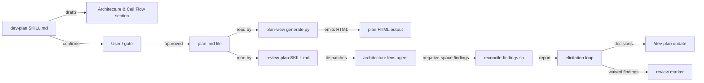
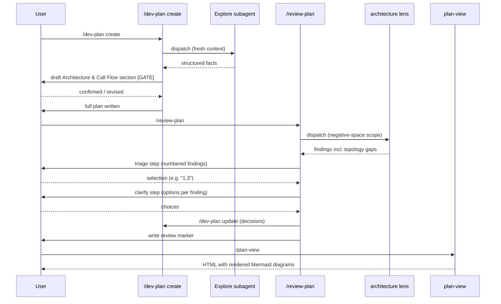

# Task: Call-Flow Diagrams, Mermaid Plan-View Rendering, and Interactive Review Loop

**Status**: Complete
**Component**: planning-skills
**Assigned to**: Agent
**Priority**: High
**Branch**: feature/plan-call-flow-and-interactive-review
**Created**: 2026-06-21
**Completed**: 2026-06-21

## Objective

Enrich dev plans with a conditional Architecture & Call Flow section (Mermaid diagrams + context-lifecycle table); render Mermaid fences as live diagrams in the plan-view HTML output; and extend review-plan with a negative-space topology audit and an interactive triage-and-clarify elicitation loop before the review marker is written.

## Context

Three related gaps surfaced from usage:

1. **Dev plans omit call-flow detail.** Multi-component plans (e.g., LLM-router pipelines, CLI+MCP+subagent stacks) do not record which component triggers which, or how context crosses boundaries. This information lives in the author's head and is lost; it also means `/review-plan`'s architecture lens cannot detect missing components it was never told about.

2. **Mermaid fences are inert in plan-view HTML.** `generate.py:render_markdown` emits `<pre><code class="lang-mermaid">` for mermaid fences (line 651), which browsers render as raw text. Adding the call-flow section to plans is only actionable if the diagrams actually render.

3. **Review-plan surfaces findings but drops the conversation.** After lens agents return findings, the current workflow presents them for discussion and then writes the review marker — but there is no structured elicitation loop to capture the user's triage decisions (which findings to act on, what design choices resolve them) before `/dev-plan update` is called. This means decisions exist only in the conversation transcript and are never persisted back into the plan.

## Requirements

### Feature 1 — Architecture & Call Flow section in dev-plan template

- The section is **conditional**: included only when the system has 2 or more independently-executing components (e.g., Claude SDK, LLM router, MCP server, subagent, CLI, storage layer).
- On `/dev-plan create`, the section is drafted by the main agent **before phases are written** and confirmed with the user at a gate before continuing (gate: present the draft section, ask "does this look correct?").
- The section lives **above the review marker** — it is part of the immutable contract and invalidates the marker hash if edited after review.
- It contains three sub-elements:
  - A Mermaid `graph` or `architecture` diagram (component graph).
  - A Mermaid `sequenceDiagram` for trigger order.
  - A markdown table: `Step | Trigger | Enters context | Cleared/persisted | Turn boundary`.
- The section heading is `## Architecture & Call Flow`.
- Placement: **immediately after the `### Integration Seams` subsection (the last subsection of `## Technical Specifications`) and before `## Testing Notes`.** NOT "before the marker" — `## Testing Notes` and `## Acceptance Criteria` both sit between Technical Specifications and the marker, so "before the marker" is ambiguous.
- The SKILL.md update must describe the gating logic (when to include the section, the gate step, and the user confirmation pattern).
- When the plan is a single-component change (e.g., a typo fix or isolated script tweak), the section is omitted entirely.

### Feature 2 — Mermaid rendering in plan-view HTML

- `generate.py:render_markdown` currently emits `<pre><code class="lang-mermaid">` for mermaid fences (lines 639–651). Change: when `lang == "mermaid"`, emit `<pre class="mermaid">` with raw (HTML-escaped) fence content instead of a `<code>` wrapper.
- Load the Mermaid JS runtime via **CDN**, pinned to a major version (decision: no vendoring; CDN load is acceptable for this local/offline-optional tool). **The exact ESM CDN path and init pattern must be verified against current Mermaid docs at implementation time** — modern Mermaid ships as an ESM module (e.g. `import mermaid from 'https://cdn.jsdelivr.net/npm/mermaid@11/dist/mermaid.esm.min.mjs'`), which differs from a classic `<script src=...min.js>` tag; whether `startOnLoad:true` auto-runs under `type="module"` with an external `src` is the runtime detail to confirm. **Also verify that Mermaid's runtime scans `<pre class="mermaid">` (not only `<div class="mermaid">`)** — if it does not, the Phase 1 change silently produces non-rendering output that the HTML-string unit test would still pass. Treat both as assumptions to validate by opening generated HTML in a browser, not as settled fact.
- Inject the runtime script tag in **both** template files:
  - `plugins/skein/skills/plan-view/template.html` — currently has `</head>` at line 153 and `<script>` at line 169; inject before `</head>`.
  - `plugins/skein/skills/plan-view/plan-template.html` — currently has `</head>` at line 116; inject before `</head>`.
- The Codex mirror counterparts (`plugins/skein-codex/skills/plan-view/`) receive the same changes.
- `test_parser.py` line 281–286 already has a test for `render_markdown` code-fence language-class output. Add a new test: `render_markdown` with a `mermaid` fence emits `<pre class="mermaid">` and does NOT emit `<code class="lang-mermaid">`.
- No snapshot/golden tests exist that would break on the HTML structure change — confirmed by Explore (test files: `test_drift_guard.py`, `test_links.py`, `test_parser.py`, `test_sections.py`; none snapshot the full output HTML).

### Feature 3 — Negative-space review + interactive elicitation loop in review-plan

**3a — Architecture lens negative-space duty:**
- Extend the architecture lens prompt's `## Your Scope (architecture only)` subsection (≈lines 98–135, within the `GENERIC LENS PROMPT: architecture` block at lines 78–135; **verify line numbers at implementation time** — SKILL.md is edited across Phases 3–4 so anchors drift) to add a "negative-space" scope item: reconstruct the implied call-flow/topology from the plan's Technical Specifications and files-to-modify list; flag any component, trigger, or context-transition the plan needs but never names; ground each flag in codebase evidence.
- Add a second scope item: topology-omission backstop — if the plan touches 2+ independently-executing components but lacks an `## Architecture & Call Flow` section, flag it as a `Missing Task` / Important finding.
- Both mirrors (`plugins/skein/skills/review-plan/SKILL.md` and `plugins/skein-codex/skills/review-plan/SKILL.md`) receive aligned updates to the architecture lens prompt block (byte-identical parity is NOT required for lens wording). Precise parity status: the lens roster (the set of `GENERIC LENS PROMPT` *names*) IS a cross-mirror invariant — declared in prose in both `SKILL.md` files (~line 74) — but **no script enforces it** (`scripts/check-prompt-parity.sh` byte-checks only the `GENERIC FINDING SCHEMA AND MERGE` block, `rubric.md`, and `*-prompt.md` files; `grep -i roster` over scripts/tests is empty). The negative-space change adds *scope items inside the existing `architecture` lens* — it does NOT add/rename a lens, so the roster is untouched; keep the two prose roster declarations aligned regardless.

**3b — Interactive triage-and-clarify elicitation loop:**
- After findings are reconciled and the report is rendered (Step 5 in the existing SKILL.md flow), before the review marker is written (Step 7), insert an interactive loop:
  1. **Triage step**: present numbered findings; ask the user which to address (multiple-choice, e.g. "1,3,4" or "all" or "none").
  2. **Clarify step**: for each selected finding, present 2–3 design-consistent resolution options (or a free-text prompt if no clear options exist); capture the user's choice.
  3. **Route**: for findings the user chooses to act on, call `/dev-plan update` with a summary of the decisions (not inline plan edits — the loop records decisions, not diffs). Findings waived by the user are recorded with reason in the plan's `## Findings` section below the marker.
  4. After the loop completes (all selected findings routed or waived), write the review marker exactly once.
- **The loop is default-on, with a `--batch` (non-interactive) escape hatch.** When `--batch` is passed, `/review-plan` skips the triage/clarify loop and behaves exactly as today (present findings, then the `yes`/`waive`/`no` marker prompt) — this preserves unattended/CI invocations. Document the flag in `argument-hint` and the usage/step prose.
- **Triage selection must not assume a fixed-option picker.** Findings count is unbounded, so the triage step takes a free-form selection (e.g. `1,3,4` / `all` / `none` / `critical+important`) rather than a 2–4-option multiple-choice widget (the AskUserQuestion-style picker caps at 4 options). The clarify step, which is per-finding, MAY use a 2–4-option picker since each finding offers a small fixed set of resolutions.
- The loop logic lives in the SKILL.md orchestration prose (the main Claude agent drives it, not a script). No new shell script is needed.
- Update the SKILL.md step numbering to accommodate the new loop (currently 7 steps; the loop adds steps between triage/discussion and marker-write).

## Review Focus

- **Mermaid CDN policy**: CDN-only rendering means plans don't render offline. Flag if this assumption is wrong for the target use-case (plan-view is described as a local HTML tool). Verify whether a lightweight CDN fallback or a `--offline` flag is needed.
- **Parity contract**: `scripts/check-prompt-parity.sh` byte-checks only the `GENERIC FINDING SCHEMA AND MERGE` block, `rubric.md`, and `*-prompt.md` files. The lens roster IS a prose-declared cross-mirror invariant (both SKILL.md ~line 74) but is NOT script-enforced (`grep -i roster` over scripts/tests is empty). The architecture lens prompt wording may legitimately differ. Confirm the new negative-space items do not accidentally land in the parity-tested GENERIC block, and keep the two prose roster declarations aligned.
- **Review marker invalidation**: `## Architecture & Call Flow` is above the review marker. Any post-review edit to that section invalidates the marker hash. Verify this is correct behavior (it is — the topology is part of the plan contract).
- **Elicitation loop and `/dev-plan update` handoff**: the loop routes decisions to `/dev-plan update`, which does NOT re-run Explore. Verify that decisions captured via the loop are woven into the correct sections (above the marker, in Technical Specifications) and don't accidentally land below the marker.
- **Template placement**: `template.md` DOES have two sections between Technical Specifications and the marker (`## Testing Notes` at template.md:116, `## Acceptance Criteria` at :132). Placement is therefore pinned to *after the `### Integration Seams` subsection and before `## Testing Notes`* — confirm the implementer inserts there, not "before the marker" (which would land after Acceptance Criteria).

## Architecture & Call Flow

The system has four independently-executing components for this feature:





| Step | Trigger | Enters context | Cleared/persisted | Turn boundary |
|------|---------|----------------|-------------------|---------------|
| 1 | `/dev-plan create` invoked | User request, repo basics | Persists to plan file | After plan written |
| 2 | Explore subagent dispatched | Explore prompt + codebase | Fresh context (isolated) | Subagent completes |
| 3 | Gate confirmation | Draft A&CF section | Persists if confirmed | User reply |
| 4 | `/review-plan` invoked | Plan content, Review Focus | Persists to lens agents | After dispatch |
| 5 | Architecture lens (negative-space) | Plan + codebase | Isolated subagent context | Lens report returned |
| 6 | Elicitation triage | Reconciled findings | Persists decisions | User selection |
| 7 | Clarify per finding | Options presented | Decision recorded | User choice each |
| 8 | `/dev-plan update` called | Decisions summary | Woven into plan above marker | After update |
| 9 | Review marker written | Accepted/waived findings | Marker hash recorded | Turn end |
| 10 | `/plan-view` invoked | Plan files + templates | Emitted as HTML | Static output |

## Implementation Checklist

The Implementation Checklist is part of the **immutable contract** above the review marker. Phase blocks describe what the work is — the contract slots `/conduct` reads to decide how to spawn subagents and run tests. They MUST NOT be edited during a run; per-phase progress and findings live in the workspace section below the marker so editing them does not invalidate the marker.

### Phase 1: Mermaid rendering in plan-view (generate.py + templates)

**Impl files:** `plugins/skein/skills/plan-view/generate.py, plugins/skein/skills/plan-view/template.html, plugins/skein/skills/plan-view/plan-template.html, plugins/skein-codex/skills/plan-view/generate.py, plugins/skein-codex/skills/plan-view/template.html, plugins/skein-codex/skills/plan-view/plan-template.html`
**Test files:** `plugins/skein/skills/plan-view/tests/test_parser.py, plugins/skein-codex/skills/plan-view/tests/test_parser.py`
**Test command:** `cd plugins/skein/skills/plan-view && python -m pytest tests/test_parser.py -v`
**Validation cmd:** `cd plugins/skein-codex/skills/plan-view && python -m pytest tests/test_parser.py -v`

- In `generate.py:render_markdown` (lines 639–651): when `lang == "mermaid"`, emit `<pre class="mermaid">{escaped_content}</pre>` instead of `<pre><code class="lang-mermaid">`.
- Inject Mermaid CDN `<script type="module">` before `</head>` in `template.html` (line 153) and `plan-template.html` (line 116).
- Add test in `test_parser.py`: `render_markdown("```mermaid\ngraph LR\n    A-->B\n```")` asserts `<pre class="mermaid">` present and `<code class="lang-mermaid">` absent. Parametrize the empty-fence (`<pre class="mermaid"></pre>`) and no-trailing-newline cases listed under Edge Cases.
- Add a presence test (or extend `test_links.py`-style template read) asserting the Mermaid `<script ... type="module">` appears before `</head>` in all four template files (`template.html`, `plan-template.html` × both mirrors). This covers the acceptance criterion that the templates load the runtime.
- **Manual-only verification (not automatable in the stdlib pytest suite):** open a generated per-plan HTML in a browser and confirm a Mermaid fence renders as a diagram (this also validates the unverified runtime assumptions in Feature 2). Record this as a manual checklist item, not an automated gate.
- Apply identical changes to Codex mirror (`plugins/skein-codex/skills/plan-view/`).

### Phase 2: Architecture & Call Flow section in dev-plan template + SKILL.md

**Impl files:** `plugins/skein/skills/dev-plan/template.md, plugins/skein-codex/skills/dev-plan/template.md, plugins/skein/skills/dev-plan/SKILL.md, plugins/skein-codex/skills/dev-plan/SKILL.md`
**Test files:** `tests/`
**Test command:** `just check-sync`
**Validation cmd:** `bash tests/parity/test-prompt-parity-extended.sh`

> Note: `test-prompt-parity-extended.sh` does NOT cover dev-plan files (it checks review-plan/deep-review parity only), so it is the Validation cmd here as a no-regression smoke check, not the primary gate. The real gate for Phase 2 is `just check-sync` (mechanical mirror byte-identity of `template.md`) plus a manual read-through that the dev-plan SKILL.md gate prose and the template section landed together.

- Add `## Architecture & Call Flow` section to `template.md` (both `plugins/skein/skills/dev-plan/template.md` and the Codex mirror `plugins/skein-codex/skills/dev-plan/template.md`) **immediately after the `### Integration Seams` subsection and before `## Testing Notes`** (NOT before the marker — two sections sit in that gap). Include placeholder sub-elements: Mermaid graph fence, Mermaid sequence fence, context-lifecycle table.
- Mark the section as conditional in a comment: `<!-- Include only when the plan has 2+ independently-executing components. Omit for single-component changes. -->`.
- **Note:** the new section is part of the immutable contract, so it must be added to the `--auto-fix=trivial` scope-forbid list — done in **Phase 3** (which already owns the `review-plan` edits) to avoid a same-file collision with this phase.
- Edit the Claude `dev-plan/template.md` and `dev-plan/SKILL.md` directly. The Codex `dev-plan/template.md` is a **direct byte-mirror** (harness-neutral markdown section) — but parity is a **manual discipline** (`just check-sync` does NOT compare `template.md`; confirmed by Codex review). The Codex `dev-plan/SKILL.md` gate/orchestration prose goes through `codex:rescue` to **adapt** to Codex conventions (`spawn_agent` + `reasoning_effort=medium` dispatch idiom — dev-plan has no lens roster), not byte-copy. See Architecture Decisions.
- **Phase-2 exit gate (commit-safety):** because no script catches a half-mirrored `template.md`, the phase is not complete until `diff plugins/skein/skills/dev-plan/template.md plugins/skein-codex/skills/dev-plan/template.md` is empty, AND the Claude-direct edits + the Codex-rescue mirror land in the **same commit** — never an intermediate commit with one mirror updated and the other not (it would merge green despite being drifted).
- Update `plugins/skein/skills/dev-plan/SKILL.md` (and Codex mirror) to describe:
  - When to include the section (2+ independently-executing components heuristic).
  - The gate step: draft the section after Explore returns, present to user for confirmation before writing phases.
  - What each sub-element contains (component graph, sequence diagram, context-lifecycle table with exact column names).
  - That the section is above the review marker (immutable contract).

### Phase 3: Negative-space architecture lens + topology-omission backstop in review-plan

**Impl files:** `plugins/skein/skills/review-plan/SKILL.md, plugins/skein-codex/skills/review-plan/SKILL.md, scripts/lib/auto-fix-common.sh`
**Test files:** `tests/parity/test-prompt-parity-extended.sh`
**Test command:** `bash tests/parity/test-prompt-parity-extended.sh`
**Validation cmd:** `just check-prompt-parity && just check-sync`

- Extend the architecture lens prompt block (`<!-- BEGIN GENERIC LENS PROMPT: architecture -->` at line 78, ending at line 135) in `plugins/skein/skills/review-plan/SKILL.md`:
  - Add to `## Your Scope (architecture only)`: a "Negative-space topology" item — reconstruct the implied call-flow from Files-to-Modify and Technical Specifications; flag any component, trigger, or context-transition the plan implies but never names; cite codebase evidence.
  - Add: "Topology-omission backstop" — if 2+ independently-executing components are implied and the plan has no `## Architecture & Call Flow` section, flag as `Missing Task` / Important.
- Mirror to the Codex `review-plan/SKILL.md` architecture lens via `codex:rescue`, instructing it to **adapt** (reasoning-level annotations, Codex harness idioms) rather than byte-copy — see Architecture Decisions.
- Verify the updates do not touch the `<!-- BEGIN/END GENERIC FINDING SCHEMA AND MERGE -->` block (which must remain byte-identical across mirrors).
- Note (Codex review): both SKILL.md mirrors carry **prose** declaring the lens roster as a cross-mirror invariant, even though no script enforces it. The negative-space scope addition does not change the roster, but keep the two prose declarations consistent so they don't drift.
- **Verify the lens actually fires** (no parity test covers prose scope additions — they land outside the GENERIC block by design). Minimum: a manual fixture run — feed a 2+-component plan that lacks `## Architecture & Call Flow` to the architecture lens and confirm it emits a `Missing Task`/Important topology-omission finding, and feed a plan whose specs imply an unnamed component and confirm a negative-space finding. Record as a manual verification step (the edge case at the bottom of Testing Notes is downgraded from "tested" to this manual check).
- **(Critical, relocated here from Phase 2) Protect the new immutable section from `--auto-fix=trivial`.** The `## Architecture & Call Flow` section is part of the contract above the marker, but the auto-fix scope-forbid list does not list it, so a `prose_clarify`/`path_rename` could silently rewrite a Mermaid label or the context-lifecycle table and Step 7 would hash the mutated content. Add `"## Architecture & Call Flow"` to `AF_FORBIDDEN_HEADINGS` in the canonical `scripts/lib/auto-fix-common.sh` (currently ~lines 318–325), re-bundle to both mirrors' `review-plan/scripts/lib/` (so `just check-sync` stays green), and add it to the prose forbid list in both `review-plan/SKILL.md` ("Why This Exists" / Constraints, ~line 13). This is a code change, not just prose — verify with `just check-sync`. (This lands in Phase 3 because it edits `review-plan/SKILL.md` + bundled scripts, the same surface Phase 3/4 own; keeping it out of Phase 2 avoids a same-file collision.)

### Phase 4: Interactive triage-and-clarify elicitation loop in review-plan SKILL.md

**Impl files:** `plugins/skein/skills/review-plan/SKILL.md, plugins/skein-codex/skills/review-plan/SKILL.md`
**Test files:** `tests/parity/test-prompt-parity-extended.sh`
**Test command:** `bash tests/parity/test-prompt-parity-extended.sh`
**Validation cmd:** `just check-prompt-parity`

- Add a `--batch` (non-interactive) flag to `argument-hint` and the usage prose. Default (no flag) runs the loop; `--batch` skips it and falls straight through to the existing `yes`/`waive`/`no` marker prompt, preserving today's CI/unattended behaviour.
- In `plugins/skein/skills/review-plan/SKILL.md` orchestration prose (the numbered step list): insert the elicitation loop (gated on the absence of `--batch`) between the current triage/discussion step and the marker-write step.
  - Step N (triage): present numbered findings; ask user which to address via free-form selection (`1,3,4` / `all` / `none` / `critical+important`) — NOT a fixed 2–4-option picker, since the finding count is unbounded.
  - Step N+1 (clarify): per selected finding, present 2–3 design-consistent resolution options (a fixed-option picker is fine here) or a free-text prompt; capture choice.
  - Step N+2 (route): route selected findings to `/dev-plan update` (summary of decisions, not inline edits); record waived findings with reason under a dedicated `### Review Waivers` subheading inside `## Findings` below the marker (keep them distinct from `/conduct`'s runtime findings).
  - Step N+3: write the review marker exactly once.
- **Write-then-hash ordering invariant (must be documented in the step prose).** Three writers can touch above-marker content in one run: the loop's `/dev-plan update`, the `--auto-fix=trivial` applier (Step 6.5), and the Step 7 marker entrypoint. Fixed order: (1) loop `/dev-plan update` edits land and are flushed to disk; (2) `--auto-fix=trivial` (if passed) runs on the updated content; (3) Step 7's single entrypoint reads and hashes the final above-marker bytes. The marker must hash post-update content, so `/dev-plan update` MUST complete and be re-read before `write-review-marker.py` runs.
- **`--batch` and `--auto-fix=trivial` composability**: state explicitly that `--batch` skips only the interactive loop (Steps N..N+2), not Step 6.5 — the two flags are orthogonal and may be combined (batch + auto-fix = today's behaviour plus trivial fixes).
- The waived-findings write (to `### Review Waivers` below the marker) is NOT a fourth ordering constraint — it targets the below-marker workspace, which is outside the hash window, so it is order-independent relative to the write-then-hash sequence above.
- Re-number subsequent steps as needed.
- Apply semantically aligned update to Codex mirror (harness wording may differ; routes via `codex:rescue`). Codex has no AskUserQuestion-style picker — it elicits via plain-text prompts, so the mirror describes the *interaction pattern*, not the Claude widget.
- **Hard ordering: Phase 4 MUST run after Phase 3 is committed.** Phases 3 and 4 edit the same file (`review-plan/SKILL.md` ×2 mirrors), so they are NOT fan-out-eligible — `/conduct` must run them strictly sequentially. Re-derive all line anchors from the post-Phase-3 file before editing (Phase 3's lens-block edits shift the line numbers this phase targets).

### Phase 5: Version bump, parity + sync checks

**Impl files:** `plugins/skein/.claude-plugin/plugin.json, plugins/skein-codex/.codex-plugin/plugin.json`
**Test files:** `tests/parity/`
**Test command:** `bash tests/parity/test-prompt-parity-extended.sh && bash tests/parity/test-allowlist-byte-identity.sh`
**Validation cmd:** `just check-sync && just check-prompt-parity`

- Bump version in both plugin manifests (`plugins/skein/.claude-plugin/plugin.json` and `plugins/skein-codex/.codex-plugin/plugin.json`) from `0.2.3` → `0.2.4`. (The version field is the update cache key; both must move together — see Architecture Decisions.)
- **Assert both versions are equal** after the bump (no existing gate checks this — `check-sync`/`check-prompt-parity`/parity tests all ignore plugin.json versions, which is how the v0.2.1 single-manifest miss happened). Minimum: `diff <(jq -r .version plugins/skein/.claude-plugin/plugin.json) <(jq -r .version plugins/skein-codex/.codex-plugin/plugin.json)` must be empty and equal `0.2.4`. Consider promoting this to a small repo check script as follow-up.
- Run `just check-sync` to confirm bundled scripts remain byte-identical to canonical `scripts/` (there is no separate promote/cache step in this repo — the justfile states this explicitly).
- Run `just check-prompt-parity` and `bash tests/parity/test-prompt-parity-extended.sh` to confirm the `GENERIC FINDING SCHEMA AND MERGE` block parity across mirrors survived the review-plan edits.
- Update `docs/dev_plans/README.md` task table with this plan.
- Update `docs/dev_plans/CODEX_MIRROR_BACKLOG.md` if any Codex drift is intentionally deferred.

### Phase 6: Document model / thinking-level routing (docs-only — separable from the feature)

**Impl files:** `docs/skills_architecture/20260522-design-claude-skills-architecture.md`
**Test files:** (none — documentation)
**Test command:** (none — manual read-through; this phase is docs-only and runs in `/conduct` degraded mode by design)

> This phase is documentation the user wants tracked alongside the feature but is **independent of it** — it can land in its own commit and does not gate the feature's correctness.
>
> Before relying on degraded mode, confirm `/conduct` *skips* (does not error on) a phase with empty `Test command:` / `Validation cmd:` slots. If `/conduct` aborts on empty slots, run Phase 6 outside `/conduct` (a plain docs commit) instead.

- Add (or update) a **model / thinking-level routing table** to `docs/skills_architecture/20260522-design-claude-skills-architecture.md` (natural home: under `## Subagent Topology` or `## Cost Model`). One row per skill subagent/lens, columns: skill → subagent/lens → Claude model + reasoning effort → Codex reasoning level.
- Capture at minimum the skills this plan touches and their current routing, with both mirrors' annotations (Codex values confirmed by review of `plugins/skein-codex/skills/review-plan/SKILL.md`):

  | Skill | Subagent / lens | Claude | Codex |
  |-------|-----------------|--------|-------|
  | dev-plan | Explore | `model: sonnet` | `reasoning_effort: medium` |
  | review-plan | architecture | `model: opus` | `reasoning: high` |
  | review-plan | sequencing | `model: opus` | `reasoning: high` |
  | review-plan | spec-and-testing | `model: opus` | `reasoning: high` |
  | review-plan | assumptions | `model: opus` | `reasoning: high` |
  | review-plan | codebase-claims | `model: haiku` | `reasoning: low` |
  | plan-view | (none — deterministic python) | — | — |
  | conduct | per-phase subagents | (per phase) | (per phase) |

  Record the Claude `(model: opus/haiku)` vs Codex `(reasoning: high/low)` annotation split as the reason the two columns differ in form.
- Add a one-line maintenance note: this table MUST be updated whenever any skill/lens model or effort assignment changes (the same discipline already applied to the dual-manifest version bump). Consider a follow-up lightweight check as a stretch goal; not in scope here.

## Technical Specifications

### Files to Modify

**Phase 1 — plan-view Mermaid rendering:**
- `plugins/skein/skills/plan-view/generate.py` — change fence handler at lines 639–651: mermaid lang → `<pre class="mermaid">` instead of `<pre><code class="lang-mermaid">`.
- `plugins/skein/skills/plan-view/template.html` — inject Mermaid CDN `<script type="module">` before `</head>` (currently line 153).
- `plugins/skein/skills/plan-view/plan-template.html` — inject Mermaid CDN `<script type="module">` before `</head>` (currently line 116).
- `plugins/skein/skills/plan-view/tests/test_parser.py` — add mermaid-fence test (after line 286).
- `plugins/skein-codex/skills/plan-view/generate.py` — identical change.
- `plugins/skein-codex/skills/plan-view/template.html` — identical change.
- `plugins/skein-codex/skills/plan-view/plan-template.html` — identical change.
- `plugins/skein-codex/skills/plan-view/tests/test_parser.py` — identical test addition.

**Phase 2 — dev-plan template + SKILL.md:**
- `plugins/skein/skills/dev-plan/template.md` — add `## Architecture & Call Flow` section with conditional comment, placeholder Mermaid fences, and context-lifecycle table template.
- `plugins/skein-codex/skills/dev-plan/template.md` — same section addition (Codex mirror, via `codex:rescue`).
- `plugins/skein/skills/dev-plan/SKILL.md` — document gating logic, section conditions, sub-element specs, placement rule.
- `plugins/skein-codex/skills/dev-plan/SKILL.md` — semantically aligned update (via `codex:rescue`).

**Phase 3 — review-plan architecture lens + auto-fix forbid list:**
- `plugins/skein/skills/review-plan/SKILL.md` (`Your Scope` subsection ≈98–135, within the architecture lens block 78–135; verify at impl time) — add negative-space topology duty + topology-omission backstop scope items; also add `## Architecture & Call Flow` to the prose forbid list (~line 13).
- `plugins/skein-codex/skills/review-plan/SKILL.md` — semantically aligned update (Codex wording may differ); same forbid-list prose addition.
- `scripts/lib/auto-fix-common.sh` — add `"## Architecture & Call Flow"` to `AF_FORBIDDEN_HEADINGS` (~lines 318–325), then re-bundle to both mirrors' `review-plan/scripts/lib/` (verify with `just check-sync`).

**Phase 4 — review-plan elicitation loop:**
- `plugins/skein/skills/review-plan/SKILL.md` (numbered step list after findings reconciliation) — insert 3-sub-step elicitation loop before marker-write step.
- `plugins/skein-codex/skills/review-plan/SKILL.md` — semantically aligned update.

**Phase 5 — manifests + docs:**
- `plugins/skein/.claude-plugin/plugin.json` — bump `version` from `0.2.3` to `0.2.4`.
- `plugins/skein-codex/.codex-plugin/plugin.json` — bump `version` from `0.2.3` to `0.2.4`.
- `docs/dev_plans/README.md` — add row for this plan.
- `docs/dev_plans/CODEX_MIRROR_BACKLOG.md` — update if any drift is deferred.

**Phase 6 — model/thinking-level routing doc (docs-only, separable):**
- `docs/skills_architecture/20260522-design-claude-skills-architecture.md` — add/refresh a model + reasoning-effort routing table (per skill → lens/subagent → Claude model+effort → Codex reasoning level) and a maintenance note.

### New Files to Create

None.

### Architecture Decisions

- **Mermaid via CDN, major-version-pinned, not vendored** (decided with the user): plan-view is a local HTML tool, but vendoring a ~2–3MB minified library is not worth the cost. Trade-off knowingly accepted: plans with Mermaid diagrams need a network fetch to render (no offline render); revisit if offline becomes a requirement. Pin the `<script>` URL to a specific mermaid major version (e.g. `mermaid@11`) rather than floating `latest`, so a remote release cannot silently change rendering. Document the CDN-only decision in SKILL.md.
- **`<pre class="mermaid">` (not `<div>`)**: chosen because `<pre>` preserves the raw diagram source as readable fallback text if Mermaid is unavailable or the CDN fails. Whether Mermaid's runtime actually scans `<pre class="mermaid">` (vs only `<div>`) is the runtime assumption Feature 2 flags for browser verification at implementation time — NOT asserted as settled fact here.
- **Architecture & Call Flow section placed after the Integration Seams subsection, before `## Testing Notes`**: the section contains topology facts (not implementation prose), so it belongs adjacent to Technical Specifications rather than "before the marker" (which is ambiguous — `## Testing Notes` and `## Acceptance Criteria` sit between Technical Specifications and the marker). Keeping it above the marker makes it immutable — appropriate since topology errors are plan errors, not runtime fixups.
- **Gate before writing phases**: the call-flow section encodes cross-component assumptions. Getting user confirmation before phases are written avoids building a plan on a misunderstood topology.
- **Elicitation loop in SKILL.md prose, not a script**: the loop requires judgment (presenting options, interpreting free-text choices) and natural-language interaction. It is orchestrated by the main Claude agent, not a shell script. This is consistent with how the existing discussion step works.
- **Parity invariants across mirrors**: only the `<!-- BEGIN/END GENERIC FINDING SCHEMA AND MERGE -->` block, `rubric.md`, and `*-prompt.md` are byte-identity-enforced by `check-prompt-parity.sh`. The lens roster (set of `GENERIC LENS PROMPT` names) is a prose-declared invariant in both SKILL.md files but is NOT script-enforced. The negative-space additions are scope additions to the architecture lens prompt *body* (not byte-parity-required) and do not change the roster.
- **Interactive loop default-on with `--batch` escape hatch** (decided with the user): the triage→clarify loop is the normal flow because front-loading decisions yields better implementation, but `--batch` preserves the fire-and-forget audit for CI/unattended runs. Default-on-no-escape was rejected because it would break any non-interactive `/review-plan` invocation.
- **Codex skill-content edits route through `codex:rescue`, which mirrors *and adapts*** (refined with the user): for `skein-codex` SKILL.md files (`dev-plan/SKILL.md`, `review-plan/SKILL.md`) — which carry harness-specific orchestration (model annotations, dispatch idioms, elicitation widgets) — do NOT hand-copy the Claude wording. Delegate to `codex:rescue` with the change intent and the caveat that it must **adapt to Codex's interworking and rules**. The exact adaptation differs per skill (confirmed by Codex review):
  - `review-plan/SKILL.md`: lenses use `reasoning: high/low` annotations (not `model: opus/haiku`) — all four judgment lenses are `high`, `codebase-claims` is `low`. Harness idioms: `spawn_agent` vs `Agent`, `$SKILL_DIR` vs `${CLAUDE_PLUGIN_ROOT}`. The elicitation loop must be expressed as plain-text prompts (Codex has no AskUserQuestion picker).
  - `dev-plan/SKILL.md`: the Explore dispatch is `spawn_agent` with `reasoning_effort=medium` (NOT a high/low lens toggle — dev-plan has no lens roster). The only adaptation is the dispatch idiom and effort annotation; the Explore prompt body is byte-identical across mirrors. The only cross-mirror invariants that stay identical are the `GENERIC FINDING SCHEMA AND MERGE` block, `rubric.md`, and `*-prompt.md` (the parity-checked set). **`/conduct` may invoke `codex:rescue` (or an adversarial-review skill) to confirm the adapted Codex implementation** rather than asserting parity by eye. `dev-plan/template.md`'s `## Architecture & Call Flow` section is **harness-neutral markdown** (Mermaid + a table, no model/idiom references), so the Codex `template.md` stays a direct byte-mirror — it does NOT need adaptive rescue. **However, `just check-sync` does NOT compare `template.md` across mirrors** (Codex review confirmed `check-sync.sh` only covers bundled auto-fix scripts under `skills/scripts/`), so template parity is a **manual discipline, not script-enforced**. Follow-up option: add a `check-sync` entry for `dev-plan/template.md`. Other mechanical mirror files (`plugins/skein-codex/skills/plan-view/generate.py`, `*.html`, tests, `.codex-plugin/plugin.json`) remain direct byte-mirror edits; Phase 1 and Phase 5 Codex edits are mechanical and direct.

### Dependencies

- Mermaid JS CDN, **major-version-pinned** (e.g. `mermaid@11`) — the exact ESM path + init pattern is verified against current Mermaid docs at implementation time (see Feature 2 requirement). Document the chosen pin in SKILL.md.
- No new Python dependencies (generate.py is stdlib-only; no pyproject.toml at skill or repo level).

### Integration Seams

| Seam | Writer (task) | Caller (task) | Contract |
|------|---------------|---------------|----------|
| `render_markdown("mermaid" fence)` | Phase 1 (generate.py) | plan-view HTML output | Must emit `<pre class="mermaid">` not `<pre><code class="lang-mermaid">` |
| Mermaid CDN `<script>` | Phase 1 (templates) | Browser rendering Mermaid diagrams | Must appear before `</head>` in both template.html and plan-template.html |
| `## Architecture & Call Flow` section | Phase 2 (template + SKILL.md) | Phase 1 (plan-view rendering) | Mermaid fences in section must render via the Phase 1 change |
| `## Architecture & Call Flow` gate | Phase 2 (SKILL.md) | dev-plan create workflow | Gate confirmation must happen before phases are written |
| Negative-space topology findings | Phase 3 (architecture lens) | Phase 4 (elicitation loop) | Topology findings must arrive via `reconcile-findings.sh` envelope (schema unchanged) |
| Elicitation loop decisions | Phase 4 (SKILL.md) | `/dev-plan update` | Decisions are passed as a prose summary, not structured diff; dev-plan update wears it into the plan above the marker |
| Plugin manifest version bump | Phase 5 | plugin update mechanism | Both manifests must move together; the `version` field is the update cache key (not git tags), so a mismatch leaves one mirror stale. `just check-sync` guards bundled-script byte-identity, not the version bump. |

## Testing Notes

### Test Approach

- **Unit (Phase 1):** `test_parser.py` — add `test_render_markdown_mermaid_fence`: verify `<pre class="mermaid">` emitted and `<code class="lang-mermaid">` absent. Run existing `test_render_markdown_code_fence_keeps_language_class` to confirm non-mermaid fences unchanged.
- **Parity (Phases 1–4):** `bash tests/parity/test-prompt-parity-extended.sh` after each SKILL.md edit. The parity test checks the `<!-- BEGIN/END GENERIC FINDING SCHEMA AND MERGE -->` block; verify the new scope additions are outside that block.
- **Parity (Phase 1, mirrors):** `bash tests/parity/test-allowlist-byte-identity.sh` — allowlist is unchanged but run to confirm no unintended drift.
- **Sync (Phase 5):** `just check-sync` and `just check-prompt-parity` after the manifest bump (no promote/cache step exists in this repo).

### Test Results

- [ ] All existing tests pass before Phase 1 begins.
- [ ] `test_render_markdown_mermaid_fence` added and passing.
- [ ] `test_render_markdown_code_fence_keeps_language_class` still passes (non-mermaid fences unchanged).
- [ ] `test-prompt-parity-extended.sh` passes after each SKILL.md edit.
- [ ] `just check-prompt-parity` passes after Phase 5.
- [ ] `just check-sync` passes after Phase 5 (and after Phase 3's auto-fix-lib re-bundle).
- [ ] Both plugin.json versions equal `0.2.4` (explicit assertion).
- [ ] Codex-mirror `test_parser.py` passes (Phase 1 cross-mirror gate — the only check that the mechanical `generate.py`/template mirror is correct).
- [ ] *(manual)* Phase 3 — a `--auto-fix=trivial` `prose_clarify` whose scope lands inside `## Architecture & Call Flow` is **rejected** (`rejected_scope`), confirming the forbid-list addition protects the new immutable section.
- [ ] *(manual)* Phase 4 — write-then-hash invariant: run the loop on a fixture, route a decision through `/dev-plan update`, and confirm the marker hash covers the post-update above-marker bytes (a marker written before the update would be rejected by `/conduct` as drift).
- [ ] *(manual)* Phase 6 — routing-table model/effort values cross-checked against each skill's SKILL.md dispatch annotations.

### Edge Cases Tested

- [ ] Mermaid fence with no trailing newline before closing fence.
- [ ] Non-mermaid code fence (e.g., `python`, `bash`) still emits `<pre><code class="lang-...">`.
- [ ] Empty mermaid fence (no diagram body) — should emit `<pre class="mermaid"></pre>`.
- [ ] Plan with `## Architecture & Call Flow` and no other mermaid fences — section renders correctly *(manual browser check)*.
- [ ] *(manual fixture check — no automated gate)* Plan without `## Architecture & Call Flow` section — review-plan architecture lens flags topology omission if 2+ independently-executing components implied.

## Acceptance Criteria

- *(manual verification)* Mermaid fences in plan-view output render as live diagrams when opened in a browser with internet access — not as raw text. The automatable proxy is the `<pre class="mermaid">` emit test + the template `<script>`-presence test.
- `generate.py:render_markdown` emits `<pre class="mermaid">` for mermaid fences and `<pre><code class="lang-{lang}">` for all other fenced code blocks.
- `template.html` and `plan-template.html` both load the Mermaid CDN runtime.
- The dev-plan template includes an `## Architecture & Call Flow` section (conditional).
- `dev-plan` SKILL.md documents: when to include the section (2+ components), the gate step before phases, the three sub-elements, and placement.
- *(manual fixture check)* The architecture lens in review-plan SKILL.md surfaces negative-space topology gaps and flags missing `## Architecture & Call Flow` sections.
- The review-plan workflow includes a structured triage-and-clarify loop between finding presentation and marker-write, default-on, with a `--batch` flag that skips the loop and restores today's fire-and-forget behaviour.
- Both plugin manifests at version `0.2.4`, and an explicit check confirms the two version fields are equal.
- `just check-sync`, `just check-prompt-parity`, and `bash tests/parity/test-prompt-parity-extended.sh` all pass.
- Codex mirror SKILL.md updates are produced via `codex:rescue` adapted to Codex conventions (reasoning levels, harness idioms), not byte-copies; mechanical mirror files (generate.py, templates, tests, manifest, `dev-plan/template.md`) are byte-mirrored. `/conduct` may invoke `codex:rescue`/adversarial review to confirm the adapted mirrors.
- `docs/skills_architecture/20260522-design-claude-skills-architecture.md` carries an up-to-date model/thinking-level routing table covering the touched skills, with a maintenance note.
- Code reviewed, tests passing, documentation updated.

<!-- reviewed: 2026-06-21 @ cd9ef23e74afdfe78e30868095d2266ff8bc4301 -->

<!-- /review-plan writes the marker line above. Everything below is the workspace: edits here do NOT invalidate the marker. -->

## Progress

Per-phase completion tracked here so ticking a box during a run does not bust the review marker. `/conduct` reads this section to skip already-done phases. Format: `- [ ] Phase <label>: <title>`.

- [x] Phase 1: Mermaid rendering in plan-view
- [x] Phase 2: Architecture & Call Flow section in dev-plan template + SKILL.md
- [x] Phase 3: Negative-space architecture lens + topology-omission backstop in review-plan
- [x] Phase 4: Interactive triage-and-clarify elicitation loop in review-plan SKILL.md
- [x] Phase 5: Version bump, parity + sync checks
- [x] Phase 6: Document model / thinking-level routing (docs-only)

## Findings

- (append findings here as work proceeds)

## Issues & Solutions

## Final Results

### Summary

All six phases implemented, reviewed (`/deep-review` + a Codex self-review of its own mirror adaptations), and shipped on PR #10 at version 0.2.4. Both mirrors landed in lockstep with no deferred Codex drift.

### Outcomes

- **Phase 1** — plan-view `render_markdown` emits `<pre class="mermaid">`; templates load the Mermaid v11 ESM CDN runtime with `securityLevel: 'strict'`. Tests: 60/60 both mirrors.
- **Phase 2** — conditional `## Architecture & Call Flow` section in the dev-plan template (byte-mirrored) + SKILL.md gating prose (Codex adapted via `codex:rescue`).
- **Phase 3** — negative-space topology + omission-backstop scope items in the review-plan architecture lens; `## Architecture & Call Flow` added to `AF_FORBIDDEN_HEADINGS` (canonical + re-bundled) and both prose forbid lists. Invariant verified: `af_heading_is_forbidden` rejects the heading.
- **Phase 4** — default-on Step 6.4 triage-and-clarify elicitation loop with a `--batch` escape hatch and a documented write-then-hash ordering invariant.
- **Phase 5** — both plugin manifests bumped to 0.2.4 (asserted equal); README index + CODEX_MIRROR_BACKLOG refreshed.
- **Phase 6** — model/thinking-level routing table added to the skills-architecture design doc.
- Post-implementation: deep-review surfaced 1 Critical (missing CHANGELOG 0.2.4 entry) + 3 Minor (Mermaid `securityLevel` made explicit; `AF_FORBIDDEN_HEADINGS` comment clarified; CDN no-SRI accepted per plan). All fixed except the accepted CDN risk.

### Learnings

- Phases 3 and 4 edited the same file, so a clean-tree commit between them was required before the parity-extended mutate-guard test would run — committing per-phase boundary made the gate pass.
- The `securityLevel: 'strict'` default in Mermaid v11 is safe, but pinning it explicitly in source guards against a future default change or an accidental `'loose'` edit.

### Follow-up Work

- **Manual verification still owed** (not automatable): open generated plan-view HTML in a browser to confirm Mermaid fences render; fixture-run the negative-space lens against a 2+-component plan lacking the section; end-to-end `--auto-fix=trivial` rejection of an edit scoped into `## Architecture & Call Flow`.
- Optional: a lightweight check asserting the routing-table values match each skill's SKILL.md dispatch annotations; a `check-sync` entry for `dev-plan/template.md` cross-mirror parity (currently manual discipline).
- Release prep folded into this PR (no separate release PR): version 0.2.4 in both manifests, CHANGELOG `[0.2.4]` promoted, README index row moved to **Shipped**. Post-merge: tag `v0.2.4` and `gh release create` per the AGENTS.md "Cutting a release" workflow.
