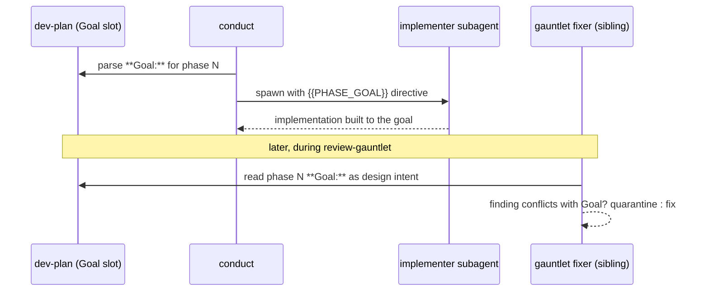

# Task: Per-phase `**Goal:**` field — shift-left design intent for conduct implementers

**Status**: Complete
**Component**: planning-skills
**Assigned to**: Claude + Codex (dual-plugin)
**Priority**: Medium
**Branch**: feature/review-gauntlet-skill
**Created**: 2026-07-07
**Completed**: 2026-07-10

## Objective

Add an optional per-phase `**Goal:**` contract slot to dev-plan phases and inject it into conduct's implementer and test-writer spawn prompts, so each phase is built to a concentrated statement of design intent / invariants from the first pass — rather than the implementer inferring intent from whole-plan prose. The same field becomes the authoritative design-intent source the `review-gauntlet` fixer reads for its design-conflict guardrail.

## Context

Today conduct's implementer prompt (`plugins/skein/skills/conduct/implementer-prompt.md:21`) instructs the worker to "Read the plan file in full before you start: the Objective, Requirements, Technical Specifications, and Integration Seams sections set constraints the phase checklist does not restate." Intent is therefore **diffuse across the whole plan** — there is no per-phase intent channel and no `{{GOAL}}`-style placeholder (verified: the implementer template placeholders are `{{PLAN_PATH}}`, `{{PHASE_INDEX}}`, `{{PHASE_LABEL}}`, `{{PHASE_TITLE}}`, `{{ITERATION}}`, `{{BASE_SHA}}`, `{{PRIOR_DIFF}}`, `{{TEST_FAILURES}}` — `implementer-prompt.md:5`).

This has two costs:
1. **Weaker first-pass implementations.** The implementer must reconstruct "what invariant must this phase hold" from prose, so subtle intent (a concurrency invariant, a protocol-state rule, a backward-compat constraint) is easy to miss — exactly the class of defect the review cycle then has to catch.
2. **A hand-wavy guardrail in `review-gauntlet`.** The sibling plan `docs/dev_plans/20260707-feature-review-gauntlet-skill.md` defines Guardrail 1: the fixer treats "the dev-plan as source of truth for design intent" to decide whether a finding is a design-conflict (quarantine) or a fixable bug. Parsing whole-plan prose for intent is fragile. A structured per-phase `**Goal:**` gives that guardrail a concrete anchor.

A concentrated per-phase `**Goal:**` is the demand-side complement to the gauntlet's supply-side: better first passes mean fewer findings and faster gauntlet convergence (directly easing the spend-cap friction flagged in the usage report), and the *same* field serves the fixer's conflict test. Designing the field once, consumed by both, avoids the gauntlet inventing an ad-hoc intent parser and this plan bolting on a duplicate later.

**Relationship to the gauntlet plan (shared files — sequencing matters):** both plans edit `conduct/SKILL.md` and the dev-plan schema (`dev-plan/SKILL.md` + `template.md`). This plan lands the `**Goal:**` *schema and implementer injection*; the gauntlet plan's Guardrail 1 *consumes* it. **This plan's schema (Phase 1) should land before the gauntlet's Guardrail-1 wiring** so the field exists when the fixer reads it. See "Sequencing" in Technical Specifications.

## Requirements

- **New optional per-phase contract slot** `**Goal:**` — a 1–2 line statement of the phase's design intent / invariant / quality bar (e.g. "Marker hash must cover contract bytes only; workspace edits never invalidate it"). Optional: a phase with no `**Goal:**` behaves exactly as today (no regression).
- **Placement:** `**Goal:**` sits in the phase contract block alongside `**Impl files:**` / `**Test files:**` / `**Test command:**` / `**Validation cmd:**`, above the review marker (immutable contract — intent is part of the contract, not the workspace).
- **Implementer injection:** conduct substitutes a new `{{PHASE_GOAL}}` placeholder into `implementer-prompt.md`, surfaced as an explicit directive ("Build to this goal; it is the design intent for the phase"), not buried in the "go read the plan" line. Empty/absent goal ⇒ placeholder renders empty and the existing read-the-plan guidance stands unchanged.
- **Test-writer injection:** the test-writer prompt also receives `{{PHASE_GOAL}}` so tests assert the intended invariant, not just surface behaviour.
- **Gauntlet consumption (defined here, wired there):** document that `review-gauntlet`'s fixer reads per-phase `**Goal:**` as the authoritative design-intent for its quarantine-vs-fix decision. The actual wiring lands in the gauntlet plan; this plan owns the field definition and a cross-reference.
- **No mini-review per phase.** This is deliberately the lightweight shift-left: inject intent only. Running review lenses on each phase before it returns is explicitly out of scope (it overlaps the gauntlet and risks redundant spend).
- **Dual-plugin parity:** mirror the dev-plan schema doc, template, and conduct prompt/injection into `plugins/skein-codex/...` with `$SKILL_DIR` anchors where paths are needed. Prompt/template content that is harness-neutral should stay byte-identical where parity tests cover it; Codex `SKILL.md` prose may use Codex-native `spawn_agent`, `wait_agent`, `close_agent`, `fork_context=false`, and `reasoning_effort` wording. Must pass the real parity checks (`just parity-tests`, `just check-prompt-parity`, and `bash tests/parity/check-mirror-handoff.sh` where handoff hygiene matters).
- **Marker-hash awareness:** because `**Goal:**` sits above the marker, adding/editing it on an already-reviewed plan invalidates the marker hash and forces re-review — correct, and consistent with how other contract-slot edits behave.

## Review Focus

- **No-regression on absent goal:** a phase with no `**Goal:**` must produce byte-identical implementer/test-writer prompts to today (empty placeholder, not a dangling label).
- **Placeholder plumbing:** `{{PHASE_GOAL}}` must be parsed from the phase contract block and substituted at every spawn/respawn site (first attempt AND fix-loop iterations), matching how `{{PHASE_TITLE}}` is handled.
- **Single source of intent:** confirm the gauntlet's Guardrail 1 reads the *same* `**Goal:**` field — no second, divergent intent channel.
- **Contract/immutability:** `**Goal:**` is above the marker; verify the marker-hash tooling counts it as contract (edits force re-review).
- **Dual-plugin parity:** Codex mirror satisfies `tests/parity/*`; anchors never collapsed.

## Implementation Checklist

> **Phase split:** Phases 1–3 are **Claude-authored** (dev-plan schema, conduct injection, tests/docs). Phases C1–C2 are **Codex-authored** for Codex-mirror SKILL.md/template/prompt content. Historical plans call this route `codex:rescue`; it means Codex-native adaptation/review, not a separate CLI command that the implementation can invoke.

### Phase 1: `**Goal:**` schema in dev-plan (Claude)

**Impl files:** `plugins/skein/skills/dev-plan/SKILL.md, plugins/skein/skills/dev-plan/template.md`
**Test files:** `tests/gauntlet/test-goal-field-schema.sh`
**Test command:** `bash tests/gauntlet/test-goal-field-schema.sh`

- Add the optional `**Goal:**` slot to the phase-contract documentation in `dev-plan/SKILL.md` (Required Sections item 4) and to `template.md`'s phase blocks, above the marker.
- Document it as optional (absent ⇒ current behaviour) and as the per-phase design-intent read by both conduct's implementer and `review-gauntlet`'s fixer.
- Note the immutability consequence (above-marker edit ⇒ re-review).

> **Cross-plan gate (blocking, reciprocal with the gauntlet plan):** this Phase 1 defines the `**Goal:**` schema that the sibling plan `docs/dev_plans/20260707-feature-review-gauntlet-skill.md` Guardrail 1 **consumes**. **This phase MUST land before the gauntlet plan's Guardrail-1 wiring** so the field exists when the fixer reads it.
> **Shared-file ownership:** both plans edit `dev-plan/SKILL.md` + `template.md`. Ownership split to avoid clobbering on parallel edits — **this plan owns the per-phase `**Goal:**` slot** (phase contract block / Required Sections item 4); **the gauntlet plan owns the `**Review Gates:**` header field** (plan Header / Required Sections item 1). Neither plan edits the other's lines.

### Phase 2: `{{PHASE_GOAL}}` injection in conduct (Claude)

**Impl files:** `plugins/skein/skills/conduct/implementer-prompt.md, plugins/skein/skills/conduct/test-writer-prompt.md, plugins/skein/skills/conduct/SKILL.md`
**Test files:** `tests/gauntlet/test-goal-injection.sh`
**Test command:** `bash tests/gauntlet/test-goal-injection.sh`

- Add `{{PHASE_GOAL}}` to the implementer and test-writer prompt templates as an explicit "build/test to this design intent" directive, distinct from the existing "read the whole plan" line.
- Update conduct's placeholder-substitution step (`SKILL.md:153`, `:168`) to parse `**Goal:**` from the phase contract block and substitute it at every spawn AND fix-loop respawn site.
- Empty/absent goal ⇒ placeholder renders empty; assert byte-identical prompt to today in that case (no-regression test).

### Phase 3: Tests, docs, cross-links (Claude)

**Impl files:** `justfile, scripts/check-prompt-parity.sh, AGENTS.md, CHANGELOG.md, docs/dev_plans/README.md, docs/dev_plans/20260707-feature-review-gauntlet-skill.md, docs/dev_plans/20260422-feature-conduct-skill.md`
**Test files:** `tests/gauntlet/`
**Test command:** `just parity-tests && just gauntlet-tests` <!-- no tests/run-all.sh exists; use justfile recipes -->

- Add a `gauntlet-tests` recipe to `justfile` (if not already added by the sibling gauntlet plan) covering `tests/gauntlet/*`; the aggregate is `just parity-tests` (existing) + `just gauntlet-tests`. There is no `tests/run-all.sh`.
- Extend prompt-parity coverage for the new placeholder across Claude/Codex prompt templates.
- Update `AGENTS.md` (dev-plan phase-contract slots list), `CHANGELOG.md`, README task table (Component `planning-skills`).
- Cross-link this plan ↔ the gauntlet plan (Guardrail 1 ↔ `**Goal:**`) and the conduct-skill plan; record the sequencing dependency.

<!-- BEGIN CODEX-AUTHORED PHASES -->
### Phase C1: Codex-mirror `**Goal:**` schema + template

**Impl files:** `plugins/skein-codex/skills/dev-plan/SKILL.md, plugins/skein-codex/skills/dev-plan/template.md`
**Test files:** `tests/parity/test_skill_md_presence.py, tests/parity/test-prompt-parity-extended.sh`
**Test command:** `python -m pytest tests/parity/test_skill_md_presence.py && bash tests/parity/test-prompt-parity-extended.sh`

- Mirror the optional `**Goal:**` phase-contract slot into the Codex dev-plan SKILL.md using Codex-native planning prose where the Claude source mentions harness mechanics.
- Keep `plugins/skein-codex/skills/dev-plan/template.md` mechanically aligned with the Claude template for the phase header block; this file is harness-neutral markdown and should not gain Codex-only wording.
- Document the same above-marker immutability rule: adding or changing `**Goal:**` invalidates a reviewed plan marker and requires re-review.
- Do not claim `tests/run-all.sh` exists in this Codex phase; use the existing parity checks above for Codex mirror verification.

### Phase C2: Codex-mirror `{{PHASE_GOAL}}` injection + parity

**Impl files:** `plugins/skein-codex/skills/conduct/implementer-prompt.md, plugins/skein-codex/skills/conduct/test-writer-prompt.md, plugins/skein-codex/skills/conduct/SKILL.md`
**Test files:** `tests/parity/test-prompt-parity-extended.sh, tests/parity/test-spawn-tiers.sh, tests/parity/check-mirror-handoff.sh`
**Test command:** `just check-prompt-parity && bash tests/parity/test-prompt-parity-extended.sh && bash tests/parity/test-spawn-tiers.sh && bash tests/parity/check-mirror-handoff.sh`

- Add `{{PHASE_GOAL}}` to the Codex implementer and test-writer prompt templates in the same semantic location as the Claude templates. If the prompt templates are parity-checked byte-for-byte, keep the new prompt block byte-identical.
- Update Codex conduct parsing/substitution prose to extract `**Goal:**` from the phase contract block and substitute it at every implementer/test-writer spawn and fix-loop respawn.
- Preserve the existing Codex conduct delegation contract: top-level `/conduct` hard-stops when `spawn_agent`, `wait_agent`, or `close_agent` are unavailable; it does not inline phase implementation. The Goal-field work adds a placeholder to existing top-level conduct workers and does not depend on the gated fan-out R6 nested-spawn topology.
- Request Codex-native worker tiers with `reasoning_effort=medium` where supported; do not introduce Claude `model:` / `effort:` fields into Codex SKILL.md.
- Run handoff and parity checks after the Codex mirror commit so prompt drift and accidental mixed-mirror edits are caught.
<!-- END CODEX-AUTHORED PHASES -->

## Technical Specifications

### Files to Modify
- `plugins/skein/skills/dev-plan/SKILL.md`, `plugins/skein/skills/dev-plan/template.md` — add `**Goal:**` slot (Phase 1).
- `plugins/skein/skills/conduct/implementer-prompt.md`, `plugins/skein/skills/conduct/test-writer-prompt.md` — add `{{PHASE_GOAL}}` directive (Phase 2).
- `plugins/skein/skills/conduct/SKILL.md` — parse `**Goal:**`, substitute `{{PHASE_GOAL}}` at all spawn/respawn sites (Phase 2).
- `justfile` — `gauntlet-tests` recipe (Phase 3; shared with the sibling gauntlet plan, add only if absent).
- `AGENTS.md`, `CHANGELOG.md`, `docs/dev_plans/README.md` (Phase 3).
- Codex mirrors of all the above (Phases C1–C2, Codex-authored/adapted): `plugins/skein-codex/skills/dev-plan/SKILL.md`, `plugins/skein-codex/skills/dev-plan/template.md`, `plugins/skein-codex/skills/conduct/implementer-prompt.md`, `plugins/skein-codex/skills/conduct/test-writer-prompt.md`, `plugins/skein-codex/skills/conduct/SKILL.md`.

### New Files to Create
- `tests/gauntlet/test-goal-field-schema.sh`, `tests/gauntlet/test-goal-injection.sh`.

### Architecture Decisions
- **Optional, non-breaking slot** — absent `**Goal:**` renders an empty placeholder; zero behavioural change for existing plans.
- **Above the marker** — intent is contract, not workspace; editing it forces re-review (same rule as other contract slots).
- **One field, two consumers** — implementer (shift-left) and gauntlet fixer (Guardrail 1) read the same `**Goal:**`. No divergent intent channel.
- **Injection, not per-phase review** — deliberately lightweight; per-phase lens review stays the gauntlet's job.

### Dependencies
- No new language deps. Depends on the conduct prompt-template mechanism and the dev-plan phase-contract schema. Codex-specific verification also depends on the existing parity scripts in `tests/parity/`; no Codex nested-spawn gate is required because this plan only changes top-level conduct worker prompts.

### Integration Seams

| Seam | Writer (task) | Caller (task) | Contract |
|------|---------------|---------------|----------|
| `**Goal:**` slot | dev-plan schema (P1) | conduct parse (P2), gauntlet fixer (sibling plan) | Optional per-phase 1–2 line intent above the marker; absent ⇒ empty placeholder, no behaviour change |
| `{{PHASE_GOAL}}` | conduct parse (P2) | implementer + test-writer prompts | Substituted at every spawn AND fix-loop respawn; empty when goal absent |
| Design-intent source | dev-plan `**Goal:**` (P1) | review-gauntlet Guardrail 1 (sibling) | Fixer reads per-phase `**Goal:**` as authoritative intent for quarantine-vs-fix |

### Sequencing

Phase 1 (the `**Goal:**` schema) is a prerequisite for the gauntlet plan's Guardrail-1 wiring. Land Phase 1 first (or concurrently) so the field exists when the fixer reads it. The two plans share `conduct/SKILL.md` and the dev-plan schema files — coordinate edits (this plan owns the implementer-injection lines; the gauntlet owns the terminal-hook lines) to avoid merge collisions.

## Architecture & Call Flow

> Included: three independently-executing components read/write the field — the dev-plan author, the conduct implementer subagent, and the gauntlet fixer subagent.

Component graph:

```mermaid
graph LR
    PLAN[dev-plan phase: **Goal:** slot] -->|parsed by| CDT[conduct substitution]
    CDT -->|{{PHASE_GOAL}}| IMPL[implementer subagent]
    CDT -->|{{PHASE_GOAL}}| TW[test-writer subagent]
    PLAN -->|design intent| FIX[review-gauntlet fixer Guardrail 1]
```

Trigger order:



Context lifecycle:

| Step | Trigger | Enters context | Cleared/persisted | Turn boundary |
|------|---------|----------------|-------------------|---------------|
| 1 | conduct spawns phase N | phase contract incl. `**Goal:**` | conductor holds contract | before implementer spawn |
| 2 | implementer dispatched | filled prompt with `{{PHASE_GOAL}}` | fresh/isolated context | implementer returns JSON |
| 3 | gauntlet fixer (sibling) | phase `**Goal:**` + finding | fresh/isolated per fixer | quarantine-vs-fix decided |

## Testing Notes

### Test Approach
- [ ] No-regression: phase without `**Goal:**` ⇒ implementer/test-writer prompt byte-identical to today.
- [ ] Substitution: `{{PHASE_GOAL}}` filled on first attempt and on fix-loop respawn (iteration ≥ 1).
- [ ] Schema: `**Goal:**` documented in SKILL.md + template; parser tolerates the `:`/`—`/`–` separators used elsewhere.
- [ ] Parity: Claude/Codex prompt templates carry the placeholder; `just check-prompt-parity`, `bash tests/parity/test-prompt-parity-extended.sh`, `bash tests/parity/test-spawn-tiers.sh`, and `bash tests/parity/check-mirror-handoff.sh` green after mirror commits.

### Test Results
- [ ] All existing tests pass
- [ ] New tests added and passing
- [ ] Manual verification complete

### Edge Cases Tested
- [ ] Absent goal ⇒ empty placeholder, no dangling label.
- [ ] Multi-line goal ⇒ rendered intact in the prompt.
- [ ] Goal added to a reviewed plan ⇒ marker hash invalidated (re-review forced).

## Acceptance Criteria

- Optional `**Goal:**` slot exists in dev-plan schema + template, documented as dual-consumer design intent.
- conduct injects `{{PHASE_GOAL}}` into implementer + test-writer at every spawn/respawn; absent goal is a no-op (proven by byte-identical prompt test).
- The gauntlet plan's Guardrail 1 is cross-referenced to consume this field; sequencing recorded.
- Codex mirror authored/adapted (C1–C2), prompt parity and handoff checks green.
- Sibling plans (gauntlet, conduct-skill) cross-linked; README/CHANGELOG/AGENTS.md updated.
- Code reviewed and approved; tests passing; docs updated.

<!-- reviewed: 2026-07-08 @ cab86cfc129c57cafeae8234ac743072fc5cde92 -->

<!-- /review-plan writes the marker line above. Everything below is the workspace: edits here do NOT invalidate the marker. -->

## Progress

- [x] Phase 1: Goal-field schema in dev-plan (Claude) — c58f66a
- [x] Phase 2: {{PHASE_GOAL}} injection in conduct (Claude) — 8c48ebf
- [x] Phase 3: Tests, docs, cross-links (Claude) — d7be637
- [x] Phase C1: Codex-mirror Goal schema + template (Codex) — 0f95ddf
- [x] Phase C2: Codex-mirror injection + parity (Codex) — 40d3cb2

## Findings

- **Stage 1 (Claude phases 1–3) conducted 2026-07-08**, autonomous, `--max-phases 3`; stopped at the max-phases cap before the Codex-mirror phases (C1/C2) per the dual-runtime split. All phases: tests green, no rogue commits.
- **Parser note (Phase 3):** the Phase 3 `**Test command:**` line carries a trailing `<!-- ... -->` HTML comment, which defeats conduct's strict `Test command:` regex (it expects the line to end right after the closing backtick). The conductor resolved the command manually (`just parity-tests && just gauntlet-tests`). Harmless, but a future cleanup could move the comment off the slot line.
- **Mid-phase reviews:** Phase 2 reviewer flagged (Important) that the no-regression test only checked doc strings, not the byte-identity invariant — fixed by adding assertions that `{{PHASE_GOAL}}` is glued to the preceding sentence with no leading space. Phase 3 reviewer flagged (Minor) a nested-bold CHANGELOG bullet — fixed.
- **Marker safety:** the review-marked sibling gauntlet plan (`20260707-feature-review-gauntlet-skill.md`) was deliberately left untouched during Phase 3 cross-linking; its cross-link to this plan already existed.
- **Stage 2 (Codex mirror C1–C2) conducted 2026-07-08** via `codex:rescue` (task-mrbwigeg-305pt2). Mirror parity verified: `test_skill_md_presence` 11/0, `test-prompt-parity-extended` 13/0, `check-prompt-parity` PASS (conduct prompt drifts cleared), `test-spawn-tiers` 57/0. No `${CLAUDE_PLUGIN_ROOT}` leaked into Codex files; `$SKILL_DIR` anchors preserved; Codex delegation hard-stop contract + `reasoning_effort=medium` intact.
- **Pre-existing failing check (NOT caused by this work):** the C2 test command lists `tests/parity/check-mirror-handoff.sh`, which fails with `missing phase 1 claude boundary commit`. It inspects git *history* for conduct-skill mirror-development boundary commits under the old-layout paths `.claude/skills/conduct` / `.codex/skills/conduct` with `Conducted-By:` trailers. This branch adds zero commits touching those paths (`git log main..HEAD -- .claude/skills/conduct .codex/skills/conduct` is empty), so it fails identically on `main`. The script was half-migrated by `07cda44` (its `commit_files` used the new paths but `touches_runtime` grepped the old prefixes, leaving it dead). **Fixed separately in `338673d`**: history-matching is now layout-agnostic, `has_test` points at the current tree, and one immutable pre-migration mixed-mirror commit (`1b49fe8`, auto-fix plan) is allowlisted by SHA. Gate now passes 6/6 boundaries + manifest.

- (append findings here as work proceeds)

## Issues & Solutions

### Issue 1: [none yet]
- **Problem**:
- **Solution**:
- **Files affected**:

## Final Results

### Summary

An optional `**Goal:**` field is now part of the dev-plan phase schema, documented in `SKILL.md` and the plan template as dual-consumer design intent. `conduct` injects it as `{{PHASE_GOAL}}` into the implementer and test-writer prompts at every spawn and fix-loop respawn, with an absent goal producing a byte-identical prompt to today (no dangling label). Implemented in both plugins — Claude authored, Codex mirrored.

### Outcomes

- All 5 phases (1–3 Claude, C1–C2 Codex mirror) shipped and committed; see Progress log above for SHAs.
- Stage 1 (Claude, phases 1–3) ran autonomously via `conduct --max-phases 3`; stopped at the cap before the Codex phases per the dual-runtime split, all tests green, no rogue commits.
- Mid-phase reviews caught and fixed two real gaps before merge: Phase 2's no-regression test only checked doc strings, not the byte-identity invariant (fixed by asserting `{{PHASE_GOAL}}` glues to the preceding sentence with no leading space); Phase 3 had a nested-bold CHANGELOG bullet (fixed).
- Stage 2 (Codex mirror C1–C2) ran via `codex:rescue`; parity verified — `test_skill_md_presence` 11/0, `test-prompt-parity-extended` 13/0, `check-prompt-parity` PASS, `test-spawn-tiers` 57/0. No `${CLAUDE_PLUGIN_ROOT}` leaked into Codex files, `$SKILL_DIR` anchors preserved, Codex delegation hard-stop contract and `reasoning_effort=medium` intact.
- The gauntlet plan's Guardrail 1 cross-references this field; sibling plans (gauntlet, conduct-skill) cross-linked, README/CHANGELOG/AGENTS.md updated.

### Learnings

- **A trailing HTML comment on a `**Test command:**` line defeats conduct's strict parser regex** (it expects the line to end right after the closing backtick). Harmless here — the conductor resolved the command manually — but worth a future cleanup to move such comments off the slot line rather than relying on manual intervention every time it recurs.
- **A pre-existing, unrelated test failure surfaced during this work and was worth root-causing rather than working around.** `check-mirror-handoff.sh` failed on this branch inspecting git history for old-layout conduct-skill mirror boundary commits; confirmed it failed identically on `main` (zero commits touch those paths on this branch), root-caused to a half-migrated script (`07cda44`: `commit_files` used new paths, `touches_runtime` still grepped old prefixes), and fixed separately in `338673d` with layout-agnostic history matching plus a SHA-allowlisted pre-migration commit. Treating a "not caused by this work" failure as still worth fixing avoided leaving a red gate for the next branch to inherit.

### Follow-up Work

- PR #12 (`feat: review-gauntlet conductor skill + conduct per-phase Goal field`) is open, not yet merged to `main`.
- Move the `**Test command:**` trailing HTML comment off the slot line in a future cleanup so conduct's regex doesn't need manual workarounds.
