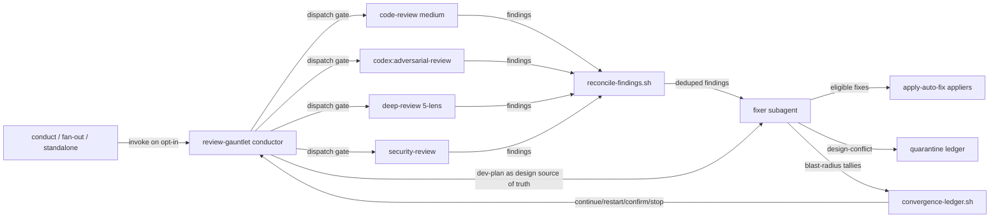
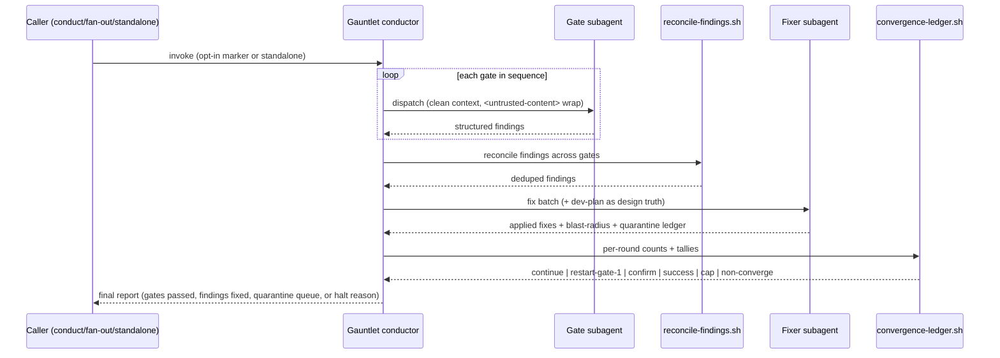

# Task: review-gauntlet — chained review-gate conductor with convergence loop

**Status**: Not Started
**Component**: review-skills
**Assigned to**: Claude + Codex (dual-plugin)
**Priority**: High
**Branch**: feature/review-gauntlet-skill
**Created**: 2026-07-07
**Completed**: (fill when done)

## Objective

Add a new skein conductor skill, `review-gauntlet`, that automates the manual multi-pass review cycle: it runs the review gates in sequence, delegates every gate and every fix batch to clean-context subagents, and loops until findings converge — so the operator never has to hand-run 6–12 review passes or clear context between them.

## Context

Today the review-and-fix workflow is entirely manual. The operator runs `/code-review`, applies fixes, runs `/codex:adversarial-review`, applies fixes, runs `/deep-review`, then `/security-review` — and because each pass bloats the working context, they must `/clear` and restart the cycle after a rest. The usage-report insights (see `docs/dev_plans/20260504-feature-skill-improvements-from-usage-report.md`) flagged this as the dominant, most repetitive workflow: "code review is your top goal by a wide margin (37 sessions)… you routinely stack multiple review passes."

The gates already exist as discrete skills. What does **not** exist is an orchestrator that chains them, applies fixes, decides when to re-run, and knows when to stop (Explore confirmed: no skill chains multiple review gates — the only gate primitives are conduct's single CI-parity gate and fan-out's Phase 6). The manual assembly *is* the friction.

`review-gauntlet` is a **conductor** in the mold of `skein:conduct`: main context stays lean because each gate and each fixer runs as an isolated-context subagent, and only structured findings/verdicts return. That is the core value — it makes 6–12 loops sustainable in a single session with no manual context clears.

This plan is the same lineage as the usage-report improvement plan and reuses primitives already built for deep-review (auto-fix appliers, cross-lens reconciliation). It is **not** standalone: it hooks into `conduct`, `fan-out`, and `dev-plan`, whose sibling plans are cross-linked below and must be updated in the same pass.

**Demand-side complement — the `**Goal:**` field.** The sibling plan `docs/dev_plans/20260707-feature-conduct-phase-goal-field.md` adds a per-phase `**Goal:**` slot that conduct injects into implementers (shift-left: robust first passes → fewer findings → faster gauntlet convergence) and that this gauntlet's Guardrail 1 reads as its design-intent source. The two plans share `conduct/SKILL.md` and the dev-plan schema files: the Goal-field plan's schema (its Phase 1) should land before this plan's Guardrail-1 wiring so the field exists when the fixer reads it.

## Requirements

- **Gate sequence (fixed order), all fixes applied to the same branch/PR — never a follow-up PR:**
  1. `/code-review` at **medium** effort (spawns its verifier subagents)
  2. `/codex:adversarial-review` (returns `approve`/`needs-attention` JSON with per-finding confidence)
  3. `skein:deep-review` (5 lenses)
  4. `/security-review`
- **Conductor pattern:** every gate invocation and every fix batch runs as a clean-context subagent; only structured findings/verdicts/verdict-ledgers return to the conductor. One level of delegation (match deep-review's isolation model).
- **Convergence algorithm:**
  - After fixing, the fixer subagent classifies each applied fix's blast radius as `local` or `structural`. **Trust the LLM's self-classification** — no mechanical/deterministic backstop (races, deadlocks, protocol-state mismanagement cannot be caught by line-count heuristics).
  - If **any** `structural` fix lands in a round → **restart from gate 1** (full corpus). Rationale: code-review and codex adversarial overlap but are not identical; a structural change can reintroduce a class of bug only the earlier gate catches.
  - If only `local` fixes land → run **one confirming pass**, no full restart.
  - **Stop conditions:** (a) a full pass yields zero actionable findings → **success**; (b) hard cap of **10 loops** → stop; (c) **non-convergence** — findings not trending down across rounds → **bail and escalate to human** with the explicit message that the plan/implementation has a deeper structural problem the loop cannot resolve.
- **Guardrail 1 — design-conflict findings are never auto-fixed.** The fixer subagent receives the **dev-plan** in context as the source of truth for design intent — specifically the per-phase `**Goal:**` field defined by the sibling plan `docs/dev_plans/20260707-feature-conduct-phase-goal-field.md` (the authoritative, concentrated statement of intent; the fixer falls back to whole-plan prose only when a phase has no `**Goal:**`). Handling depends on blast radius:
  - conflict + `local` → **quarantine**, continue applying other safe fixes, report the quarantine queue at the end.
  - conflict + `structural`/cascading (fixing it would force major changes elsewhere) → **halt immediately**, human needed.
- **Guardrail 2 — fix all findings regardless of confidence score.** The *only* quarantine trigger is design/architecture conflict, not a confidence threshold.
- **Invocation model (three modes, opt-in by default so a 10-loop run is never a surprise spend):**
  - Standalone: `review-gauntlet [--plan <path>] [<branch> | --pr]`
  - dev-plan marker: a new **header field** `**Review Gates:** none | quick | full` (default `none`; `quick` = code-review gate only; `full` = all four). NB: plans have **no YAML frontmatter** — this is an inline header field above the review marker (Explore fact).
  - Auto-chain: `conduct`'s terminal step (after the CI-parity gate) and `fan-out`'s Phase 6 (post-merge) read the marker and invoke `review-gauntlet` only when the plan opts in.
- **Reuse, do not reinvent:** the fixer must call deep-review's bundled auto-fix appliers (`apply-auto-fix-code.sh`, `audit-auto-fix-eligibility.sh`, `auto-fix-allowlist.json`, `lib/auto-fix-common.sh`) and cross-gate finding dedup must use `reconcile-findings.sh` (signature `(file,line,category)`).
- **Dual-plugin parity:** ship a Claude SKILL.md (`${CLAUDE_PLUGIN_ROOT}` anchors) and a byte-parity Codex mirror (`$SKILL_DIR` anchors); the only legitimate divergence is the dispatch idiom (Agent vs spawn_agent). Must pass existing parity tests.

## Review Focus

- **Convergence termination:** prove the loop *always* terminates — every path must hit one of the three stop conditions. The non-convergence detector must not false-negative into an infinite loop, nor false-positive-bail on a legitimately-shrinking finding set.
- **Guardrail correctness:** a design-conflict finding must never be silently auto-fixed; verify the dev-plan-as-source-of-truth is actually in the fixer's context on every fix batch, at every call site.
- **Spend safety:** default `none` marker; auto-chain must be strictly opt-in. Verify no path triggers a full 10-loop run without an explicit `full` marker or explicit standalone invocation.
- **Reuse integrity:** confirm the gauntlet calls the *existing* appliers/reconciler rather than forking logic — no duplicated allowlist, no reimplemented signature scheme.
- **Dual-plugin parity:** Codex mirror must satisfy `tests/parity/*` (SKILL.md presence, applier-bundle byte-identity, mirror handoff). Harness-divergent anchors (`${CLAUDE_PLUGIN_ROOT}` vs `$SKILL_DIR`) must never be collapsed.
- **Same-PR invariant:** all fixes land on the working branch; the gauntlet never opens a second PR.

## Implementation Checklist

> **Phase split:** Phases 1–6 are **Claude-authored** (repo-level files: Claude SKILL.md, bundled scripts, hooks into other Claude skills, tests, docs). Phases C1–Cn are **Codex-authored** (the Codex-mirror SKILL.md content and mirror edits), delegated via `codex:rescue` per the mirror-edit rule. Codex authors the content of the C-phases below.

### Phase 1: Core orchestrator SKILL.md (Claude)

**Impl files:** `plugins/skein/skills/review-gauntlet/SKILL.md`
**Test files:** `tests/gauntlet/test-gauntlet-skill-shape.sh`
**Test command:** `bash tests/gauntlet/test-gauntlet-skill-shape.sh`

- Write the SKILL.md frontmatter (`name: review-gauntlet`, `description` with trigger phrases: "review gauntlet", "run the review gates", "run all reviews", "review loop until clean"; `argument-hint`).
- Document the conductor loop: gate sequence, per-gate clean-context subagent dispatch, structured-findings return contract.
- Specify the convergence algorithm exactly per Requirements (blast-radius classification, structural→restart-gate-1, local→single confirming pass, three stop conditions).
- Specify both guardrails (design-conflict quarantine-vs-halt by blast radius; fix-all-regardless-of-confidence).
- Specify invocation parsing for the three modes and the `--plan`/`--pr`/`<branch>` arguments.
- Wrap any plan/diff content passed to subagents in `<untrusted-content>` with the attacker-control warning (match deep-review's pattern).

### Phase 2: Gate-runner + convergence bundled scripts (Claude)

**Impl files:** `plugins/skein/skills/review-gauntlet/scripts/run-gate.sh, plugins/skein/skills/review-gauntlet/scripts/convergence-ledger.sh, plugins/skein/skills/review-gauntlet/scripts/lib/gauntlet-common.sh`
**Test files:** `tests/gauntlet/test-convergence-ledger.sh, tests/gauntlet/test-reuse-wiring.sh`
**Test command:** `bash tests/gauntlet/test-convergence-ledger.sh && bash tests/gauntlet/test-reuse-wiring.sh`

- `convergence-ledger.sh`: track per-round finding counts + blast-radius tallies; emit `continue|restart|confirm|success|cap|non-converge` decisions. Pure function of the ledger — deterministic, unit-testable.
- `run-gate.sh`: thin dispatcher that normalizes each gate's output into the common finding schema and pipes cross-gate findings through the **existing** `../../deep-review/scripts/reconcile-findings.sh` (do not fork it).
- Fixer wiring calls the **existing** deep-review appliers (`apply-auto-fix-code.sh`, `audit-auto-fix-eligibility.sh`, `auto-fix-allowlist.json`) — reference them, do not copy allowlist logic.
- Quarantine ledger: record design-conflict findings with blast radius so the conductor can decide quarantine-continue vs halt.

### Phase 3: dev-plan `**Review Gates:**` header marker field (Claude)

**Impl files:** `plugins/skein/skills/dev-plan/SKILL.md, plugins/skein/skills/dev-plan/template.md`
**Test files:** `tests/gauntlet/test-review-gates-marker.sh`
**Test command:** `bash tests/gauntlet/test-review-gates-marker.sh`

- Add `**Review Gates:** none | quick | full` to the plan Header (Required Sections item 1) and to `template.md`, documented as an above-marker contract field (default `none`).
- Document that `conduct`/`fan-out` read this field to decide whether to auto-chain `review-gauntlet`.
- Note the immutability consequence: because it sits above the marker, changing it post-`/review-plan` invalidates the marker hash (correct — opting a plan into gates is a contract decision).

### Phase 4: conduct terminal hook (Claude)

**Impl files:** `plugins/skein/skills/conduct/SKILL.md`
**Test files:** `tests/gauntlet/test-conduct-hook.sh`
**Test command:** `bash tests/gauntlet/test-conduct-hook.sh`

- After the CI-parity gate (`conduct/SKILL.md:297`, `_dispatch_ci_parity_if_eligible` at `:416`), when status would become `complete`, read the plan's `**Review Gates:**` field; if `quick`/`full`, invoke `review-gauntlet` with `--plan <this plan>` scoped to the correct gate subset.
- Strictly opt-in: absent or `none` marker → no gauntlet, current behavior unchanged.
- Update conduct's handback prose (which currently anticipates the operator manually running `/deep-review`, `:246`) to reflect the automated path.

### Phase 5: fan-out Phase 6 hook (Claude)

**Impl files:** `plugins/skein/skills/fan-out/SKILL.md`
**Test files:** `tests/gauntlet/test-fanout-hook.sh`
**Test command:** `bash tests/gauntlet/test-fanout-hook.sh`

- At the end of Phase 6 (Merge + post-merge verification, `fan-out/SKILL.md:209-224`), before Phase 7 Cleanup, read the `**Review Gates:**` field and invoke `review-gauntlet` on the merged feature branch when `quick`/`full`.
- Opt-in identical to Phase 4; default behavior unchanged.

### Phase 6: Tests, docs, and sibling cross-links (Claude)

**Impl files:** `tests/parity/test_skill_md_presence.py, AGENTS.md, CHANGELOG.md, docs/dev_plans/README.md, docs/dev_plans/20260422-feature-conduct-skill.md, docs/dev_plans/20260512-feature-conduct-autonomous-mode.md, docs/dev_plans/20260317-feature-deep-review.md`
**Test files:** `tests/gauntlet/`
**Test command:** `bash tests/run-all.sh` <!-- resolve to repo's actual aggregate test entry; see justfile -->

- Extend `tests/parity/test_skill_md_presence.py` to require the review-gauntlet skill in both plugins.
- Add the gauntlet unit suite (convergence stop conditions, blast-radius restart logic, quarantine-vs-halt classification, opt-in gating).
- Update `AGENTS.md` (skill roster + Model/Effort policy note for the gauntlet's gate tiers), `CHANGELOG.md`, and the `docs/dev_plans/README.md` task table (Component `review-skills`).
- Cross-link this plan into the conduct/deep-review sibling plans' "related work" so the corpus stays coherent (repo rule: update siblings in the same pass).

<!-- BEGIN CODEX-AUTHORED PHASES -->
### Phase C1: Codex-mirror review-gauntlet SKILL.md

**Impl files:** `plugins/skein-codex/skills/review-gauntlet/SKILL.md, plugins/skein-codex/skills/review-gauntlet/scripts/run-gate.sh, plugins/skein-codex/skills/review-gauntlet/scripts/convergence-ledger.sh, plugins/skein-codex/skills/review-gauntlet/scripts/lib/gauntlet-common.sh`
**Test files:** `tests/gauntlet/test-gauntlet-skill-shape.sh, tests/gauntlet/test-convergence-ledger.sh, tests/gauntlet/test-reuse-wiring.sh, tests/parity/test_skill_md_presence.py`
**Test command:** `bash tests/gauntlet/test-gauntlet-skill-shape.sh && bash tests/gauntlet/test-convergence-ledger.sh && bash tests/gauntlet/test-reuse-wiring.sh && python -m pytest tests/parity/test_skill_md_presence.py`

- Author the Codex mirror SKILL.md via `codex:rescue`, preserving the Claude-side conductor contract while using Codex dispatch language (`spawn_agent`, `fork_context: false`, reasoning-effort hints) instead of Claude `Agent` tool prose.
- Use Codex `$SKILL_DIR` anchors for bundled-script invocations and never collapse them to the Claude `${CLAUDE_PLUGIN_ROOT}` idiom.
- Mirror the review-gauntlet bundled scripts under the Codex skill directory with byte-parity wherever the scripts are shared runtime artifacts.
- Keep the same gate sequence, convergence algorithm, guardrails, same-branch invariant, and `<untrusted-content>` wrapping contract as the Claude SKILL.md.
- Ensure the new `plugins/skein-codex/skills/review-gauntlet/SKILL.md` is registered by directory convention and by the existing Codex plugin `"skills": "./skills/"` manifest surface.

### Phase C2: Codex-mirror hook edits (conduct / fan-out / dev-plan mirrors + template)

**Impl files:** `plugins/skein-codex/skills/conduct/SKILL.md, plugins/skein-codex/skills/fan-out/SKILL.md, plugins/skein-codex/skills/dev-plan/SKILL.md, plugins/skein-codex/skills/dev-plan/template.md`
**Test files:** `tests/gauntlet/test-review-gates-marker.sh, tests/gauntlet/test-conduct-hook.sh, tests/gauntlet/test-fanout-hook.sh`
**Test command:** `bash tests/gauntlet/test-review-gates-marker.sh && bash tests/gauntlet/test-conduct-hook.sh && bash tests/gauntlet/test-fanout-hook.sh`

- Mirror the `**Review Gates:** none | quick | full` header-field documentation into the Codex dev-plan skill and template, keeping it above the review marker and defaulting to `none`.
- Mirror the conduct terminal auto-chain hook prose into the Codex conduct SKILL.md using Codex-native invocation wording for `review-gauntlet --plan <this plan>`.
- Mirror the fan-out Phase 6 auto-chain hook prose into the Codex fan-out SKILL.md, preserving the opt-in-only behavior and merged-feature-branch scope.
- Keep the hook semantics byte-equivalent to the Claude side except for legitimate Codex-vs-Claude dispatch wording and `$SKILL_DIR` path-anchor differences.
- Do not edit repo-level files in this phase; Codex owns only the mirror SKILL.md/template content, while Claude owns shared scripts, tests, AGENTS.md, CHANGELOG.md, and README changes.

### Phase C3: Codex-mirror parity verification

**Impl files:** `plugins/skein-codex/skills/review-gauntlet/SKILL.md, plugins/skein-codex/skills/review-gauntlet/scripts/, plugins/skein-codex/skills/conduct/SKILL.md, plugins/skein-codex/skills/fan-out/SKILL.md, plugins/skein-codex/skills/dev-plan/SKILL.md, plugins/skein-codex/skills/dev-plan/template.md`
**Test files:** `tests/parity/test_skill_md_presence.py, tests/parity/test-applier-bundle-parity.sh, tests/parity/test-allowlist-byte-identity.sh, tests/parity/check-mirror-handoff.sh, tests/gauntlet/`
**Test command:** `just parity-tests && bash tests/parity/check-mirror-handoff.sh && bash tests/gauntlet/test-gauntlet-skill-shape.sh && bash tests/gauntlet/test-convergence-ledger.sh && bash tests/gauntlet/test-reuse-wiring.sh && bash tests/gauntlet/test-review-gates-marker.sh && bash tests/gauntlet/test-conduct-hook.sh && bash tests/gauntlet/test-fanout-hook.sh`

- Run the parity suite that covers SKILL.md presence, applier-bundle byte-identity, allowlist byte-identity, marker parity, spawn-tier contracts, and no-manual-fallback behavior.
- Run `tests/parity/check-mirror-handoff.sh` after the Codex mirror work has landed in phase-bounded commits, so mixed-mirror handoff regressions are caught.
- Compare the Claude and Codex `review-gauntlet` SKILL.md files and assert that the only intended prose divergences are dispatch idiom (`Agent` vs `spawn_agent`) and path anchors (`${CLAUDE_PLUGIN_ROOT}` vs `$SKILL_DIR`).
- Confirm mirrored review-gauntlet scripts are byte-identical where parity requires it, including `run-gate.sh`, `convergence-ledger.sh`, and `lib/gauntlet-common.sh`.
- Record any non-parity divergence as a blocker before the plan can proceed to implementation or review acceptance.
<!-- END CODEX-AUTHORED PHASES -->

## Technical Specifications

### Files to Modify
- `plugins/skein/skills/dev-plan/SKILL.md` — add `**Review Gates:**` header field (Phase 3).
- `plugins/skein/skills/dev-plan/template.md` — add the field to the header block (Phase 3).
- `plugins/skein/skills/conduct/SKILL.md` — terminal auto-chain hook after CI-parity gate (Phase 4).
- `plugins/skein/skills/fan-out/SKILL.md` — Phase 6 auto-chain hook (Phase 5).
- `tests/parity/test_skill_md_presence.py` — require review-gauntlet in both plugins (Phase 6).
- `AGENTS.md`, `CHANGELOG.md`, `docs/dev_plans/README.md` — roster/changelog/index (Phase 6).
- Codex mirrors of all of the above (Phases C1–C3, Codex-authored).

### New Files to Create
- `plugins/skein/skills/review-gauntlet/SKILL.md` — the conductor skill (Phase 1).
- `plugins/skein/skills/review-gauntlet/scripts/{run-gate.sh,convergence-ledger.sh,lib/gauntlet-common.sh}` — gate dispatch + convergence decision (Phase 2).
- `plugins/skein-codex/skills/review-gauntlet/SKILL.md` + mirrored scripts (Codex, Phases C1/C3).
- `tests/gauntlet/*` — unit + hook + shape tests (Phases 1–6).

### Architecture Decisions
- **Conductor, not monolith:** each gate/fixer is a clean-context subagent (one delegation level). Keeps the conductor's context flat across all loops — the whole reason the skill exists. Mirrors deep-review's per-lens isolation (`deep-review/SKILL.md:83`).
- **Reuse the deep-review script bundle** for appliers + reconciliation rather than forking — a single allowlist and a single `(file,line,category)` signature scheme across the review surface.
- **Marker is an inline header field, not frontmatter** — plans carry no YAML frontmatter (Explore fact); the field lives above the review marker as immutable contract.
- **Opt-in by default** — the marker defaults to `none`; auto-chain fires only on explicit `quick`/`full`. Protects against surprise 10-loop spend (a named friction in the usage report).
- **Convergence decision is a pure, unit-testable function** of the per-round ledger — termination provability lives in `convergence-ledger.sh`, not in prose.

### Dependencies
- No new language deps (no root manifest; plugin manifests at `0.3.0`). Depends on existing skills: `/code-review`, `/codex:adversarial-review`, `skein:deep-review`, `/security-review`, and the deep-review script bundle.

### Integration Seams

| Seam | Writer (task) | Caller (task) | Contract |
|------|---------------|---------------|----------|
| Review Gates marker | dev-plan (Phase 3) | conduct hook (P4), fan-out hook (P5) | Field parsed from plan header above marker; absent/`none` ⇒ no-op; `quick` ⇒ code-review gate only; `full` ⇒ all four gates |
| Gate finding schema | run-gate.sh (P2) | reconcile-findings.sh (deep-review) | Findings normalized to `(file,line,category,severity,confidence)` before dedup; reconciler is called, never forked |
| Auto-fix apply | fixer subagent (P1/P2) | apply-auto-fix-code.sh (deep-review) | Fixer routes eligible fixes through the existing applier + allowlist; ineligible/design-conflict fixes bypass the applier and go to the quarantine ledger |
| Convergence decision | convergence-ledger.sh (P2) | conductor loop (P1) | Given per-round finding counts + blast-radius tallies, returns exactly one of `continue|restart|confirm|success|cap|non-converge` |
| Quarantine ledger | fixer subagent (P1) | conductor loop (P1) | Design-conflict findings recorded with blast radius; `local` ⇒ continue, `structural` ⇒ halt |
| Codex-mirror parity | Codex mirror (C1–C3) | tests/parity/* | Mirror SKILL.md + scripts satisfy presence + byte-identity + handoff tests; only anchor idiom diverges |

## Architecture & Call Flow

> Included: the system has 5+ independently-executing components (conductor, four gate subagents, fixer subagents, the Codex CLI behind the adversarial gate, and the conduct/fan-out callers).

Component graph — which component triggers which:

Trigger order — the sequence of calls across a single round:

Context lifecycle — what enters context at each step, and whether it clears or persists:

| Step | Trigger | Enters context | Cleared/persisted | Turn boundary |
|------|---------|----------------|-------------------|---------------|
| 1 | gauntlet invoked | invocation args, marker/plan path, branch | conductor holds only the ledger + report | persists ledger to a run file |
| 2 | gate dispatched | gate prompt + diff/plan (wrapped untrusted) | fresh/isolated per gate subagent | subagent returns structured findings, context discarded |
| 3 | reconcile | deduped finding set only | conductor holds findings, not raw gate output | after reconcile writes deduped set |
| 4 | fixer dispatched | findings batch + dev-plan (design truth) | fresh/isolated per fixer subagent | fixer returns fixes + blast-radius + quarantine |
| 5 | convergence decision | per-round counts + tallies (ledger only) | ledger persists across rounds to a run file | decision returned; loop or stop |
| 6 | terminate | final report | report persists; conductor context released | success / cap / non-converge / halt |

## Testing Notes

### Test Approach
- [ ] Unit: `convergence-ledger.sh` decision table — every input row maps to exactly one of the six outcomes; termination is provable (cap and non-converge are reachable and mutually exclusive with success).
- [ ] Unit: blast-radius restart logic (any `structural` ⇒ restart gate 1; all `local` ⇒ single confirming pass).
- [ ] Unit: guardrail classification (design-conflict + `local` ⇒ quarantine-continue; + `structural` ⇒ halt; non-conflict ⇒ fix regardless of confidence).
- [ ] Unit: opt-in gating (`none`/absent ⇒ no-op; `quick` ⇒ gate 1 only; `full` ⇒ all four).
- [ ] Reuse wiring: `run-gate.sh` invokes the existing `reconcile-findings.sh` and appliers, not a fork (assert by path + no duplicated allowlist).
- [ ] Parity: SKILL.md presence in both plugins; applier-bundle byte-identity; mirror handoff.
- [ ] Integration (manual): drive the gauntlet on a seeded branch with known findings; confirm it converges and lands all fixes on the same branch.

### Test Results
- [ ] All existing tests pass
- [ ] New tests added and passing
- [ ] Manual verification complete

### Edge Cases Tested
- [ ] Zero findings on first pass ⇒ immediate success, no fixer dispatched.
- [ ] Findings that never converge ⇒ non-converge bail with human-escalation message, not infinite loop.
- [ ] Exactly 10 loops ⇒ cap stop.
- [ ] Design-conflict structural finding on round 1 ⇒ immediate halt, no further gates.
- [ ] Marker absent ⇒ conduct/fan-out behavior byte-identical to pre-change.

## Acceptance Criteria

- `review-gauntlet` skill exists in both plugins, passes `tests/parity/*`, and triggers on the documented phrases.
- Running it drives all four gates in order, applies fixes to the working branch only, and reports gates passed / findings fixed / quarantine queue.
- Convergence loop provably terminates via one of the three stop conditions; unit tests cover all six ledger outcomes.
- Both guardrails enforced at every fixer call site with the dev-plan in context.
- `**Review Gates:**` marker gates auto-chain from conduct and fan-out; default `none` is a strict no-op.
- Fixer reuses the existing deep-review appliers + reconciler (no forked allowlist/signature logic).
- Sibling plans (conduct, deep-review) cross-linked; README task table + CHANGELOG + AGENTS.md updated.
- Codex mirror authored (Phases C1–C3) and byte-parity where required.
- Code reviewed and approved
- Tests passing
- Documentation updated

<!-- reviewed: YYYY-MM-DD @ <hash> -->
<!-- /review-plan writes the marker line above. Everything below is the workspace: edits here do NOT invalidate the marker. -->

## Progress

- [ ] Phase 1: Core orchestrator SKILL.md (Claude)
- [ ] Phase 2: Gate-runner + convergence bundled scripts (Claude)
- [ ] Phase 3: dev-plan Review Gates header marker field (Claude)
- [ ] Phase 4: conduct terminal hook (Claude)
- [ ] Phase 5: fan-out Phase 6 hook (Claude)
- [ ] Phase 6: Tests, docs, and sibling cross-links (Claude)
- [ ] Phase C1: Codex-mirror review-gauntlet SKILL.md (Codex)
- [ ] Phase C2: Codex-mirror hook edits (Codex)
- [ ] Phase C3: Codex-mirror parity verification (Codex)

## Findings

- (append findings here as work proceeds)

## Issues & Solutions

### Issue 1: [none yet]
- **Problem**:
- **Solution**:
- **Files affected**:

## Final Results

[Fill this section when the work is complete]

### Summary

### Outcomes

### Learnings

### Follow-up Work
