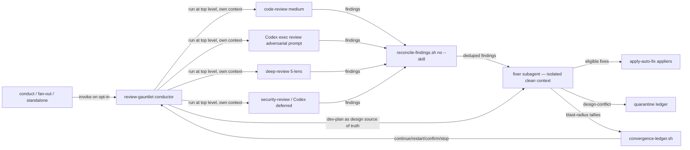
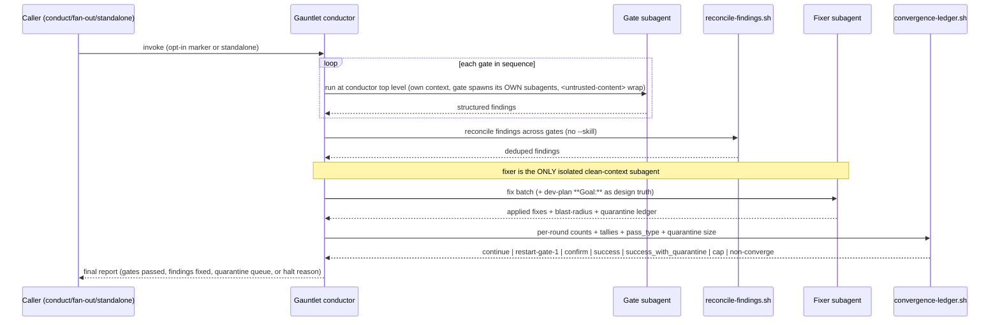

# Task: review-gauntlet — chained review-gate conductor with convergence loop

**Status**: In Progress
**Component**: review-skills
**Assigned to**: Claude + Codex (dual-plugin)
**Priority**: High
**Branch**: feature/review-gauntlet-skill
**Created**: 2026-07-07

## Objective

Add a new skein conductor skill, `review-gauntlet`, that automates the manual multi-pass review cycle: it runs the review gates in sequence at the conductor's top level, delegates every fix batch to clean-context subagents, and loops until findings converge — so the operator never has to hand-run 6–12 review passes or clear context between them.

## Context

Today the review-and-fix workflow is entirely manual. The operator runs the available review gates (`/code-review` or Codex's native `codex exec review` code-review path, an adversarial Codex review prompt when needed, `/deep-review`, then `/security-review` where the harness provides it), applies fixes between passes, and because each pass bloats the working context, they must `/clear` and restart the cycle after a rest. The usage-report insights (see `docs/dev_plans/20260504-feature-skill-improvements-from-usage-report.md`) flagged this as the dominant, most repetitive workflow: "code review is your top goal by a wide margin (37 sessions)… you routinely stack multiple review passes."

The gates already exist as discrete skills. What does **not** exist is an orchestrator that chains them, applies fixes, decides when to re-run, and knows when to stop (Explore confirmed: no skill chains multiple review gates — the only gate primitives are conduct's single CI-parity gate and fan-out's Phase 6). The manual assembly *is* the friction.

`review-gauntlet` is a **conductor** in the mold of `skein:conduct`, but with a deliberate delegation split (**Option A**). The multi-spawn gates — `/code-review` and `skein:deep-review` — already fan out their own verifier/lens subagents, and both forbid being run as a nested subagent (`conduct/implementer-prompt.md` Scope Rule 2; `deep-review/SKILL.md` "Delegation Pattern": one level of delegation only). They therefore run at the **conductor's top level, in its own context**, and the conductor absorbs their structured findings. Only the **fixer batches** run as isolated clean-context subagents. Because the fixer is the largest and most-repeated context consumer across 6–12 loops (every round re-reads findings + diff + dev-plan), isolating *it* — not the gates — is what keeps a multi-loop run sustainable in a single session with no manual context clears, even though gate output lands in the conductor's context.

This plan is the same lineage as the usage-report improvement plan and reuses primitives already built for deep-review (auto-fix appliers, cross-lens reconciliation). It is **not** standalone: it hooks into `conduct`, `fan-out`, and `dev-plan`, whose sibling plans are cross-linked below and must be updated in the same pass.

**Demand-side complement — the `**Goal:**` field.** The sibling plan `docs/dev_plans/20260707-feature-conduct-phase-goal-field.md` adds a per-phase `**Goal:**` slot that conduct injects into implementers (shift-left: robust first passes → fewer findings → faster gauntlet convergence) and that this gauntlet's Guardrail 1 reads as its design-intent source. The two plans share `conduct/SKILL.md` and the dev-plan schema files: the Goal-field plan's schema (its Phase 1) should land before this plan's Guardrail-1 wiring so the field exists when the fixer reads it.

## Requirements

- **Gate sequence (fixed order), all fixes applied to the same branch/PR — never a follow-up PR:**
  1. Code-review gate. Claude runner: `/code-review` at **medium** effort (spawns its verifier subagents). Codex runner: `codex exec review` (or `codex review` when no structured output is needed) with `--base <base>` / `--uncommitted`; use `codex exec review --output-schema <schema>` when the gauntlet needs machine-readable findings.
  2. Adversarial Codex-review gate. There is no repo or CLI command named `/codex:adversarial-review`; the Codex runner is `codex exec review --output-schema <schema> "<adversarial-review prompt>"` with the same diff target as gate 1. The gauntlet-owned schema returns `{ "gate": string, "status": "approve" | "needs-attention" | "skipped" | "deferred" | "error", "findings": [...], "notes": string|null }`, where each finding carries `file`, `line`, `category`, `severity`, `confidence`, `summary`, `evidence`, and optional `auto_fix`.
  3. `skein:deep-review` (5 lenses). Present in `plugins/skein-codex/skills/deep-review`, but the Codex gauntlet may not invoke it from inside another delegated worker until the nested-spawn gate is confirmed.
  4. Security-review gate. Claude runner: `/security-review`. Codex runner for v1: explicit `skipped` / `deferred` verdict unless a real Codex security-review primitive is configured later; `plugins/skein-codex` currently ships no `security-review` skill.
- **Codex gate matrix:** Codex mirror must document each slot as `native-codex-review`, `skein-deep-review-gated`, or `deferred`, not claim same-command parity with Claude. `quick` maps to Codex gate 1 only. `full` on Codex is allowed to run only the supported native Codex review gates and must surface `deferred` entries for unsupported/gated slots; it must not silently pretend gate 3/4 ran.
- **Conductor pattern (Option A — split delegation):** the multi-spawn gates (`/code-review`, `skein:deep-review`) run at the conductor's **top level, in its own context** — they already spawn their own verifier/lens subagents and forbid nested spawning (`conduct/implementer-prompt.md` Scope Rule 2; `deep-review/SKILL.md` "Delegation Pattern"), so they cannot be dispatched as clean-context subagents. Only the **fixer batches** run as isolated clean-context subagents, returning structured fix reports + blast-radius + quarantine ledgers. The conductor's context therefore absorbs gate findings, but the fixer — the dominant repeated consumer across loops — stays isolated. Codex full behavioural parity is currently gated because invoking gates like `skein:deep-review` from inside a gauntlet worker can require a second `spawn_agent` level whose tier is not confirmable in the current Codex CLI.
- **Convergence algorithm:**
  - After fixing, the fixer subagent classifies each applied fix's blast radius as `local` or `structural`. **Trust the LLM's self-classification** — no mechanical/deterministic backstop (races, deadlocks, protocol-state mismanagement cannot be caught by line-count heuristics).
  - If **any** `structural` fix lands in a round → **restart from gate 1** (full corpus). Rationale: code-review and codex adversarial overlap but are not identical; a structural change can reintroduce a class of bug only the earlier gate catches.
  - If only `local` fixes land → run **one confirming pass**, no full restart.
  - **Stop conditions:** (a) a full pass (`pass_type: full`) yields zero actionable findings, **and no gate in that round returned `error`/`skipped`/`deferred`** (tracked via the ledger's `--unresolved <N>` input — any unresolved gate blocks `success` even at `count=0`) → **success**; a clean local-confirming pass (`pass_type: confirm`) is NOT terminal — it returns to the loop, because only a clean *full* pass proves global convergence. (b) hard cap of **10 loops** → stop; **every round — including a gate-1 structural restart — increments the single monotonic loop counter**, so a plan that structurally restarts every round still reaches the cap. (c) **non-convergence, defined as a running-minimum stall-streak SCOPED TO THE CURRENT EPOCH (the rounds since the last structural restart, if any): track the lowest reconciled-finding count seen within the current epoch; if a round fails to beat that running minimum, increment a stall counter, else reset it to zero; bail when the stall streak reaches K=2** → **bail and escalate to human** with the explicit message that the plan/implementation has a deeper structural problem the loop cannot resolve. A structural restart starts a fresh epoch and a fresh running minimum — a pre-restart count is not commensurate with post-restart counts (the diff a fresh gate-1 corpus reviews has changed) and must not anchor the stall streak, so a fresh epoch needs its own K+1 recorded rounds before non-convergence can fire again. This running-minimum formulation (not a raw K-round window comparison) deliberately tolerates a genuinely converging run with a transient blip (e.g. 5,4,5,3,2,1 never bails, since the running minimum keeps improving) — the trade-off is that a sawtooth whose minimum keeps improving at least once every K rounds (e.g. 5,3,5,2,5,1) is bounded by the hard cap (b), not this rule, rather than false-bailing on genuine convergence. (d) converged clean but with a non-empty quarantine queue → terminal status **`success_with_quarantine`** (distinct from `success`).
- **Guardrail 1 — design-conflict findings are never auto-fixed.** The fixer subagent receives the **dev-plan** in context as the source of truth for design intent — specifically the per-phase `**Goal:**` field defined by the sibling plan `docs/dev_plans/20260707-feature-conduct-phase-goal-field.md` (the authoritative, concentrated statement of intent; the fixer falls back to whole-plan prose only when a phase has no `**Goal:**`). Handling depends on blast radius:
  - conflict + `local` → **quarantine**, continue applying other safe fixes, report the quarantine queue at the end.
  - conflict + `structural`/cascading (fixing it would force major changes elsewhere) → **halt immediately**, human needed.
- **Guardrail 2 — fix all findings regardless of confidence score.** The *only* quarantine trigger is design/architecture conflict, not a confidence threshold. Fixes are applied by **route, not confidence**: trivial/allowlisted findings through the bundled `apply-auto-fix-code.sh`; substantive logic/security findings as **direct fixer edits** (the applier is trivial-allowlist-only — see "Reuse, do not reinvent"). **Ordering invariant:** the trivial-fix applier must run and commit *before* the fixer subagent makes its substantive edits — the applier exits 7 on a dirty worktree, so a fixer-first ordering would silently skip every trivial fix for the round.
- **Invocation model (three modes, opt-in by default so a 10-loop run is never a surprise spend):**
  - Standalone: `review-gauntlet [--plan <path>] [<branch> | --pr]`
  - dev-plan marker: a new **header field** `**Review Gates:** none | quick | full` (default `none`; `quick` = code-review gate only; `full` = all logical gate slots, with Codex reporting unsupported slots as gated/deferred per the Codex gate matrix). NB: plans have **no YAML frontmatter** — this is an inline header field above the review marker (Explore fact).
- **`quick` = single-pass, no convergence loop.** `quick` runs the code-review gate exactly once (fix trivial/direct findings inline) and returns — it does **not** enter the up-to-10-loop convergence cycle. Only `full` and standalone invocation run the convergence loop; the 10-loop cap is reachable only under `full`/standalone.
  - Auto-chain: `conduct`'s terminal step (after the CI-parity gate) and `fan-out`'s Phase 6 (post-merge) read the marker and invoke `review-gauntlet` only when the plan opts in.
- **Reuse, do not reinvent:** skein does **not** share the auto-fix pipeline by relative path — `scripts/bundle-appliers.sh` (driven by `scripts/lib/bundle-map.sh`'s `BUNDLE_SKILLS`) **copies** it byte-identically into each skill's own `scripts/`, enforced by `tests/parity/test-applier-bundle-parity.sh`. So `review-gauntlet` joins `BUNDLE_SKILLS` and calls its **own bundled** copies (never `../../deep-review/scripts/`). Apply by route:
  - **Trivial/allowlisted** fixes (`docstring_typo`, `unused_import`, `unused_var`, `mechanical_replace`, `import_sort`) → the bundled `apply-auto-fix-code.sh` (+ `audit-auto-fix-eligibility.sh`, `auto-fix-allowlist.json`, `lib/auto-fix-common.sh`). That applier only applies the trivial allowlist and is hardcoded `SKILL="deep-review"`.
  - **Substantive logic/security** fixes → **direct edits by the fixer subagent**, not via the applier (the applier cannot apply them).
  - Cross-gate finding dedup → the bundled `reconcile-findings.sh` (signature `(file,line,category)`) called **without `--skill`** (it rejects any skill other than `deep-review`/`review-plan` with exit 2). Gate findings **must not carry `auto_fix` blocks** at the reconcile stage — the reconciler requires `--skill` only when `auto_fix` is present, so trivial-fix proposals are handled separately by the fixer route, never fed through reconcile with an `auto_fix` payload.
- **Dual-plugin parity:** ship a Claude SKILL.md (`${CLAUDE_PLUGIN_ROOT}` anchors) and a Codex mirror (`$SKILL_DIR` anchors) that are semantically aligned where the harnesses support the same behaviour. Byte parity is required only for shared runtime artifacts and parity-checked generic blocks; Codex-specific gate support, dispatch idiom, nested-spawn gating, and path anchors are legitimate divergences. Must pass existing parity tests without asserting unsupported Codex behaviour.

## Review Focus

- **Convergence termination:** prove the loop *always* terminates — every path must hit one of the three stop conditions. The non-convergence detector must not false-negative into an infinite loop, nor false-positive-bail on a legitimately-shrinking finding set.
- **Guardrail correctness:** a design-conflict finding must never be silently auto-fixed; verify the dev-plan-as-source-of-truth is actually in the fixer's context on every fix batch, at every call site.
- **Spend safety:** default `none` marker; auto-chain must be strictly opt-in. Verify no path triggers a full 10-loop run without an explicit `full` marker or explicit standalone invocation.
- **Reuse integrity:** confirm the gauntlet calls the *existing* appliers/reconciler rather than forking logic — no duplicated allowlist, no reimplemented signature scheme.
- **Dual-plugin parity:** Codex mirror must satisfy the real `tests/parity/*` coverage (SKILL.md presence, applier-bundle byte-identity, allowlist byte-identity, marker parity, spawn-tier census, no-manual-fallback, mirror handoff). Harness-divergent anchors (`${CLAUDE_PLUGIN_ROOT}` vs `$SKILL_DIR`) and the Codex gate matrix above must never be collapsed into false byte-parity claims.
- **Same-PR invariant:** all fixes land on the working branch; the gauntlet never opens a second PR.

## Implementation Checklist

> **Phase split:** Phases 1–6 are **Claude-authored** (repo-level files: Claude SKILL.md, bundled scripts, hooks into other Claude skills, tests, docs). Phases C1–Cn are **Codex-authored** (the Codex-mirror SKILL.md content and mirror edits), using Codex-native review/adaptation rather than hand-copying Claude prose. Historical plans call this route `codex:rescue`; it is a repo convention for Codex-authored adaptation, not a review-gauntlet gate command. Codex authors the content of the C-phases below.

### Phase 1: Core orchestrator SKILL.md (Claude)

**Impl files:** `plugins/skein/skills/review-gauntlet/SKILL.md`
**Test files:** `tests/gauntlet/test-gauntlet-skill-shape.sh`
**Test command:** `bash tests/gauntlet/test-gauntlet-skill-shape.sh`

> **Cross-plan prerequisite gate (blocking):** Guardrail 1 reads the per-phase `**Goal:**` field. That field is defined by the sibling plan `docs/dev_plans/20260707-feature-conduct-phase-goal-field.md`. **Its Phase 1 (`**Goal:**` schema) MUST land before this plan's Guardrail-1 wiring** so the field the fixer reads actually exists. Do not merge the Guardrail-1 dispatch prose until the Goal-field schema is on the branch.

- Write the SKILL.md frontmatter (`name: review-gauntlet`, `description` with trigger phrases: "review gauntlet", "run the review gates", "run all reviews", "review loop until clean"; `argument-hint`).
- Document the conductor loop: gate sequence, per-gate clean-context subagent dispatch, structured-findings return contract.
- Specify the convergence algorithm exactly per Requirements (blast-radius classification, structural→restart-gate-1, local→single confirming pass, three stop conditions).
- Specify both guardrails (design-conflict quarantine-vs-halt by blast radius; fix-all-regardless-of-confidence).
- Specify invocation parsing for the three modes and the `--plan`/`--pr`/`<branch>` arguments.
- Wrap any plan/diff content passed to subagents in `<untrusted-content>` with the attacker-control warning (match deep-review's pattern).

### Phase 2: Gate-runner + convergence bundled scripts (Claude)

**Impl files:** `plugins/skein/skills/review-gauntlet/lib/run-gate.sh, plugins/skein/skills/review-gauntlet/lib/convergence-ledger.sh, plugins/skein/skills/review-gauntlet/lib/gauntlet-common.sh`
**Test files:** `tests/gauntlet/test-convergence-ledger.sh, tests/gauntlet/test-reuse-wiring.sh`
**Test command:** `bash tests/gauntlet/test-convergence-ledger.sh && bash tests/gauntlet/test-reuse-wiring.sh`

- `convergence-ledger.sh`: track per-round reconciled finding counts + blast-radius tallies + `pass_type` + quarantine-queue size + unresolved-gate count; emit `continue|restart|confirm|success|success_with_quarantine|cap|non-converge` decisions. **INPUT contract per round:** `{count, structural_tally, local_tally, pass_type: full|confirm, quarantine_size, --unresolved N}`. `success` requires a clean `pass_type: full` **and** `--unresolved 0` (any gate that returned `error`/`skipped`/`deferred` blocks `success` even at `count=0`); a clean `pass_type: confirm` returns `continue`. Non-convergence fires via a **running-minimum stall streak SCOPED TO THE CURRENT EPOCH** (the rounds since the last structural restart, if any): the ledger tracks the lowest `count` seen *within the current epoch*, and bails when a round fails to beat that minimum for **K=2** consecutive rounds (not a raw K-round window comparison — this tolerates a transient blip on a genuinely converging run, e.g. 5,4,5,3,2,1, at the cost of only capping via the hard 10-loop limit on a sawtooth that keeps setting new minima, e.g. 5,3,5,2,5,1). A structural restart opens a fresh epoch with a fresh running minimum — a pre-restart count is not commensurate with post-restart counts (the diff a fresh gate-1 corpus reviews has changed) and must not anchor the stall streak, so each new epoch needs its own K+1 recorded rounds before non-convergence can fire again. The **single monotonic loop counter** increments every round including a gate-1 restart, so the 10-loop cap always binds. Pure function of the ledger — deterministic, unit-testable.
- **Bundling (skein copies, never relative-path):** add `review-gauntlet` to `BUNDLE_SKILLS` in `scripts/lib/bundle-map.sh` (applier basename `apply-auto-fix-code.sh` via a `bundle_applier_for` arm; no `bundle_extra_for` extras) so `scripts/bundle-appliers.sh` copies the byte-identical shared pipeline (`reconcile-findings.sh`, `apply-auto-fix-code.sh`, `audit-auto-fix-eligibility.sh`, `auto-fix-allowlist.json`, `lib/auto-fix-common.sh`) into `plugins/skein/skills/review-gauntlet/scripts/`. Extend `tests/parity/test-applier-bundle-parity.sh` and `tests/parity/test-allowlist-byte-identity.sh` to cover the new skill.
- `run-gate.sh`: thin dispatcher that normalizes each gate's output into the common finding schema and pipes cross-gate findings through the **bundled** `"$SKILL_DIR"/scripts/reconcile-findings.sh` (or `${CLAUDE_PLUGIN_ROOT}` anchor on Claude) called **without `--skill`** — do not fork it, and do not reference `../../deep-review/scripts/`.
- Fixer wiring: **trivial/allowlisted** fixes route through the bundled `apply-auto-fix-code.sh` (+ `audit-auto-fix-eligibility.sh`, `auto-fix-allowlist.json`); **substantive** logic/security fixes are **direct fixer edits** (the applier is trivial-only and hardcoded `SKILL="deep-review"`). Reference the appliers, do not copy allowlist logic.
- Quarantine ledger: record design-conflict findings with blast radius so the conductor can decide quarantine-continue vs halt.

### Phase 3: dev-plan `**Review Gates:**` header marker field (Claude)

**Impl files:** `plugins/skein/skills/dev-plan/SKILL.md, plugins/skein/skills/dev-plan/template.md`
**Test files:** `tests/gauntlet/test-review-gates-marker.sh`
**Test command:** `bash tests/gauntlet/test-review-gates-marker.sh`

- Add `**Review Gates:** none | quick | full` to the plan Header (Required Sections item 1) and to `template.md`, documented as an above-marker contract field (default `none`).
- Document that `conduct`/`fan-out` read this field to decide whether to auto-chain `review-gauntlet`.
- Note the immutability consequence: because it sits above the marker, changing it post-`/review-plan` invalidates the marker hash (correct — opting a plan into gates is a contract decision).
- **Shared-file ownership (reciprocal with the Goal-field plan):** this phase and the sibling Goal-field plan both edit `dev-plan/SKILL.md` + `template.md`. Ownership split to avoid clobbering on parallel edits: **this plan owns the `**Review Gates:**` header field** (plan Header / Required Sections item 1); **the Goal-field plan owns the per-phase `**Goal:**` slot** (phase contract block / Required Sections item 4). Neither plan edits the other's lines.

### Phase 4: conduct terminal hook (Claude)

**Impl files:** `plugins/skein/skills/conduct/SKILL.md`
**Test files:** `tests/gauntlet/test-conduct-hook.sh`
**Test command:** `bash tests/gauntlet/test-conduct-hook.sh`

- After the CI-parity gate (the `## CI Parity Gate` section and its `_dispatch_ci_parity_if_eligible` dispatch protocol; ~`conduct/SKILL.md:297+`), when status would become `complete`, read the plan's `**Review Gates:**` field; if `quick`/`full`, invoke `review-gauntlet` with `--plan <this plan>` scoped to the correct gate subset.
- Strictly opt-in: absent or `none` marker → no gauntlet, current behavior unchanged.
- Update conduct's handback prose (which currently anticipates the operator manually running `/deep-review`, in the `### Step 8 — Phase-boundary commit` / hard-stop handback area; ~`:246`) to reflect the automated path.
- **Commit ownership at the terminal seam (who commits gauntlet fixes):** conduct's `### Step 8 — Phase-boundary commit` freezes each phase's `commit_sha` as **immutable**, and its `--resume` preflight absorbs any follow-up commits into `resume_base_sha` for the rogue-commit check (it does NOT rewrite `commit_sha`). Therefore the gauntlet, running *after* the final phase boundary, must **land its own single `review-gauntlet fixes` commit** on the working branch; conduct must treat that commit as an absorbed follow-up (rolled into `resume_base_sha`), not as a rogue commit and not by rewriting a prior phase's frozen `commit_sha`. Specify this reconciliation explicitly so the rogue-commit check does not flag the gauntlet's own commit.

### Phase 5: fan-out Phase 6 hook (Claude)

**Impl files:** `plugins/skein/skills/fan-out/SKILL.md`
**Test files:** `tests/gauntlet/test-fanout-hook.sh`
**Test command:** `bash tests/gauntlet/test-fanout-hook.sh`

- At the end of the `### Phase 6: Merge` section (Merge + post-merge verification; ~`fan-out/SKILL.md:209-224`), before `### Phase 7: Cleanup`, read the `**Review Gates:**` field and invoke `review-gauntlet` on the merged feature branch when `quick`/`full`.
- **No-op on the PR-per-task exit path:** `### Phase 6: Merge` is reached only via `/fan-out merge` (option 1 — branches merged into one current branch). The alternative exit (option 2, "Create individual PRs for each branch") produces **no single merged branch** — the hook must **no-op** there. The gauntlet runs **only on the merged-branch path**; there is no unified diff to gate under PR-per-task.
- Opt-in identical to Phase 4; default behavior unchanged.

### Phase 6: Tests, docs, and sibling cross-links (Claude)

**Impl files:** `justfile, scripts/lib/bundle-map.sh, scripts/bundle-appliers.sh, tests/parity/test-applier-bundle-parity.sh, tests/parity/test-allowlist-byte-identity.sh, AGENTS.md, CHANGELOG.md, docs/dev_plans/README.md, docs/dev_plans/20260422-feature-conduct-skill.md, docs/dev_plans/20260512-feature-conduct-autonomous-mode.md, docs/dev_plans/20260317-feature-deep-review.md`
**Test files:** `tests/gauntlet/`
**Test command:** `just parity-tests && just gauntlet-tests` <!-- no tests/run-all.sh exists; use justfile recipes -->

- Add a `gauntlet-tests` recipe to `justfile` that runs the `tests/gauntlet/*` suite; the aggregate entry point is `just parity-tests` (existing) + `just gauntlet-tests` (new). There is no `tests/run-all.sh`.
- Add `review-gauntlet` to `BUNDLE_SKILLS` (`scripts/lib/bundle-map.sh`) and its `bundle_applier_for` arm; extend `tests/parity/test-applier-bundle-parity.sh` and `tests/parity/test-allowlist-byte-identity.sh` to cover the bundled review-gauntlet copies. (See Phase 2.)
- Add the gauntlet unit suite (convergence stop conditions, blast-radius restart logic, quarantine-vs-halt classification, opt-in gating).
- Update `AGENTS.md` (skill roster + Model/Effort policy note for the gauntlet's gate tiers), `CHANGELOG.md`, and the `docs/dev_plans/README.md` task table (Component `review-skills`).
- **NB (commit boundary, I4):** the `tests/parity/test_skill_md_presence.py` `MANAGED_SKILLS` edit is **NOT** done here — it requires the skill to exist in **both** plugins, and the Codex mirror lands in Phase C1. That edit is moved into Phase C1 so the repo never goes red between Phase 6 and C1.
- Cross-link this plan into the conduct/deep-review sibling plans' "related work" so the corpus stays coherent (repo rule: update siblings in the same pass).

<!-- BEGIN CODEX-AUTHORED PHASES -->
### Phase C1: Codex-mirror review-gauntlet SKILL.md

**Impl files:** `plugins/skein-codex/skills/review-gauntlet/SKILL.md, plugins/skein-codex/skills/review-gauntlet/lib/run-gate.sh, plugins/skein-codex/skills/review-gauntlet/lib/convergence-ledger.sh, plugins/skein-codex/skills/review-gauntlet/lib/gauntlet-common.sh`
**Test files:** `tests/parity/test_skill_md_presence.py, tests/parity/test-spawn-tiers.sh`
**Test command:** `python -m pytest tests/parity/test_skill_md_presence.py && bash tests/parity/test-spawn-tiers.sh`

- Author the Codex mirror SKILL.md from the Codex side, preserving the Claude-side conductor contract while using Codex dispatch language (`spawn_agent`, `fork_context: false`, reasoning-effort hints) instead of Claude `Agent` tool prose.
- Use Codex `$SKILL_DIR` anchors for bundled-script invocations and never collapse them to the Claude `${CLAUDE_PLUGIN_ROOT}` idiom.
- Mirror the review-gauntlet bundled scripts under the Codex skill directory with byte-parity wherever the scripts are shared runtime artifacts.
- Keep the same logical gate slots, convergence algorithm, guardrails, same-branch invariant, and `<untrusted-content>` wrapping contract as the Claude SKILL.md, but document Codex's real runner per slot:
  - gate 1 `code-review`: invoke native `codex exec review` (machine mode: `--output-schema <schema>`; target by `--base <branch>` / `--uncommitted`; effort by supported config such as `-c model_reasoning_effort="medium"` when used from a CLI subprocess).
  - gate 2 `adversarial-review`: invoke native `codex exec review --output-schema <schema>` with an adversarial prompt; do not reference `/codex:adversarial-review`.
  - gate 3 `deep-review`: available as `skein:deep-review`, but gated when running beneath another Codex worker because nested `spawn_agent` topology/tier confirmation is still gated.
  - gate 4 `security-review`: no `plugins/skein-codex` skill or Codex CLI subcommand exists; emit a structured `skipped` / `deferred` verdict unless a future real security primitive is added.
- Add the Codex gauntlet output adapter/schema for native Codex review gates: `{ "gate": string, "status": "approve" | "needs-attention" | "skipped" | "deferred" | "error", "findings": [ { "file": string, "line": integer|null, "category": string, "severity": string, "confidence": number|null, "summary": string, "evidence": string, "auto_fix": object|null } ], "notes": string|null }`. `approve` and `needs-attention` are review outcomes; `skipped`/`deferred` are explicit Codex capability outcomes and are never counted as clean gate passes.
- Hard-stop or downgrade `full` mode on Codex when it would require unsupported nested gate execution; do not claim full behavioural parity until the R6 nested-spawn gate is confirmed for topology and child tier.
- Ensure the new `plugins/skein-codex/skills/review-gauntlet/SKILL.md` is registered by directory convention and by the existing Codex plugin `"skills": "./skills/"` manifest surface.
- **Add `review-gauntlet` to `MANAGED_SKILLS` in `tests/parity/test_skill_md_presence.py` in THIS phase's commit (I4 commit-boundary):** that test asserts the skill exists in **both** plugins, so the `MANAGED_SKILLS` edit must land together with the Codex mirror created here — not in Phase 6 (Claude-only), which would leave the repo red until C1. If Phase 6 and C1 are instead landed as a single commit, this edit may live there; the invariant is that `MANAGED_SKILLS` never lists review-gauntlet while the Codex mirror is absent.

### Phase C2: Codex-mirror hook edits (conduct / fan-out / dev-plan mirrors + template)

**Impl files:** `plugins/skein-codex/skills/conduct/SKILL.md, plugins/skein-codex/skills/fan-out/SKILL.md, plugins/skein-codex/skills/dev-plan/SKILL.md, plugins/skein-codex/skills/dev-plan/template.md`
**Test files:** `tests/parity/test-prompt-parity-extended.sh, tests/parity/test-spawn-tiers.sh, tests/parity/check-mirror-handoff.sh`
**Test command:** `bash tests/parity/test-prompt-parity-extended.sh && bash tests/parity/test-spawn-tiers.sh && bash tests/parity/check-mirror-handoff.sh`

- Mirror the `**Review Gates:** none | quick | full` header-field documentation into the Codex dev-plan skill and template, keeping it above the review marker and defaulting to `none`.
- Mirror the conduct terminal auto-chain hook prose into the Codex conduct SKILL.md using Codex-native invocation wording for `review-gauntlet --plan <this plan>`, but preserve Codex's delegation-availability hard stop: no inline implementation when `spawn_agent` / `wait_agent` / `close_agent` are unavailable.
- Mirror the fan-out Phase 6 auto-chain hook prose into the Codex fan-out SKILL.md, preserving the opt-in-only behavior and merged-feature-branch scope while respecting the existing R6 note that nested test-writer topology is gated.
- Keep hook semantics aligned with the Claude side only for supported gates. Codex hooks must pass through the Codex gate matrix (`quick` = native code review; `full` = native supported gates plus explicit deferred/gated entries) instead of claiming byte-equivalent execution of missing `/security-review` or `/codex:adversarial-review` commands.
- Do not edit repo-level files in this phase; Codex owns only the mirror SKILL.md/template content, while Claude owns shared scripts, tests, AGENTS.md, CHANGELOG.md, and README changes.

### Phase C3: Codex-mirror parity verification

**Impl files:** `plugins/skein-codex/skills/review-gauntlet/SKILL.md, plugins/skein-codex/skills/review-gauntlet/scripts/, plugins/skein-codex/skills/conduct/SKILL.md, plugins/skein-codex/skills/fan-out/SKILL.md, plugins/skein-codex/skills/dev-plan/SKILL.md, plugins/skein-codex/skills/dev-plan/template.md`
**Test files:** `tests/parity/test_skill_md_presence.py, tests/parity/test-applier-bundle-parity.sh, tests/parity/test-allowlist-byte-identity.sh, tests/parity/test-spawn-tiers.sh, tests/parity/check-mirror-handoff.sh`
**Test command:** `just parity-tests && bash tests/parity/check-mirror-handoff.sh`

- Run the real parity suite that covers SKILL.md presence, applier-bundle byte-identity, allowlist byte-identity, marker parity, spawn-tier contracts, and no-manual-fallback behavior: `just parity-tests`, plus `bash tests/parity/check-mirror-handoff.sh` for handoff hygiene.
- Run `tests/parity/check-mirror-handoff.sh` after the Codex mirror work has landed in phase-bounded commits, so mixed-mirror handoff regressions are caught.
- Compare the Claude and Codex `review-gauntlet` SKILL.md files and assert only the parity that is real: shared script artifacts and generic schemas byte-identical where tests require it; prose semantically aligned for shared behaviour; Codex-specific divergences allowed for `codex exec review` invocation, the absence of `/codex:adversarial-review`, the absence/deferment of `security-review`, and the R6 nested-spawn gate.
- Confirm mirrored review-gauntlet scripts are byte-identical where parity requires it, including `run-gate.sh`, `convergence-ledger.sh`, and `lib/gauntlet-common.sh`.
- Record any accidental non-parity divergence as a blocker before the plan can proceed to implementation or review acceptance. Record the intentional Codex runtime limitation as `gated` rather than a blocker: `docs/dev_plans/CODEX_MIRROR_BACKLOG.md` documents that the Codex nested-spawn topology can run in a plain shell but remains gated because child `reasoning_effort` is not observable from `codex exec --json` and availability is launch-context-dependent.
<!-- END CODEX-AUTHORED PHASES -->

## Technical Specifications

### Files to Modify
- `plugins/skein/skills/dev-plan/SKILL.md` — add `**Review Gates:**` header field (Phase 3).
- `plugins/skein/skills/dev-plan/template.md` — add the field to the header block (Phase 3).
- `plugins/skein/skills/conduct/SKILL.md` — terminal auto-chain hook after CI-parity gate (Phase 4).
- `plugins/skein/skills/fan-out/SKILL.md` — Phase 6 auto-chain hook (Phase 5).
- `scripts/lib/bundle-map.sh` — add `review-gauntlet` to `BUNDLE_SKILLS` + `bundle_applier_for` arm (Phase 2/6).
- `scripts/bundle-appliers.sh` — no code change expected, but re-run to emit the bundled copies; verify it handles the new skill (Phase 2/6).
- `tests/parity/test-applier-bundle-parity.sh`, `tests/parity/test-allowlist-byte-identity.sh` — extend to cover review-gauntlet's bundled copies (Phase 6).
- `justfile` — add `gauntlet-tests` recipe; aggregate = `just parity-tests` + `just gauntlet-tests` (Phase 6).
- `tests/parity/test_skill_md_presence.py` — add review-gauntlet to `MANAGED_SKILLS` (requires both plugins → landed in **Phase C1** with the Codex mirror, per I4).
- `AGENTS.md`, `CHANGELOG.md`, `docs/dev_plans/README.md` — roster/changelog/index (Phase 6).
- Codex mirrors of all of the above (Phases C1–C3, Codex-authored).

### New Files to Create
- `plugins/skein/skills/review-gauntlet/SKILL.md` — the conductor skill (Phase 1).
- `plugins/skein/skills/review-gauntlet/scripts/{run-gate.sh,convergence-ledger.sh,lib/gauntlet-common.sh}` — gate dispatch + convergence decision (Phase 2).
- `plugins/skein-codex/skills/review-gauntlet/SKILL.md` + mirrored scripts (Codex, Phases C1/C3).
- `tests/gauntlet/*` — unit + hook + shape tests (Phases 1–6).

### Architecture Decisions
- **Conductor, not monolith (Option A):** the multi-spawn gates (`/code-review`, `skein:deep-review`) run at the conductor's **top level** because they fan out their own subagents and forbid nesting (`deep-review/SKILL.md` "Delegation Pattern"; `conduct/implementer-prompt.md` Scope Rule 2); only the **fixer** runs as a clean-context subagent. The fixer is the dominant per-loop context consumer, so isolating *it* — not the gates — keeps the conductor sustainable across 6–12 loops. Gate output lands in the conductor's context by design.
- **Reuse the shared script bundle** for appliers + reconciliation rather than forking — a single allowlist and a single `(file,line,category)` signature scheme across the review surface. skein does not share via relative path: `scripts/bundle-appliers.sh` (driven by `scripts/lib/bundle-map.sh`'s `BUNDLE_SKILLS`) **copies** the pipeline byte-identically into each skill's own `scripts/`, enforced by `tests/parity/test-applier-bundle-parity.sh`. `review-gauntlet` joins `BUNDLE_SKILLS` (applier basename `apply-auto-fix-code.sh`, no extras) and gets its own bundled copy; trivial fixes use that applier, substantive fixes are direct fixer edits.
- **Marker is an inline header field, not frontmatter** — plans carry no YAML frontmatter (Explore fact); the field lives above the review marker as immutable contract.
- **Opt-in by default** — the marker defaults to `none`; auto-chain fires only on explicit `quick`/`full`. Protects against surprise 10-loop spend (a named friction in the usage report).
- **Convergence decision is a pure, unit-testable function** of the per-round ledger — termination provability lives in `convergence-ledger.sh`, not in prose.

### Dependencies
- No new language deps (no root manifest; plugin manifests at `0.3.0`). Claude depends on the existing review commands `/code-review`, `skein:deep-review`, and `/security-review`, plus the deep-review script bundle. Codex depends on the installed Codex CLI `review` / `exec review` subcommands for code/adversarial review, `skein:deep-review` for the deep-review slot when nested delegation is confirmed, and explicit `deferred` output for any missing Codex security-review primitive.

### Integration Seams

| Seam | Writer (task) | Caller (task) | Contract |
|------|---------------|---------------|----------|
| Review Gates marker | dev-plan (Phase 3) | conduct hook (P4), fan-out hook (P5) | Field parsed from plan header above marker; absent/`none` ⇒ no-op; `quick` ⇒ code-review gate only; `full` ⇒ all logical gate slots, with Codex gated/deferred slots reported explicitly |
| Gate finding schema | run-gate.sh (P2) | bundled reconcile-findings.sh | Findings normalized to `(file,line,category,severity,confidence)` and dedup'd via `reconcile-findings.sh` called **without `--skill`** (it rejects any skill other than deep-review/review-plan, exit 2); gate findings **must not carry `auto_fix` blocks** at reconcile (reconciler requires `--skill` only when `auto_fix` is present — trivial-fix proposals handled separately); Codex native review gates are adapted from the gauntlet-owned JSON schema; reconciler is called, never forked |
| Auto-fix apply | fixer subagent (P1/P2) | bundled apply-auto-fix-code.sh | Trivial/allowlisted fixes route through the bundled applier; substantive logic/security fixes are made as **direct fixer edits** (applier is trivial-only, hardcoded `SKILL=deep-review`); design-conflict fixes bypass both and go to the quarantine ledger. **Ordering:** applier runs and commits before the fixer's substantive edits — the applier exits 7 on a dirty worktree, so a fixer-first order silently skips trivial fixes |
| Convergence decision | convergence-ledger.sh (P2) | conductor loop (P1) | Given per-round finding counts + blast-radius tallies + `pass_type` (full\|confirm) + quarantine size + `--unresolved N` (count of gates that returned error/skipped/deferred this round), returns exactly one of `continue\|restart\|confirm\|success\|success_with_quarantine\|cap\|non-converge`; `success` additionally requires `--unresolved 0`; non-convergence = a running-minimum stall streak of K=2 rounds SCOPED TO THE CURRENT EPOCH (rounds since the last structural restart — a restart opens a fresh epoch with a fresh running minimum, since a pre-restart count is not commensurate with post-restart counts; not a raw window comparison); loop counter is monotonic across restarts |
| Quarantine ledger | fixer subagent (P1) | conductor loop (P1) | Design-conflict findings recorded with blast radius; `local` ⇒ continue, `structural` ⇒ halt |
| Codex-mirror parity | Codex mirror (C1–C3) | tests/parity/* | Mirror scripts satisfy byte-identity where parity tests require it; SKILL.md prose is semantically aligned but may diverge for Codex CLI review invocation, missing security-review, nested-spawn gating, and anchor idiom |

## Architecture & Call Flow

> Included: the system has 5+ independently-executing components (conductor, four gate subagents, fixer subagents, the Codex CLI behind the adversarial gate, and the conduct/fan-out callers).

Component graph — which component triggers which:

Trigger order — the sequence of calls across a single round:

Context lifecycle — what enters context at each step, and whether it clears or persists:

| Step | Trigger | Enters context | Cleared/persisted | Turn boundary |
|------|---------|----------------|-------------------|---------------|
| 1 | gauntlet invoked | invocation args, marker/plan path, branch | conductor holds only the ledger + report | persists ledger to a run file |
| 2 | gate run (top level) | gate prompt + diff/plan (wrapped untrusted) | runs in the **conductor's own context**; the gate spawns its **own** verifier/lens subagents (cannot nest under the conductor) | gate returns structured findings; its internal subagent context is discarded, but its output lands in the conductor |
| 3 | reconcile | deduped finding set only | conductor holds findings, not raw gate output | after reconcile writes deduped set |
| 4 | fixer dispatched (isolated) | findings batch + dev-plan `**Goal:**` (design truth) | fresh/isolated clean-context subagent — the **only** delegated tier | fixer returns fixes + blast-radius + quarantine |
| 5 | convergence decision | per-round counts + tallies (ledger only) | ledger persists across rounds to a run file | decision returned; loop or stop |
| 6 | terminate | final report | report persists; conductor context released | success / cap / non-converge / halt |

## Testing Notes

### Test Approach
- [x] Unit: `convergence-ledger.sh` decision table — every input row maps to exactly one of the seven outcomes; termination is provable (cap and non-converge are reachable and mutually exclusive with success). (`test-convergence-ledger.sh`, cases 1–12)
- [x] Unit (C4): **plateau** `3→3→3` ⇒ non-converge (running minimum stalls for K=2 rounds; first round is always a new minimum, so this needs ≥K+1 recorded rounds to fire). (`test-convergence-ledger.sh:139-147`)
- [x] Unit (fixup, `13d9055`): **oscillation** `5→3→5→3` ⇒ non-converge (running min 3 stalled K=2 rounds), but `5→3→5` alone ⇒ `confirm`, NOT a premature bail (running min stalled only 1 round) — corrects the plan's original raw-window description of this vector.
- [x] Unit (fixup, `13d9055`): **converging-with-blip** `5,4,5,3,2,1` ⇒ never fires non-converge, because the running minimum keeps improving each time it's beaten — the case the running-minimum formulation exists to protect, distinguishing it from a raw K-round window comparison.
- [x] Unit (C4): **structural-restart-every-round** ⇒ monotonic loop counter still reaches the **cap** at 10 (restart does not reset the counter). (`test-convergence-ledger.sh:194-209`)
- [x] Unit (C4): **clean-confirm vs clean-full** — clean `pass_type: confirm` ⇒ `continue`; clean `pass_type: full` ⇒ `success`. (`test-convergence-ledger.sh:109-127`)
- [x] Unit (C4): **converged-with-quarantine** — clean full pass + non-empty quarantine queue ⇒ `success_with_quarantine`. (`test-convergence-ledger.sh:115-119`)
- [x] Unit (fixup, `13d9055`): **errored-gate blocks clean pass** — `count=0`, `pass_type: full`, but `--unresolved 1` (a gate returned error/skipped/deferred that round) ⇒ `continue`, NOT `success`; same rule composes with quarantine (`count=0`, quarantine>0, `--unresolved 1` ⇒ `continue`, not `success_with_quarantine` — the errored-gate rule outranks the quarantine terminal).
- [x] Unit: blast-radius restart logic (any `structural` ⇒ restart gate 1; all `local` ⇒ single confirming pass). (`test-convergence-ledger.sh:133-137`)
- [x] Unit (I6): the 10-loop cap is reachable **only under `full`/standalone**; `quick` runs a single code-review pass and never enters the convergence loop. (documented and asserted via `test-gauntlet-skill-shape.sh:187`; no separate integration harness runs the loop live)
- [x] Unit: guardrail classification (design-conflict + `local` ⇒ quarantine-continue; + `structural` ⇒ halt; non-conflict ⇒ fix regardless of confidence). (fixer classification is LLM self-classification per Requirements, not a scriptable unit; verified via `test-gauntlet-skill-shape.sh:155-173` asserting both guardrails are fully specified in `SKILL.md`)
- [x] Unit: opt-in gating (`none`/absent ⇒ no-op; `quick` ⇒ gate 1 only, single pass; `full` ⇒ all logical gate slots, with unsupported Codex slots surfaced as gated/deferred). (`test-gauntlet-skill-shape.sh:178-187`, `test-conduct-hook.sh`, `test-fanout-hook.sh`)
- [x] Unit (minor): **gate-order enforcement** — gates run in the fixed sequence (code-review → adversarial → deep-review → security); assert order, not just membership. (`test-gauntlet-skill-shape.sh`: asserts each gate heading's line number is strictly increasing)
- [x] Unit (minor, fixup `13d9055`): **gate/applier failure mid-loop** — a gate subagent that **errors** (status `error`/`skipped`/`deferred`) is tracked via the ledger's `--unresolved` count and distinguished from one that returns findings; it blocks the clean-full-pass `success` rule even at `count=0` (does not silently converge).
- [x] Shape (I1, Guardrail 1): grep/AST assertion that the fixer-dispatch block in `SKILL.md` embeds both the dev-plan/`**Goal:**` design-intent reference AND the `<untrusted-content>` wrap, so a future edit cannot silently drop either. (`test-gauntlet-skill-shape.sh`: asserts co-occurrence within the "Every fixer dispatch ... must include both" paragraph, not just independent presence anywhere in the file. `SKILL.md` has a single fixer-dispatch description, so paragraph-scoped co-occurrence covers the whole surface.)
- [x] Shape (fixup, `13d9055`): **applier-before-fixer ordering** — assert every fixer-dispatch block in `SKILL.md` sequences the trivial-fix applier run/commit strictly before the fixer subagent's substantive edits, per the Guardrail 2 ordering invariant.
- [x] Reuse wiring: `run-gate.sh` invokes the **bundled** `reconcile-findings.sh` (no `--skill`) and appliers, not a fork (assert by path + no duplicated allowlist); bundled copies are byte-identical (`test-applier-bundle-parity.sh`, `test-allowlist-byte-identity.sh` extended to review-gauntlet). (`test-reuse-wiring.sh`)
- [x] Integration (fixup, `318aef2`): **`tests/gauntlet/test-run-gate.sh`** (17 assertions) — end-to-end coverage of `run-gate.sh normalize|reconcile|route`: auto_fix stripped from the pooled/reconcile-bound payload but cached unstripped; `lens=<gate>` tagging; non-clean gate status (`error`) exits 4 and still emits findings; route re-attaches cached `auto_fix` by `(file,line,category)` and delegates eligibility to the bundled auditor; route warns to stderr on a colliding `(file,line,category)` auto_fix signature (using the same BEL-joined signature the re-attach map itself uses, per `915cceb`) instead of silently dropping one gate's proposal.
- [x] Parity: SKILL.md presence in both plugins; applier-bundle byte-identity; allowlist byte-identity; spawn-tier census; mirror handoff; Codex-specific gated/deferred review slots documented. (`just parity-tests` green per Stage 4 Findings)
- [x] Integration (manual): drive the gauntlet on a seeded branch with known findings; confirm it converges and lands all fixes on the same branch. (Stage 4 Findings: end-to-end smoke of `run-gate.sh` normalize→reconcile→route against the real bundled pipeline, anchor/dev-fallback/abort paths, and the reconcile-without-`--skill` invariant)

### Test Results
- [x] All existing tests pass (`just parity-tests`, `just gauntlet-tests` — 204 assertions across 9 files, per Stage 3/4/5/6 Findings)
- [x] New tests added and passing (`test-run-gate.sh` 17/17, `test-convergence-ledger.sh` 37/37 including case 9c, `test-applier-bundle-parity.sh` 48/48 including the skill-identity pin)
- [x] Manual verification complete (Stage 4 Findings robustness smoke; both mirrors verified in sync via `check-mirror-handoff.sh`)

### Edge Cases Tested
- [x] Zero findings on first pass ⇒ immediate success, no fixer dispatched. (`test-convergence-ledger.sh:109-113`)
- [x] Findings that never converge ⇒ non-converge bail with human-escalation message, not infinite loop. (`test-convergence-ledger.sh:139-163`)
- [x] Exactly 10 loops ⇒ cap stop. (`test-convergence-ledger.sh:194-209`)
- [x] Design-conflict structural finding on round 1 ⇒ immediate halt, no further gates. (guardrail classification documented and asserted per `SKILL.md`; see the guardrail-classification unit item above for the LLM-self-classification caveat)
- [x] Marker absent ⇒ conduct/fan-out behavior byte-identical to pre-change. (`test-conduct-hook.sh`, `test-fanout-hook.sh`)

## Acceptance Criteria

- `review-gauntlet` skill exists in both plugins, passes `tests/parity/*`, and triggers on the documented phrases.
- Running it drives all supported gates in order, applies fixes to the working branch only, and reports gates passed / findings fixed / quarantine queue. Claude full mode drives all four gates; Codex full mode must explicitly report gated/deferred slots until real Codex primitives and nested-spawn confirmation exist.
- Convergence loop provably terminates via one of the three stop conditions; unit tests cover all six ledger outcomes.
- Both guardrails enforced at every fixer call site with the dev-plan in context.
- `**Review Gates:**` marker gates auto-chain from conduct and fan-out; default `none` is a strict no-op.
- Fixer reuses the existing deep-review appliers + reconciler (no forked allowlist/signature logic).
- Sibling plans (conduct, deep-review) cross-linked; README task table + CHANGELOG + AGENTS.md updated.
- Codex mirror authored (Phases C1–C3), byte-parity where required, and honest capability parity where full behavioural parity is gated by Codex nested-spawn/tier observability.
- Code reviewed and approved
- Tests passing
- Documentation updated

<!-- reviewed: 2026-07-08 @ b948a92a5eea39ce871780931c640f2a10f2a5bb -->

<!-- /review-plan writes the marker line above. Everything below is the workspace: edits here do NOT invalidate the marker. -->

## Progress

- [x] Phase 1: Core orchestrator SKILL.md (Claude) — ddbbb41
- [x] Phase 2: Gate-runner + convergence bundled scripts (Claude) — e6b460b
- [x] Phase 3: dev-plan Review Gates header marker field (Claude) — 3051d3e
- [x] Phase 4: conduct terminal hook (Claude) — b475547
- [x] Phase 5: fan-out Phase 6 hook (Claude) — 1e29be0
- [x] Phase 6: Tests, docs, and sibling cross-links (Claude) — 73438bc
- [x] Phase C1: Codex-mirror review-gauntlet SKILL.md (Codex) — e31e5af
- [x] Phase C2: Codex-mirror hook edits (Codex) — 0b281e6
- [x] Phase C3: Codex-mirror parity verification (Codex) — verified (no authored change)

## Findings

- **Stage 3 (Claude phases 1–6) complete** — commits `ddbbb41` (P1 SKILL.md), `e6b460b` (P2 scripts), `035cab0` (P2 layout fixup), `3051d3e` (P3 Review Gates field), `b475547` (P4 conduct hook), `1e29be0` (P5 fan-out hook), `73438bc` (P6 bundle/tests/docs/cross-links). Gates green: `just parity-tests`, `just gauntlet-tests` (204 assertions across 9 files), `check-mirror-handoff.sh`, `ruff`.
- **LAYOUT CORRECTION — authored scripts moved to `lib/` (affects Codex phases C1/C3).** review-gauntlet is the first skill with BOTH authored operative scripts AND a bundled shared pipeline. The bundle-parity invariant (`test-applier-bundle-parity.sh` stale-leftover guard + `bundle-appliers.sh` `rsync --delete`) requires a `BUNDLE_SKILLS` skill's `scripts/` to contain ONLY the bundled pipeline. So the three authored scripts were relocated **out of `scripts/` into the skill's `lib/`**:
  - `run-gate.sh`, `convergence-ledger.sh`, `gauntlet-common.sh` now live at `plugins/skein/skills/review-gauntlet/lib/` (flat — `gauntlet-common.sh` is no longer under a nested `lib/lib`).
  - `scripts/` holds only the bundled pipeline (`reconcile-findings.sh`, `apply-auto-fix-code.sh`, `audit-auto-fix-eligibility.sh`, `plan-scope-detect.sh`, `auto-fix-allowlist.json`, `lib/auto-fix-common.sh`).
  - `gauntlet-common.sh` resolves the bundled dir at `${CLAUDE_PLUGIN_ROOT}/skills/review-gauntlet/scripts` (unchanged); dev fallback is now the sibling `../scripts`.
  - **C1 must mirror this:** author the Codex operative scripts at `plugins/skein-codex/skills/review-gauntlet/lib/{run-gate.sh,convergence-ledger.sh,gauntlet-common.sh}` (NOT `scripts/…` as the C1/C3 Impl-files blocks above state — those paths predate this correction), using `$SKILL_DIR` anchors that resolve the bundled dir at `$SKILL_DIR/scripts`. Phase 6 already bundled the shared pipeline into `plugins/skein-codex/skills/review-gauntlet/scripts/`.
- **C1 still owns the `MANAGED_SKILLS` edit** (`tests/parity/test_skill_md_presence.py`) per the I4 commit-boundary NB — deferred from Phase 6 (Claude-only) so the repo is never red without the Codex SKILL.md.
- **Stage 4 (Codex mirror C1–C3) complete** — driven via `codex:rescue`. `C1` (`e31e5af`): Codex `SKILL.md` (`$SKILL_DIR` anchors, `spawn_agent`, gate matrix, no `/codex:adversarial-review`) + `lib/` scripts (`convergence-ledger.sh`/`run-gate.sh` byte-identical to Claude, `gauntlet-common.sh` anchor-adapted) + `MANAGED_SKILLS`/spawn-tier registration. `C2` (`0b281e6`): Codex conduct/fan-out hooks + dev-plan Review-Gates field, single-mirror. `C3`: verification-only — `just parity-tests`, `check-mirror-handoff.sh`, `check-prompt-parity`, `check-sync`, `test_skill_md_presence.py`, `gauntlet-tests`, `reconciliation-tests` all green; bundles idempotent; both mirrors in sync. **Robustness pre-check before mirroring:** an end-to-end smoke of the Claude runtime (`run-gate.sh` normalize→reconcile→route against the real bundled pipeline; `gc_bundled_scripts_dir` anchor + dev-fallback + abort; the reconcile-without-`--skill`/`auto_fix`-guard invariant) passed, so no runtime bug was mirrored into both plugins.
- **Stage 5 — post-Stage-4 review-response fixes, both trees, 5 commits.** Two review rounds (Codex adversarial + a Claude `/code-review` workflow) ran against the completed Stage 4 branch and surfaced real defects; all are now fixed and re-verified:
  - `92555bb` — `apply-auto-fix-code.sh`'s before/after type guard rejected malformed shapes but treated a JSON `null` `after` as an accepted "delete the matched line(s)" signal via `// ""` coalescing; dropped the dead unsupported-shape branch this left behind.
  - `13d9055` — replaced the raw K=2-round-window non-convergence check with the running-minimum stall-streak formulation (see Requirements/Technical-Specs updates above), added the `--unresolved <N>` ledger input so a gate returning `error`/`skipped`/`deferred` blocks the clean-full-pass `success` rule even at `count=0`, and pinned the Guardrail-2 applier-before-fixer commit ordering (applier exits 7 on a dirty worktree, so fixer-first silently skips trivial fixes). New/updated ledger vectors: converging-with-blip, corrected oscillation (5,3,5 ⇒ confirm; 5,3,5,3 ⇒ non-converge), `--unresolved` composed with quarantine.
  - `318aef2` — `run-gate.sh` route's last-writer-wins `(file,line,category)` → `auto_fix` map silently dropped one gate's proposal on a signature collision; now warns to stderr per collision before the map build. Also dropped two dead `gauntlet-common.sh` helpers (`gc_strip_auto_fix`, `gc_quarantine_record` — no callers in any script or test) and added the new `tests/gauntlet/test-run-gate.sh` end-to-end suite (17 assertions).
  - `915cceb` — a Claude workflow re-review (R1, CONFIRMED) found the `318aef2` collision-warning partition joined signatures on `"|"` while the re-attach map it warns about joins on BEL (`\u0007`); a literal `|` in a file/category value could make the warning diverge from the map's actual collapse. Fixed both to join on the same BEL separator. Also mirrored this fix — plus the running-min sawtooth/cap trade-off honesty note — into the skein-codex tree (this repo keeps `run-gate.sh`/`convergence-ledger.sh` in sync across both trees per `318aef2`), and fixed a corrupted comment where a raw BEL control byte had been embedded mid-sentence instead of readable text.
  - `135c790` — a Codex re-review LOW note: the applier's guard accepted `string/string` **or** `string/null` for before/after, while the auditor (`audit-auto-fix-eligibility.sh`) rejects any non-string `after` (including `null`) as malformed. Since a legitimate deletion is already expressed as an empty string (not `null`), tightened the applier to `string/string`-only, closing the divergence without breaking real deletions and keeping the applier never laxer than the eligibility gate that runs before it. Propagated to all four bundled copies (skein/skein-codex × review-gauntlet/deep-review), verified byte-identical by `test-applier-bundle-parity.sh`.
  - All of `tests/gauntlet/test-run-gate.sh` (17/17), `tests/gauntlet/test-convergence-ledger.sh` (37/37), `tests/parity/test-applier-bundle-parity.sh` (48/48), and `tests/auto-fix/test-path-traversal.sh` (12/12) pass after these fixes.
- **Stage 6 — post-merge follow-up fixes, both trees, 2 commits.**
  - `74e4d9a` / `fd7bed8` — scoped the non-convergence stall-streak detector to the **current epoch** (rounds since the last structural restart) instead of the whole ledger history: a pre-restart finding count is not commensurate with post-restart counts (the diff a fresh gate-1 corpus reviews has changed) and must not anchor the running minimum. A structural restart now opens a fresh epoch with its own running minimum, requiring a fresh K+1 recorded rounds before non-convergence can fire again. Mirrored into `plugins/skein-codex/skills/review-gauntlet/lib/convergence-ledger.sh`. New regression coverage added to `tests/gauntlet/test-convergence-ledger.sh` (case "9c").
  - `0d5f4e1` — added a skill-identity pin parity test in `tests/parity/test-applier-bundle-parity.sh`, asserting the bundled `apply-auto-fix-code.sh` hardcodes `SKILL="deep-review"` in all four bundled copies (skein/skein-codex × review-gauntlet/deep-review), guarding against a future bundling change silently drifting the applier's skill identity.

## Issues & Solutions

### Issue 1: [none yet]
- **Problem**:
- **Solution**:
- **Files affected**:

## Final Results

### Summary

The `review-gauntlet` skill is implemented in both plugins (`plugins/skein`, `plugins/skein-codex`): a conductor that drives the four review gates (code-review, deep-review, security-review, spec-compliance) in sequence, feeds findings through the existing deep-review reconciler/appliers, and enforces both guardrails (applier-before-fixer ordering, dev-plan-in-context at every fixer call) at each call site. A `**Review Gates:**` header marker auto-chains the gauntlet from `conduct` and `fan-out`, defaulting to a strict `none` no-op. The convergence loop terminates via one of three stop conditions (clean pass, quarantine, epoch-scoped non-convergence stall), with the stall detector correctly scoped to rounds since the last structural restart so pre-restart finding counts never anchor the running minimum for a fresh epoch.

### Outcomes

- All 9 phases (1–6 Claude, C1–C3 Codex mirror) shipped and committed; see Progress log above for SHAs.
- Two review rounds (Codex adversarial + Claude `/code-review`) against the completed Stage 4 branch surfaced and fixed 5 real defects (`92555bb`, `13d9055`, `318aef2`, `915cceb`, `135c790`), plus 2 post-merge fixes to the stall-streak epoch scoping (`74e4d9a`/`fd7bed8`, mirrored to `skein-codex`) and a skill-identity pin parity test (`0d5f4e1`).
- Test suites green as of this writing: `gauntlet-tests` (15/15 core + 9/9 Codex capability-gap), `parity-tests` (14/14), `test-run-gate.sh` (17/17), `test-convergence-ledger.sh` (37/37), `test-applier-bundle-parity.sh` (48/48), `test-path-traversal.sh` (12/12).
- Codex full mode honestly reports permanent capability gaps (gates 3/4) rather than faking parity — clean Codex passes can succeed with only documented gaps present, never silently degraded coverage.

### Learnings

- **Bundle-parity forced a layout correction.** review-gauntlet was the first skill with both authored operative scripts and a bundled shared pipeline; the `BUNDLE_SKILLS`/`rsync --delete` invariant requires `scripts/` to hold *only* the bundled pipeline, so `run-gate.sh`, `convergence-ledger.sh`, and `gauntlet-common.sh` had to move to a flat `lib/` — a constraint not visible until Phase 2 collided with the bundling machinery built in earlier plans.
- **Separator consistency across independently-written code is easy to miss.** `318aef2`'s collision-warning path joined signatures on `"|"` while the re-attach map it warns about joins on BEL (``); a `315cceb`-caught re-review found a literal `|` in a real value could make the warning diverge from the map's actual collapse. Both must use the same separator even when written in the same commit.
- **Non-convergence detection must be epoch-aware.** A structural restart changes what the gate corpus even is (the diff being reviewed changes), so a running-minimum stall detector anchored across a restart boundary produces false non-convergence signals. This was caught post-merge, not during the original review — a reminder that convergence/termination logic deserves an explicit "what happens across a restart" test case up front.

### Follow-up Work

- PR #12 (`feat: review-gauntlet conductor skill + conduct per-phase Goal field`) is open, not yet merged to `main`.
- Codex gates 3 (deep-review) and 4 (security-review) remain permanently deferred pending real Codex nested-spawn primitives and topology confirmation — tracked as an honest capability gap, not a bug.
