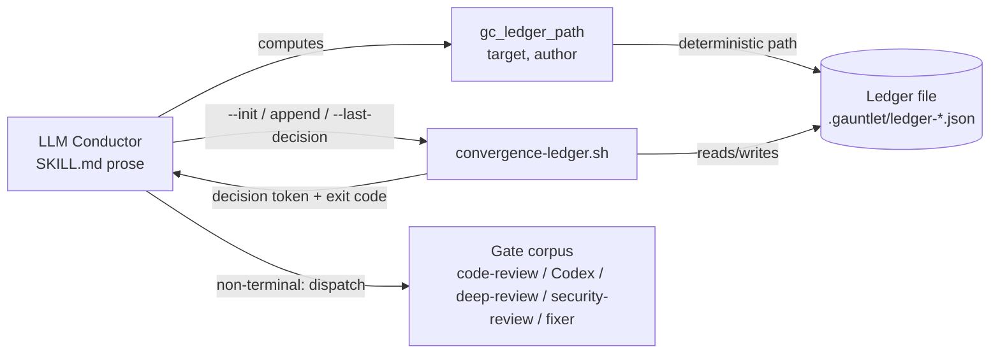
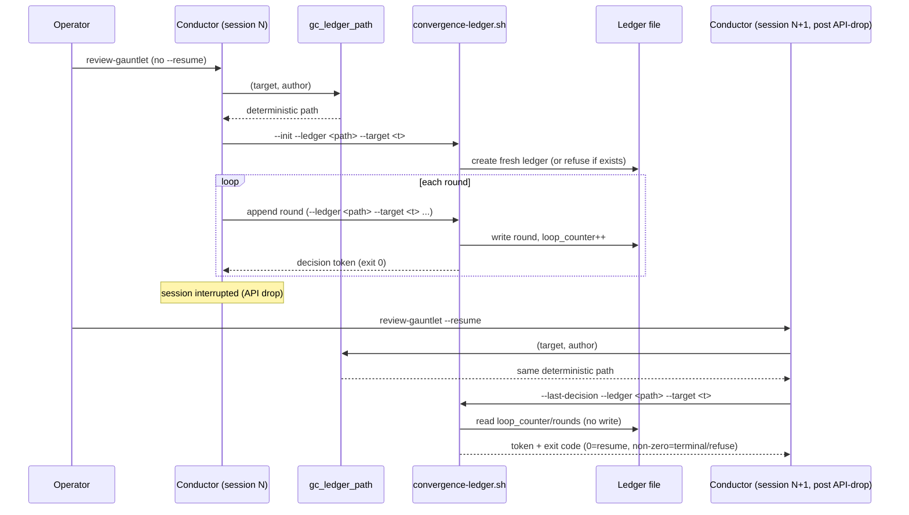

# Task: Session-Resume Support for review-gauntlet

**Status**: Not Started
**Component**: review-skills
**Assigned to**: Claude
**Priority**: Medium
**Branch**: feature/review-gauntlet-resume
**Created**: 2026-07-10
**Completed**: (fill when done)

## Objective

Give `review-gauntlet` a `--resume` mode so an interrupted run (API drop, spend cap, dropped Codex dispatch) can pick back up from the last recorded round in its convergence ledger instead of losing all progress and restarting the whole gate corpus from gate 1.

## Context

The 2026-07-06 Claude Code Insights report flagged this as the top unaddressed friction pattern: long autonomous runs get derailed by API drops and spend caps, and the user has to manually resume or abandon work. The prior review-gauntlet dev plan (`docs/dev_plans/20260707-feature-review-gauntlet-skill.md`, merged in PR #12 / v0.4.0) built `convergence-ledger.sh`, which persists `{loop_counter, rounds: [...]}` to a JSON file — but that ledger exists solely to feed the in-run stall-detection math (`convergence-ledger.sh`'s non-convergence rule 4 walks `rounds` to compute the current epoch's running minimum). Nothing reads the ledger back to resume a dropped session: grep across both `plugins/skein/skills/review-gauntlet/` and `plugins/skein-codex/skills/review-gauntlet/` finds zero `--resume`/`--continue` flags, and neither SKILL.md defines any convention for *where* the ledger file lives on disk — every current invocation is implicitly ephemeral (the test suite uses `mktemp`).

Two structural facts from the Explore pass shape this plan:

1. **No ledger-path convention exists today.** `skein:conduct` already solves an analogous problem for its own state file — `conductor.py`'s `_state_path()` writes `.conduct/state-{claude|codex}-{plan-stem}-{sha1(rel_plan_path)[:12]}.json`, keyed by plan path so multiple conduct runs don't collide, and explicitly runtime-partitioned ("`state-claude-...`; the Codex mirror writes `state-codex-...`. The two runtimes MUST NOT share a state file or lock."). review-gauntlet needs the same shape of answer, scoped to *its* diff target (branch or `--pr <N>` — `--plan <path>` supplies design-intent context, not diff identity, and is not itself a target axis; see Requirements) rather than a plan path, and gitignored the same way `.conduct/` is (`.gitignore` line 4).
2. **The ledger stores round inputs, not round outputs.** Each appended round object has `count`, `structural_tally`, `local_tally`, `pass_type`, `quarantine_size`, `unresolved_gates` — but the decision token (`continue|restart|confirm|success|success_with_quarantine|cap|non-converge`) that `convergence-ledger.sh` computes from those inputs is only ever printed to stdout, never persisted. Resuming needs to know "what phase to resume at," which is a function of the *last* decision token, not of any single round field — so the cleanest fix is a **read-only peek mode** that re-derives the last decision from existing ledger state via the same pure precedence logic already in `convergence-ledger.sh`, rather than adding a new persisted field that could drift out of sync with the decision logic.

## Requirements

- `review-gauntlet --resume` (standalone) locates the ledger for the resolved diff target (branch / `--pr <N>`, resolved the same way the existing invocation modes resolve it) and, if found, resumes from the phase implied by the last recorded round's decision instead of starting a fresh gate-1 pass.
- **The normal (non-`--resume`) round loop must itself write the ledger at the same stable, target-keyed path** on every round — this is the load-bearing prerequisite for resume: without it, no run ever persists anything resumable, and `--resume` has nothing to read. This is not implied by the schema work alone; it is a distinct wiring task in the conductor's existing per-round `convergence-ledger.sh` invocation.
- **A fresh (non-`--resume`) invocation must not silently inherit a stale ledger at the same target.** Because the ledger path is deterministic (same target + same author → same path), a prior aborted run's ledger sitting at that path would otherwise be silently appended to — inheriting its `loop_counter` and round history, corrupting cap/epoch math from round 1 of the "fresh" run. This requires a concrete initialization mechanism (see Phase 1's `--init`/`--force` design), not just a policy statement: a non-`--resume` invocation must fail loudly if a ledger already exists at its target path, telling the operator to pass `--resume` to continue it or an explicit fresh-start flag to discard it.
- Resume is **opt-in** — a plain `review-gauntlet` invocation with no `--resume` flag never silently picks up a stale ledger; per the skill's existing invocation-mode contract ("nothing here ever fires without an explicit trigger").
- **Target-string canonicalization covers repeated invocations of the same surface, not cross-surface unification.** The diff target resolves via one of two surfaces — explicit branch/commit-range, or `--pr <N>` — each canonicalizing to its own discriminated key (`branch:<name>` / `pr:<N>`). Repeated invocations using the *same* surface for the *same* logical run must always produce the same key (e.g. `--pr 42` run twice always keys `pr:42`). This plan deliberately does **not** attempt to unify `--pr 42` with an equivalent branch-name invocation into one key — doing so would require a network-dependent PR↔branch lookup (`gh pr view`) inside a bash script with no such dependency today, and the realistic resume case (re-running the same interrupted command) does not need it. State this scoping limitation explicitly in "What Resume Cannot Restore."
- Ledger path is scoped so two gauntlet runs against different targets (different branches, different PRs) never collide, and a resume attempt against a mismatched target (ledger says branch A, `--resume` invoked while on branch B) fails loudly rather than resuming against the wrong diff.
- Document precisely what resume **cannot** restore: mid-round state before the ledger's round-append point (gate findings already collected this round but the fixer not yet dispatched) is lost — resume always restarts at a round boundary (the beginning of gate 1 for a `continue`/`restart`-implied resume, or the beginning of the confirm-pass gate sequence for a `confirm`-implied resume), never mid-gate or mid-fixer-dispatch. Also document two narrower, accepted gaps: cross-surface (PR-vs-branch) resume is out of scope (above), and a gauntlet run inside a `fan-out`-spawned linked worktree anchors its ledger under that worktree's root (`git rev-parse --show-toplevel` resolves per-worktree) — the ledger is destroyed on worktree teardown and is not resumable from the main checkout.
- `success` / `success_with_quarantine` / `cap` / `non-converge` are terminal — `--resume` against a ledger whose last decision was one of these must refuse to resume (the loop already ended) and tell the operator why. **This refusal is enforced by the script's exit code, not by SKILL.md prose or conductor discretion** — matching how `convergence-ledger.sh` already keeps the success/cap/restart precedence itself out of conductor judgment. The exit-code contract covers **all four** terminal tokens, not only `success`.
- **The shared decision logic operates on the ledger file's persisted on-disk state, not on CLI-supplied round scalars.** The non-convergence rule (rule 4) needs the full epoch's round history to compute its running-minimum stall streak — a 7-scalar function signature limited to "the last round's inputs" cannot reproduce it. Both the append path (after writing the new round) and the `--last-decision` peek path (reading an existing ledger, no write) must call one function that reads `loop_counter` and `rounds[]` directly from the ledger file at the moment of the call — this is what makes the peek genuinely equivalent to the append path's decision, for every rule including non-convergence.
- Both the Claude SKILL.md (`plugins/skein/skills/review-gauntlet/`) and the Codex mirror (`plugins/skein-codex/skills/review-gauntlet/`) gain the same resume behavior — `convergence-ledger.sh` is currently byte-identical between the two mirrors (confirmed via `diff`), and any schema/flag addition must be applied identically to both copies (they are hand-authored duplicates, not bundled — `run-gate.sh`'s own doc comment confirms `lib/` scripts are "this skill's own authored `lib/` script, not a bundled copy"). **The two mirrors are not starting from the same place**: the Codex SKILL.md already documents one concrete `convergence-ledger.sh --ledger <path> ...` invocation (`plugins/skein-codex/skills/review-gauntlet/SKILL.md:140`) that Phase 2 edits in place; the Claude SKILL.md has **no** such invocation documented anywhere (confirmed by grep) — Phase 2 must author that block from scratch for Claude, not "update" a nonexistent one.
- **`gc_ledger_path` (the new ledger-location helper) anchors under the repo root** (`git rev-parse --show-toplevel`), the same way `skein:conduct`'s `_state_path()` anchors `.conduct/` under its `repo_root` — **not** under the harness plugin-install anchor. The `${CLAUDE_PLUGIN_ROOT}` (Claude) / `$SKILL_DIR` (Codex) anchor (`gauntlet-common.sh:48-49`) exists solely to locate each harness's installed, read-only bundled scripts (`gc_bundled_scripts_dir`) — it is the wrong anchor for per-run, per-repo runtime state, and using it would put ledgers inside the shared plugin cache, colliding across every repo the plugin reviews and landing outside any repo's own `.gitignore`. `gc_ledger_path` itself can and should stay byte-identical across mirrors if `author` (`claude`/`codex`) is passed as a function argument rather than hardcoded per mirror.
- The new `gc_ledger_path` helper needs a sha1 digest (mirroring `_state_path()`'s `sha1(rel_plan_path)[:12]`, but computed in shell, not Python) — this adds a real dependency (`sha1sum` or `shasum`) beyond the currently-declared `bash` + `jq`, and needs its own `gc_have_*`-style guard.
- `.gauntlet/` (or whatever ledger directory name is chosen) is added to `.gitignore`, mirroring the existing `.conduct/` entry — this must land in the same commit as the first code that writes under it, not as an orphaned, unscheduled task.

## Review Focus

- Verify the peek/last-decision mode is truly read-only (does not increment `loop_counter` or append a round) — a resume that mutates the ledger as a side effect of merely checking status would corrupt the round history the stall-detection epoch logic depends on.
- Verify the shared decision function correctly computes **all seven rules including non-convergence** for both the append path and the peek path — a function scoped to only the last round's scalars cannot reproduce the epoch-wide running-minimum stall streak, so it must read `loop_counter`/`rounds[]` from the ledger file directly.
- Verify target-mismatch detection actually fails closed (errors) rather than failing open (silently resuming against the wrong branch/PR) on **both** the append path and the `--last-decision` peek path.
- Verify terminal-decision refusal (`success`/`success_with_quarantine`/`cap`/`non-converge` ledgers refuse `--resume`) is enforced by the script's **exit code for all four terminal tokens**, not just `success`, and not left to SKILL.md prose or conductor/LLM discretion.
- Verify the **write side is actually wired**: the normal (non-`--resume`) round loop in both SKILL.md mirrors must bind `gc_ledger_path`'s output and pass `--target` on every `convergence-ledger.sh` append — a plan that only builds the resume-reading half ships a feature with nothing to resume from. Verify this is authored correctly per mirror: Codex edits an existing invocation line, Claude has none to edit and must author one.
- Verify a fresh (non-`--resume`) invocation cannot silently inherit and corrupt a stale ledger left by a prior aborted run at the same target — verify the `--init`/`--force` mechanism (Phase 1) actually prevents this, with a test that simulates it.
- Verify `gc_ledger_path` anchors under the repo root (`git rev-parse --show-toplevel`), not the harness plugin-install anchor (`${CLAUDE_PLUGIN_ROOT}`/`$SKILL_DIR`) — that anchor is reserved for locating each harness's bundled scripts, and reusing it for runtime ledger state would collide across every repo the plugin reviews. Verify this is actually asserted by a test, not just documented.
- Confirm the two mirrors stay byte-identical on `convergence-ledger.sh` (or explicitly and deliberately diverge with a documented reason) — but **not** on `gauntlet-common.sh`, which already, legitimately, diverges at the `${CLAUDE_PLUGIN_ROOT}`/`$SKILL_DIR` anchor lines; a whole-file byte-identity assertion there is a plan bug, not a test to pass. `tests/parity/test-applier-bundle-parity.sh` is the existing pattern for bundled scripts; `lib/` scripts have no equivalent parity test today, so decide in Phase 1 whether one should be added, scoped correctly.
- Confirm `docs/dev_plans/20260707-feature-review-gauntlet-skill.md`'s "Follow-up Work" section — **this correction was already applied during this plan's drafting** (2026-07-10, before implementation started); Phase 4 only needs to verify it's still in place, not redo it.
- This plan touches both `plugins/skein/skills/review-gauntlet/` and `plugins/skein-codex/skills/review-gauntlet/` — per AGENTS.md's dual-harness review requirement, a Codex-side `/review-plan` pass is also needed before this is considered fully reviewed (tracked as a follow-up; this session ran the Claude-side review only).

## Implementation Checklist

### Phase 1: Ledger schema — target metadata, ledger-file-scoped decision function, `--init`/`--force`, ledger-path helper

**Impl files:** `plugins/skein/skills/review-gauntlet/lib/convergence-ledger.sh, plugins/skein-codex/skills/review-gauntlet/lib/convergence-ledger.sh, plugins/skein/skills/review-gauntlet/lib/gauntlet-common.sh, plugins/skein-codex/skills/review-gauntlet/lib/gauntlet-common.sh, .gitignore`
**Test files:** `tests/gauntlet/test-convergence-ledger.sh`
**Test command:** `bash tests/gauntlet/test-convergence-ledger.sh`

- **Extract the precedence logic (rules 1–7) into a single shared function that reads its inputs from the ledger file itself** (`loop_counter` and `rounds[]`, read fresh from `--ledger <path>` at call time) — **not** from CLI-supplied round scalars. Today the logic is inline code reading live `$COUNT`/`$STRUCTURAL`/… CLI variables right after the append. The append path calls this function immediately after writing the new round (so the file already reflects it); the new `--last-decision` peek path calls the identical function against an existing ledger with no write. Because both paths derive the decision from the *same on-disk state* via the *same function*, non-convergence (rule 4, which needs the full epoch's round history, not just the last round) works correctly for both — a signature limited to the last round's scalars cannot compute it. The arg-validation block (currently requiring all round-input flags) becomes mode-conditional so peek mode can omit them.
- Add an optional `--target <string>` flag to `convergence-ledger.sh`, applied uniformly on **both** the append path and the `--last-decision` peek path: on ledger creation, records `{"target": "<string>", "loop_counter": 0, "rounds": []}`; on every subsequent call against an existing ledger, if `--target` is supplied and the ledger already has a `target` field, mismatch is a hard error (distinct exit code from the existing malformed-ledger exit 2). Ledgers created before this change (no `target` key) skip the check — backward compatible, not retroactively enforced.
- Add a `--last-decision` peek mode: given `--ledger <path>` (and optionally `--target <string>`, subject to the same mismatch check as the append path) and no round-input flags (`--count`/`--structural`/etc. become invalid in this mode — reject with usage error if supplied alongside `--last-decision`), call the shared ledger-scoped decision function to print the decision token **that the most recently appended round already resolved to** — without incrementing `loop_counter` or appending a new round. If the ledger has zero rounds, print a distinct token (`no-rounds`) rather than erroring; if the ledger file does not exist at all, exit with a distinct "not found" error (this is what lets the conductor's existence check, Phase 2, distinguish "nothing to resume, start fresh" from "typo'd path/target, don't silently proceed"). **Exit code encodes terminal vs. non-terminal deterministically for all four terminal tokens**: exit 0 for `continue`/`restart`/`confirm`/`no-rounds`; exit 5 for the terminal tokens `success`/`success_with_quarantine`/`cap`/`non-converge`. This is the script-level enforcement point for terminal-refusal — the conductor branches on exit code, not on parsing/judging the printed token.
- **Add an `--init [--force]` mode**: given `--ledger <path>` and `--target <string>`, creates a fresh ledger (`{"target": "<string>", "loop_counter": 0, "rounds": []}`) at that path. If a file already exists at the path, refuse with exit 6 **unless `--force` is also passed**, in which case truncate and reinitialize. This is the concrete mechanism behind the Requirements bullet "a fresh invocation must not silently inherit a stale ledger": the normal (non-`--resume`) round loop calls `--init` once at loop entry (Phase 2), and a pre-existing ledger at that target surfaces as a loud, actionable error rather than silent corruption.
- **Full exit-code contract (finalized, must match exactly across both mirrors since `convergence-ledger.sh` is byte-identical)**: `0` = success / non-terminal decision; `2` = usage error or malformed ledger (existing); `3` = target mismatch (new, distinct from `2` per Requirements); `4` = `--last-decision` ledger not found; `5` = `--last-decision` reached a terminal decision; `6` = `--init` refused to overwrite an existing ledger without `--force`.
- Add `gc_ledger_path` helper to `gauntlet-common.sh` in both mirrors, as a shell function taking `(target, author)` as explicit arguments (`author ∈ {claude, codex}`, mirroring conduct's runtime partition) — **not** hardcoded per mirror, so the function body itself stays byte-identical across both copies. It prints `.gauntlet/ledger-<author>-<slug(target)>-<sha1(target)[:12]>.json`, anchored under **the repo root** (`git rev-parse --show-toplevel`, matching how `conductor.py`'s `_state_path()` anchors `.conduct/` under its `repo_root` argument) — explicitly **not** the `${CLAUDE_PLUGIN_ROOT}`/`$SKILL_DIR` plugin-install anchor, which is reserved for locating each harness's bundled scripts and would collide across every repo the plugin reviews if reused here. Slugify the target string (lowercase, non-alnum → `-`) so branch names with slashes produce a safe filename. Note the accepted limitation: inside a `fan-out` linked worktree, `--show-toplevel` resolves to the worktree root, not the main repo — such a ledger is not resumable after worktree teardown (documented in Requirements, not solved here).
- Add a `gc_have_sha` guard (mirroring `gc_have_jq`) that checks for `shasum` first, falling back to `sha1sum`, exiting with a clear error if neither is present. Document this as a new dependency.
- Add `.gauntlet/` to `.gitignore` in the same commit that introduces `gc_ledger_path` — not deferred to a later phase.
- Keep `convergence-ledger.sh` byte-identical across both mirrors after this phase (per Requirements) — write the diff once, apply to both, `diff` them in the test to confirm. `gauntlet-common.sh` is **not** held to whole-file byte-identity (see Phase 3) — only `gc_ledger_path`'s function body is.
- **Add the full unit-test coverage for every piece of new code this phase introduces**, directly to `tests/gauntlet/test-convergence-ledger.sh` (co-located with the code, not deferred to Phase 3):
  - `--target`: first-use records; mismatch on second use fails with a distinct exit code (verified numerically distinct from exit 2); matching `--target` succeeds; omitted `--target` skips validation; a legacy (pre-`target`-field) ledger accepts any `--target` on first post-upgrade use; the mismatch check applies identically on the `--last-decision` peek path, not just the append path.
  - `--last-decision`: on a clean full pass at count 0 prints `success` and exits with the terminal exit code; on ledgers whose last decision is each of `success_with_quarantine`, `cap`, and `non-converge` also prints the right token and exits with the (same) terminal exit code — all four terminal tokens, not just `success`; on a mid-loop ledger prints `continue`/`restart`/`confirm` and exits 0; on an empty/zero-round ledger prints `no-rounds` and exits 0; on a **nonexistent** ledger file exits with the distinct not-found code (different from the zero-round case); combined with any round-input flag is a usage error; does not mutate `loop_counter`/`rounds` (byte-identical ledger file before/after); a ledger at `loop_counter == cap` peeks as `cap` using the stored `loop_counter` verbatim (no off-by-one).
  - `--init`/`--force`: `--init` on an absent path creates a valid fresh ledger with the given target; `--init` on an existing path fails with a distinct exit code; `--init --force` on an existing path truncates and reinitializes (old rounds gone, `loop_counter` back to 0).
  - `gc_ledger_path` (sourced directly from `gauntlet-common.sh`, both mirrors — this needs a new sourcing harness since the test file currently only invokes the script as a subprocess): a branch name containing `/` slugifies to a `/`-free, filesystem-safe basename; the same `(target, author)` pair always produces the same path (determinism); two distinct targets produce two distinct paths (collision-safety); the emitted path is rooted at `$(git rev-parse --show-toplevel)/.gauntlet/`, **not** at `${CLAUDE_PLUGIN_ROOT}`/`$SKILL_DIR` (assert setting a bogus `CLAUDE_PLUGIN_ROOT` does not change the emitted path); the function body is identical across both mirrors.

### Phase 2: `--resume` flag + write-side wiring in SKILL.md (both mirrors, authored differently per mirror)

**Impl files:** `plugins/skein/skills/review-gauntlet/SKILL.md, plugins/skein-codex/skills/review-gauntlet/SKILL.md`
**Test files:** `tests/gauntlet/test-gauntlet-skill-shape.sh`
**Test command:** `bash tests/gauntlet/test-gauntlet-skill-shape.sh`

- **Define the canonical target-string scheme first** (needed by every other bullet in this phase): `pr:<N>` when invoked via `--pr <N>`, `branch:<name>` for an explicit branch/commit-range argument or the implicit current-branch-vs-merge-base case. `--plan <path>` is orthogonal — it supplies Guardrail 1's design-intent context, not diff identity, and travels alongside whichever of the two target keys applies; it is never itself a target axis. Per Requirements, this scheme guarantees consistency for *repeated invocations of the same surface* (same `--pr 42` always → `pr:42`), not cross-surface unification (a branch invocation of that PR's head does **not** resolve to `pr:42`) — document that scoping explicitly, not just the mapping table, in SKILL.md's Invocation Modes section.
- **Wire the write side, per mirror** (this is the single most important set of bullets in this phase — without it, Phase 1's schema/peek work has nothing to read on a later `--resume` invocation):
  - **Codex**: edit the existing per-round invocation at `plugins/skein-codex/skills/review-gauntlet/SKILL.md:140` to add `--ledger $(gc_ledger_path "<canonical-target>" codex) --target "<canonical-target>"`.
  - **Claude**: grep confirms `plugins/skein/skills/review-gauntlet/SKILL.md` documents **no** concrete `convergence-ledger.sh --ledger ...` invocation anywhere today (only prose fragments referencing `--unresolved <N>`) — author the full per-round invocation block from scratch in the Convergence Algorithm section, with `author=claude`, matching the same semantic contract Codex now documents.
  - Both mirrors: at loop entry for a **non-`--resume`** invocation, call `convergence-ledger.sh --init --ledger $(gc_ledger_path ...) --target "..."` once before round 1 (Phase 1's new mode). If `--init` fails because a ledger already exists at that target, surface the concrete error to the operator: "a prior run's ledger exists at this target — pass `--resume` to continue it, or `--init --force` (surfaced as a `--fresh` gauntlet flag) to discard it and start over." This is what makes the Requirements' "must not silently merge into old ledger" concrete rather than aspirational.
  - Every subsequent round in the loop passes the **same** `--ledger`/`--target` pair on its `convergence-ledger.sh` append call — standalone, `full`, and the `conduct`/`fan-out` auto-chain paths all included, not only when `--resume` is in play.
- Extend the `argument-hint` and Invocation Modes section: `review-gauntlet --resume [--plan <path>] [<branch> | --pr <N>]` (and a `--fresh` flag mapping to `--init --force` for the "discard stale ledger" case above). Resume resolves the diff target exactly as today (via the canonical scheme above), computes the ledger path via `gc_ledger_path`, then calls `--last-decision --ledger "$ledger_path" --target "$canonical_target"` — **the peek call must pass `--target`, not just `--ledger`**, so mismatch detection applies on the resume path too, not only on appends (caught by the Codex-side dual-harness review: the plan's own Phase 2 text and sequence diagram initially omitted it). If that exits with the "ledger not found" code (Phase 1), error with a clear message rather than silently starting fresh (silent fresh-start on a missing ledger would make a typo'd `--resume` invisible); a `no-rounds` result (ledger exists but is empty) is treated as nothing-to-resume and proceeds as a fresh gate-1 pass on that same ledger.
- **`gc_ledger_path` is a shell function, not an executable — every call site must source `gauntlet-common.sh` first.** State this explicitly in Phase 2's SKILL.md prose (both mirrors), not just imply it: `. "${CLAUDE_PLUGIN_ROOT}/skills/review-gauntlet/lib/gauntlet-common.sh"` (Claude) / `. "$SKILL_DIR"/lib/gauntlet-common.sh` (Codex), before any `gc_ledger_path` or `--init`/append/`--last-decision` invocation in the documented loop. This was the second Codex-side dual-harness review finding — the plan's original Phase 2 text called `$(gc_ledger_path ...)` without ever saying to source it first.
- Document the resume decision table directly in SKILL.md's Convergence Algorithm section, driven by `--last-decision`'s **exit code**, not by string-matching its stdout token: exit 0 with token `continue`/`restart` → resume at a fresh gate-1 full pass; exit 0 with token `confirm` → resume at the confirm-pass gate sequence; exit 0 with token `no-rounds` → treat as equivalent to no `--resume` (proceed as a fresh gate-1 pass, same ledger); **non-zero exit (any of the four terminal tokens)** → refuse to resume, print the terminal status and why, exit without touching the ledger. The non-zero-exit branch is what makes refusal deterministic rather than conductor-judged, for all four terminal tokens, not only `success`.
- Add an explicit "What Resume Cannot Restore" subsection covering, precisely: (1) mid-round loss — gate findings collected earlier in an in-progress round, before the fixer batch was dispatched and a round was appended to the ledger, are not recoverable; resume always re-runs the round-scoped work from its start, never mid-gate; (2) cross-surface scope — a `--pr <N>` run and an equivalent branch-name invocation of that PR's head are tracked as distinct ledgers, by design (see canonical scheme bullet above); (3) worktree scope — a `fan-out`-spawned linked-worktree gauntlet run's ledger is not resumable after worktree teardown.
- Update the Reuse section's bundled-script list if `gc_ledger_path` needs to be callable outside `gauntlet-common.sh`'s existing sourcing pattern (likely not — it's a shell function, not a new bundled script, so no `bundle-map.sh` change expected; confirm during implementation and note in Findings if that assumption is wrong).

### Phase 3: Confirm Phase 1 coverage; add write-side wiring, cross-mirror shape, and corrected parity tests

**Impl files:** `tests/gauntlet/test-convergence-ledger.sh, tests/gauntlet/test-gauntlet-skill-shape.sh`
**Test files:** `tests/gauntlet/test-convergence-ledger.sh, tests/gauntlet/test-gauntlet-skill-shape.sh`
**Test command:** `bash tests/gauntlet/test-convergence-ledger.sh && bash tests/gauntlet/test-gauntlet-skill-shape.sh`

- Confirm (do not re-add — Phase 1 already added the full set) every assertion listed under Phase 1's test bullet exists and passes: `--target` mismatch/backward-compat on both the append and peek paths; `--last-decision` covering all seven decision tokens (including all four terminal tokens with the terminal exit code, not just `success`) plus `no-rounds` plus the distinct not-found-ledger case plus no-mutation plus the `cap`-boundary off-by-one case; `--init`/`--force` create/refuse/truncate behavior; `gc_ledger_path` slugification/determinism/distinctness/repo-root-anchor-not-plugin-anchor/cross-mirror-function-body-identity.
- New assertion for the **write-side wiring** (Phase 2): grep both SKILL.md files' documented per-round `convergence-ledger.sh` invocation to confirm each now includes `gc_ledger_path`/`--target` — a shape check that accounts for the two mirrors starting from different states (Codex: existing line 140 modified; Claude: a new block authored from scratch) rather than assuming a common "before" text to diff against. Also assert both mirrors document the `--init`-at-loop-entry step for non-`--resume` invocations. This is a shape check on the documented command, not a full end-to-end conductor run, since the conductor loop itself is LLM-driven prose rather than a script this test harness can execute.
- New test (or extend `test-gauntlet-skill-shape.sh`, parameterized to loop over **both** mirror SKILL.md paths — it currently hardcodes only the Claude path) asserting both files document `--resume`, `--fresh`, the canonical target-string scheme **and its stated cross-surface scoping limitation**, and the exit-code-driven resume decision table covering all four terminal tokens, in their Invocation Modes / Convergence Algorithm / "What Resume Cannot Restore" sections.
- **Byte-identity scope, corrected**: assert `plugins/skein/skills/review-gauntlet/lib/convergence-ledger.sh` and the Codex mirror remain byte-identical (`diff -q`), mirroring `tests/parity/test-applier-bundle-parity.sh`'s intent for the bundled `scripts/` tree. For `gauntlet-common.sh`, do **not** assert whole-file byte-identity — it legitimately diverges at the `${CLAUDE_PLUGIN_ROOT}`/`$SKILL_DIR` anchor lines (existing, pre-plan divergence, confirmed by direct diff). Instead assert the new `gc_ledger_path` function body specifically is identical across both mirrors (e.g. `sed`-extract the function and diff just that span), consistent with AGENTS.md's documented won't-fix on this anchor divergence.

### Phase 4: Docs — confirm stale follow-up note correction, verify cross-link

**Impl files:** `docs/dev_plans/20260707-feature-review-gauntlet-skill.md, docs/dev_plans/README.md`
**Test files:** (none — docs-only phase)
**Test command:** `true`

- **This phase's primary correction was already applied during this plan's drafting** (2026-07-10, before implementation started): `docs/dev_plans/20260707-feature-review-gauntlet-skill.md`'s "Follow-up Work" section already reads "PR #12 ... merged to `main` as commit `4e09055`, shipped in v0.4.0" and already cross-links this plan as the tracked resume-support follow-up. Verify both are still present (they may have drifted if other work touched the file between plan-review and this phase running) — do not redo the edit if it's already correct.
- Verify `docs/dev_plans/README.md`'s task table already has this plan's row (added during drafting) under "In Progress / Partially Shipped" with `**Component**: review-skills`; move it to "Shipped" once this plan reaches Complete, per the table's existing convention.

## Technical Specifications

### Files to Modify
- `plugins/skein/skills/review-gauntlet/lib/convergence-ledger.sh` - add `--target`, `--last-decision`
- `plugins/skein-codex/skills/review-gauntlet/lib/convergence-ledger.sh` - identical change, hand-applied
- `plugins/skein/skills/review-gauntlet/lib/gauntlet-common.sh` - add `gc_ledger_path`
- `plugins/skein-codex/skills/review-gauntlet/lib/gauntlet-common.sh` - identical change, hand-applied
- `plugins/skein/skills/review-gauntlet/SKILL.md` - document `--resume`, resume decision table, what's unrecoverable
- `plugins/skein-codex/skills/review-gauntlet/SKILL.md` - identical documentation, hand-applied
- `docs/dev_plans/20260707-feature-review-gauntlet-skill.md` - correct stale Follow-up Work section
- `.gitignore` - add `.gauntlet/`

### New Files to Create
- (none expected — this extends existing `lib/` scripts and SKILL.md files; confirm in Findings if a new file proves necessary)

### Architecture Decisions
- Decision: recompute the last decision token via a pure read-only peek (`--last-decision`), backed by a **shared decision function that reads directly from the ledger file** (`loop_counter` + `rounds[]`), rather than persisting a `decision` field on each round object or passing round scalars as function arguments. Rationale: the decision — including non-convergence, which needs the full epoch's round history — is fully determined by the ledger's on-disk state at the moment of the call; a function scoped to CLI-supplied scalars for "the last round" cannot reproduce the epoch-wide stall streak, so it must read the file. Both the append path (immediately after writing the new round) and the peek path (no write) call the identical function against that same on-disk state, which is what makes "definitionally consistent" true for every one of the seven rules, not just the scalar-computable ones.
- Decision: scope the ledger path by a **canonicalized** target string (`pr:<N>` / `branch:<name>`), not by an arbitrary run ID or raw invocation syntax, mirroring `skein:conduct`'s plan-path-keyed `_state_path()`. Rationale: a gauntlet run's identity *is* its diff target — two runs against the same branch are the same logical run (resumable into each other), two runs against different branches are not, so keying on a canonical form of target is both the natural collision boundary and the natural resume-match boundary. Deliberately scoped to **same-surface** consistency, not cross-surface (PR↔branch) unification — see the next decision.
- Decision: do **not** attempt to unify `--pr <N>` and an equivalent branch-name invocation into one canonical key. Rationale: doing so requires a network-dependent `gh pr view`-style lookup inside a bash helper with no such dependency today, adds a failure mode (PR closed, `gh` unauthenticated, offline), and the realistic resume scenario — re-running the same interrupted command — doesn't need it. Documented as an explicit, accepted scope limitation in "What Resume Cannot Restore" rather than silently under-delivering on an implied guarantee.
- Decision: a fresh (non-`--resume`) invocation must go through an explicit `--init [--force]` step rather than relying on the deterministic path alone. Rationale: because `gc_ledger_path` is deterministic, a plain append call against a stale-but-existing ledger at the same target would silently inherit its `loop_counter` and round history — corrupting cap/epoch math from round 1. `--init` makes "is there already a ledger here" a checkable, refusable precondition instead of an implicit merge.
- Decision: anchor `gc_ledger_path` under the **repo root** (`git rev-parse --show-toplevel`), not the harness plugin-install anchor (`${CLAUDE_PLUGIN_ROOT}`/`$SKILL_DIR`). Rationale: the plugin anchor locates each harness's own installed, read-only bundled scripts — a concern entirely separate from where a specific repo's per-run, mutable ledger state should live. Reusing it for the ledger would put per-run state inside the shared plugin cache, colliding across every repo the plugin reviews and landing outside any individual repo's `.gitignore`. `_state_path()` (the explicit precedent this plan cites) anchors under an injected `repo_root`, never the plugin root. Accepted trade-off: computing the anchor live via `git rev-parse` (rather than an injected value, as conduct does) means a `fan-out` linked-worktree invocation resolves to the worktree's root, not the main repo — documented as a known, unaddressed gap rather than solved in this plan.
- Decision: terminal-decision refusal is enforced by `--last-decision`'s **exit code** (0 for non-terminal tokens, a distinct non-zero code for all four terminal ones), not by the conductor parsing/judging the printed token string. Rationale: matches the Review Focus requirement that refusal be deterministic and script-owned, the same way `convergence-ledger.sh` already keeps success/cap/restart precedence out of conductor discretion — an LLM correctly reading a decision table is not the same guarantee as a script that fails closed by construction.
- Decision: target-mismatch is a hard error, not a warning-and-continue, on both the append and peek paths. Rationale: matches the skill's existing "fail loudly, never silently degrade" posture (e.g. Guardrail 1's structural-conflict halt, the missing-bundled-path abort in Reuse) — a silently-resumed wrong-target ledger would apply fixes from a stale round classification to the wrong diff.
- Decision: the normal (non-`--resume`) round loop writes to the same `gc_ledger_path`-computed, target-keyed ledger on every round, authored differently per mirror (Codex edits an existing invocation line; Claude authors one from scratch, since none exists today) — this is not optional plumbing but the load-bearing prerequisite for `--resume` to have anything to read. Rationale: a resume feature whose read side is fully built but whose write side is never wired into the actual gate loop ships inert code; Phase 2 makes this the first bullet, not an afterthought.

### Dependencies
- `sha1sum` or `shasum` (shell) — new dependency for `gc_ledger_path`'s digest, guarded by a new `gc_have_sha` check mirroring `gc_have_jq`. Not previously declared; `bash` + `jq` alone are no longer the complete dependency list once this plan lands.

### Integration Seams

| Seam | Writer (task) | Caller (task) | Contract |
|------|---------------|----------------|----------|
| Ledger-file-scoped decision function | Phase 1 | Phase 1 (both append path and `--last-decision` peek call it against the same on-disk ledger state) | Reads `loop_counter`/`rounds[]` fresh from `--ledger <path>` at call time; same file state → same token, for all seven rules including non-convergence |
| Ledger target/`--init`/last-decision schema | Phase 1 | Phase 2 (SKILL.md write-side + resume logic), Phase 3 (tests) | `--target` mismatch exits non-zero with a distinct code from malformed-ledger (exit 2), on both append and peek paths; `--last-decision` never mutates `loop_counter`/`rounds`; exit code 0 vs. distinct non-zero encodes non-terminal vs. all four terminal tokens; `--init` refuses an existing ledger unless `--force` |
| `gc_ledger_path` helper | Phase 1 | Phase 2 (SKILL.md write-side wiring AND resume lookup) | Given `(target, author)`, deterministic output path under `.gauntlet/`, anchored at repo root (not plugin root); same target + same author -> same path; distinct targets -> distinct paths |
| Canonical target-string scheme | Phase 2 (defines the `pr:<N>`/`branch:<name>` mapping, `--plan` orthogonal) | Phase 2 (both the write-side binding and the `--resume` lookup use the same scheme), Phase 3 (tests) | Same invocation surface, same logical run, always → same target string. Cross-surface (PR vs. its branch) is explicitly out of scope, not silently broken |
| Write-side wiring | Phase 2 (Codex: edit existing line; Claude: author new block) | Phase 3 (shape test on the documented per-round invocation, per mirror) | Every round of the normal (non-resume) loop passes `--ledger $(gc_ledger_path ...) --target "..."`; loop entry calls `--init` once before round 1 |
| Corrected Follow-up Work note | (already applied during plan drafting, 2026-07-10) | Phase 4 (verification only) | Text accurately reflects merged PR #12 state and links this plan as the resume-support tracker |

## Architecture & Call Flow

The resume feature spans four independently-executing pieces: the LLM conductor (SKILL.md prose, per harness), the `convergence-ledger.sh` script, the `gc_ledger_path` shell helper, and the persisted ledger file itself as shared storage across separate invocations (potentially separate sessions, separated by an API drop).

| Step | Trigger | Enters context | Cleared/persisted | Turn boundary |
|------|---------|----------------|-------------------|---------------|
| 1 | Non-resume `review-gauntlet` invocation | Resolved target string, `--init` call | Ledger file created at `gc_ledger_path` output; persists to disk | After `--init` returns |
| 2 | Each gate-loop round | Gate findings, fixer output | Round appended to ledger file (persists); findings themselves stay in conductor's own context per the Delegation Pattern | After each round's `convergence-ledger.sh` append |
| 3 | Session interrupted (API drop, spend cap) | — | Ledger file on disk is the only surviving state; conductor's in-memory context is lost | Session boundary (uncontrolled) |
| 4 | `review-gauntlet --resume` (new session) | Resolved target string, `--last-decision` result | Fresh conductor context; reads persisted ledger, does not inherit prior session's context | After `--last-decision` returns exit code + token |

## Testing Notes

### Test Approach
- [ ] Unit tests for `--target` mismatch detection and backward-compat (no-target-field legacy ledgers), on both append and peek paths — landed in Phase 1
- [ ] Unit tests for `--last-decision` peek mode: all seven decision tokens reachable, **all four terminal tokens** exit with the terminal code (not just `success`), plus `no-rounds` (exit 0) vs. nonexistent-ledger (distinct not-found code), plus no-mutation assertion, plus the `cap`-boundary off-by-one case — landed in Phase 1
- [ ] Unit tests for `--init`/`--force`: create-fresh, refuse-if-exists, force-truncates — landed in Phase 1
- [ ] Unit tests for `gc_ledger_path` (needs a new sourcing harness, since the existing test file only subprocess-invokes the script): slugification safety, determinism, distinctness (collision-safety), repo-root-not-plugin-anchor — landed in Phase 1
- [ ] Shape tests (parameterized over **both** mirror SKILL.md paths — the current harness hardcodes only Claude's) confirming both files document `--resume`, `--fresh`, the canonical target scheme with its explicit cross-surface scoping limitation, and the exit-code-driven resume decision table
- [ ] Shape test confirming the write-side wiring (the normal per-round loop invocation, including the `--init`-at-loop-entry step) actually includes `gc_ledger_path`/`--target` in both mirrors — accounting for the two mirrors starting from different "before" states
- [ ] Parity check that both mirrors' `convergence-ledger.sh` stay byte-identical post-change; `gauntlet-common.sh` is checked only at the `gc_ledger_path` function-body granularity, **not** whole-file (it legitimately diverges elsewhere)

### Test Results
- [ ] All existing tests pass
- [ ] New tests added and passing
- [ ] Manual verification complete

### Edge Cases Tested
- [ ] `--resume` against a ledger whose last decision is any of the four terminal tokens (`success`/`success_with_quarantine`/`cap`/`non-converge`) refuses via non-zero exit code and explains why
- [ ] `--last-decision` against a genuinely nonexistent ledger file returns the distinct not-found exit code — this is script-testable and is what the conductor's "error on missing ledger" prose (Phase 2) actually branches on
- [ ] `--resume` against a ledger for a different target (branch/PR mismatch) errors, on both the append and peek `--target` check
- [ ] A non-`--resume` invocation against a target with a pre-existing ledger refuses via `--init`'s distinct exit code, rather than silently appending to stale state (`--init --force` / `--fresh` explicitly overrides)
- [ ] `--last-decision` on a freshly created, zero-round ledger returns `no-rounds` with exit 0, not an error
- [ ] `--last-decision` on a ledger at `loop_counter == cap` returns `cap` using the stored counter verbatim (no off-by-one)
- [ ] Branch names containing `/` (e.g. `feature/foo`) slugify to a safe, collision-free ledger filename
- [ ] `gc_ledger_path`'s emitted path is unaffected by a bogus `CLAUDE_PLUGIN_ROOT`/`$SKILL_DIR` value, confirming it's anchored at the repo root, not the plugin anchor

### Explicitly Out of Scope (not tested, not silently promised)
- **Cross-surface target unification.** `--pr 42` and a later plain invocation on that PR's head branch are tracked as **distinct** ledgers by design (see Requirements and the Architecture Decision on this) — there is deliberately no test asserting they resolve to the same key, because they don't.
- **Worktree-spanning resume.** A `fan-out`-spawned linked-worktree gauntlet run's ledger is not resumable from the main checkout after worktree teardown — accepted, documented, not tested-for-success.

### Testability Limits (stated honestly, not hidden)
- Phase-resumption fidelity itself — that a `--resume` invocation actually causes the conductor to start work at gate 1 vs. the confirm-pass sequence — is realized in SKILL.md prose executed by an LLM conductor, not by a script this test harness can run. What Phase 3's tests verify is: (a) the decision-table mapping is documented correctly, and (b) the exit code the table branches on is produced deterministically and correctly by the script. Actual phase-selection behavior at runtime is verified by manual/live exercise of the skill, not by the automated test suite.
- The "missing ledger errors on `--resume`" behavior is conductor prose that branches on `--last-decision`'s script-verified not-found exit code — the branching *input* is script-tested; the conductor's *reaction* to it is not.

## Acceptance Criteria

- The normal (non-`--resume`) round loop writes a ledger at the `gc_ledger_path`-computed, target-keyed location on every round, in both mirrors (Codex: existing invocation edited; Claude: authored from scratch) — verified by the Phase 3 write-side wiring shape test, prerequisite to every criterion below.
- A fresh (non-`--resume`) invocation against a target with a pre-existing ledger refuses via `--init`'s distinct exit code rather than silently corrupting `loop_counter`/round history — verified by test.
- `review-gauntlet --resume` on a ledger with a non-terminal last decision resumes at the correct phase (fresh gate-1 full pass for `continue`/`restart`, confirm-pass gates for `confirm`) instead of restarting the entire gauntlet.
- `review-gauntlet --resume` on a ledger with **any of the four terminal last decisions** (`success`/`success_with_quarantine`/`cap`/`non-converge`) refuses via a deterministic, non-zero script exit code — not conductor judgment — stating the terminal status. Verified by test for all four, not just `success`.
- The shared decision function correctly classifies `non-converge` from the peek path (reading the ledger's full epoch history), matching what the append path would have decided — verified by test.
- `gc_ledger_path` anchors under the repo root, not the harness plugin-install anchor; verified by test (bogus-anchor-env-var-doesn't-change-output) and by reading the implementation.
- Ledger path scoping prevents collision across distinct canonicalized targets (branches/PRs), verified by test (slugification safety, determinism, distinctness).
- Target mismatch on resume fails loudly, verified by test, on both the append and `--last-decision` peek paths.
- Both Claude and Codex mirrors document and implement resume identically: `convergence-ledger.sh` byte-identical and parity-tested; `gauntlet-common.sh`'s `gc_ledger_path` function body identical (whole-file identity is explicitly *not* required, since the file's existing anchor lines legitimately diverge).
- The canonical target-string scheme's cross-surface scope limitation (PR vs. its branch are distinct ledgers, by design) and the worktree-resume limitation are documented in "What Resume Cannot Restore," not silently unmet promises.
- `docs/dev_plans/20260707-feature-review-gauntlet-skill.md`'s "Follow-up Work" section correction and cross-link are confirmed still present (already applied during plan drafting).
- Code reviewed and approved
- Tests passing
- Documentation updated (if applicable)
- A dual-harness `/review-plan` pass has run on the Codex side (this plan touches both `plugins/skein` and `plugins/skein-codex`), per AGENTS.md — tracked as a follow-up if not completed before implementation starts.

<!-- reviewed: 2026-07-10 @ e187e499db910939582e9c07ebfc268d8770b720 -->

<!-- /review-plan writes the marker line above. Everything below is the workspace: edits here do NOT invalidate the marker. -->

## Progress

- [x] Phase 1: Ledger schema — target metadata, ledger-file-scoped decision function, `--init`/`--force`, ledger-path helper
- [x] Phase 2: `--resume` flag + write-side wiring in SKILL.md (both mirrors, authored differently per mirror)
- [x] Phase 3: Confirm Phase 1 coverage; add write-side wiring, cross-mirror shape, and corrected parity tests
- [x] Phase 4: Docs — confirm stale follow-up note correction, verify cross-link

## Findings

- **2026-07-10 — `/review-plan` first pass, findings incorporated pre-implementation.** Five-lens review surfaced 6 Critical + 5 Important findings, all folded directly into the plan body above rather than tracked as a separate discussion (well-corroborated: 3 of the 6 Critical findings were caught independently by 2-3 lenses). Key corrections: (1) the original plan built only the resume-*read* side and never wired the normal round loop to actually write a resumable ledger — architecture lens caught this, now Phase 2's first bullet; (2) the ledger-path anchor requirement conflated the harness plugin-install anchor (`${CLAUDE_PLUGIN_ROOT}`/`$SKILL_DIR`, for locating bundled scripts) with repo-scoped runtime state (should anchor at `git rev-parse --show-toplevel`, matching `conductor.py`'s `_state_path()`) — caught independently by architecture, assumptions, and sequencing lenses; (3) terminal-decision refusal was designed as SKILL.md prose rather than script-enforced — now `--last-decision` encodes terminality via exit code; (4) Phase 3's byte-identity assertion incorrectly included `gauntlet-common.sh`, which already, legitimately diverges at the anchor lines — caught by sequencing and spec-and-testing lenses; (5) the plan's premise that the 20260707 plan's follow-up note was still stale was itself stale — I'd already corrected that note earlier in the same session, before dispatching review (assumptions lens catch). Re-review recommended before implementation begins, given the scale of the revision.
- **2026-07-10 — Codex-side dual-harness review completed and Codex mirror implemented, via `codex:rescue`.** Codex reviewed the plan for Codex-specific risks (spawn_agent/wait_agent/close_agent dispatch, `$SKILL_DIR` anchor, the native-Codex-review gate matrix) — 0 Critical, 2 Important findings, both already fixed in Codex's own implementation and folded back into this plan: (1) the `--last-decision` peek call must pass `--target` too, not just `--ledger`, for resume-path mismatch detection — the plan's original Phase 2 text and sequence diagram omitted it; (2) `gc_ledger_path` is a shell function, not an executable, so every call site needs an explicit `source gauntlet-common.sh` prelude, which the plan didn't state. Codex then implemented the Codex-mirror portions of Phases 1–2 (`plugins/skein-codex/skills/review-gauntlet/lib/convergence-ledger.sh`, `lib/gauntlet-common.sh`, `SKILL.md`), finalizing the exit-code contract as `0`=success/non-terminal, `2`=usage/malformed, `3`=target mismatch, `4`=missing ledger, `5`=terminal decision, `6`=`--init` refused — now the authoritative numbering for both mirrors since `convergence-ledger.sh` must stay byte-identical. Verified: `bash -n`, `shellcheck`, `shfmt -d` clean; direct smoke tests of every new mode passed; existing `tests/gauntlet/test-convergence-ledger.sh` (Claude-mirror-scoped, untouched) still 45/45. `gc_ledger_path`'s function body uses only `git rev-parse --show-toplevel` — no `$SKILL_DIR`/`${CLAUDE_PLUGIN_ROOT}` dependency — confirmed byte-identical-capable across mirrors, stronger than the plan's original "function-body equivalent" framing.
- **2026-07-10 — Claude mirror implemented (Phase 1 + Phase 2 lib/SKILL.md), reconciled against Codex's finalized design.** `plugins/skein/skills/review-gauntlet/lib/convergence-ledger.sh` is now **byte-identical** to the Codex copy (confirmed via `diff`, exit codes `0/2/3/4/5/6` as Codex finalized them); `gauntlet-common.sh` gained `gc_have_sha`/`gc_sha1`/`gc_ledger_path`, with `gc_ledger_path`'s function body also byte-identical across mirrors and only the pre-existing `${CLAUDE_PLUGIN_ROOT}`-vs-`$SKILL_DIR` lines in `gc_bundled_scripts_dir` diverging, as expected; `SKILL.md` gained the `--resume`/`--fresh` invocation modes, the "Target and Resume Ledger" subsection (with the sourcing prelude), the Resume Decision Table, "What Resume Cannot Restore," and the Reuse section's convergence-decision snippet — mirroring Codex's structure with the Claude dispatch idiom (`Agent`, `${CLAUDE_PLUGIN_ROOT}`, `author=claude`). Also folded in both of Codex's Task 1 findings against the plan text itself (the `--last-decision` peek call now shows `--target` in Phase 2's text and the sequence diagram; a new Phase 2 bullet states the `source gauntlet-common.sh` prelude explicitly). Verified: `bash -n`, `shellcheck`, `shfmt -d` clean on both Claude lib files; direct smoke tests of every new mode (`--init`, `--force`, `--last-decision` across all decision tokens, target mismatch, missing ledger) passed against the Claude mirror; `gc_ledger_path` determinism/distinctness/anchor-independence verified directly; full `tests/gauntlet/` suite (10 files, 232 assertions) still 100% passing; `just check-prompt-parity`, `just check-sync`, and `just parity-tests` all pass. **Not yet done**: Phase 1's own contract calls for the new unit-test assertions to be added to `tests/gauntlet/test-convergence-ledger.sh` itself (currently verified only via ad hoc smoke tests, not committed as repeatable test cases), and Phase 3's cross-mirror shape/parity tests haven't been written — both still open, tracked in Progress below.
- **2026-07-10 — `/review-plan` second pass (re-review), findings incorporated.** A second four-lens pass against the revised plan found the first round's fixes were directionally correct but incomplete, surfacing 3 new Critical + 4 new Important findings — real second-order gaps, not polish. Key corrections: (1) the write-side design as first revised had no fresh-vs-stale-ledger handling — a deterministic path plus an unconditional append meant a "fresh" run could silently inherit a prior aborted run's `loop_counter`/round history; fixed by adding `convergence-ledger.sh --init [--force]` as an explicit, refusable precondition, called once at loop entry (architecture lens); (2) the "shared precedence function" as first specified took 7 round-scalars as arguments and provably couldn't compute the non-convergence rule, which needs the full epoch's round history — fixed by having the shared function read `loop_counter`/`rounds[]` directly from the ledger file instead of from CLI args, so both the append and peek paths derive every rule, including non-convergence, from the same on-disk state (architecture lens); (3) the target-canonicalization contradiction from pass 1 wasn't actually resolved — the scheme still implied `--pr 42` and its head branch would unify into one key while defining no mechanism to do so; resolved by explicitly scoping canonicalization to same-surface consistency only, dropping the cross-surface unification promise as a network-dependent feature that isn't needed for the realistic resume case (caught independently by architecture, assumptions, and spec-and-testing lenses — the strongest corroboration of the whole review). Also fixed: Claude's SKILL.md has no existing `--ledger` invocation to "update" (must author from scratch, unlike Codex's line 140); `git rev-parse --show-toplevel` diverges from conduct's injected-`repo_root` precedent under `fan-out` worktrees (documented as an accepted, unaddressed gap rather than solved); `gc_ledger_path` tests moved from Phase 3 into Phase 1 (co-location, sequencing lens); terminal-exit-code test coverage extended to all four terminal tokens, not just `success` (spec-and-testing lens); added an `## Architecture & Call Flow` section (the topology backstop triggered — 4 independently-executing components: conductor, `convergence-ledger.sh`, `gc_ledger_path`, the ledger file as cross-session storage). Not yet done: a Codex-side `/review-plan` pass per AGENTS.md's dual-harness requirement (tracked in Review Focus and Acceptance Criteria as a follow-up, not blocking a third Claude-side re-review). Given diminishing marginal findings expected from a third full 5-lens pass relative to its cost, proceeding to implementation without a third automated re-review — the Codex-side dual-harness pass is the recommended next check instead.
- **2026-07-10 — Phase 1 test debt closed + Phase 3 tests written.** Added the full Phase 1 unit-test contract to `tests/gauntlet/test-convergence-ledger.sh` as real, repeatable assertions (previously only ad hoc smoke-tested): `--target` first-use/mismatch/match/omitted/legacy-ledger behavior on both the append and `--last-decision` peek paths (exit 3 on mismatch, distinct from usage-error exit 2); `--last-decision` covering all three non-terminal tokens (`continue`/`confirm`/`restart`, exit 0) plus all four terminal tokens (`success`/`success_with_quarantine`/`cap`/`non-converge`, exit 5) plus `no-rounds` (exit 0) plus a genuinely nonexistent ledger (exit 4, distinct from `no-rounds`) plus a `--count`-combined usage error plus a byte-identical-before/after no-mutation check plus the `loop_counter == cap` off-by-one case; `--init`/`--force` create-fresh/refuse-if-exists (exit 6)/force-truncate-and-reset behavior; a new sourcing harness for `gc_ledger_path` (sourced directly from both mirrors' `gauntlet-common.sh`, not subprocess-invoked) asserting slugification safety, determinism, distinctness, repo-root anchoring (not `${CLAUDE_PLUGIN_ROOT}`/`$SKILL_DIR`, verified via a bogus-env-var probe), and cross-mirror function-body identity. Also added Phase 3's corrected byte-identity assertions: `convergence-ledger.sh` whole-file `diff -q` across both mirrors (confirmed identical), explicitly scoped away from `gauntlet-common.sh` (which is checked only at the `gc_ledger_path` function-body granularity, per the plan's stated correction). Extended `tests/gauntlet/test-gauntlet-skill-shape.sh` with a mirror-parameterized resume-shape section (new `assert_grep_fixed` literal-match helper added alongside the existing regex helpers) asserting both SKILL.md files document `--resume`, `--fresh`, the `pr:<N>`/`branch:<name>` canonical scheme and its cross-surface scoping limitation, the exit-code-driven Resume Decision Table (0/4/5, all four terminal tokens named), the "What Resume Cannot Restore" section (mid-round + worktree-teardown gaps), the `gauntlet-common.sh` sourcing prelude, and — the write-side wiring check — that the loop-entry `--init`, `--fresh`-as-`--init --force`, and per-round append calls all bind `$ledger_path`/`$canonical_target` literally in each mirror's own anchor idiom (`${CLAUDE_PLUGIN_ROOT}` vs `$SKILL_DIR`). One authoring bug caught and fixed during this pass: a duplicated/dead env-var prefix on the bogus-anchor probe (shellcheck SC2034) — removed, not just silenced. Verified: `bash -n`, `shellcheck`, `shfmt -d` clean on both test files; `just gauntlet-tests` (12 files) 100% passing, zero FAIL lines; `just check-prompt-parity`, `just check-sync`, `just parity-tests` (58 assertions) and `tests/auto-fix/test-review-plan-marker-write.sh` (14 assertions) all still passing — no regressions from the new tests touching shared harness helpers. Phase 4 (docs) was already verified pre-satisfied during plan drafting; this pass did not re-touch it. Not yet done: the plan's own `<!-- reviewed: ... -->` marker has not been written, and a final Phase 4 verification pass plus `/deep-review` + `/security-review` are still outstanding before a PR.

## Issues & Solutions

### Issue 1: [Brief description]
- **Problem**: [What went wrong]
- **Solution**: [How it was resolved]
- **Files affected**: [List files]

## Final Results

[Fill this section when the work is complete]

### Summary
[Brief summary of what was accomplished]

### Outcomes
- Outcome 1
- Outcome 2

### Learnings
- [Any insights or lessons learned during implementation]

### Follow-up Work
- [Any related work identified for future plans]
