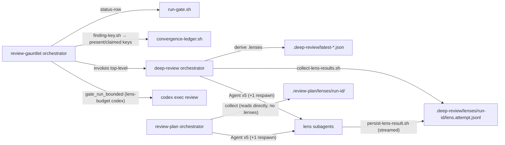

# Task: Review-skill resilience — bounded gates, durable lens state, regression guard, hygiene

**Status**: Not Started
**Component**: review-skills
**Assigned to**: Claude (conduct) + Codex mirror via `codex:rescue`
**Priority**: High
**Branch**: feature/review-skills-resilience
**Created**: 2026-08-23
**Completed**:
**Review Gates**: full

## Objective

Make `review-gauntlet`, `deep-review`, and `review-plan` tolerate fallible infrastructure (hung Codex CLI, silent lens subagents) without stalling a round, add a regression-loop stop condition to the gauntlet, and codify four hygiene rules surfaced by the 2026-08-23 Claude Code insights report.

## Context

Source: Claude Code insights report, 2026-08-23 (`file:///Users/vr000m/.claude/usage-data/report-2026-08-23-163953.html`), covering 16 sessions 2026-08-15→23 (5 review-gauntlet sessions). Observed regressions/friction:

- **Codex gate hangs**: `codex exec review` ran 25+, 44+, and 90+ minutes against an ~11.5-minute baseline; the 90-minute case used an incompatible flag combination. No timeout, no fallback — operator had to drop the gate mid-gauntlet by hand.
- **Silent lenses**: gauntlet lens subagents "never returned content through the mailbox"; Agent tool hit a spawn cap, forcing respawns and manual review. Same failure class as the open memory item *review-plan lens agent no-return* (2/5 lenses — assumptions, codebase-claims — went silent in a live dogfood run; root cause never chased).
- **Regression loops**: a later review round had to catch a regression introduced by an earlier fix round; fixes applied in one place when the pattern appeared in several.
- **Security reviews interrupted**: 3 sessions killed mid-exploration before any finding was delivered.
- **Inferred state**: PyPI manual-approval gate wrongly concluded gone from workflow run duration; two files had to be corrected.
- **ruff hook stripped `# noqa`**: `~/.claude/hooks/format-on-edit.sh:18` runs `ruff check --fix`. ASSUMPTION (unreproduced): the stripping is RUF100, which only fires when a project selects it — Phase 4 must reproduce before fixing.
- **Foreground test timeout**: full suite exceeded the 2-minute foreground Bash timeout and had to be re-run in background.

What already exists (verified by Explore, 2026-08-23): `lib/convergence-ledger.sh` already implements cap (`CAP=10`, line 56), K=2 non-convergence stall, structural-restart, and excludes `error/skipped/deferred` from clean passes (`SKILL.md:214`); it consumes **tallies only** (`--count/--structural/--local/--quarantine`, no finding identity). Both `deep-review` and `review-plan` persist state via bundled scripts but **only from the orchestrator after a lens returns** — a lens that never returns leaves nothing on disk. No `timeout`/background wrapping exists for the Codex gate. Shared scripts are **bundle-generated**: canonical source is `scripts/` (+ `scripts/lib/`), placed into `plugins/*/skills/<skill>/scripts/` by `scripts/bundle-appliers.sh` per `scripts/lib/bundle-map.sh` (`BUNDLE_SHARED`, `bundle_extra_for`); `scripts/check-sync.sh` flags any unmapped bundled file as drift; `tests/parity/test-applier-bundle-parity.sh` enforces byte-identity, with gauntlet `lib/` covered by `GAUNTLET_LIB_PARITY_FILES=(run-gate.sh convergence-ledger.sh)`. Host facts: `flock(1)` is absent on this macOS; `timeout` is Homebrew coreutils only.

## Requirements

- R1. Codex gate in `review-gauntlet` is wrapped in a wall-clock budget from `lens-budget.sh --kind codex` (20m floor, 45m cap; `--gate-timeout <seconds>` override). Enforcement is **shell-only** via `gate_run_bounded`, synchronous, killing the whole process group; Claude-side `run_in_background` + Monitor is an optional UX layer, non-load-bearing and Claude-only. On expiry the gate is recorded as `status: skipped`, `notes: "DEGRADED: timeout after <N>s"`, written to a path distinct from the tool's own output file — the round continues.
- R2. The flag combination that produced the 90+ minute hang is identified (from the insights facets / session transcripts) and explicitly forbidden in the gate invocation prose, Claude and Codex mirrors. If unrecoverable, record UNVERIFIED and document the budget as the only defence. Acceptance: both mirrors carry either a `Forbidden flags:` line naming the combo or an `UNVERIFIED` marker naming the budget as sole defence; `test-gauntlet-skill-shape.sh` accepts exactly one of the two forms.
- R3. Lens subagents in `deep-review` and `review-plan` stream typed JSON lines to a per-attempt file **as they go** (ASSUMPTION: a subagent reliably shells out to `persist-lens-result.sh` per unit without permission prompts — dogfood must verify progress lines land at distinct mtimes and that the script path is permission-allow-listed): `{"type":"start","run_id":..,"units":[...]}` first; `{"type":"progress","unit":..}` after each unit; `{"type":"finding",...}` immediately on discovery; `{"type":"done","status":"completed|errored"}` last. Path: `<skill-state-dir>/lenses/<run-id>/<lens>.<attempt>.jsonl` (`.deep-review/` or `.review-plan/`). **One writer per file** — no `flock`, no cross-writer atomicity assumption; the collector tolerates a truncated trailing line. The disk file is the source of truth; the Agent return value is a fallback only.
- R4. Orchestrator applies a per-lens budget from `lens-budget.sh`. `collect-lens-results.sh` reads all attempts for the run-id and reports per lens `{status, reviewed, assigned, unreviewed[], findings[]}` (merged across attempts, deduped by finding signature). The status enum is the superset `completed|partial|timed_out|errored|skipped` (absent key = missing) — the collector emits exactly this enum, `.lenses` persists it, and `--continue` re-runs `timed_out|errored|partial|absent`. Return-value precedence: if the Agent returned a parseable result but disk has no `done` line, the orchestrator writes the `done`+`finding` lines itself on the lens's behalf (attempt stays 1) and skips respawn — disk remains source of truth, returned work is salvaged. Otherwise a lens with no `done` after the budget is respawned **once** as attempt 2, scoped to `unreviewed`; a second failure is persisted as `timed_out` with coverage. The **orchestrator owns the assigned-units list** and passes it via `collect-lens-results.sh --expected <lens:units,...>`; for a `missing` lens, `unreviewed` := the full assigned list. ASSUMPTION (budget-wake): the orchestrator can observe budget expiry while lenses still run — Phase 2 starts with a spike (one deliberately silent stub lens) proving budget-triggered collect+respawn fires in a live session before the 10 lens prompts are written; the mechanism (Monitor vs Bash loop) is recorded in `## Findings`. `persist-deep-review-state.sh` **derives** its `.lenses` object from collector output (deep-review only — see the asymmetric-seam decision); `persist-review-state.sh` is untouched and the review-plan orchestrator reads collector output directly for its errored/timed_out report list. Codex sequential-fallback mode: the orchestrator emits the typed lines itself; `collect-lens-results.sh` still runs (only respawn is skipped) so both mirrors share one derivation path.
- R4a. Budgets scale with task size. `lens-budget.sh --files N --lines L [--sections S] --kind lens|plan-lens|codex` (bundled `BUNDLE_SHARED` script): lens = `max(5m, 2m + 45s×files + 10s×(lines/100))` cap 30m; plan-lens = `max(5m, 2m + 20s×sections)` cap 30m; codex = `max(20m, 2×lens)` cap 45m. Output in seconds. Coefficients are untuned guesses (Codex ~0.5m/file from the 11.5m baseline). Computed budget printed in the range banner.
- R5. Gauntlet gains a **regression** stop condition implemented in `convergence-ledger.sh`. Identity: a ledger-owned **regression key** `sha1(file|category|normalised summary)` (lowercase, whitespace-collapsed — **no digit-stripping**, so findings differing only in a number stay distinct; bias to precision), computed by bundled `finding-key.sh` — explicitly **distinct** from the reconciler's line-anchored `(file, line, category)` dedup key. Ledger gains `--present-keys <file>` per round and `--claimed-keys <file>`; the **ledger itself** promotes a claimed key into cumulative `fixed_keys` iff it is absent from the next `pass_type: full` pass's `present_keys`, and computes `regression = present_keys ∩ fixed_keys` internally — the orchestrator passes only what it observes (present, claimed), never a fixed set. The `regression` decision slots **after success, before cap** in the priority chain. A present key ∈ fixed set → terminal `regression`. Quarantined/deferred keys never promote. `fixed_keys` persist across structural restarts. Ledgers lacking the fields default to empty (no `--resume` break). Fixer output contract becomes a schema: `{claimed:[key...]}`.
- R6. *(dropped 2026-08-23 — grilled: deep-review has no lens-selection flag and confirm-subset counts would pollute the running-minimum; a clean confirm pass is already followed by a full pass.)*
- R7. Every round ends with a gate-status table (gate, status, duration_s, findings, degraded_reason). Rows are **emitted by `run-gate.sh status-row`** from the gate envelope (unit-testable); SKILL.md only says where to print them.
- R8. Hygiene rules added to `.claude/CLAUDE.md` (repo) and `~/.claude/CLAUDE.md` (global): background the full test suite; never infer CI/approval state from indirect signals (cite `gh run view`/`gh api`); security/diff reviews post scope summary first, ≤3 orienting calls, stream findings severity-first.
- R9. `format-on-edit.sh` stops stripping `# noqa`. Phase 4 first **reproduces** in a scratch dir with `ruff.toml` selecting `RUF100`, then applies `--ignore RUF100` and re-probes (hook reads `tool_input.file_path` from stdin JSON — probe must pipe JSON, not pass argv).
- R10. Claude and Codex mirrors updated for every skill change. Scripts: edit **canonical `scripts/` once**, register in `bundle-map.sh`, regenerate with `scripts/bundle-appliers.sh`; byte-identity enforced by `just parity-tests && just check-sync`. Gauntlet `lib/` additions are added to `GAUNTLET_LIB_PARITY_FILES`. SKILL.md prose is semantically aligned, not byte-identical; Codex SKILL.md edits go through `codex:rescue` then a fresh-thread self-review, **in the same phase as the Claude edit** (shape tests assert on both mirrors). Deferral of a Codex-side item is allowed ONLY for behaviour the Codex harness cannot express (e.g. Monitor/Agent-tool-specific mechanics); each such item is exempted from the both-mirror shape assertions and recorded in `docs/dev_plans/CODEX_MIRROR_BACKLOG.md`.
- R11. Every shell change is covered by a test under `tests/gauntlet/` or new `tests/lenses/`; no behaviour lives only in prose when a script can enforce it. Prose-only items (R2 forbidden-flag note, R8) get grep shape assertions.

## Review Focus

- `convergence-ledger.sh` decision table: adding `regression` and the key flags must not change any existing decision for inputs without the flags (golden-test current outputs first, including `--resume` on a pre-change ledger).
- Regression key vs dedup key are **different by design**; the test must show a reappearing finding on a shifted line still matches, and a same-category different-summary finding does not.
- Disk-first lens results: collector must handle a truncated trailing line, a stale run-id directory, and attempt-2 merging without duplicate findings.
- Timeout interplay: a killed Codex gate must not leave a half-written output that `run-gate.sh normalize` parses as clean — envelope path ≠ tool output path; process-group kill; test with a stub that forks a SIGTERM-ignoring child.
- Mirror/bundle discipline: canonical `scripts/` + `bundle-map.sh` + `bundle-appliers.sh`; `just check-sync` green at every phase commit.
- The forbidden flag combo (R2) must be a verified fact, not a guess.

## Implementation Checklist

### Phase 1: Bounded Codex gate + size-scaled budgets

**Impl files:** `scripts/lens-budget.sh, scripts/lib/bundle-map.sh, plugins/skein/skills/review-gauntlet/lib/gate-bounded.sh, plugins/skein/skills/review-gauntlet/lib/run-gate.sh, plugins/skein-codex/skills/review-gauntlet/lib/gate-bounded.sh, plugins/skein-codex/skills/review-gauntlet/lib/run-gate.sh, plugins/skein/skills/review-gauntlet/SKILL.md, plugins/skein-codex/skills/review-gauntlet/SKILL.md, tests/parity/test-applier-bundle-parity.sh, justfile`
**Test files:** `tests/gauntlet/test-gate-timeout.sh, tests/gauntlet/test-lens-budget.sh, tests/gauntlet/test-gauntlet-skill-shape.sh`
**Test command:** `bash tests/gauntlet/test-gate-timeout.sh && bash tests/gauntlet/test-lens-budget.sh && bash tests/gauntlet/test-gauntlet-skill-shape.sh`
**Validation cmd:** `just parity-tests && just check-sync`
**Goal:** A hung external gate costs at most its budget, enforced in shell, never blocks the round, and is visibly `skipped`/DEGRADED — never silently clean; budgets are one formula, bundled, overridable in seconds.

- `scripts/lens-budget.sh` (canonical; register via `bundle_extra_for review-gauntlet` in this phase — promoted to `BUNDLE_SHARED` in Phase 2 when deep-review/review-plan start invoking it, keeping bundled==operative at every phase commit); tests: lens floor/cap, plan-lens sections, codex 20m floor / 45m cap, `--lines`, override beats computed.
- `gate_run_bounded <seconds> <envelope-out> <tool-out> -- <cmd...>` in a NEW harness-neutral `lib/gate-bounded.sh` (both mirrors; sources `gauntlet-common.sh` where needed — `gauntlet-common.sh` itself is NOT touched and NOT added to parity, it legitimately diverges per harness): GNU `timeout --kill-after` when available (it signals its own process group), else a `python3 os.setsid`+exec shim creating a real process group for the kill loop (`setsid(1)` is absent on this host); on expiry remove `<tool-out>`, write DEGRADED envelope to `<envelope-out>` stamping `duration_s` and `degraded_reason`. Every envelope (not only DEGRADED) carries optional `duration_s` (number|null) and `degraded_reason` (string|null). Add `gate-bounded.sh` to `GAUNTLET_LIB_PARITY_FILES`.
- `run-gate.sh normalize` treats the DEGRADED envelope as `skipped` (exit 4 path) and passes `duration_s`/`degraded_reason` through.
- SKILL.md gate 1 (both mirrors, same phase): invoke through the helper; budget from `lens-budget.sh --kind codex`; Monitor noted as Claude-only advisory.
- R2 forbidden flag combo: recover from facets; document or mark UNVERIFIED in `## Findings`.
- Tests: stub writes a valid `{"status":"ok","findings":[]}` tool-out then sleeps 5s with 2s budget → `skipped`, tool-out removed, `run-gate.sh normalize` on the envelope exits 4 with `notes` starting `DEGRADED:`, `duration_s` populated; stub forking a SIGTERM-ignoring child → child dead after expiry (both timeout and shim paths); run twice with `timeout` hidden from PATH → identical envelope. New tests registered in the `justfile` `gauntlet-tests` recipe; `just gauntlet-tests` added to the Validation cmd.

### Phase 2: Disk-first streamed lens results (deep-review + review-plan)

**Impl files:** `scripts/persist-lens-result.sh, scripts/collect-lens-results.sh, scripts/lib/persist-common.sh, scripts/persist-deep-review-state.sh, scripts/lib/bundle-map.sh, plugins/skein/skills/deep-review/SKILL.md, plugins/skein/skills/review-plan/SKILL.md, plugins/skein-codex/skills/deep-review/SKILL.md, plugins/skein-codex/skills/review-plan/SKILL.md, justfile`
**Test files:** `tests/lenses/test-persist-lens-result.sh, tests/lenses/test-lens-collect.sh, tests/lenses/test-derived-lenses-state.sh, tests/lenses/test-lens-skill-shape.sh, tests/reconciliation/test-deep-review-state.sh, tests/reconciliation/test-review-plan-state.sh`
**Test command:** `bash tests/lenses/test-persist-lens-result.sh && bash tests/lenses/test-lens-collect.sh && bash tests/lenses/test-derived-lenses-state.sh && bash tests/lenses/test-lens-skill-shape.sh`
**Validation cmd:** `just parity-tests && just check-sync && just reconciliation-tests`
**Goal:** A lens's coverage and findings are on disk as it works, in one-writer-per-file attempt files under the skill's own state dir keyed by run-id; a silent lens is detectable, respawned exactly once on its unreviewed units, and `--continue` still has one source of truth.

- **Spike first (budget-wake ASSUMPTION):** before writing the 10 lens prompts, spawn one deliberately silent stub lens and prove budget-triggered collect+respawn fires in a live session; record the mechanism (Monitor vs Bash loop) in `## Findings`.
- `scripts/persist-lens-result.sh --root <repo-root> --skill --run-id --lens --attempt --type start|progress|finding|done [...]` → appends to `<state-dir>/lenses/<run-id>/<lens>.<attempt>.jsonl` (`--root` explicit, never cwd-derived). Register in `bundle_extra_for` for deep-review and review-plan; promote `lens-budget.sh` to `BUNDLE_SHARED`; regenerate.
- `scripts/collect-lens-results.sh --skill --run-id --expected <lens:units,...>` → per-lens status/coverage/unreviewed/findings merged across attempts, emitting the superset enum (`completed|partial|timed_out|errored|skipped`, absent = missing); ignores truncated trailing line; unknown run-id dir → all `missing` with `unreviewed` = full assigned list from `--expected`.
- `persist-deep-review-state.sh`: derive `.lenses` from collector output (single writer of the summary); existing positional `lenses.json` input retained as an override so current tests keep passing. `persist-review-state.sh` NOT modified — the review-plan orchestrator reads collector output directly for its errored/timed_out report list.
- Lens prompts (5 + 5) + respawn variant (`units` := `unreviewed`, `--attempt 2`), each with a fixed preamble carrying: resolved absolute path of `persist-lens-result.sh` (orchestrator substitutes `${CLAUDE_PLUGIN_ROOT}`/`$SKILL_DIR` before spawning), absolute repo root, run-id, lens name, attempt. Budget per lens from `lens-budget.sh`, printed in banner; orchestrator reads disk first; a parseable Agent return with no `done` is written to disk by the orchestrator (attempt 1, no respawn); Codex sequential mode: orchestrator emits the lines, collector still runs, no respawn. Both mirrors' SKILL.md in this phase; new shape test `tests/lenses/test-lens-skill-shape.sh` asserts both mirrors reference `persist-lens-result.sh --type start`, `--attempt 2`, `collect-lens-results.sh`, `lens-budget.sh`, and the Codex sequential-mode clause.
- Tests: done → completed; start+2/5 progress → `partial 2/5`, unreviewed list of 3; attempt-2 merge → no duplicate findings; attempt-1 partial + attempt-2 partial/missing → `timed_out` with merged coverage; returned-but-no-done → orchestrator-written done, no respawn; stale run-id → missing; missing dir with `--expected` units → `unreviewed` = full list; truncated last line → ignored. New `justfile` `lens-tests` recipe runs them.
- Dogfood `/review-plan` on this plan: commit Phase 2, **restart the `claude` process** (skill-registry cache is process-scoped), run the dogfood, then re-verify the plan marker/hash before conduct resumes Phase 3. Record in `## Findings` whether the previously silent lenses left disk records, whether per-unit progress lines landed at distinct mtimes, whether respawn succeeded under the spawn cap, and the observed cap value (cap is UNVERIFIED).

### Phase 3: Regression-loop stop + gate-status rows

**Impl files:** `scripts/finding-key.sh, scripts/lib/bundle-map.sh, plugins/skein/skills/review-gauntlet/lib/convergence-ledger.sh, plugins/skein/skills/review-gauntlet/lib/run-gate.sh, plugins/skein-codex/skills/review-gauntlet/lib/convergence-ledger.sh, plugins/skein-codex/skills/review-gauntlet/lib/run-gate.sh, plugins/skein/skills/review-gauntlet/SKILL.md, plugins/skein-codex/skills/review-gauntlet/SKILL.md, justfile`
**Test files:** `tests/gauntlet/test-convergence-ledger.sh, tests/gauntlet/test-regression-stop.sh, tests/gauntlet/test-finding-key.sh, tests/gauntlet/test-status-row.sh`
**Test command:** `bash tests/gauntlet/test-convergence-ledger.sh && bash tests/gauntlet/test-regression-stop.sh && bash tests/gauntlet/test-finding-key.sh && bash tests/gauntlet/test-status-row.sh && bash tests/gauntlet/test-gauntlet-skill-shape.sh`
**Validation cmd:** `just parity-tests && just check-sync`
**Goal:** Existing ledger decisions are byte-for-byte unchanged when the key flags are absent; a reappearing fixed finding (even on a shifted line) terminates with `regression`; status rows are script-emitted.

- Golden-test current ledger outputs + `--resume` on a pre-change ledger before touching it.
- `scripts/finding-key.sh` (registered via `bundle_extra_for review-gauntlet`, NOT `BUNDLE_SHARED` — gauntlet-only, bundled==operative): regression key from a finding JSON; normalisation is lowercase + whitespace-collapse only (no digit-stripping); tests: shifted-line match, different-summary non-match, two same-file same-category findings differing only in a number → distinct keys.
- Ledger: `--present-keys`, `--claimed-keys`; per-round `present_keys`, cumulative `fixed_keys` promoted **by the ledger** (claimed ∧ absent from next full pass's present_keys; survive structural restart); decision `regression` = present ∩ fixed, slotted after success and before cap; missing fields default empty. Negative tests: claimed-but-still-present key never enters `fixed_keys` nor later fires `regression`; key present only in a `pass_type: confirm` pass never promotes; `--last-decision` on a `regression` ledger exits terminal; one test per higher-priority decision rule.
- SKILL.md (both mirrors): fixer output schema `{claimed:[key...]}`; the ledger owns claimed→fixed promotion (orchestrator passes only present/claimed); stop condition 5 documented; R6 removed.
- `run-gate.sh status-row <envelope>` → one table row (`-` for null `duration_s`/`degraded_reason`; orchestrator stamps `duration_s` for gates 2/3 from its wall clock); SKILL.md prints rows before the ledger decision; shape test asserts column names in both mirrors; test-status-row.sh asserts populated `duration_s` and empty `degraded_reason` on a clean envelope. New tests registered in `justfile` `gauntlet-tests`; `just gauntlet-tests` in Validation cmd.

### Phase 4: Hygiene — CLAUDE.md rules + ruff hook

**Impl files:** `.claude/CLAUDE.md, /Users/vr000m/.claude/CLAUDE.md, /Users/vr000m/.claude/hooks/format-on-edit.sh`
**Test files:** `tests/plugin/test-claude-md-hygiene.sh`
**Test command:** `bash tests/plugin/test-claude-md-hygiene.sh`
**Validation cmd:** `bash tests/plugin/noqa-probe.sh`
**Goal:** The four insights-report hygiene failures each have a written rule or a mechanical guard; the `# noqa` stripping is reproduced before it is fixed, and the fix is proven by the same probe.

- `tests/plugin/noqa-probe.sh`: scratch dir with `ruff.toml` `select=["RUF100"]` + file with unused `# noqa`; pipe `{"tool_input":{"file_path":...}}` into the hook via `HOOK_PATH` env var (explicit SKIP when unset/absent); exit 1 if `noqa` gone. Run against the unmodified hook first and record the reproduction (or its absence) in `## Findings` — also record which project config triggered the original stripping (or that it could not be identified), distinguishing mechanism-reproduced from incident-explained (the probe reproduces by construction since it selects RUF100 itself).
- `format-on-edit.sh:18`: `ruff check --fix --ignore RUF100`.
- Repo + global CLAUDE.md: `## Testing`, `## Facts vs Inference`, `## Security & Diff Reviews`; test asserts headings — repo `.claude/CLAUDE.md` unconditionally, global via `GLOBAL_CLAUDE_MD` env var with explicit SKIP when unset/absent; global-file results recorded in `## Findings` as a manual check.

### Phase 5: Docs, manifests, backlog

**Impl files:** `CHANGELOG.md, AGENTS.md, docs/dev_plans/README.md, plugins/skein/.claude-plugin/plugin.json, plugins/skein-codex/.codex-plugin/plugin.json, docs/dev_plans/CODEX_MIRROR_BACKLOG.md`
**Test files:** `tests/parity/test-applier-bundle-parity.sh`
**Test command:** `just parity-tests && just check-sync`
**Goal:** Docs reflect the shipped contracts; both manifests bumped; any deferred Codex-side item recorded.

- Bump both manifests (0.6.0); changelog; AGENTS.md gotchas (bundle discipline for new scripts, one-writer-per-file lens state).
- Update `docs/dev_plans/CODEX_MIRROR_BACKLOG.md` only for items the Codex harness cannot express (per narrowed R10); each entry names the exempted shape assertion.

## Technical Specifications

### Files to Modify
- `scripts/lib/bundle-map.sh` — Phase 1: `lens-budget.sh` via `bundle_extra_for review-gauntlet`; Phase 2: promote `lens-budget.sh` to `BUNDLE_SHARED`, add `persist-lens-result.sh`, `collect-lens-results.sh` to `bundle_extra_for` deep-review/review-plan; Phase 3: `finding-key.sh` via `bundle_extra_for review-gauntlet` (bundled==operative at every phase commit).
- `scripts/lib/persist-common.sh` (canonical; bundled to both skills) — append-line helper.
- `scripts/persist-deep-review-state.sh` — derive `.lenses` from collector output (positional `lenses.json` input retained as override). `scripts/persist-review-state.sh` is NOT modified — no `.lenses` object, no `--continue` consumer; the review-plan orchestrator reads collector output directly.
- `justfile` — new `lens-tests` recipe; new tests added to `gauntlet-tests` and plugin recipes.
- `plugins/skein{,-codex}/skills/review-gauntlet/lib/run-gate.sh` — DEGRADED envelope → `skipped`; `status-row` subcommand; pass through `duration_s`/`degraded_reason`.
- `plugins/skein{,-codex}/skills/review-gauntlet/lib/convergence-ledger.sh` — `--present-keys`/`--claimed-keys`, ledger-owned promotion to `fixed_keys`, `regression` decision after success / before cap.
- `plugins/skein{,-codex}/skills/review-gauntlet/SKILL.md` — gate 1 invocation; stop condition 5; R6 removed; fixer schema; status rows.
- `plugins/skein{,-codex}/skills/deep-review/SKILL.md`, `.../review-plan/SKILL.md` — streamed lens protocol, budgets, collect/respawn, derived `.lenses`, Codex sequential mode.
- `tests/parity/test-applier-bundle-parity.sh` — `GAUNTLET_LIB_PARITY_FILES` += `gate-bounded.sh` (`gauntlet-common.sh` stays excluded — it legitimately diverges per harness).
- `.claude/CLAUDE.md`, `~/.claude/CLAUDE.md`, `~/.claude/hooks/format-on-edit.sh:18`.

### New Files to Create
- `scripts/lens-budget.sh`, `scripts/finding-key.sh`, `scripts/persist-lens-result.sh`, `scripts/collect-lens-results.sh` (canonical; bundled copies generated, never hand-edited)
- `plugins/skein{,-codex}/skills/review-gauntlet/lib/gate-bounded.sh` (harness-neutral, in `GAUNTLET_LIB_PARITY_FILES`)
- `tests/gauntlet/test-gate-timeout.sh`, `test-lens-budget.sh`, `test-regression-stop.sh`, `test-finding-key.sh`, `test-status-row.sh`
- `tests/lenses/test-persist-lens-result.sh`, `test-lens-collect.sh`, `test-derived-lenses-state.sh`, `test-lens-skill-shape.sh`
- `tests/plugin/test-claude-md-hygiene.sh`, `tests/plugin/noqa-probe.sh`

### Architecture Decisions
- **Timeout in shell, not prose**; process-group kill; envelope path ≠ tool output path.
- **Decision (grilled): `gate_run_bounded` lives in a new harness-neutral `lib/gate-bounded.sh`** added to `GAUNTLET_LIB_PARITY_FILES`; `gauntlet-common.sh` stays out of byte-parity (it legitimately diverges per harness). Process group via GNU `timeout` when present, else `python3 os.setsid`+exec shim (`setsid(1)` absent on this host).
- **Decision (grilled): lens status enum is the superset** `completed|partial|timed_out|errored|skipped` (absent = missing), emitted by the collector and persisted verbatim; a parseable Agent return with no `done` on disk is written to disk by the orchestrator (attempt 1, no respawn); the orchestrator owns assigned-units and supplies them via `--expected`; budget-wake is a named ASSUMPTION verified by a Phase 2 spike.
- **Decision (grilled): asymmetric state seam** — only deep-review derives `.lenses` (it has the `--continue` consumer); `persist-review-state.sh` untouched; Codex sequential mode still runs the collector (only respawn skipped).
- **Decision (grilled): ledger-owned claimed→fixed promotion** — `--claimed-keys` replaces `--fixed-keys`; the ledger promotes and computes `present ∩ fixed`; `regression` slots after success, before cap; key normalisation drops digit-stripping.
- **Decision (grilled): R10 narrowed** — Codex-side deferral only for harness-inexpressible behaviour, exempted from shape assertions, recorded in `docs/dev_plans/CODEX_MIRROR_BACKLOG.md`.
- **Lens writes, orchestrator reads**; one writer per file (attempt-suffixed) removes every locking/atomicity assumption; run-id directory removes stale reads; derived `.lenses` keeps `--continue` on one source of truth.
- **Size-scaled budgets, one formula**, bundled via `BUNDLE_SHARED` — no cross-skill `lib/` sourcing.
- **Decision (grilled): drop R6** — deep-review has no lens-selection flag; confirm-subset counts would pollute the running-minimum; a clean confirm pass is already followed by a full pass.
- **Decision (grilled): ledger-owned regression key** `sha1(file|category|normalised summary)`, distinct from the line-anchored dedup key; a missed regression degrades to today's cap behaviour, while a false positive would halt a healthy run — so bias to precision.
- **Decision (grilled): lens state under each skill's existing state dir** (`.deep-review/lenses/<run-id>/`, `.review-plan/lenses/<run-id>/`) — no fourth state dir, no `.gitignore` change.
- **One respawn, not backoff loops.**
- **Extend `convergence-ledger.sh`, don't add a second engine.**
- **`--ignore RUF100` over dropping `--fix`**, contingent on Phase 4 reproduction.
- Deferred: unified findings ledger; CI watchdog; issue-swarm.

### Dependencies
- Ambient: `bash`, `jq`, `python3`, `sha1sum`/`shasum`; `timeout` optional (Homebrew coreutils) with `python3 os.setsid` shim fallback; **no `flock`, no `setsid`** on this host. No manifests in repo.

### Integration Seams

| Seam | Writer | Caller | Contract |
|------|--------|--------|----------|
| DEGRADED gate envelope | `gate_run_bounded` (`lib/gate-bounded.sh`) | `run-gate.sh normalize` | `status: skipped`, `notes` starts `DEGRADED:`; exit 4; tool-out removed; envelope at separate path; every envelope carries optional `duration_s`/`degraded_reason` |
| Lens attempt file | lens subagent via `persist-lens-result.sh --root` | `collect-lens-results.sh` | `<state-dir>/lenses/<run-id>/<lens>.<attempt>.jsonl`; one writer; typed lines `start/progress/finding/done`; coverage = progress/start units; status enum `completed|partial|timed_out|errored|skipped` (absent = missing); returned-but-no-done → orchestrator writes done (attempt 1) |
| Assigned units | orchestrator | `collect-lens-results.sh --expected <lens:units,...>` | orchestrator owns the list; missing lens ⇒ `unreviewed` = full assigned list |
| Derived lens summary | `persist-deep-review-state.sh` (from collector; positional input retained) | deep-review `--continue` | `.lenses` object; disk attempt files are the source; review-plan orchestrator reads collector output directly (no `.lenses`) |
| Regression key | `finding-key.sh` | orchestrator → ledger `--present-keys/--claimed-keys` | `sha1(file|category|normalised summary)`, lowercase + whitespace-collapse only; never the reconciler's key |
| Fixer output | fixer subagent | orchestrator → ledger | `{claimed:[key...]}`; ledger promotes claimed→fixed after next full pass; quarantined/deferred excluded |
| Lens budget | `lens-budget.sh` | all three orchestrators | seconds; floors 5m lens / 5m plan-lens / 20m codex; caps 30m / 30m / 45m |
| Status row | `run-gate.sh status-row` | gauntlet round loop | columns gate, status, duration_s, findings, degraded_reason |

## Architecture & Call Flow

Component graph:



Trigger order (one gauntlet round):

```mermaid
sequenceDiagram
    participant G as gauntlet
    participant CX as codex CLI
    participant DR as deep-review
    participant L as lens agents
    participant D as state-dir/lenses/run-id
    participant CL as ledger
    G->>CX: gate_run_bounded (budget s, process group)
    CX-->>G: envelope or DEGRADED skipped
    G->>DR: invoke (top-level)
    DR->>L: spawn 5 lenses (attempt 1)
    L->>D: start / progress / finding lines during review; done before return
    DR->>D: collect after budget; respawn partial/missing once (attempt 2, unreviewed units)
    DR->>DR: derive .lenses summary
    DR-->>G: findings
    G->>CL: tallies + present-keys + claimed-keys (ledger promotes fixed after full pass)
    CL-->>G: continue | confirm | regression | cap | ...
    G-->>G: print status rows
```

Context lifecycle:

| Step | Trigger | Enters context | Cleared/persisted | Turn boundary |
|------|---------|----------------|-------------------|---------------|
| 1 | gate 1 | Codex envelope (or DEGRADED) | envelope file | budget expires or tool exits |
| 2 | lens spawn | prompt + diff/plan + units, no parent history | typed lines streamed to attempt file | lens completes or budget expires |
| 3 | collect | JSON summary of disk state only | attempt-2 file for respawn; derived `.lenses` | after ≤1 respawn |
| 4 | ledger | tallies + keys | ledger state file | decision printed |

## Testing Notes

### Test Approach
- [ ] Shell unit tests per phase (stub `codex` incl. SIGTERM-ignoring child; stub lenses writing/not writing; ledger goldens incl. `--resume`)
- [ ] `just parity-tests && just check-sync` at every phase commit
- [ ] Dogfood: `/review-plan` on this plan after Phase 2; `/review-gauntlet` on this branch after Phase 3
- [ ] `tests/plugin/noqa-probe.sh` before and after the hook change

### Test Results
- [ ] All existing tests pass
- [ ] New tests added and passing
- [ ] Dogfood runs recorded in `## Findings`

### Edge Cases Tested
- [ ] `timeout` absent → PID-group fallback, identical envelope
- [ ] Tool child ignores SIGTERM → still dead after expiry; envelope intact
- [ ] Lens killed mid-write → truncated last line dropped; `partial` with coverage
- [ ] Attempt-2 merge → no duplicate findings
- [ ] Stale run-id directory → `missing`, not `completed`
- [ ] Regression key: shifted line still matches; two findings differing only in a number stay distinct; quarantined key never `regression`; key survives structural restart
- [ ] Claimed-but-still-present key never promotes to fixed; confirm-pass presence never promotes; `--last-decision` on `regression` exits terminal
- [ ] Returned-but-no-done → orchestrator writes done, no respawn; attempt-1 partial + attempt-2 partial/missing → `timed_out` with merged coverage
- [ ] Pre-change ledger with `--resume` → unchanged decision

## Acceptance Criteria

- Stub `codex` writing a valid tool-out then sleeping 5s with a 2s budget → gate `skipped`/DEGRADED, tool-out removed, `normalize` exits 4, `duration_s` stamped, child process dead (timeout and shim paths).
- Lens stub writing `done` → completed; `start`+2/5 `progress` → `partial 2/5`, respawned once on 3 units, merged without duplicates; nothing twice → `timed_out`; parseable return with no `done` → salvaged, no respawn.
- Ledger goldens unchanged without key flags; `regression` fires on a reappearing fixed key on a shifted line, and only then (never from claimed-but-still-present or confirm-pass keys).
- `run-gate.sh status-row` emits the five columns; shape tests (gauntlet + lens SKILL.md) pass on both mirrors; R2 acceptance: `Forbidden flags:` line or `UNVERIFIED` marker, exactly one form.
- `lens-budget.sh`: `--files 122` → 30m cap; `--files 3` → 5m floor; `--kind codex` → 20m floor / 45m cap; override wins.
- `noqa-probe.sh` fails on the old hook (or reproduction recorded as not reproducible) and passes on the new one.
- CLAUDE.md carries the three new sections; `just parity-tests && just check-sync` green; both manifests bumped; Codex mirrors aligned per phase.
- Code reviewed and approved; tests passing; docs updated.

<!-- reviewed: 2026-08-24 @ 2af2cf6b3128b396b5b6035b2e40438e55b6668c -->

<!-- /review-plan writes the marker line above. Everything below is the workspace: edits here do NOT invalidate the marker. -->

## Progress

- [ ] Phase 1: Bounded Codex gate + size-scaled budgets
- [ ] Phase 2: Disk-first streamed lens results
- [ ] Phase 3: Regression-loop stop + gate-status rows
- [ ] Phase 4: Hygiene — CLAUDE.md rules + ruff hook
- [ ] Phase 5: Docs, manifests, backlog

## Status

| Date | Update |
|------|--------|
| 2026-08-23 | Plan created from insights report; branch `feature/review-skills-resilience`. |
| 2026-08-23 | Added R4a: budgets scale with diff size via `lens-budget.sh`; coefficients are untuned guesses to revisit after dogfood. |
| 2026-08-23 | `/review-plan` run 1: 36 findings (5 Critical, 21 Important, 10 Minor), 8 contradictions. All addressed; three grilled decisions: drop R6; ledger-owned regression key; lens state under per-skill state dirs with attempt files. |
| 2026-08-23 | User confirmed Architecture & Call Flow; lens file made append-only with typed `start/progress/finding/done` lines so partial coverage is observable and respawn is scoped to unreviewed units. |
| 2026-08-24 | `/review-plan` run 2: 35 raw findings reconciled to 34 (5 lenses + contradiction pass; 2 Critical, 19 Important, 13 Minor; 6 contradictions). All 34 accepted; five grilled decisions applied: gate-bounded.sh (not gauntlet-common.sh) in parity; superset lens enum + return salvage + orchestrator-owned units + budget-wake spike; asymmetric state seam (review-plan persist untouched, Codex mode keeps collector); ledger-owned claimed→fixed, regression after success/before cap, no digit-stripping; R10 narrowed for harness-inexpressible deferrals. |

## Findings

- 2026-08-23 (source: insights report 2026-08-23): Codex gate 25/44/90+ min vs ~11.5 min baseline; lens mailbox silence + spawn cap; 2/5 review-plan lenses silent (memory item open); 3 security reviews interrupted mid-exploration; PyPI gate wrongly inferred from run duration; ruff hook stripped `# noqa`; full suite > 2-min foreground timeout.
- 2026-08-23 (Explore): convergence cap/K logic already exists in `convergence-ledger.sh` — scope of item (3) narrowed to regression detection + affected-lens confirm + status table.
- 2026-08-23 (verified): `~/.claude/hooks/format-on-edit.sh:18` runs `ruff check --fix` — the `# noqa` stripping mechanism.
- UNVERIFIED: exact flag combination behind the 90-minute Codex hang — to be recovered from session facets in Phase 1.
- 2026-08-24 (dogfood, run 2): all six review subagents (5 lenses + contradiction pass) went idle WITHOUT delivering their reports; each required a follow-up mailbox message before returning findings. Exactly the silent-lens failure mode this plan targets — supports R3/R4's disk-first design and the budget-wake spike.

### Review Waivers

- none (run 1, 2026-08-23)

## Issues & Solutions

## Final Results
