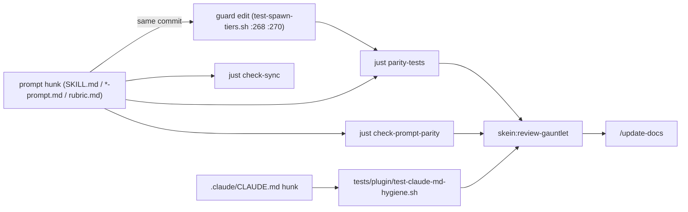
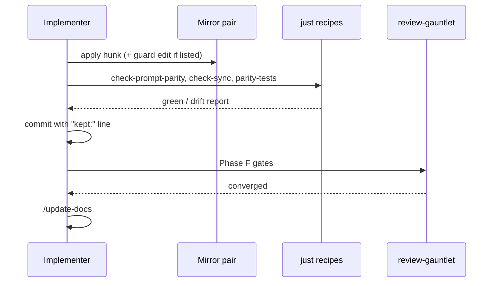

# Task: prompt-audit cleanup, Claude mirror — dated prompting patterns across skein skill prompts + project CLAUDE.md

**Status**: Complete
**Component**: meta
**Assigned to**: unassigned
**Priority**: Low
**Branch**: `chore/prompt-audit-cleanup`
**Created**: 2026-09-03
**Completed**: 2026-09-03
**Review Gates**: full

## Objective

Land the high- and medium-confidence findings of a fresh `/claude-api prompt-audit` over every shipped skein skill prompt (both mirrors) and the project `.claude/CLAUDE.md`, keeping every machine anchor that a parity script or test greps for byte-exact, and hand the global-file findings to the sync-computer repo as a follow-up.

## Context

**Companion plan.** This is the Claude half of a two-file plan. `docs/dev_plans/20260903-docs-prompt-audit-codex.md` is the Codex half and runs first; this plan starts only once every phase there is ticked. The review gauntlet runs once, from this plan.

**Provenance.** An earlier version of this plan was reconstructed from a compacted transcript of a 2026-09-02 audit run and carried 38 findings. On 2026-09-03 the audit was re-run cleanly in four scopes (A: conduct/deep-review/dev-plan/review-plan; B: fan-out/review-gauntlet/release; C: content-draft/content-review/spec-compliance/plan-view/rfc-finder/grill/update-docs; D: the two CLAUDE.md files) with exact before/after text and out-of-band guard greps. The fresh run is the sole finding source here. Old findings not reproduced by the fresh run are dropped: old #4 (conduct `anymore`, line 364 now reads as the `full`-only rule with no migration phrasing) and old #36 (global "Reuse prior reads" bullets, judged working context). Old #38 (project Review Workflow lacks the global's first bullet) is resolved as a decision (AD-6), not a finding.

**Methodology.** The `claude-api` skill's `shared/prompt-audit.md` (bundled with Claude Code; invoke `/claude-api prompt-audit` to load it — the on-disk path is version-specific). Three of its rules govern every hunk below:

1. Context is never cruft. Audience, environment facts, tool contracts and the *reasons* behind a constraint stay even when a grep pattern matches; only the dated wrapper (dates, retired model names, incident IDs, "now"/"the old X" framing) goes.
2. A removal is complete only when everything that references the removed text goes too: a test assertion, a normalizer regex, a doc pointer. A prompt fixed while its guard still greps the old string is a broken build, not a cleanup.
3. Rewrites beat bare deletions wherever the instruction has a live purpose: re-express it in present tense rather than dropping the concern.

**Dominant pattern.** Leaked internal rule IDs (`R1`, `R3`, `R6`, `R7`, `C1`, `C2` — dev-plan review-round labels) and history narratives (dated gate results, incident reports, "before this skill existed"). Baseline `rg -n '\b[RC][0-9]\b' plugins/skein plugins/skein-codex --glob '*.md'` = 29 lines on 2026-09-03.

**Ownership.** `~/.claude/CLAUDE.md` is owned by the sync-computer repo (`AGENTS.md:103`, `:165`) and is not modified here. The project `.claude/CLAUDE.md` is the source of truth for skein workflow rules in this plan.

## Requirements

- Every hunk in the apply set lands in both mirrors where a twin exists: a Codex commit then a Claude commit per mirror pair. The per-pair gate is `tests/parity/test-spawn-tiers.sh` plus parity judged only on the files that pair owns; the mirror-comparing recipes (`just check-prompt-parity`, `just check-sync`) are judged per phase on the files that phase owns (see the Lag window rule) and are asserted whole-plugin only at Phase F.
- Harness ownership (AD-8): Claude implements only Claude-mirror (`plugins/skein/`) and project `.claude/CLAUDE.md` hunks. Every Codex-mirror hunk (`plugins/skein-codex/`), the Codex delegation-idiom set (AD-4), and any change that alters behaviour Codex derives from `AGENTS.md` is handed to Codex via `codex:rescue` for review and implementation; Claude does not apply those hunks itself.
- Every literal a script or test greps for survives byte-exact, or the guard is edited in the same hunk and commit (see the guard map).
- `tests/parity/test-spawn-tiers.sh` is the per-phase gate between a Codex phase and its Claude twin. The full six-recipe set (`just check-prompt-parity`, `just check-sync`, `just parity-tests`, `just gauntlet-tests`, `just lens-tests`, `just plugin-tests`) is required only at Phase F of the Claude plan (equivalently, at the end of the Codex plan's run).
- No flag-only item is applied without a recorded user decision (see the flag-only decisions section of the Claude plan).
- Nothing outside this repo is edited; global-file hunks are handed off verbatim.

## Audit Findings

Legend. **Conf** High/Med. **Guard** = script/test that greps the touched text (`none` = grepped `scripts/`, `tests/`, `justfile`, `plugins/*/skills/*/scripts/`, zero hits). **GENERIC** = inside a `<!-- BEGIN/END GENERIC -->` block (all findings: no; the only blocks are deep-review 591–619, review-plan 116–729, dev-plan 110–170, and no hunk falls inside one). **Mirror** = which mirrors change. After text is verbatim. Before text is verbatim when quoted inline; a paragraph-length Before is identified by line and its opening/closing words and must be re-diffed against live text at the start of the phase that applies it.

### `conduct/SKILL.md` (Claude + Codex)

- **A-F2** Claude :208 — High, rewrite, guard none, Claude only. Before: the sentence `**Pre-implementation audit (Phase 1)**: today's three increments … equivalent return point.` After: `Each of the three call sites invokes the helper only after the failure signature is observable to the conductor, so \`iteration_count\` at the bound-check point reflects the failure that triggered it.` (next sentence, naming `helper-is-single-increment-source-three-sites`, unchanged).
- **L1** Claude :237 — High, rewrite, guard `tests/parity/test-spawn-tiers.sh:295` pins `opus/high:` total = 6 (kept). Before: `<!-- opus/high: it reviews code, so it earns the review tier under the two-tier policy (R1) even though it is only advisory -->` After: `<!-- opus/high: it reviews code, so it earns the review tier under the two-tier policy (AGENTS.md Model/Effort Policy) even though it is only advisory -->`.
- **L2** Codex :41 — High, rewrite, guard `test-spawn-tiers.sh:270` asserts `R3 why: code review is judgment work` → change the assertion to `code review is judgment work, so the advisory reviewer gets the review tier` in the same commit. Before: `… when supported. R3 why: code review is judgment work, so the advisory reviewer gets the review tier.` After: `… when supported. Code review is judgment work, so the advisory reviewer gets the review tier.`
- **A-F8a** Claude :252 `(Phase 4)`, :254 (see A-F13), :267, :279 `(Phase 3)`, :359 `(the Phase 3 marker; …)`, :393 `(Phase 5)`, :434 `Phase 3 bumps Claude-side to \`2\``, :436; Codex :250 (see A-F13), :378 `(Phase 5)` — High, remove the tag, guard none. Two sites are rewrites: Claude :267 Before `The CI-parity gate (Phase 3) introduces a result-file path that releases the lock and re-enters on resume, producing \`lock_acquisitions == 2\` for the production gate flow — but Phase 2 itself does not exercise that path.` After `The CI-parity gate's result-file path releases the lock and re-enters on resume, producing \`lock_acquisitions == 2\` for the production gate flow.`; Claude :436 Before `### Fields introduced for the CI-parity gate (Phase 3, schema_version 2)` After `### Fields introduced for the CI-parity gate (schema_version 2)`. For :434 rewrite `Phases 1-2 (Claude-side) write 1; Phase 3 bumps Claude-side to \`2\`` as `Claude-side writes \`2\`` (re-diff against live text first; the schema_version value is the operative fact). Elsewhere delete the parenthetical only.
- **A-F9** Claude :229 — Med, rewrite, guard none. Before `- **\`test_contract_mismatch\` exception** is unchanged: if the previous implementer report set` After `- **\`test_contract_mismatch\` exception**: if the previous implementer report set`.
- **A-F10a** Claude :363 remove ` Current behavior is byte-unchanged on every plan that does not explicitly opt in.`; Codex :345 remove ` Current behavior is unchanged for every plan that does not explicitly opt in.` — Med, guard none (the `byte-unchanged` hits in `tests/auto-fix/test-review-plan-marker-write.sh` are that test's own text).
- **A-F13** Claude :254 + Codex :250 — Med, rewrite, guard `scripts/check-prompt-parity.sh:120` reads env var `CONDUCT_LAGGING_MIRROR_OK` (name kept). Claude After: `**Pre-commit hook scope.** \`scripts/check-prompt-parity.sh\` is invoked only from \`justfile\` recipes, never from \`.pre-commit-config.yaml\` or any other hook chain, so a boundary commit lands cleanly with hooks enabled even while one mirror's assets lag the other. Contributors invoking \`just check-prompt-parity\` during a lagging-mirror window can pass \`CONDUCT_LAGGING_MIRROR_OK="<skill>/<prompt-file>"\` to get a green exit with a stderr annotation.` Codex After: `Pre-commit hook scope: \`scripts/check-prompt-parity.sh\` is invoked from \`justfile\` recipes only, not from \`.pre-commit-config.yaml\` or the hook chain. Codex mirror work can therefore land while shared prompt-parity assets are handled in their separate boundary. Contributors invoking \`just check-prompt-parity\` during a lagging-mirror window can pass \`CONDUCT_LAGGING_MIRROR_OK="<skill>/<prompt-file>"\` to get a green exit with a stderr annotation.`

### `deep-review/SKILL.md` (Claude + Codex)

- **A-F3** Claude :38 + Codex :377 — High, rewrite, guard none. Before `- **Status enum is now the superset** \`completed | partial | timed_out | errored | skipped\` (absent key = missing),` After `- **Status enum** is \`completed | partial | timed_out | errored | skipped\` (absent key = missing),`.
- **A-F4** Claude :51; Codex :298-300 (and review-plan below) — High, rewrite, guard none. Claude After: `\`collect-lens-results.sh\` also emits \`missing\`, and \`persist-deep-review-state.sh\` persists it verbatim; stated as a complement, any status added to the enum later is covered without editing this rule.` Codex After (two lines): `The collector also emits \`missing\`, and any status added to the enum later` / `is covered without editing this rule — which an enumerated list would not be.` Before in each case is the sentence naming `the old … allowlist` / `under the old … list … never ran.`
- **A-F5** Claude :122 — High, rewrite, guard none. After: `Concurrent-worktree detection happens inline in §1a (single \`git worktree list\` call there) — do not split it across a section boundary, or the informational line is silently dropped when §1a is reordered or skipped.`
- **A-F8b** Claude :37, :173, :635; Codex :117, :287, :376 — High, guard none. Claude :37 After: `- **Disk-first lens results.** Each checkpoint is \`collect-lens-results.sh\` (reads the per-lens attempt files under \`.deep-review/lenses/<run-id>/\`) piped into \`persist-deep-review-state.sh --from-collector\` (derives \`.lenses\` from the collector's shape) — a single derivation path. Never assemble a per-lens object by hand.` :635 `(recovering them is the point of Phase 2's disk-first design)` → `(recovering them is the point of the disk-first design)`. Codex :117 `(Phase 2, disk-first streamed lens results)` → `(disk-first streamed lens results)`. Others: delete ` (Phase 2)`.
- **L3** Claude :79 — High, rewrite, guard none. `per the two-tier policy (\`AGENTS.md\` Model/Effort Policy, R1):` → `per the two-tier policy (\`AGENTS.md\` Model/Effort Policy):`.
- **A-F11 + L4** Claude :433 — Med, rewrite, guard `test-spawn-tiers.sh:295` (`opus/high:` kept). After: `<!-- opus/high: code review is judgment work under the two-tier policy, same tier as the other review lenses; see AGENTS.md Model/Effort Policy -->`.
- **A-F12a** Claude :181 — Med, remove ` The respawn-exactly-once-per-invocation cap is unchanged.`, guard none.
- **Trunk snippet** (`scripts/check-trunk-snippet-parity.sh`) is anchored on `BASE=$(git symbolic-ref …` content, untouched by every hunk above.

### `dev-plan/SKILL.md` (Claude + Codex)

- **A-F6** Claude :230 + Codex :235 — High, rewrite, guard none. `so their cost is unchanged from before this skill grew an Explore step.` → `so they cost nothing beyond the main agent's own turn.`
- **A-F10b** Claude :58 `Absent or \`none\` is a strict no-op — current behavior unchanged.` → `Absent or \`none\` is a strict no-op.`; Claude :62 + Codex :62 `Absent \`**Goal:**\` is a no-op: the phase behaves exactly as it does today.` → `Absent \`**Goal:**\` is a no-op: the phase runs with no design-intent directive injected.` (Codex uses an ASCII hyphen where Claude uses an em dash; match each file's bytes). Med, guard none.
- **L5** Claude :100 — High, rewrite, guard none. `\`AGENTS.md\` Model/Effort Policy R1)` → `\`AGENTS.md\` Model/Effort Policy)`. The `<!-- sonnet/medium: … -->` comment on the same line is untouched.

### `review-plan/SKILL.md` + `rubric.md` (Claude + Codex)

- **A-F1 + L6** Claude :31 — High, rewrite, guard none (`fable/high:` is not in this paragraph). Two edits in one hunk: `(\`AGENTS.md\` Model/Effort Policy, R1)` → `(\`AGENTS.md\` Model/Effort Policy)`; and the three sentences from `The five Fable calls dispatch at` through `without changing the prose here.` → `The five Fable calls dispatch at \`model: fable\` first, with an automatic retry at \`model: opus\` for any single lens or pass whose dispatch errors out on a usage-limit/quota condition. The fallback trigger (below) reacts to the actual quota-error text, not to any assumption about which plan is active, so no plan-detection logic is needed here.` (the existing sentence beginning `The fallback trigger itself (below) is plan-agnostic` is subsumed — delete it; keep `Report which lenses …`).
- **L7** Codex :42 — High, rewrite, guard none. `This matches the R1 review-tier framing now used by deep-review's architecture lens:` → `This matches the review-tier framing of deep-review's architecture lens (\`AGENTS.md\` Model/Effort Policy):`.
- **A-F4** Claude :107 + Codex :114-116 — same Codex-form After as deep-review above.
- **A-F8c** Claude :56, :89 delete ` (Phase 2)`; Claude :612 same rewrite as deep-review :635; Codex :83, :149 delete ` (Phase 2)` — High, guard none.
- **A-F12b** Claude :97 remove ` The respawn-exactly-once-per-invocation cap is unchanged.`; Codex :102 remove the whole line — Med, guard none.
- **A-F7** `rubric.md:85` both mirrors — High, rewrite, guard `scripts/check-prompt-parity.sh:61-88` byte-diffs `rubric.md` across mirrors → same commit, identical bytes. `- Marker write/validate logic is unchanged: hash-above-marker, idempotent rewrite, placeholder validation` → `- Marker write/validate logic holds: hash-above-marker, idempotent rewrite, placeholder validation`.

### `fan-out/{SKILL.md,agent-prompt.md,test-writer-prompt.md}` (Claude + Codex) — see AD-2

- **B-06** Claude SKILL :17 `### R6: clean-context test-writer graft (live on Claude)` → `### Clean-context test-writer graft`; Codex SKILL :17 `### R6: clean-context test-writer graft (intended design, gated)` → `### Clean-context test-writer graft (gated on this harness)`; both `test-writer-prompt.md:1` `# Fan-Out Test-Writer Subagent Prompt Template (R6 contract)` → `# Fan-Out Test-Writer Subagent Prompt Template` — High, guard: line 1 of test-writer-prompt.md is outside every excised span, so byte-parity-checked → same commit both mirrors.
- **B-07** Claude SKILL :21 — High, rewrite, guard none (test :366 asserts `model: sonnet, effort: medium` against agent-prompt.md, not here). Before: the paragraph `**This topology is CONFIRMED LIVE … this manual gate.` After: `The Task tool has **no per-call \`effort\` argument**, so the test-writer's \`model: sonnet\` is set per-call while its \`effort: medium\` is *inherited* from the worker's \`--effort medium\` session. The contract mechanism — a contract-derived test catching a divergent implementation — is guarded in CI by \`plugins/skein/skills/fan-out/tests/run-seeded-divergence.sh\`. The nested-spawn topology itself is checked by \`plugins/skein/skills/fan-out/tests/check-r6-gate.sh\`, a manual skip-permissions gate deliberately kept out of \`just parity-tests\`; re-run it if nested spawning ever appears to stop honoring a per-call model.`
- **B-11** Codex SKILL :21 — High, rewrite, guard `test-spawn-tiers.sh:274` matches `reasoning_effort=medium.*fork_context=false` on line 19, which is untouched. Before: `**This topology is currently GATED, not active.** The Phase-5 live gate … which Test-phase mode is active.` After: `On this harness the separate-subagent topology is not available: a non-interactive \`codex exec\` worker cannot be shown to initialize the app-server client and spawn a nested \`spawn_agent\` test-writer without unsafe bypass flags. The worker therefore keeps a single-context Test phase — it writes and runs its own tests, but tests to the same slice contract — and the anti-cheat rule below applies in full. Full \`/conduct\` per slice remains available opt-in for genuinely multi-phase slices (see below), regardless of which Test-phase mode is active.`
- **L8** Claude SKILL :119 + Codex SKILL :115 `(R6 contract source)` → `(the slice-contract source)`; Codex SKILL :241 `the gated R6 nested test-writer topology` → `the gated nested test-writer topology` — High, guard none.
- **B-08** Claude `agent-prompt.md:67-79` — High, rewrite (not remove; AD-2), guard `scripts/check-prompt-parity.sh:178` excises the block only when it opens `<!--\nR6 status:`. After (the whole block, opener kept):
  ```
  <!--
  R6 status: the separate clean-context test-writer topology is live on the Claude
  harness. A `claude -p --dangerously-skip-permissions` worker (CLAUDECODE unset,
  exactly as fan-out.sh launches it) can spawn a nested Task subagent that honors a
  per-call model; re-check with plugins/skein/skills/fan-out/tests/check-r6-gate.sh.
  Caveat carried into the active directive below: the Task tool has NO per-call effort
  argument, so the test-writer's effort is inherited from this worker's session (which
  fan-out.sh runs at `--effort medium`), while its model IS set per-call.
  -->
  ```
- **L9** Claude `agent-prompt.md:92` `(Nested-spawn topology confirmed on Claude — see the R6 status note above.)` → `(Nested spawning is supported on this harness — see the status note above.)` — High, guard: inside the Phase-2 directive span the normalizer excises, so Claude-only is parity-safe; confirm with `just check-prompt-parity`.
- **B-09** Codex `agent-prompt.md:67-82` — High, rewrite (AD-2), guard `check-prompt-parity.sh:178` opener `INTENDED DESIGN (currently GATED, not active):` and `test-spawn-tiers.sh:276` asserts `reasoning_effort=medium` in this file (only occurrence is inside this block) — both kept. After:
  ```
  <!--
  INTENDED DESIGN (currently GATED, not active): when your slice has an applicable
  test framework, spawn a separate clean-context test-writer subagent with
  `fork_context=false` and request `reasoning_effort=medium` (mechanical test
  authoring against an already-defined contract, not judgment work). The test-writer
  receives ONLY the slice contract — `{{TASK_DESCRIPTION}}` plus the Writer-designated
  Integration Seams rows injected via `{{TECHNICAL_SPECIFICATIONS}}` — and never the
  implementer's diff. That topology needs nested `spawn_agent` support from a
  non-interactive Codex worker, which this harness does not provide. The ACTIVE PATH
  below is single-context authoring: you write and run your own tests, but you author
  them to the same contract a separate test-writer would have used.
  -->
  ```
- **B-10** both `test-writer-prompt.md` status notes — High, rewrite (AD-2), guard `check-prompt-parity.sh:183` sed range from `**Status note (read first):**` to `^Filled by the fan-out worker` (both anchors kept; the latter is also pinned by `test-spawn-tiers.sh:387`), and `test-spawn-tiers.sh:278` asserts `reasoning_effort=medium` in the Codex file (kept). Claude :3-9 After: `**Status note (read first):** on this harness the fan-out worker spawns a separate clean-context test-writer subagent with \`model: sonnet\`; effort is inherited from the worker's \`--effort medium\` session because the Task tool has no per-call effort argument. The test-writer never sees the implementer's diff.` Codex :3-15 After: `**Status note (read first):** on this harness the worker consumes this contract single-context: it authors tests to the contract inside its own Phase 2 (see \`agent-prompt.md\`) rather than spawning a separate subagent, and it follows the anti-cheat rule in \`agent-prompt.md\` Phase 4 as if the two contexts were genuinely separate. The template below is the separate-subagent form, ready to use verbatim where nested \`spawn_agent\` with \`fork_context=false\` and \`reasoning_effort=medium\` is available.` The Codex sentence `Filled by the fan-out worker before spawning the test-writer (once the nested-spawn\ngate is confirmed). …` at :17-19 stays byte-exact (normalizer rewrites it literally).
- **B-20** both `agent-prompt.md:29` — Med, rewrite, guard: byte-parity-checked span plus `tests/parity/test-spawn-tiers.sh:392` pins `do not touch files outside your scope` → same commit. `IMPORTANT: Only modify files relevant to your task. Do not touch files outside your scope.` → `Modify only files relevant to your task; do not touch files outside your scope. Other agents are working in parallel worktrees, and every branch merges back into the same base.`

### `review-gauntlet/SKILL.md` (Claude; Codex only for B-01)

- **B-01** Claude :124 + Codex :130 — High, rewrite, guard `tests/gauntlet/test-gauntlet-skill-shape.sh:418-441` (`assert_r2_forbidden_flags_xor_for` requires each mirror to carry exactly one of the literal `Forbidden flags:` or an `UNVERIFIED` marker plus `budget` plus `(sole|only) defen[cs]e`; this sentence is the only source of that marker in either mirror, so a bare delete fails both assertions). Replace the sentence `**Flag combination: UNVERIFIED.** The 2026-08-23 insights report's … the sole defence against a repeat.` with, byte-identical in both mirrors: `**Flag combination: UNVERIFIED.** The gate has hung for 90+ minutes with no recoverable cause (the available record carries narrative only, never the exact CLI argv); the wall-clock budget above is the sole defence against a repeat.` Per AD-5 the wording is cause-neutral. Keeps the dated narrative out and the XOR guard satisfied without touching the test. Codex has no R7/C1/C2 text; this is its only hunk.
- **B-02** :274 remove the paragraph `These bundled scripts and the convergence-decision helper are built in a later phase … once they exist.` — High, guard none (all scripts exist under `lib/` and `scripts/`).
- **B-03** :240 `This is an accepted prose seam (R7), not a script-enforced contract, now extended from just \`duration_s\` to the full envelope shape including \`gate\` identity.` → `This is an accepted prose seam, not a script-enforced contract: the full envelope shape, \`gate\` identity included, is stamped by hand for gates 2/3.` — High, guard none.
- **B-04** :234 `and R7's accepted prose seam below` → `and in the prose seam noted below` — High.
- **B-05** :97 `(and C1's key-file wiring)` → `, and the key-file wiring,` (full: `this is what makes the status-row block below, and the key-file wiring, reference variables that actually exist, rather than only the gate-1 pair`); :241 `(C1/C2 wiring — the orchestrator, never the fixer, computes keys)` → `(the orchestrator, never the fixer, computes keys)` — High.
- **B-19** :175 `specifically the phase's \`**Goal:**\` field (added by the sibling \`conduct\` phase-goal-field work) when the plan has reached that phase` → `specifically the phase's \`**Goal:**\` field when the plan has reached that phase` — Med.

### `release/SKILL.md` (Claude; Codex line = Claude line + 1)

Guard for all: `scripts/check-prompt-parity.sh:271-296` compares the two files after normalization and pins `RELEASE_*` exact lines (:287-296); none of the hunks below touch a pinned line, but every hunk lands in both mirrors (Codex commit, then Claude commit) before parity is asserted.

- **B-12** :89 — Med, rewrite. Before: `An earlier revision ran a forced tag fetch … both served without it:` (two sentences). After: `A forced tag fetch here would silently move **every** local tag that also exists on origin (not just the target \`vX.Y.Z\`) to match origin's position — an unannounced mutation during a read/preflight phase, one that fires immediately and can destroy an operator's intentional local tag divergence even on a run that then aborts for an unrelated reason (an ambiguous \`gh release view\` failure in Step 3.1, say). No fetch is needed, because the only two things one would serve are both served without it:`
- **B-13** :89 later `— the stronger guarantee the earlier no-pruning rule was reaching for, since a fetch that never runs can neither prune a local-only tag nor force-move a diverged one.` → `— a fetch that never runs can neither prune a local-only tag nor force-move a diverged one.` — Med.
- **B-14** :229 `**do not** run a forced tag fetch here: Step 2's pre-confirmation path no longer fetches local tags: a force-fetch silently overwrites` → `**do not** run a forced tag fetch here, and note that Step 2's pre-confirmation path does not fetch local tags either. A force-fetch silently overwrites` — Med.
- **B-15** :10 `This is the single owner of skein's release-note shape — before this skill existed, … (see \`docs/dev_plans/20260712-feature-release-skill.md\`).` → `This is the single owner of skein's release-note shape: hand-typed \`gh release create --notes "..."\` calls drift into inconsistent shapes across releases, so every release goes through here.` — Med.
- **B-16** :221 remove ` — this is the workflow that manually found skein's own three-shapes drift and its missing \`v0.5.1\` release, folded into the skill instead of repeated by hand.` (sentence ends at `one named version.`) — Med.
- **B-17** :262 `If it is absent, this is a genuine \`missing-tag\`: (Skein's own \`v0.5.1\` before this session's first fix.) Fixable` → `If it is absent, this is a genuine \`missing-tag\`. Fixable` — Med.
- **B-18** :300 `This skill's own canonical format was established … chooses to add a summary:` → `An illustrative release in the canonical shape, shown without a \`## What's New\` paragraph. An ordinary re-sync preserves that absence unless the user explicitly chooses to add a summary:` — Med.

### `spec-compliance` (Claude + Codex)

- **C-F1 + C-F16** Codex SKILL :45 — High, rewrite, guard `test-spawn-tiers.sh:268` asserts `R3 why: normative spec compliance is judgment work` → change to `Mapping normative spec requirements onto code is judgment work` in the same commit; `:219` pins exactly one `reasoning_effort=high` (kept). After: `Use \`spawn_agent\` with the harness-selected model and \`reasoning_effort=high\` to run the following self-contained prompt (fill in \`{{PLACEHOLDERS}}\`). Mapping normative spec requirements onto code is judgment work, not a lookup, so it warrants the high tier. If \`spawn_agent\` is unavailable, run the same prompt contract in the main context.`
- **C-F4** Claude :165-171 + Codex :161-167 remove the `### What NOT to Do` section (heading, blank, five bullets) — Med, guard none; positives survive at `### Report Rules`, :31, :77, :107.
- **C-F6** Claude :154 After `Present the compliance report to the user as-is. Before presenting, verify it against [rubric.md](rubric.md), which covers spec resolution, requirement extraction, per-requirement classification, report structure, and scope discipline.`; Codex :150 After `Before presenting the compliance report to the user, verify it against [rubric.md](rubric.md).`; `rubric.md:3` both mirrors `Gradeable criteria for evaluating a completed compliance report. Doubles as a Managed Agents outcome rubric and a local self-check before presenting the report to the user.` → `Criteria for evaluating a completed compliance report. Use it as a self-check before presenting the report to the user.` — Med, guard `check-prompt-parity.sh:61-88` byte-diffs `rubric.md` → same commit.

### Codex delegation idiom (AD-4) — `content-draft:42,46`, `content-review:46,54`, `rfc-finder:29,33`, `update-docs:27,29`, `spec-compliance:37`, `spec-compliance:45` (landed by C8 with C-F1) (Codex mirror only)

- **C-F16** — Med, rewrite, guard `test-spawn-tiers.sh:233,235,237,239` pin one `reasoning_effort=low` per file (`:219` high for spec-compliance) — every After keeps exactly one. Canonical pair (rfc-finder): `:29` → `These steps involve multiple web lookups against Datatracker and RFC Editor. Delegate them to a subagent to keep the main context lean. If \`spawn_agent\` is unavailable in the current runtime, run the same steps in the main context.`; `:33` → `Use \`spawn_agent\` with the harness-selected model and \`reasoning_effort=low\` to run the following self-contained prompt (fill in \`{{PLACEHOLDERS}}\`). If \`spawn_agent\` is unavailable, run the same prompt contract in the main context.` Apply the same shape to the other files, preserving each file's subject, tool name and effort tier. Description-only for the eight non-canonical sites: write each against live text when the phase applies it.

### `rfc-finder`, `grill`, `plan-view`, `update-docs` (Claude + Codex unless noted)

- **C-F5** rfc-finder :103-108 both mirrors remove `### What NOT to Do` (heading, blank, four bullets) — Med, guard none; positives at :36 (subagent prompt: do not reproduce RFC substance), :60, :68, :74 stay.
- **C-F11** grill :11 both mirrors remove `This skill is inspired by mattpocock/skills' \`grilling\` skill, … not a port.` plus following blank — Med.
- **C-F12** grill Claude :44-46 — Med, rewrite: replace the three-line two-harness choice with `2. Present a fixed three-way choice for that recommendation: \`AskUserQuestion\` with exactly three options — **accept**, **propose an alternative**, **waive**.` Codex :44 already carries only its own branch. Guard none; grill has no wholesale parity.
- **C-F13** grill Claude :75 / Codex :73 → `Below-marker workspace edits (\`## Progress\`, \`## Findings\`) are always fine and never trigger this check; only above-marker contract content is guarded.` — Med.
- **C-F2 + C-F7** plan-view Claude :207-213 / Codex :208-214 remove the `## What's deferred to v2` section (heading, blank, five bullets incl. the struck-through `.plan-view.yml` line, trailing blank) — High for the struck line, Med for the section, guard none.
- **C-F3** plan-view Codex :7 comment: drop ` as of 2026-07-12's skill-invocation-mode audit` and ` as of this writing` (After: `<!-- invocation-mode divergence: this skill is user-invoked-only on the Claude mirror (disable-model-invocation: true). Codex CLI has no equivalent front-matter suppression, so it remains autonomously invocable here — a harness limitation, not an oversight. See docs/dev_plans/20260711-chore-skill-invocation-mode-audit.md. -->`) — High, guard: `RELEASE_CODEX_INVOCATION_DIVERGENCE` pins only the *release* file's comment; plan-view is unguarded.
- **C-F8** plan-view Claude :219 / Codex :220 → `- **\`/update-docs\`** — keeps READMEs/CHANGELOGs in sync with code.` — Med.
- **C-F9** plan-view :66/:67 drop ` (e.g. the rich cross-links added here)`; :140/:141 `and it back-fills rich pages generated before back-links existed.` → `and it adds the breadcrumb to any rich page on disk that lacks one.` — Med.
- **C-F14** plan-view `parser.md:117` both mirrors drop `v1 used a koda-specific \`COMPONENT_PATTERNS\` slug matcher; it was removed before shipping. ` from the parenthetical — Med, guard none (`parser.md` not parity-checked; apply identically anyway).
- **C-F17** plan-view :201/:202 `~51 plans render in well under a second.` → `a whole corpus renders in well under a second.` (joined with `; `); :49/:50 `# inline-only; this dir is empty in v1` → `# inline-only; this dir is currently unused` (keep column alignment) — Med.
- **C-F10** update-docs :150-185 both mirrors remove the `#### Sibling-plan audit — worked example` block through the closing fence of the commit-preamble example — Med, guard: `check-trunk-snippet-parity.sh` extracts :259-263 by content anchor, unaffected.

### Project `.claude/CLAUDE.md` (skein-owned)

Guard for all: `tests/plugin/test-claude-md-hygiene.sh:53-57` asserts the H2 headings `## Testing`, `## Facts vs Inference`, `## Security & Diff Reviews`; no hunk touches a heading.

- **D-F05** :29 `- Run \`/update-docs\`, \`/review\`, \`/security-review\`, and \`/deep-review\` before merging.` → two lines: `- When the skein plugin is available, run \`skein:review-gauntlet\` (or set a dev-plan's **Review Gates:** field) rather than hand-running the gates. Otherwise hand-run \`/code-review\`, \`/security-review\`, and \`/deep-review\` before merging.` / `- Once reviews have converged, run \`/update-docs\` — review-gauntlet does not do this itself, it only chains the review gates.` — High (`/review` resolves nowhere; AD-6).
- **D-F01** :18 — High, rewrite: drop `Reason: two consecutive fixes in one session (2026-07-12, … after the fact.`; insert after `those other call sites depend on` the parenthetical ` (pay special attention to encode/decode, escape/unescape, serialize/deserialize pairs — the reverse side is often built the same naive way and breaks in reverse)`; append `A fix that satisfies the reported line can silently break a second call site on the same mechanism, and the second break surfaces only in a later review round.`
- **D-X** (old #38, AD-6) insert as the first `## Review Workflow` bullet: `- **When a review returns findings, don't patch reactively in the same pass.** Think through each reported issue first — root cause, not just the symptom. Where the fix is more than mechanical, delegate it as a sequence of clean-context subagents — architect, implement, test, verify against the original finding — rather than writing the diff inline. Reason: fixes written inline immediately after reading a finding tend to be shallow patches on the reported symptom; splitting architect/fix/test/verify across subagents forces the root-cause step instead of skipping straight to a diff.` — decision, user may decline.
- **D-F02** :118 remove ` Reason: 2026-08-23 insights report, full suite > 2-minute foreground timeout, had to be re-run in background.` — High.
- **D-F03** :121 remove ` Reason: 2026-08-23 insights report, a PyPI manual-approval gate was wrongly concluded gone from run duration alone; two files had to be corrected.` — High.
- **D-F04** :131 remove ` Stale memories caused real friction (e.g., trusting a 32-day-old roadmap; assuming v0.0.18 was tagged when it wasn't).` — High (line becomes identical to global :154).
- **D-F08** :124 ` Reason: 2026-08-23 insights report, 3 security-review sessions were interrupted mid-exploration before any finding was delivered.` → ` A review held to the end delivers nothing at all if the session is interrupted mid-exploration.` — Med (the reason is kept; only the date and tally go).
- **D-F09** :6 `do not hand-run the old \`git tag\` + \`gh release create\` procedure.` → `do not hand-run \`git tag\` + \`gh release create\`.` — Med.
- **D-F16** :94-101 replace the `**3. Decision rule — inline vs delegate:**` table with the paragraph `**3. Decision rule — inline vs delegate.** Run it inline when the narrowed output is small and I will act on the detail myself. Delegate when the raw output would be large or spread across files and I only need the conclusion. Two carve-outs are not obvious from that rule: verbose-but-single-purpose output (build, test, deploy logs) stays inline behind a filter pipe unless all I want is a verdict, and anything I will re-reference later in the session stays inline, because delegating discards the detail.` — Med, most declinable hunk; take last. The global half is in Follow-ups; until it lands the two files' wording differs while the rule does not.

### Flag only — decide with user (not in the apply set)

- **A-F14** dev-plan :230 says `/review-plan` has four lenses; it has five. Fix if taken: `four` → `five`, `not four` → `not five`.
- **A-F15** conduct `reviewer-prompt.md:57` third statement of "no style nits" (byte-parity file; both mirrors if taken).
- **A-F16** conduct :267 names the `LockAcquisitionCounter` fixture; verify it still exists under `plugins/skein/skills/conduct/tests/` before deciding.
- **B-21** fan-out `agent-prompt.md:50` `You MUST complete all phases before finishing.` — rigidity is the intent for an unattended worker; probe before softening.
- **B-22** review-gauntlet :29 `there is no single-pass mode anymore` — interacts with the stale-`quick` warning at :243.
- **B-23** review-gauntlet :272 `pre-Phase-3` is a named schema shape in `tests/gauntlet/test-convergence-ledger.sh` (8 assertions); rename both surfaces or neither.
- **B-24** Codex release :7 `as of this writing` is pinned byte-exact by `RELEASE_CODEX_INVOCATION_DIVERGENCE` (`check-prompt-parity.sh:287`, `test-prompt-parity-extended.sh:158`); leave unless the constant is being edited anyway.
- **C-F15** Codex plan-view :22 invocation path `.claude/skills/plan-view/generate.py` should probably be `.codex/skills/…`; confirm the Codex install path before editing.
- **C-F18** `description:` trigger-clause drift in content-draft/content-review (Codex omits `Use when the user says "/…"`); needs a fact about Codex slash routing.
- **C-F19** rfc-finder :124-161 worked examples carry memorized RFC facts the file forbids relying on.
- **C-F20** plan-view :220/:221 references `/playground`, a skill outside this plugin.
- **C-F21** plan-view :70/:71 duplicate "inspired by" attribution.
- **C-F22** update-docs :115-128 deterministic slug matching could move to `scripts/plan-scope-detect.sh` (code change, not a prompt edit).
- **C-F23** content-draft :101, :149, :167 examined; no action (working recap, publishing convention).

## Implementation Checklist

Runtime: Claude-driven `/conduct` only. Prerequisite: every phase in `docs/dev_plans/20260903-docs-prompt-audit-codex.md` is ticked, so the Codex half of each mirror pair has landed. The `L` phases align to the text Codex actually landed, not to the proposed After if they differ. Branch creation is not a phase — `chore/prompt-audit-cleanup` already exists.

**Run order.** (a) Codex-driven `/conduct docs/dev_plans/20260903-docs-prompt-audit-codex.md` lands Phase 0 and C1…C10 there. (b) Claude-driven `/conduct docs/dev_plans/20260903-docs-prompt-audit-claude.md` then walks L1…L10 and F here. (c) Do not start this plan until the codex plan's `## Progress` is fully ticked.

**Lag window.** Between a Codex phase and its Claude twin the mirrors diverge on purpose, so `just check-prompt-parity` is red: the rubric byte-diff (`check-prompt-parity.sh:61-88`) and the fan-out prompt normalizer span comparison (`:173-184`) both fail while only one half has landed. The codex plan therefore runs `bash tests/parity/test-spawn-tiers.sh` alone. Each Phase L1–L10 Test command below still runs the full parity recipe set, but inside the lag window a phase passes when those recipes are green on the files that phase owns, with any remaining red confined to twins not yet landed; the whole-plugin green assertion is Phase F, not each L phase. The mirror-comparing recipes go green once the last twin that touches a rubric byte-diff or a fan-out normaliser span lands — which can land before the final L phase (see Findings for when it happened on this run). Each mirror pair is two boundary commits, Codex then Claude; the per-pair gate is `tests/parity/test-spawn-tiers.sh` plus parity judged only on the files that pair owns.
### Phase L1: Claude conduct
**Impl files:** plugins/skein/skills/conduct/SKILL.md
**Test command:** `just check-prompt-parity && just check-sync && just parity-tests`
**Goal:** Runtime: claude. Align to the text Codex landed in codex plan phase C1, not to the proposed After if they differ. Hunks: A-F2, L1, A-F8a Claude sites, A-F9, A-F10a Claude, A-F13 Claude.

### Phase L2: Claude deep-review
**Impl files:** plugins/skein/skills/deep-review/SKILL.md
**Test command:** `just check-prompt-parity && just check-sync && just parity-tests`
**Goal:** Runtime: claude. Align to the text Codex landed in codex plan phase C2, not to the proposed After if they differ. Hunks: A-F3, A-F4, A-F5, A-F8b, L3, A-F11 + L4, A-F12a.

### Phase L3: Claude dev-plan
**Impl files:** plugins/skein/skills/dev-plan/SKILL.md
**Test command:** `just check-prompt-parity && just check-sync && just parity-tests`
**Goal:** Runtime: claude. Align to the text Codex landed in codex plan phase C3, not to the proposed After if they differ. Hunks: A-F6, L5, A-F10b.

### Phase L4: Claude review-plan
**Impl files:** plugins/skein/skills/review-plan/SKILL.md, plugins/skein/skills/review-plan/rubric.md
**Test command:** `just check-prompt-parity && just check-sync && just parity-tests`
**Goal:** Runtime: claude. Align to the text Codex landed in codex plan phase C4, not to the proposed After if they differ. Hunks: A-F1 + L6, A-F4, A-F8c, A-F12b, A-F7 (`rubric.md` Claude half — this phase restores `rubric.md` byte parity).

### Phase L5: Claude fan-out
**Impl files:** plugins/skein/skills/fan-out/SKILL.md, plugins/skein/skills/fan-out/agent-prompt.md, plugins/skein/skills/fan-out/test-writer-prompt.md
**Test command:** `just check-prompt-parity && just check-sync && just parity-tests`
**Goal:** Runtime: claude. Align to the text Codex landed in codex plan phase C5, not to the proposed After if they differ. Hunks: B-06 Claude, B-07, L8 Claude, B-08, L9, B-10 Claude, B-20 Claude — this phase restores normalizer and byte parity for the fan-out prompts.

### Phase L6: Claude review-gauntlet
**Impl files:** plugins/skein/skills/review-gauntlet/SKILL.md
**Test command:** `just check-prompt-parity && just check-sync && just parity-tests && just gauntlet-tests`
**Goal:** Runtime: claude. Align to the text Codex landed in codex plan phase C6, not to the proposed After if they differ. Hunks: B-01 Claude half, B-02, B-03, B-04, B-05, B-19.

### Phase L7: Claude release
**Impl files:** plugins/skein/skills/release/SKILL.md
**Test command:** `just check-prompt-parity && just check-sync && just parity-tests`
**Goal:** Runtime: claude. Align to the text Codex landed in codex plan phase C7, not to the proposed After if they differ. Hunks: B-12, B-13, B-14, B-15, B-16, B-17, B-18.

### Phase L8: Claude spec-compliance
**Impl files:** plugins/skein/skills/spec-compliance/SKILL.md, plugins/skein/skills/spec-compliance/rubric.md
**Test command:** `just check-prompt-parity && just check-sync && just parity-tests`
**Goal:** Runtime: claude. Align to the text Codex landed in codex plan phase C8, not to the proposed After if they differ. Hunks: C-F4 Claude, C-F6 Claude and `rubric.md` Claude half — this phase restores `rubric.md` byte parity.

### Phase L9: Claude misc skills
**Impl files:** plugins/skein/skills/rfc-finder/SKILL.md, plugins/skein/skills/grill/SKILL.md, plugins/skein/skills/plan-view/SKILL.md, plugins/skein/skills/plan-view/parser.md, plugins/skein/skills/update-docs/SKILL.md
**Test command:** `just check-prompt-parity && just check-sync && just parity-tests`
**Goal:** Runtime: claude. Align to the text Codex landed in codex plan phase C10, not to the proposed After if they differ. Hunks: C-F5, C-F11, C-F12, C-F13 Claude, C-F2 + C-F7, C-F8, C-F9, C-F14, C-F17, C-F10.

### Phase L10: Claude project CLAUDE.md
**Impl files:** .claude/CLAUDE.md
**Test command:** `just check-prompt-parity && just check-sync && just parity-tests && just plugin-tests`
**Goal:** Runtime: claude. This file has no Codex twin, so there is nothing to align to. Hunks: D-F05, D-F01, D-X, D-F02, D-F03, D-F04, D-F08, D-F09, D-F16. No `~/.claude/CLAUDE.md` edit may appear in the diff.

### Phase F: Final gates
**Impl files:** none
**Test files:** none
**Test command:** `just check-prompt-parity && just check-sync && just parity-tests && just gauntlet-tests && just lens-tests && just plugin-tests`
**Goal:** Run the ID sweep from Testing Notes (expected residue 7, all on the allowlist) and the phase-tag check (zero hits), then dry-run `/review-gauntlet --plan <this plan>` and `/fan-out` on a scratch plan. `skein:review-gauntlet` then auto-chains from the `**Review Gates**: full` header and all findings are fixed; `/update-docs` runs after it converges, per AD-7 and the rule D-F05 installs.

### Flag-only decisions (manual, with the user)

Not a `/conduct` phase. Walk the flag list under "Flag only — decide with user" with the user and record accept/decline per item in `## Findings`. Accepted items are applied per AD-1 (guard edit in the same commit) and AD-8 (Codex-side flags go to Codex), as extra phases appended to this checklist and to `## Progress` before the run that lands them.

### Phase R: R6 apparatus removal
**Impl files:** plugins/skein/skills/fan-out/agent-prompt.md, plugins/skein/skills/fan-out/test-writer-prompt.md, plugins/skein-codex/skills/fan-out/agent-prompt.md, plugins/skein-codex/skills/fan-out/test-writer-prompt.md, scripts/check-prompt-parity.sh
**Test files:** tests/parity/test-spawn-tiers.sh
**Test command:** `just check-prompt-parity && just check-sync && just parity-tests`
**Goal:** Runtime: Codex authors the Codex mirror, the normaliser and the test via codex:rescue; Claude aligns its mirror; one commit. Delete both agent-prompt.md comment blocks (`R6 status:` / `INTENDED DESIGN`) and both test-writer-prompt.md status notes; the Codex `Filled by the fan-out worker …` sentence takes the Claude wording; the Codex test-framework directive carries the single-context fact in prose. In `check-prompt-parity.sh` drop the perl comment-block alternation, the Filled-sentence substitution and the Status-note sed range, leaving the test-framework and anti-cheat excisions; rewrite the header comment without rule IDs, dates or gate narrative. In `test-spawn-tiers.sh` drop the `reasoning_effort=medium` pins on the two Codex prompt files (the SKILL.md pin stays) and rename R6-labelled assertions descriptively. Anchors kept: `Filled by the fan-out worker` (:387) and `### Phase 5`. The fan-out tests directory (seeded-divergence fixtures, gate probe scripts) and CODEX_MIRROR_BACKLOG.md history are out of scope.

## Technical Specifications

### Files to Modify

- `plugins/skein/skills/{conduct,deep-review,dev-plan,review-plan,fan-out,review-gauntlet,release,spec-compliance,rfc-finder,grill,plan-view,update-docs}/SKILL.md` — the Claude halves of the hunks above.
- `plugins/skein/skills/fan-out/agent-prompt.md`, `…/fan-out/test-writer-prompt.md` — B-08, B-10, B-20, L9.
- `plugins/skein/skills/review-plan/rubric.md` — A-F7. `plugins/skein/skills/spec-compliance/rubric.md` — C-F6. `plugins/skein/skills/plan-view/parser.md` — C-F14.
- `.claude/CLAUDE.md` — D-F01, D-F02, D-F03, D-F04, D-F05, D-F08, D-F09, D-F16, D-X.
- Phase R (both mirrors, Codex-authored halves): `plugins/skein-codex/skills/fan-out/agent-prompt.md`, `…/test-writer-prompt.md`, `scripts/check-prompt-parity.sh`, `tests/parity/test-spawn-tiers.sh`, plus the Claude twins above.
- Not modified here (Phases L1–L10, F): everything under `plugins/skein-codex/` and `tests/parity/test-spawn-tiers.sh` (the codex plan owns both, AD-8; the review gauntlet added one write-containment guardrail pin there via Codex, commit a8a09f7, review-gauntlet round 1), `AGENTS.md`, `~/.claude/CLAUDE.md` (see Follow-ups), `scripts/check-sync.sh`, `scripts/check-trunk-snippet-parity.sh`, `tests/plugin/test-claude-md-hygiene.sh`.

### New Files to Create

- none

### Architecture Decisions

- **AD-1 Machine anchors are kept verbatim by default.** Where a finding's clean fix would change a string a script or test greps for, the guard edit (script/test file and line) is part of the same hunk and commit, and that file is in Files to Modify. No guard edit is left implied. Old invariant = new invariant for every anchor not listed as edited.
- **AD-2 R6 apparatus: rewrite prose, keep anchors.** The audit calls the whole apparatus a fossil. This pass removes the dates (`2026-07-04`), the retired model name (`claude-haiku-4-5`), and the CONFIRMED/GATED narratives, but keeps byte-exact: the openers `R6 status:` and `INTENDED DESIGN (currently GATED, not active):` (normalizer alternation at `check-prompt-parity.sh:178`), `**Status note (read first):**` and `Filled by the fan-out worker` (sed range :183 and `test-spawn-tiers.sh:387`), `reasoning_effort=medium` in the two Codex prompt files (`:276`, `:278`), the Codex `Filled by the fan-out worker before spawning the test-writer (once the nested-spawn\ngate is confirmed).` sentence (literal substitution at :178), and `### Phase 5` / the two `If … test framework` anchors (:381-386). Two-sided invariant: old = the Claude block is excised because its first line matches `R6 status:` and the Codex block because it matches `INTENDED DESIGN (…)`; new = the same, because both openers are unchanged. Full removal is the deferred R6 apparatus removal, off by default. **Superseded by Phase R** (after the gauntlet decisions): the openers, both status notes, the Codex `(once the nested-spawn gate is confirmed)` sentence and the two Codex prompt-file `reasoning_effort=medium` pins are removed together with their normaliser and test guards; the anchors that remain are `^If your task has an applicable test framework`, `^If no relevant test framework exists`, `^### Phase 5` and the `^Filled by the fan-out worker` opener.
- **AD-3 Uniform fix shape for ID leaks.** State the rule content in prose in the same sentence and drop the bare ID. `AGENTS.md` Model/Effort Policy is a live section and stays as the pointer; `R1`/`R3` do not appear in that section, so the suffix is an undefined ID and goes. Never add an HTML why-comment to a Codex SKILL.md (the Codex idiom is inline prose); where `test-spawn-tiers.sh` pins an `R3 why:` string, its assertion moves to the new prose in the same commit. This overrides audit-A's "keep R1/R3" non-finding.
- **AD-4 The Codex delegation clause is an operative Codex-only gate, kept as an intended divergence.** The C9 rewrite of the ten sites (`spec-compliance:45` in C8, nine in C9) turned the old "if delegation is available and explicitly allowed" hedge into a rule: delegate only at top level or under an orchestrator's explicit authorisation, never spawn a nested worker, fall back to the main context when `spawn_agent` is unavailable. The Claude mirror carries no twin on purpose: Claude subagents have no Agent tool, conduct's implementer prompt forbids nested spawns and deep-review states one level of delegation, so the invariant is enforced by the harness rather than restated per skill. The five sites (content-draft:42, content-review:46, rfc-finder:29, spec-compliance:37, update-docs:27) are harness-divergent by decision, not drift (decided after gauntlet round 6; see Findings). Effort-annotation counts per file are preserved.
- **AD-5 Cause-neutral wording where the cause is unknown.** The review-gauntlet hang paragraph is removed rather than restated with a cause; if any restatement is wanted it says the gate has hung with no recoverable cause and the wall-clock budget is the sole defence. No flag combination is asserted anywhere.
- **AD-6 Project CLAUDE.md aligns to the global file's workflow wording.** Line 29 is replaced by the global's review-gauntlet + `/update-docs`-after-convergence bullets (D-F05), and the global's first Review Workflow bullet is added to the project file in its de-hedged form (D-X). The project file remains the source of truth for skein-specific rules (the `skein:release` bullet stays). The user may override D-X.
- **AD-7 `/update-docs` runs after the review gates converge**, matching the rule D-F05 installs.
- **AD-8 Harness ownership split.** `AGENTS.md` and the Codex mirror are Codex/ChatGPT's surface; Claude must not change material behaviour of the other harness. Per mirror pair: (1) Claude hands Codex the Codex-side hunk list (before/after text, guard hits, the AD-1 anchor rule) via `codex:rescue` with a review-and-implement mandate — Codex may modify or decline a hunk, and its decision is recorded in `## Findings`; (2) a second fresh-thread `codex:rescue` call self-reviews what Codex landed; (3) Claude applies the Claude-mirror twin aligned to the text Codex actually landed (not to the plan's proposed text if they differ); (4) each half is its own boundary commit — the Codex commit from its `/conduct` phase, then the Claude commit from the twin phase — and the mirror-comparing gates are judged per the Lag window rule above: green on the files each phase owns, with whole-plugin green asserted only at Phase F. Guards that pin Codex strings (`tests/parity/test-spawn-tiers.sh:268`, `:270`; the two prompt-file `reasoning_effort=medium` pins at `:276`, `:278` existed until Phase R deleted them) are updated by Codex in step (1), in the same working-tree change. Findings with no Claude twin (L7, C-F16 Codex-only sites, B-01 Codex half wording) are Codex-only tasks. The R6 apparatus removal (Phase R) touched Codex prompt files and the normalizer that reads them, so it was Codex-led end to end.

### Dependencies

- `just`, `rg`, `bash` ≥ 4 for the parity tests; the fan-out normaliser is `sed`-only since Phase R. No new dependencies.

### Integration Seams

| Seam | Writer (task) | Caller (task) | Contract |
|------|---------------|---------------|----------|
| fan-out prompt normalizer | fan-out hunks (B-08, B-09, B-10, L9, B-20) | `scripts/check-prompt-parity.sh:173-184` via `just check-prompt-parity` | Openers, sed anchors and the Codex `Filled by …` sentence byte-exact; non-excised spans identical across mirrors |
| spawn-tier census | L1, L2, A-F11, C-F1, C-F16, B-09, B-10, B-11 | `tests/parity/test-spawn-tiers.sh` via `just parity-tests` | `opus/high:` total 6; `fable/high:` total 5; one `reasoning_effort=*` per Codex file; `:268`/`:270` strings updated with the prose |
| rubric / prompt byte parity | A-F7, C-F6, B-06 (test-writer-prompt :1), B-20, A-F15 if taken | `check-prompt-parity.sh:61-120` | identical bytes in both mirrors, same commit |
| release normalized parity | B-12–B-18 | `check-prompt-parity.sh:271-296` | `RELEASE_*` pinned lines untouched; both mirrors edited together |
| CLAUDE.md hygiene | D-* hunks | `tests/plugin/test-claude-md-hygiene.sh:53-57` | H2 headings `## Testing`, `## Facts vs Inference`, `## Security & Diff Reviews` present |
| trunk-snippet parity | A-F* deep-review, C-F10 update-docs | `scripts/check-trunk-snippet-parity.sh` | `BASE=$(git symbolic-ref …` five-line block unchanged |
| sync check | every mirror pair | `scripts/check-sync.sh` via `just check-sync` | mirror trees agree on the files it compares |

## Architecture & Call Flow

Guard map — for every file touched, which script/test reads it and which literal it depends on.

| File | Guard | Literal / rule depended on | Status after this plan |
|---|---|---|---|
| `fan-out/agent-prompt.md` (both) | `test-spawn-tiers.sh` Phase-2/anti-cheat anchor and pin assertions | `^If your task has an applicable test framework`, `^If no relevant test framework exists`, `^### Phase 5`; `model: sonnet, effort: medium` (Claude); `contract wins`; `do not touch files outside your scope` (B-20). Removed in Phase R: `R6 status:` / `INTENDED DESIGN` openers and the Codex prompt-file `reasoning_effort=medium` pin | kept through Phase F; Phase R removed the openers with their guards |
| `fan-out/test-writer-prompt.md` (both) | `test-spawn-tiers.sh` `^Filled by the fan-out worker` assertion | `^Filled by the fan-out worker` opener; whole file byte-identical across mirrors. Removed in Phase R: `**Status note (read first):**`, the Codex `(once the nested-spawn gate is confirmed)` sentence and its `reasoning_effort=medium` pin | kept through Phase F; Phase R removed the status notes with their guards |
| `fan-out/SKILL.md` (Codex) | `test-spawn-tiers.sh:274,280` | `reasoning_effort=medium.*fork_context=false` (line 19), `Codex does not pin model names` | kept (line 19 untouched) |
| `conduct/SKILL.md` (Claude) | `test-spawn-tiers.sh:295` | `opus/high:` count contributes 1 | kept |
| `conduct/SKILL.md` (Codex) | `test-spawn-tiers.sh:270` | `R3 why: code review is judgment work` | **assertion rewritten** (L2) |
| `deep-review/SKILL.md` (Claude) | `test-spawn-tiers.sh:295,323`; `check-trunk-snippet-parity.sh` | `opus/high:` ×4, `effort: high` ×4, trunk snippet | kept |
| `spec-compliance/SKILL.md` (Codex) | `test-spawn-tiers.sh:219,268` | one `reasoning_effort=high`; `R3 why: normative spec compliance is judgment work` | count kept; **assertion rewritten** (C-F1) |
| `{content-draft,content-review,rfc-finder,update-docs}/SKILL.md` (Codex) | `test-spawn-tiers.sh:233-239` | one `reasoning_effort=low` each | kept |
| `review-plan/rubric.md`, `spec-compliance/rubric.md` | `check-prompt-parity.sh:61-88` | byte-identical across mirrors | kept (same commit) |
| `release/SKILL.md` (both) | `check-prompt-parity.sh:271-296`; `test-prompt-parity-extended.sh:158` | `RELEASE_*` exact lines incl. the Codex invocation-divergence comment | kept (B-24 not applied) |
| `update-docs/SKILL.md` (both) | `check-trunk-snippet-parity.sh` | `BASE=$(git symbolic-ref …` block | kept |
| `.claude/CLAUDE.md` | `test-claude-md-hygiene.sh:53-57` | three H2 headings | kept |
| `review-gauntlet/SKILL.md` (both) | `tests/gauntlet/test-gauntlet-skill-shape.sh:418-441` via `just gauntlet-tests` | XOR: `Forbidden flags:` or UNVERIFIED+budget+sole-defence marker (B-01 keeps the marker) | kept |
| `dev-plan`, `grill`, `plan-view`, `parser.md` | none found | — | — |





| Step | Trigger | Enters context | Cleared/persisted | Turn boundary |
|------|---------|----------------|-------------------|---------------|
| 1 | per-phase re-verify | live file text at cited lines | notes persist under `## Findings` | per file |
| 2 | C/L phase hunk | before/after text, guard line | commit | per mirror pair |
| 3 | Phase F gates | recipe output, sweep residue | `## Findings` baseline vs final | end of plan |

## Testing Notes

### Test Approach

- [x] `just check-prompt-parity` — after every Claude-twin commit and in Phase F.
- [x] `just check-sync` — same cadence.
- [x] `just parity-tests` — same cadence (runs `test-spawn-tiers.sh` and `test-prompt-parity-extended.sh`, the only path to the pinned-string assertions).
- [x] `just gauntlet-tests` — after every review-gauntlet commit and in Phase F (runs `tests/gauntlet/test-gauntlet-skill-shape.sh`, the only path to the B-01 XOR guard).
- [x] `just lens-tests` — Phase 0 (Codex plan) and Phase F.
- [x] `just plugin-tests` — Phase 0 (Codex plan) and Phase F.
- [x] ID sweep: `rg -n '\b[RC][0-9]\b' plugins/skein plugins/skein-codex --glob '*.md'`. Baseline 29. Allowlist after all C and L phases: `plugins/skein/skills/fan-out/agent-prompt.md` `R6 status:` opener (1 line); `plugins/{skein,skein-codex}/skills/fan-out/tests/seeded-divergence/fixture-plan.md` (4 lines, test fixture docs, out of scope); `plugins/{skein,skein-codex}/skills/release/SKILL.md` `C0/DEL` (2 lines). Expected residue: 7 lines, all on the allowlist (6 after Phase R removes the `R6 status:` opener).
- [x] Phase-tag check: each string listed in A-F8a/b/c and B-11 returns zero hits (`rg -n '\(Phase [0-9]\)|Phase 2.s disk-first|Phase-5 live gate|Phase 3 impl commit|Phase 3 Codex mirror' plugins/*/skills/{conduct,deep-review,review-plan,fan-out} --glob '*.md'`); `### Phase N` user-plan references in conduct and the fan-out `### Phase 5` anchor are legitimate and stay.
- [x] Fan-out and review-gauntlet exercised after their commits: `/fan-out` checked structurally against a scratch plan (the rewritten comment block in the written worker prompt stays intact), and `skein:review-gauntlet` checked via the live Phase F auto-chain run (status-row table renders) in place of a separate scratch dry run.

### Test Results

- [x] Phase 0 baseline green, residue 29 recorded.
- [x] Phase F all recipes green, residue 7 recorded.
- [x] Dry runs complete (fan-out worker prompt checked structurally; review-gauntlet dry run replaced by the real auto-chain run — see Findings).

### Edge Cases Tested

- [x] A hunk applied to one mirror only fails `check-prompt-parity` (rubric, test-writer-prompt :1, agent-prompt :29) — verified after the gauntlet by appending a line to the Claude review-plan rubric.md (drift reported, recipe failed) and reverting.
- [x] Dropping an excision anchor fails `test-spawn-tiers.sh:381-388` — verified the same way: altering `Filled by the fan-out worker` in the Claude test-writer-prompt.md fails the anchor assertion (116/117) and check-prompt-parity; renaming the `R6 status:` opener in agent-prompt.md is caught by check-prompt-parity's normaliser (spawn-tiers stays green, the opener is not a spawn-tiers pin).

## Acceptance Criteria

- Every apply-set hunk is applied in both mirrors where a twin exists: Codex commit first, then the Claude commit. The per-pair gate (`tests/parity/test-spawn-tiers.sh` plus parity judged only on the files that pair owns) passes after each Claude commit, per the Lag window rule; the mirror-comparing recipes are asserted whole-plugin only at Phase F.
- `tests/parity/test-spawn-tiers.sh:268` and `:270` assert the new prose and pass; no other pinned string or count changed except the write-containment guardrail pin added during review and, later, Phase R removing the two Codex fan-out prompt-file `reasoning_effort=medium` pins (the `SKILL.md` pin stays; see the Codex plan's Progress).
- `just check-prompt-parity`, `just check-sync`, `just parity-tests`, `just gauntlet-tests`, `just lens-tests`, and `just plugin-tests` exit 0 on the final commit.
- ID sweep residue equals the allowlist exactly (7 lines at Phase F; 6 after Phase R).
- Phase-tag check returns zero hits for the listed strings.
- Each commit body carries one "kept:" line per hunk naming where the operative clause survives, e.g. A-F2 kept: helper-after-failure invariant in the rewritten sentence plus the named assertion; A-F4 kept: complement rule in the same bullet; A-F13 kept: `CONDUCT_LAGGING_MIRROR_OK` mechanism in the same paragraph; B-01 kept: wall-clock budget rule two sentences earlier; B-07 kept: effort-inheritance caveat and both gate-script paths in the rewrite; B-08/B-09/B-10 kept: openers and effort/model facts in the rewritten blocks; B-12 kept: no-fetch rule and its consequence in present tense; C-F4/C-F5 kept: each prohibition's positive statement at the cited lines; C-F16 kept: the delegate/fallback branch pair in every rewritten sentence; D-F01 kept: blast-radius sweep rule plus its mechanism sentence; D-F08 kept: the streaming reason; D-F16 kept: both carve-outs in the paragraph.
- No `~/.claude/CLAUDE.md` change is in the diff.
- `/review-gauntlet` and `/fan-out` dry runs complete without a parity or anchor error.
- `skein:review-gauntlet` run to a terminal decision with every actionable finding fixed and every non-fixed finding quarantined with a recorded reason; `/update-docs` run afterwards. (Run 1, six rounds, ended non-converge on re-reports of items awaiting a user decision; those decisions are recorded above. Run 2, after Phase R, is recorded under Findings and its terminal decision in the Summary.)

## Follow-ups outside this repo

Route to the sync-computer repo (owner of `~/.claude/CLAUDE.md`); apply there, then `./scripts/sync.sh collect claude`. Line numbers are as of 2026-09-03. None of these hunks touch a heading asserted by `test-claude-md-hygiene.sh` when `GLOBAL_CLAUDE_MD` is set.

- **D-F05 (global half)** :37 drop `/review` from the hand-run gate list (`/code-review`, `/security-review`, `/deep-review`); no such command resolves, same as the project-file hunk.
- **D-F06** :158 remove ` Reason: 2026-08-23 insights report, full suite > 2-minute foreground timeout, had to be re-run in background.`
- **D-F07** :161 remove ` Reason: 2026-08-23 insights report, a PyPI manual-approval gate was wrongly concluded gone from run duration alone; two files had to be corrected.`
- **D-F08 (global half)** :164 same rewrite as the project D-F08.
- **D-F10** :40 `- Update PR description to reflect final state of the work. **Do this yourself with \`gh pr edit\` — the PR description is in your mandate, not off-limits. Don't wait for me to update it or ask permission.**` → `- Update the PR description to reflect the final state of the work. **Do it yourself with \`gh pr edit\` — the PR description is in your mandate.**`
- **D-F11** :4 `- Be terse. No preamble, no filler ("Great question!", "Let me know if..."), no restating the task.` → `- Be terse. No preamble, no filler, no restating the task.`
- **D-F12** :8 `- After finishing a task, state what changed in one line — don't recap the approach taken to get there.` → `- After finishing a task, say what changed rather than recapping how you got there. Length follows the change: one line for a one-line edit, a short list for a multi-file one.`
- **D-F13** :142-143 remove the blank line and `  Don't run Opus/Fable on work Haiku or Sonnet handles well.` (the tier table above carries the rule).
- **D-F14** :146 `Skills like Skein's \`conduct\` / \`deep-review\` / \`fan-out\` / \`review-plan\` engineer their per-lens/per-phase tiers on purpose;` → `A skill that sets per-lens or per-phase tiers engineered them on purpose;`.
- **D-F15** :24 rewrite the Review Workflow bullet to the D-X wording above (scopes the four-subagent pipeline to non-mechanical fixes; keeps the `Reason:` trailer). Declinable; if declined, also decline D-X here so the two files agree.
- **D-F16 (global half)** :111-118 same table → paragraph rewrite as the project D-F16. Apply both halves or neither.
- Flags: **D-F17** :62 `refines, not contradicts` (keep; it reconciles two rules), **D-F18** :9 `/skein:grill` name pin (keep; single live pointer), **D-F19** fourteen byte-identical sections load twice per session (no action; working redundancy).

## Review Gates

`skein:review-gauntlet`

<!-- reviewed: 2026-09-04 @ 9acef4c68a9c9d5edae09aadc5f82022e0ca33ec -->

<!-- /review-plan writes the marker line above. Everything below is the workspace: edits here do NOT invalidate the marker. -->

## Progress

- [x] Phase L1: Claude conduct
- [x] Phase L2: Claude deep-review
- [x] Phase L3: Claude dev-plan
- [x] Phase L4: Claude review-plan
- [x] Phase L5: Claude fan-out
- [x] Phase L6: Claude review-gauntlet
- [x] Phase L7: Claude release
- [x] Phase L8: Claude spec-compliance
- [x] Phase L9: Claude misc skills
- [x] Phase L10: Claude project CLAUDE.md
- [x] Phase F: Final gates
- [x] Phase R: R6 apparatus removal

## Findings

- **Run (2026-09-03):** Claude-driven `/conduct`, phases L1–L10 + F, one boundary commit per phase (cf268f2, 808338c, 9478eec, 91cc04d, 78a40a7, a8820dc, 3e9c5e5, d02e008, 22090da, 11faf8c). Each commit body carries the per-hunk `kept:` ledger. Test-writer subagents were skipped: every phase is prose-only with existing script/test guards and no `Test files:` slot.
- **Alignment to Codex text:** every mirror pair aligned to the Codex mirror at HEAD. Divergences from the plan's proposed After: review-plan A-F4 took the Codex-form sentence (the plan cites "same Codex-form After as deep-review"); release B-12/B-13 landed as one combined paragraph, matching Codex's single hunk; fan-out SKILL.md also dropped a stray `2026-07-04` on the Codex-mirror asymmetry line adjacent to B-07; B-20 restored the prohibition clause dropped from the plan's proposed After (review gauntlet round 1, commit a8a09f7), and `tests/parity/test-spawn-tiers.sh` now pins that clause; D-F16's proposed After for `.claude/CLAUDE.md:96` is superseded by round 4's restored inline cutoff "(under about 30 lines)" (commit 247fc7a); A-F8a's proposed After for conduct:434 is superseded by round 4's conditional wording — schema_version writes 1 until any `ci_parity_*` field is set, then 2 (commit 247fc7a, matching conductor.py). Intended divergence by user decision: the Codex delegation clause (C-F16 sites content-draft:42, content-review:46, rfc-finder:29, spec-compliance:37, update-docs:27) has no Claude twin; the harness enforces the same one-level-of-delegation invariant, so the clause is Codex-only (see the Codex plan's AD-4).
- **Phase R (after the round-6 decisions):** both agent-prompt.md comment blocks and both test-writer-prompt.md status notes removed; the Codex Phase 2 directive states the single-context fact in prose; `check-prompt-parity.sh` keeps only the test-framework and anti-cheat excisions and its header names no rule IDs or dates; `test-spawn-tiers.sh` drops the two Codex prompt-file `reasoning_effort=medium` pins (SKILL.md pin stays) and labels the remaining assertions descriptively (115 tests). Codex authored its mirror, the normaliser and the test via codex:rescue; Claude aligned its mirror. Out of scope: fan-out tests fixtures, gate probe scripts, CODEX_MIRROR_BACKLOG.md history.
- **Review-gauntlet rounds (post-Phase F):**
  - Round 1 — a8a09f7: `fan-out/agent-prompt.md:29` both mirrors restore the "do not touch files outside your scope" clause; `tests/parity/test-spawn-tiers.sh` pins it; Codex `fan-out/agent-prompt.md:73` restores "or internal code"; `rfc-finder` fence line both mirrors rewritten to "…brief factual annotations. Do not paraphrase, summarize, or reproduce the substance of RFC content — let the link do that work." 1443dfb: Codex `deep-review/SKILL.md` drops the stray "The respawn-exactly-once-per-invocation cap is unchanged" sentence (the cap is stated normatively elsewhere in the file). b89a130: plan renames to the `yyyymmdd-docs-*` convention.
  - Round 2 — b99576c: both conduct twins gain the plan-rename re-binds-the-state-file clause (conduct:106 Claude side); Codex conduct twin gains the `CONDUCT_LAGGING_MIRROR_OK` sentence; Codex `spec-compliance:45` restores "request `reasoning_effort=high` when supported". 896c677: orphan `SKILL_DIR="<the disclosed base directory for this skill>"` bind blocks dropped from Claude `deep-review/SKILL.md` and `review-plan/SKILL.md`. e23ecdf: docs.
  - Round 3 — 22a85e9: `rfc-finder` both mirrors add the adoption/deployment-claims verification rule; `fan-out/SKILL.md` both mirrors replace the dead `find ~/.*/skills` SKILL_DIR bind (`${SKILL_DIR:?}` Codex, `${CLAUDE_PLUGIN_ROOT}/skills/fan-out` Claude); Codex fan-out gated-topology wording harmonised. 63db0ce: docs + CHANGELOG.
  - Round 4 — 247fc7a: Claude `conduct:434` schema_version rule made conditional (see Alignment bullet above); Claude `fan-out/SKILL.md` bind gains `:?` guard (`${CLAUDE_PLUGIN_ROOT:?}`; reverted to the bare token plus a file check in round 11, the harness substitutes only the bare form); `.claude/CLAUDE.md:96` inline cutoff "(under about 30 lines)" restored (see Alignment bullet above). 240a514: docs + `CODEX_MIRROR_BACKLOG.md`.
  - Round 5 — 54789c3: stale `.claude/skills` / `.codex/skills` mirror paths replaced in conduct, dev-plan and plan-view (both mirrors; plan-view resolves flag-only C-F15, see the Flag-only bullet) and Claude conduct:252 names the mirrors each runtime lands; 2c86402: this Findings ledger.
  - Round 6 — 69a34d8: plan-view rich-mode invocations use the harness path idiom at every call site in both mirrors, the generate.py footer comment, the plan-view test fixture and the ci-parity test docstring name the plugin paths, and fan-out `SKILL.md:21` says the seeded-divergence gate runs on demand; 93c133e: `scripts/check-prompt-parity.sh` drift messages name the Claude and Codex mirrors; 96e6907: the Codex update-docs feature-branch recipe no longer reads an unassigned variable; this Findings ledger records C-F15 as resolved and the round-3 record in the Codex plan is corrected. Ledger decision: non-converge (reconciled 13 = 6 fixed + 7 re-reports of items awaiting a user decision, listed under Final Results); the loop stopped at the K=2 stall rule, not on an open actionable finding.
  - Run 2 (after Phase R; ledger reset, run-1 ledger kept as `.gauntlet/ledger-claude-prompt-audit-run1-rounds1-6.bak.json`):
  - Round 7 (full) — 2e3d710, 295ed58, b15fae9, 08fc821: fan-out test-writer opener made harness-neutral in both mirrors; update-docs pre-flight refuses a base-branch name outside `[A-Za-z0-9._/-]` and the recipe single-quotes `{{BASE_BRANCH}}` (both mirrors); AD-2, guard map, Files to Modify and residue brought to the Phase R state; six findings quarantined (three C-F16 sites, B-20 emphasis, the intended Codex prompt-file pin removal, `.claude/CLAUDE.md:96` re-report). 25 reconciled → 19 fixed, all local → confirm.
  - Round 8 (confirm) — a5a46f6, f83ec63, plus the commit carrying this bullet: deep-review status-enum bullet lists all six values and separates the absent-key case (both mirrors); plan-view output tree drops the never-created `_assets/` entry (both mirrors); Claude plan AD-4 aligned to the Codex plan's, `perl` dependency and A11 attribution corrected; this plan and the Codex plan record run 2; dev-plan cost paragraph says "not five". Quarantined: C-F16 re-reports (update-docs:29 hardening, security lens) and the Codex `test-writer-prompt.md:3` opener (shared template kept byte-identical for parity; `fan-out/SKILL.md:21` documents the Codex gate).
  - Round 9 (confirm) — 500a38d, ee74bc9, 1c7215f: deep-review absent-key bullet names the full resume set (both mirrors); AD-8 pin list reflects Phase R (both plans); backlog `:94` pointer names the Claude section title; both review markers refreshed; Codex plan Final Results filled; Claude acceptance pin claim corrected. Quarantined: C-F16 re-reports at `CODEX_MIRROR_BACKLOG.md:15`, the rubric-aside consistency item (Follow-up Work), the pending run-2 decision line.
  - Round 10 (confirm) — 06769e7, 2f1e0d8, 1ccb289, 3ed28f2: global-file `/review` drop queued for sync-computer (D-F05 global half); A-F14 recorded as a flag-only item the gauntlet applied; update-docs pre-flight refuses a leading `-` in the base-branch name (both mirrors, `git merge-base '-a'` parsed it as an option); Codex content-draft, content-review and rfc-finder wrap their delegated inputs in `<untrusted-content>` tags like spec-compliance and update-docs. Quarantined: C-F16 at `update-docs:29`, the pending run-2 decision line and its Status twin.
  - Round 11 (confirm) — 78f04b7, 61d3ac8, fdab0aa, cbe4442: update-docs pre-flight refuses an empty base-branch name (both mirrors; the allowlist pattern needed one character); Claude fan-out binds `SKILL_DIR` from the bare `${CLAUDE_PLUGIN_ROOT}` token plus a file check (the `:?` guard from round 4 would abort, the variable is render-substituted, not exported); `tests/parity/test-no-manual-apply-fallback.sh` comment says so; Codex content-draft wraps `{{TITLE}}` in `<untrusted-content>`. Quarantined: C-F16 restated at five Claude sites, the Codex template opener, the pending run-2 decision line.
  - Round 12 (confirm) — see Summary for the run-2 decision.
- **Parity lag window:** `just check-prompt-parity` went green at L8 (spec-compliance rubric was the last drift); the parity-comparing recipes were run per phase and judged on files owned by the phase only.
- **Phase F gates:** `check-prompt-parity`, `check-sync`, `parity-tests`, `gauntlet-tests`, `lens-tests`, `plugin-tests` all exit 0 (`PYTEST_ADDOPTS='-p no:cacheprovider'` for plugin-tests, as in Phase 0). `gauntlet-tests` flaked once on `tests/gauntlet/test-gate-timeout.sh` A11 (1/50 timing race, green on re-run); the branch touches neither that test nor `lib/gate-bounded.sh`. Follow-up: stabilise A11.
- **ID sweep:** residue 7 = allowlist exactly at Phase F (`fan-out/agent-prompt.md:68` `R6 status:` opener; 2×2 `fixture-plan.md` lines; `release/SKILL.md` `C0/DEL` in each mirror). Baseline was 29. After Phase R the residue is 6: the opener is gone, the fixture and release lines remain.
- **Phase-tag check:** zero hits.
- **Dry runs:** fan-out worker-prompt template checked structurally — the rewritten `R6 status:` block (agent-prompt.md:67-75) carries no placeholders and passes the parity normalizer, so a filled prompt carried it verbatim (block since removed in Phase R); `--dry-run` stops before prompt assembly and would not exercise it further. review-gauntlet is exercised by the real auto-chain run from this plan rather than a separate dry run.
- **Flag-only items:** none decided with the user in this run. One item, C-F15 (plan-view invocation path), was resolved by review-gauntlet round 5 as a stale-mirror-path defect rather than a judgment call: both mirrors now invoke `generate.py` through the harness path idiom (`${CLAUDE_PLUGIN_ROOT}/skills/plan-view/generate.py` / `$SKILL_DIR/generate.py`, commit 54789c3). A-F14 (dev-plan :230 lens count) also landed without a user decision: gauntlet fixers corrected `four` → `five` (round 7, 2e3d710) and `not four` → `not five` (round 8, 46250e8) as a verifiable factual defect against review-plan's five-lens prompt; recorded here as a deviation from the flag-only rule above, since the item was on the flag-only list. The rest of the list is untouched and awaits a decision.

## Issues & Solutions

### Issue 1: [Brief description]
- **Problem**:
- **Solution**:
- **Files affected**:

## Final Results

### Summary

Phases L1–L10 and F landed as one boundary commit each (cf268f2 … 11faf8c), aligning `plugins/skein/` and `.claude/CLAUDE.md` to the Codex mirror text. The auto-chained review-gauntlet ran six rounds and stopped on the K=2 stall rule with decision non-converge. Every actionable finding was fixed; the stall is driven by re-reports of items the user has to decide. Those decisions (C-F16 as an intended Codex-only divergence, Phase R removing the fan-out status apparatus, rubric vocabulary kept) were applied and a second gauntlet run started at round 7; its rounds are listed under Findings. Run 2 decision: in progress (round 12, confirm pass); the terminal decision replaces this sentence when the loop ends.

### Outcomes

- Gauntlet rounds (reconciled / fixed / quarantined): R1 13/10/3, R2 14/11/3, R3 9/9/0, R4 8/7/1, R5 9/6/3, R6 13/6/7. Round commits: a8a09f7, b99576c, 22a85e9, 63db0ce, 247fc7a, 240a514, 54789c3, 2c86402, 69a34d8, 93c133e, df8ebc9, 96e6907.
- Fixes landed by the gauntlet beyond the plan's hunks: rfc-finder adoption-claims rule; fan-out SKILL_DIR bind repaired (bare `${CLAUDE_PLUGIN_ROOT}` plus a file-existence check on the Claude side, since the harness substitutes the bare token and does not export the variable; `${SKILL_DIR:?}` on Codex, where it is env-exported); stale `.claude/skills` and `.codex/skills` paths replaced across conduct, dev-plan, plan-view (SKILL.md, generate.py comment, test fixture, ci-parity docstring) and `scripts/check-prompt-parity.sh`; plan-view rich-mode invocations use the harness path idiom; Codex update-docs recipe no longer reads an unassigned variable; project CLAUDE.md decision rule wording; conduct schema_version rule made conditional; flag-only C-F15 resolved.
- Parity gates green at HEAD: `just check-prompt-parity`, `just check-sync`, `tests/parity/test-spawn-tiers.sh` (117 before Phase R, 115 after: two Codex prompt-file effort pins removed with the status apparatus), `tests/parity/test-prompt-parity-extended.sh` (29), plan-view and conduct test suites.
- Decided after round 6: C-F16 recorded as an intended Codex-only divergence (AD-4 rewritten, no Claude twin); the R6 prompt apparatus removed on this branch (Phase R below); the Managed-Agents rubric vocabulary kept as descriptive wording. Dismissed with evidence: the grill guard claim (round 4), the conduct rename-clause claim (round 5), the lag-window rule claim (round 6, the plan text already states the recipe is red inside the window).

### Learnings

- From gauntlet round 10 on, the `codex:codex-rescue` workers reported the Codex CLI unavailable in their environment (`node` missing) and applied the requested Codex-mirror hunks themselves, with a Claude-side self-review instead of a Codex fresh-thread review. Every such hunk was byte-verified against the Claude twin or the stated target text before commit (1ccb289, 3ed28f2, 78f04b7, fdab0aa, cbe4442). Recorded as a deviation from AD-8's Codex-implements rule.
- Two fixer blast-radius labels were overridden from structural to local with the reason recorded here: a plan-text edit (round 4) and a prompt-recipe edit (round 6). Neither can reintroduce a bug class the gates detect. Everything else used the fixer's own label.
- A stale-path sweep must cover code, tests and script strings, not only markdown; the round-5 markdown-only sweep cost a round.
- Items awaiting a human decision count against the stall rule every round; a gauntlet with standing quarantine cannot reach success, only non-converge, so decide quarantined items before re-running.

### Follow-up Work

- C-F6 dropped the "Doubles as a Managed Agents outcome rubric" aside from `spec-compliance/rubric.md` only; `deep-review/rubric.md:3`, `review-plan/rubric.md:3` and `dev-plan/rubric.md` still carry it (out of this audit's finding set; gauntlet round 9 architecture lens). Drop it there in a follow-up, both mirrors.
- `tests/gauntlet/test-gate-timeout.sh` case A11 (a `gate_run_bounded` timing race, not a plan-view test) flaked 1/50 in Phase F and again in gauntlet round 6; not reproduced on re-run, worth stabilising.
