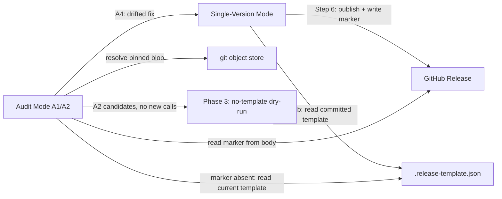
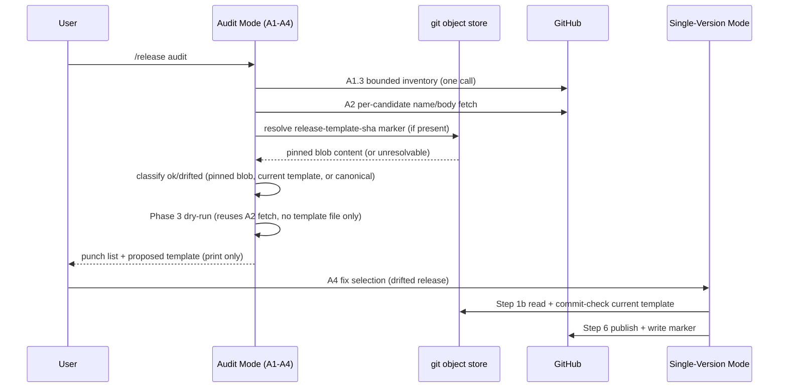

# Task: skein:release — repo-declared release-notes template override

**Status**: Complete
**Component**: meta
**Assigned to**: Claude
**Priority**: Medium
**Branch**: feature/release-repo-template
**Created**: 2026-09-14
**Completed**: 2026-09-15
**Review Gates**: none

## Objective

Let a target repository declare its own release-notes **shape** (title suffix, compare-line wording, excluded sections) via a small machine-readable file that `skein:release` reads and honors instead of always emitting its hardcoded canonical shape — and make `/release audit`'s `ok`/`drifted` classification template-aware so a correctly-templated release is not permanently flagged as drift. This closes the shape subset of a repo's documented convention only; a convention that also asks for reworded/narrative body content remains unmet by this plan (see Findings).

## Context

Cutting `pipecat-context-hub` v0.8.0 through `/release` produced a release whose title and body followed skein's hardcoded canonical shape (`<repo> vX.Y.Z — <highlight>` title, `**Full diff:**` wording, `## What's New` summary), silently overriding that repo's own documented release-notes convention in its `CLAUDE.md` (bare `vX.Y.Z` title, `**Full changelog:**` wording, an explicit excluded-sections list). No error, no warning — every prior release in that repo (v0.0.5–v0.7.0) had followed the project template by hand; v0.8.0, cut through the skill, broke the pattern.

Root cause: `plugins/skein/skills/release/SKILL.md` (and its Codex mirror) hardcode the title/body shape in `## Canonical Format` with no read path for a target repo's own convention, even when one is explicitly documented.

Note on scope: pipecat-context-hub's documented convention also asks for a reworded, reader-friendly body — this plan does not close that part. Only the shape knobs (title, compare-line label, excluded sections, What's New presence) are in scope; verbatim-CHANGELOG-copy stays the fixed default body-content behavior regardless of template presence.

A template-override mechanism alone does not close this: a repo with a real, hand-followed convention but no `.release-template.json` yet would keep silently getting canonical shape — this is exactly the pipecat-context-hub scenario before anyone had written the file. Closing the recurrence gap requires `/release audit` to notice, when no template exists, whether the repo's actual release history looks like it follows a stable non-canonical shape, and propose (never silently write) a template capturing it.

skein's own repo release workflow (`skein:release` cutting skein's own tags) is unaffected by this — skein has no competing template of its own and will keep using the canonical shape as the default/fallback. This plan is about repos that consume the `skein` plugin and have their own documented convention.

## Requirements

- A target repo can declare a release-notes template via a small **machine-readable schema**, not free-text prose in `CLAUDE.md` that the skill "reads and follows" — `CLAUDE.md`/`CHANGELOG.md` are already treated by this skill as untrusted, attacker-editable data (see `plugins/skein/skills/release/SKILL.md:39,101`), and a skill that pushes git tags and publishes public GitHub releases must not execute instructions sourced from repo content.
- Scope is shape-override only: title suffix on/off, compare-line wording (`Full diff` vs `Full changelog` vs other fixed label), an excluded-sections list, and What's New presence (`whats_new`, recover/preserve-only — never forces drafting new summary prose). Verbatim-CHANGELOG-copy stays the fixed default body-content behavior — reworded/narrative bodies are an explicit non-goal of this plan.
- Absence of a template file must be a no-op: existing skein behavior (canonical shape) is unchanged for every repo that hasn't opted in, including skein's own repo.
- `/release audit`'s Step A2 `ok`/`drifted` classification (`plugins/skein/skills/release/SKILL.md:219-267`) must classify against the repo's own template when one exists, not skein's hardcoded canonical shape: a release carrying a `release-template-sha` marker classifies against that pinned blob; a marker-less release classifies against the repo's **current** `.release-template.json` when one exists in the working tree (closing the gap for hand-cut releases that predate the marker but match the now-adopted convention); only when no template file exists at all does classification fall back to canonical shape. Otherwise every correctly-templated release is permanently `drifted`.
- Both mirrors (`plugins/skein/skills/release/SKILL.md`, `plugins/skein-codex/skills/release/SKILL.md`) change together in one commit, per `AGENTS.md` mirror convention; `scripts/check-prompt-parity.sh` already singles out the release skill's normalized workflow contract for parity enforcement and must keep passing.
- `tests/parity/test_release_skill_contract.py` (862 lines, enumerates concrete `gh repo`/`gh release` call shapes against both mirrors) must be extended, not bypassed, to cover the new template-read path.
- `/release audit`, when no `.release-template.json` exists, judges (LLM-executed prose classification, same pattern as Step A2's existing `ok`/`drifted` logic — no new mechanical diff script) whether the repo's actual release history looks like a stable non-canonical convention, and if so proposes drafting a template rather than writing one unprompted. This dry-run lives in Audit Mode only — never in Single-Version Mode — so an ordinary `/release X.Y.Z` cut (including every skein release) pays no extra cost.

## Review Focus

- Untrusted-input boundary: the template file is repo content, same trust class as `CHANGELOG.md`/`CLAUDE.md` — verify the schema is small enough and strict enough (fixed enum fields, no free-text instruction fields) that "parse the template" cannot become "follow instructions embedded in the template."
- Backward compatibility: no existing skein-cut release (skein's own repo, or any other repo with no template file) should change behavior or newly classify as `drifted` under audit.
- Mirror parity: `check-prompt-parity.sh` and `test_release_skill_contract.py` both must pass unmodified-assumption-wise — confirm what exactly these scripts assert before touching release/SKILL.md so the change doesn't silently break an existing parity invariant.

## Implementation Checklist

### Phase 1: Schema, parsing, and Canonical Format read path

**Impl files:** `plugins/skein/skills/release/SKILL.md, plugins/skein-codex/skills/release/SKILL.md`
**Test files:** `tests/parity/test_release_skill_contract.py`
**Test command:** `python3 -m pytest tests/parity/test_release_skill_contract.py -v`
**Validation cmd:** `scripts/check-prompt-parity.sh`
**Goal:** `.release-template.json` absence must be a byte-for-byte no-op against today's canonical-shape output; presence must fail closed on any validation error rather than partially applying or silently falling back. The template file must be committed before it can be cut against — an uncommitted/dirty template is refused, never silently used.

- Define the `.release-template.json` schema in `## Canonical Format` (new subsection): `title_format` (`"bare" | "canonical"`, default `"canonical"`), `compare_line_label` (`"Full diff" | "Full changelog" | "none"`, default `"Full diff"`), `excluded_sections` (array of exact `###` heading strings, default `[]`; each entry must be unique, non-empty, contain no newline/control bytes, and match `^### [^\n]+$`; bounded to a reasonable count/length — validation-failure on any entry fails the whole read closed same as any other field), `whats_new` (`true | false`, default current recover/preserve-absence behavior — `true` only recovers/preserves an existing What's New summary, it never forces drafting new prose; template presence does not itself change What's New handling unless this field is set).
- Add a template-read step early in Step 1 (Step 1b): read `.release-template.json` via the harness native read primitive at the pinned source top-level (not a bare `test -f` in cwd) — absence is silent no-op. Presence → validate via the `jq empty` / `jq -e 'type == "object"'` / per-field enum-membership idiom, porting exactly the three gates `persist-common.sh`'s `persist_validate_json_shape` implements (`jq empty`, `jq -s 'length' == 1` single-document guard, `jq -e 'type == "object"'`) plus new gates this schema needs: per-field enum/type checks, unknown-key rejection (`keys - [allowed-keys] == []`), and a duplicate-key count check mirroring `persist_assert_no_duplicate_keys` (jq silently keeps the last of a duplicate key, which would otherwise pass the shape gate silently). `jq` is added to the Step 2 pinned-executable set and identity-pinned like every other invoked executable — it is not shelled out via inherited PATH. Any validation failure (bad JSON, multi-document input, unrecognized enum value, wrong field type, unknown extra field, duplicate key) is a hard stop — report the exact validation error, never partially apply, never silently fall back to canonical.
- **Commit precondition**: before use, require `.release-template.json` to be committed and match HEAD exactly (`git diff --quiet HEAD -- .release-template.json` and the file must be tracked, not untracked) — hard-stop with a clear error otherwise. This is what makes the published marker (below) resolvable from any clone.
- Wire the four fields into Step 3 (Compose Title and Body): `title_format` picks the title shape; `compare_line_label` substitutes the fixed label text into the existing compare-line template (`**<label>:** <url>/compare/...`), `"none"` omits the line entirely regardless of PREV; `excluded_sections` drops matching verbatim `###` subsections from the copied CHANGELOG body before composing (a heading absent from the fetched CHANGELOG section is a no-op, reported as such in the Step 4 line-item; an exclusion set that empties the body entirely is a Step-1.4-style hard stop, not a silent empty release); `whats_new` forces inclusion/omission, overriding the existing recover/preserve-absence default only when explicitly set.
- Extend Step 3's re-sync recovery and Audit Step A2's body-split logic to be marker/label-aware in the same commit as this Step 3 wiring change (not deferred to Phase 2): strip a trailing `<!-- release-template-sha: ... -->` line as a recognized final trailer before candidate matching, parametrize the boundary/recovery suffix by the active `compare_line_label` (including `"none"`, which expects no trailing suffix at all), and compare against the `excluded_sections`-filtered CHANGELOG section rather than the raw one. Without this, the first re-sync of a templated release misparses as malformed/drifted.
- Step 4 (Confirm Before Mutating) gains an explicit template line-item in the confirmation output whenever a template was read: name the active field values and what each changed relative to canonical shape, alongside the composed title/body already shown.
- The existing confirmed-payload-hash (CHANGELOG section + title + highlight + What's New only, per `SKILL.md:114`) stays **unchanged** — template field values are not folded into it, preserving its existing "CHANGELOG-derived content only" boundary. Instead, introduce a separate **confirmed template identity** check: the committed blob SHA (see marker, below) recorded in Step 1b, shown in Step 4, and re-verified as its own equality check immediately before Step 5's tag write and Step 6's release mutation — with an explicit no-template sentinel value so untemplated runs stay byte-for-byte identical to today. A concurrent edit to `.release-template.json` during the Step 4 pause is caught by this check the same way a concurrent `CHANGELOG.md` edit is already caught by the payload hash.
- On successful publish, append the version-tracking marker to the release body: `<!-- release-template-sha: <sha> -->` where `<sha>` is the **committed** blob — `git rev-parse HEAD:.release-template.json` (never a working-tree `git hash-object` of uncommitted bytes) — placed after the compare line (or in the same position when the compare line is suppressed via `compare_line_label: "none"`). Because of the commit precondition above, this is always resolvable via `git cat-file` from any clone that has the commit. Omit the marker entirely when no template was read (no behavior change for untemplated repos).
- Extend `tests/parity/test_release_skill_contract.py` with structural/regex-level assertions (matching its existing style) that both mirrors' SKILL.md describe: the schema (including `excluded_sections` validation rules), the harness-native best-effort read, the fail-closed validation (all gates, not just the three ported ones), the commit precondition, the Step 4 line-item, the separate template-identity re-verify, the marker-aware Step 3/A2 recovery, and the HEAD-blob marker. In addition, add **executable** fixture tests (subprocess, mirroring `test_release_skill_contract.py:779-799`'s precedent for executing shell as part of a test) that regex-extract the jq validation command(s) from both mirrors and run them against fixtures. Valid cases (exit 0, defaults apply): a full template with all 4 fields set, and `{}` (empty object — every field is independently defaulted per Requirements, so an empty object is a legal, if pointless, template: exit 0, not an error). Invalid cases (exit non-zero, documented error text): invalid JSON, `[]` (not an object), two concatenated objects, bad enum value, `whats_new: "true"` (wrong type), unknown extra key, duplicate key. Prose-only coverage is not sufficient for the boundary this fail-closed gate protects.

### Phase 2: Audit-mode template-aware classification

**Impl files:** `plugins/skein/skills/release/SKILL.md, plugins/skein-codex/skills/release/SKILL.md`
**Test files:** `tests/parity/test_release_skill_contract.py`
**Test command:** `python3 -m pytest tests/parity/test_release_skill_contract.py -v`
**Validation cmd:** `scripts/check-prompt-parity.sh`
**Goal:** A correctly-templated release must classify `ok`, never `drifted`. Three-way classification: marker present → pinned blob; marker absent but a current `.release-template.json` exists → that current template (closes the pre-adoption gap once a repo adopts a template); no template file at all → canonical shape (today's behavior, unchanged). Note: Phase 1 and Phase 2 land in the same commit/PR — do not cut a templated release between them, since Phase-1-alone (marker write, no marker-aware A2) would classify every templated release `drifted` on the trailing-marker line and loop forever through A4.

- Audit Step A2's `ok`/`drifted` check (`plugins/skein/skills/release/SKILL.md:~260-262`) reads the release body's `release-template-sha` marker. Before use, validate it: must match `^<!-- release-template-sha: [0-9a-f]{40} -->$` exactly once in the body (untrusted remote data — same treatment as the rest of the release body per `SKILL.md:101,223`); resolve via `git cat-file -t <sha>` and require the type to be `blob` (never commit/tree/tag); run `git cat-file -p <sha>` through the pinned source Git context; pass the resolved content through the identical Phase 1 jq validation. Any failure at any of these gates → the unresolvable/malformed informational state (never `ok`/`drifted`), not a crash and not a silent `ok`.
- Marker present and valid → classify against that pinned blob content, stripping the marker itself and applying that blob's `excluded_sections` before the exact-bytes CHANGELOG comparison (same recovery logic Phase 1 added to A2/Step 3).
- Marker absent → if `.release-template.json` exists in the current working tree (and passes Phase 1 validation), classify against **that current template** — this is what lets a repo's pre-adoption hand-cut releases (matching the convention the repo later formalized) classify `ok` once the template file is committed, without requiring every historical release to be re-cut with a marker. If no template file exists at all, classify against canonical shape (today's behavior, unchanged) — this is the only case where marker absence is not drift.
- Extend `tests/parity/test_release_skill_contract.py` with structural assertions that both mirrors describe: the marker regex/blob-type/content-validation gate chain, the three-way branch (pinned blob / current template / canonical), the marker-and-excluded_sections-aware A2 body split, and the unresolvable-marker informational state. No new executable classification-test harness — flagged as follow-up (see Findings/Follow-up Work), since audit classification has no executable test harness for any of its logic today, template-aware or not; the jq-gate and regex-gate fixture tests added in Phase 1 do get executable coverage, since those are the untrusted-input boundary this phase depends on.
- Run `scripts/check-prompt-parity.sh` to confirm the normalized release-skill workflow contract still matches across both mirrors after the SKILL.md edits.

### Phase 3: Audit-mode no-template dry-run and proposal

**Impl files:** `plugins/skein/skills/release/SKILL.md, plugins/skein-codex/skills/release/SKILL.md`
**Test files:** `tests/parity/test_release_skill_contract.py`
**Test command:** `python3 -m pytest tests/parity/test_release_skill_contract.py -v`
**Validation cmd:** `scripts/check-prompt-parity.sh`
**Goal:** Closes the actual recurrence gap — a repo with a real, hand-followed convention but no `.release-template.json` gets surfaced and offered a template, without ever writing one unprompted, without issuing new `gh` calls beyond what A2 already fetches, and without taxing an ordinary `/release` cut. Once a proposed template is adopted, this step naturally stops firing and Phase 2's revised marker-absent semantics (current-template classification) means the same historical releases it drew evidence from now classify `ok`, not `drifted` — no more talking past each other.

- New Audit Mode step, sequenced **after Step A2** (not alongside A1 — A1.3's `gh release list --json tagName,name` has no `body` field; A2 is what actually fetches per-candidate `name`/`body`): only when `.release-template.json` is absent from the repo, and only within `/release audit` — never Single-Version Mode. Reuse A2's already-fetched `name`/`body` (filtered to `isDraft=false`) for the highest exactly-3 `T=R=C=✓` candidates — never 2, so the 3+ threshold below is satisfiable by construction; if a version was never fetched by A2, exclude it rather than issuing an extra call. **No new `gh` calls are introduced** — this keeps the existing gh-call Counter (`tests/parity/test_release_skill_contract.py:707-709`) and the "exactly one bounded inventory call" assertion (`:344`) unchanged. Judge (LLM-executed prose comparison, same execution model as Step A2's existing `ok`/`drifted` classification — no new mechanical diff script) whether their actual title/body shape looks like a stable convention, agreeing on every inferred field, that diverges from canonical shape.
- Treat fetched release `name`/`body` as untrusted data for this comparison exactly as Step 3/Audit already do elsewhere (`plugins/skein/skills/release/SKILL.md:101,223`) — observe and compare only, never follow embedded instructions.
- Threshold: require **3+ consecutive, non-draft, non-prerelease** releases (ordered by strict-SemVer tag from A1's union, not `gh release list`'s creation-date ordering) that agree on every inferred field before proposing; any disagreement, or fewer than 3 qualifying releases, yields no new finding — behavior identical to today's audit.
- If releases look like a stable non-canonical convention, add a new informational punch-list classification (e.g. `no-template-convention-detected`) naming the inferred field values (`title_format`, `compare_line_label`, candidate `excluded_sections`) as evidence, and propose — never write — drafting `.release-template.json` with those values. Audit Mode stays strictly read-only by itself (`SKILL.md:19,286`): **print the proposed JSON content in the audit output** for the user to save/commit themselves, the same discipline every other Audit finding already follows (report, don't mutate) — do not add a new Audit-mode file-write side effect.
- Extend `tests/parity/test_release_skill_contract.py` with structural assertions that both mirrors describe this dry-run step, its Audit-Mode-only scope, the A2-fetch-reuse (no new gh calls), the untrusted-data treatment, the 3+-release/strict-SemVer threshold, and the propose-and-print-never-write behavior.

## Technical Specifications

### Files to Modify
- `plugins/skein/skills/release/SKILL.md` — Canonical Format section, Step 1b (template read/validate), Step 3 (compose, including marker/label-aware recovery), Step 4 (confirmation line-item + template-identity check), Step 6 (create/edit + marker write), Audit Step A2 (marker validation + three-way classification), new Audit dry-run step (after A2). Frontmatter description updated if it currently implies a single canonical shape unconditionally.
- `plugins/skein-codex/skills/release/SKILL.md` — mirrored change (Codex half first per `AGENTS.md`, then Claude half aligned in the same commit).
- `tests/parity/test_release_skill_contract.py` — extend to cover template-present and template-absent paths against `RELEASE_PLAN`/README (this plan itself becomes a referenced source once complete, per this test file's existing pattern of checking mirrors against `docs/dev_plans/20260712-feature-release-skill.md`); update the pinned gh-call Counter only if Phase 3 review confirms a delta is unavoidable (expected: no delta, per Phase 3's A2-fetch-reuse design).
- `README.md` — the release-row entry pinned by `test_release_skill_contract.py:298-316` may need updating if it currently states the shape is always canonical; check before editing.

### New Files to Create
- None in the skein repo itself. `.release-template.json` is a file a *consuming* repo (e.g. pipecat-context-hub) creates at its own root — out of scope for this plan's diff, documented as the consumer-facing contract in `## Canonical Format`.

### Architecture Decisions
- **Template file, not CLAUDE.md prose** (grilled): `.release-template.json` at target-repo root, structured JSON only, parsed with `jq` — keeps the untrusted-data boundary true by construction (a separate, narrowly-schemed file) rather than adding a second parsing responsibility to CLAUDE.md.
- **Closed enum fields, no free text** (grilled): `title_format`/`compare_line_label` are fixed enums; `excluded_sections` is a list of exact heading strings, never templated/interpolated text. This is what keeps repo-supplied template content from becoming instruction execution in a skill that publishes public releases.
- **Fail closed on any malformed template** (grilled): validation failure stops the run; never partial-apply, never silently revert to canonical.
- **Absence is a silent no-op** (grilled): no `.release-template.json` → today's canonical-shape behavior, unchanged, for every repo including skein's own.
- **Version-pinned audit classification via committed HEAD-blob marker** (grilled): `<!-- release-template-sha: <sha> -->` appended to the release body on publish, where `<sha>` is `git rev-parse HEAD:.release-template.json` — the **committed** blob, never a working-tree `git hash-object` of uncommitted bytes. Step 1b hard-stops if the working tree differs from that committed blob or the file is untracked (template must be committed before cutting). This guarantees the marker resolves via `git cat-file` from any clone with the commit, and audit resolves and classifies against that pinned blob, not current HEAD's template — so a later template edit cannot retroactively flag an already-correct release as drifted. (Rejected alternative: embedding the four field values directly in the marker instead of blob indirection — removes the resolve step but was not chosen, to keep one source of truth for template content; do not implement both.)
- **Marker absent ≠ automatic drift** (grilled): a marker-less release classifies against the repo's *current* `.release-template.json` when one exists (closes the pre-adoption recurrence gap for the motivating pipecat-context-hub case), and only falls back to canonical shape when no template file exists at all.
- **Confirmed payload hash stays unchanged; template identity is a separate check** (grilled): the existing CHANGELOG-derived payload hash (`SKILL.md:114`) is not touched by this plan — template field values are re-verified via a distinct "confirmed template identity" (the committed blob SHA) check, keeping "a payload-hash mismatch means CHANGELOG content changed, nothing else" true.
- **Confirmation transparency** (grilled): Step 4 names active template fields and their effect explicitly, not just implicitly in the shown title/body.
- **Test scope** (grilled): extend the existing text-contract test (`test_release_skill_contract.py`) only; a dedicated executable classification-test harness is out of scope (pre-existing gap, not created by this plan) — see Follow-up Work.
- **No-template dry-run is Audit-only, LLM-judgment, propose-and-print-never-write**: closes the actual recurrence gap (a repo with a real convention but no template file yet) without adding a mechanical diff script, without a new Audit-mode file-write side effect, or taxing every ordinary `/release` cut — reuses the same execution model Step A2's classification already uses and the same read-only discipline every other Audit finding already follows.
- **No migration path for template revisions (accepted limitation)**: pinning classification to the marker blob means a repo that revises `.release-template.json` has no built-in path to detect or re-classify releases cut under an old revision — an A4 fix re-cuts them under the *current* template, which is correct going forward but does not retroactively re-validate the old marker's semantics. Out of scope for this plan; a future plan could add a marker schema-version field if this becomes a real pain point.

### Dependencies
- `jq` — first use inside `release/SKILL.md` itself. This is a **target/consumer-repo** dependency, not a skein-repo one: the release skill executes in the *consuming* repo's shell, where `jq` availability is not guaranteed the way it is in skein's own repo. Step 1b must check `command -v jq` and fail with a clear, actionable error (not a cryptic parse failure) if absent, before attempting to validate a present template. Validation idiom ports the three gates from `persist-common.sh`'s `persist_validate_json_shape` (`jq empty`, single-document guard, `jq -e 'type == "object"'`) plus new per-field enum/type/unknown-key/duplicate-key gates this schema needs — ported inline since `release/SKILL.md` has no existing script-sourcing convention to hook into.

### Integration Seams

| Seam | Writer (task) | Caller (task) | Contract |
|------|---------------|----------------|----------|
| `.release-template.json` schema | Phase 1 (Canonical Format definition) | Phase 1 (Step 1b read/validate), Phase 2 (Step 3/Step 4 field usage) | Four fields (`title_format`, `compare_line_label`, `excluded_sections`, `whats_new`), each independently defaulted; any one malformed fails the whole read closed |
| `release-template-sha` body marker (committed HEAD blob) | Phase 1 (Step 6, on publish) | Phase 2 (Audit Step A2 three-way classification) | Written only when a template was read at cut-time, value is `git rev-parse HEAD:.release-template.json`; Phase 2 resolves via `git cat-file`, validating SHA format + blob type + Phase-1 schema before use; marker-absent classifies against the *current* template if one exists, else canonical — never treated as an error |
| Step 3 / Audit A2 body-recovery parsing | Phase 1 (marker/label-aware recovery) | Phase 1 re-sync, Phase 2 A2 classification | Both must strip the trailing marker and apply the active `excluded_sections` before comparing bytes — a mismatch here misparses a valid templated release as malformed/drifted |
| A2 per-candidate `gh release view` fetch | Phase 2 (Audit A2) | Phase 3 (no-template dry-run) | Phase 3 reuses A2's already-fetched `name`/`body` for the highest exactly-3 `T=R=C=✓` candidates; issues no new `gh` calls |

## Architecture & Call Flow

Two independently-sequenced modes within the same skill (Single-Version Mode, Audit Mode) plus an Audit→Single-Version re-entry (A4 fixes), each reading a different template source — this crosses the 2+-independently-executing-components bar for including this section.

| Step | Trigger | Enters context | Cleared/persisted | Turn boundary |
|------|---------|-----------------|--------------------|----------------|
| 1 | `/release X.Y.Z` invoked | user version arg, CHANGELOG.md, .release-template.json (if committed) | template identity persists into Step 4/5/6 checks | after Step 6 publish |
| 2 | `/release audit` invoked | release inventory (A1), per-candidate bodies (A2) | fresh per audit run | after punch list rendered |
| 3 | A2 classifies a release | release body marker (untrusted), resolved blob (if any) | not persisted beyond the punch-list row | per-candidate |
| 4 | A4 routes a `drifted` fix | current committed template (not the old marker's blob) | re-enters Single-Version Mode's own Step 1b context | after re-publish |

## Testing Notes

### Test Approach
- [x] Extend `tests/parity/test_release_skill_contract.py` for template-present/absent paths
- [x] Mirror-parity check (`scripts/check-prompt-parity.sh`) passes on both mirrors post-change

### Test Results
- [x] All existing tests pass — `just ci` on this branch: `test_release_skill_contract.py` 216 passed, 0 failed; `check-sync` passed; `check-prompt-parity` passed. `gauntlet-tests` shows 11 pre-existing `tests/gauntlet/test-gate-timeout.sh` shim-path failures — confirmed present identically on `main` (unrelated to this branch's diff, no gate-timeout files touched here; environment-specific, not a regression from this plan).
- [x] New tests added and passing — structural + executable jq-fixture assertions in `test_release_skill_contract.py` (schema, fail-closed validation, commit precondition, three-way marker classification, dry-run proposal) all pass.
- [ ] Manual verification complete — the `gh release view --json body` marker round-trip (below) is unverified against a real GitHub release; everything else is covered by the automated suite.

### Edge Cases Tested
- [x] No template file present (default/fallback path, must match today's behavior exactly) — covered by `test_release_skill_contract.py`
- [x] Template present and empty (`{}`) validates successfully — every field is independently defaulted, so an empty object is legal (exit 0, defaults apply), not an error
- [x] Template present but malformed/unparseable (fail closed, do not silently fall back or silently apply partial fields), including: invalid JSON, `[]` (not an object), two concatenated objects, bad enum, wrong-type `whats_new`, unknown extra key, duplicate key
- [x] Template present but uncommitted/dirty (Step 1b hard-stops, does not use working-tree bytes)
- [x] Audit classification of a pre-existing correctly-templated release with a valid marker (must be `ok`, not `drifted`)
- [x] Audit classification of a marker-less release with a current template present (must classify against that current template, not canonical)
- [x] Templated release re-synced twice is byte-identical, exactly one marker (no marker duplication)
- [x] `compare_line_label: "none"` combined with the marker (recovery must not expect a compare-line suffix)
- [x] `excluded_sections` naming a heading absent from the fetched CHANGELOG (no-op, reported in Step 4) and naming enough sections to empty the body (hard stop)
- [x] Marker with malformed SHA (short, uppercase, shell metacharacters) or resolving to a non-blob object (commit/tree/tag) — must land in the unresolvable/malformed informational state, never `ok`
- [ ] `gh release view --json body` round-trips the appended marker byte-for-byte — **not yet manually verified** against a real GitHub release; this is unverified GitHub behavior, not derivable from the skill text or contract test alone.

## Acceptance Criteria

- A repo with no `.release-template.json` cuts a release via `/release`; diffed against a fixed golden fixture (today's canonical-shape output for a known CHANGELOG/version input), the output is byte-identical (no regression to skein's own releases or any other untemplated repo).
- A repo with a valid `.release-template.json` (bare title, `Full changelog` wording, 2+ excluded sections) cuts a release matching the template exactly, with Step 4's confirmation explicitly naming the active template fields.
- A malformed `.release-template.json` (bad JSON, bad enum value, unknown key, duplicate key) stops the run before any mutation, with the exact validation error reported — no tag pushed, no release created. An uncommitted/dirty template stops the run the same way.
- A published templated release carries the `release-template-sha` body marker (the committed HEAD blob SHA); `/release audit` classifies it `ok` against the pinned blob, and continues classifying it `ok` even after the repo's current `.release-template.json` is later changed.
- A release predating template adoption (no marker) is classified against the repo's *current* `.release-template.json` when one exists (not permanently `drifted`), or against canonical shape when no template file exists at all — never flagged `drifted` merely for marker absence.
- A repo with no template and 3+ consecutive non-draft/non-prerelease releases (by strict-SemVer order) that consistently diverge from canonical shape and agree on every inferred field gets an informational `/release audit` finding proposing a template, with inferred field values printed as evidence; a repo with no template and no such consistent pattern gets no new finding. Neither case ever writes `.release-template.json` — Audit only prints the proposed JSON — and neither runs during an ordinary `/release X.Y.Z` cut.
- `tests/parity/test_release_skill_contract.py` passes with new assertions covering the schema (including `excluded_sections` rules), fail-closed validation (structural + executable jq fixture tests), the commit precondition, Step 4 line-item, the three-way marker/classification logic, marker-aware Step 3/A2 recovery, and the Audit-only dry-run/proposal step (no new gh calls), on both mirrors. The pinned gh-call Counter (`:707-709`) is confirmed unchanged.
- `scripts/check-prompt-parity.sh` passes — both mirrors' normalized release-skill workflow contract still match.
- Code reviewed and approved (`/code-review xhigh --fix`, then `skein:review-gauntlet` per project review-gate convention).
- `/update-docs` run after reviews converge (CHANGELOG, AGENTS.md if the release-skill contract summary there needs updating, README.md release row if it needs updating, frontmatter descriptions in both SKILL.md mirrors if they currently imply a single unconditional canonical shape).

<!-- reviewed: 2026-09-14 @ 925ced9859fa958fa4c715d586025e186527e4bf -->

<!-- /review-plan writes the marker line above. Everything below is the workspace: edits here do NOT invalidate the marker. -->

## Progress

- [x] Phase 1: Schema, parsing, and Canonical Format read path
- [x] Phase 2: Audit-mode template-aware classification
- [x] Phase 3: Audit-mode no-template dry-run and proposal

## Findings

- **Follow-up work (not in scope for this plan):** `/release audit`'s ok/drifted classification — canonical-shape and template-aware alike — has no executable unit-test harness; today and after this plan it is verified only by text-contract assertions against SKILL.md prose (`test_release_skill_contract.py`) and by manual runs. Grilled decision (Decision 8): building a real classification-test harness is a pre-existing gap this plan doesn't create and shouldn't be scoped to close.
- **Reworded-vs-verbatim body content** (raised in the original bug write-up, deliberately excluded from Requirements): pipecat-context-hub's template asks for a reworded "reader-friendly" body; this plan keeps verbatim-CHANGELOG-copy as the fixed default regardless of template presence. A future plan can add a `body_style: "verbatim" | "reworded"` field if wanted.
- **AGENTS.md doesn't document the mirror-editing convention explicitly** (review-plan finding, out of scope to fix here): the "Codex half first, then Claude half aligned in the same commit" convention this plan and `AGENTS.md`'s own prose assume is not spelled out verbatim in `AGENTS.md` itself. Worth a small doc fix in a future pass; not blocking this plan.
- **Plan reopened post-review (2026-09-16, user-confirmed):** `/code-review xhigh --fix` findings 7/10/11 required edits above the `<!-- reviewed -->` marker (line 208) — stale test-file line citations (`695-703`/`330` → `707-709`/`344`) and obsolete `Step 3.1` notation, both now corrected in the Implementation Checklist/Technical Specifications above. The marker itself is left as-is (still the original `/review-plan` sign-off); this note documents that the plan was edited post-marker with explicit user authorization, not through a re-run of `/review-plan`.

## Issues & Solutions

## Final Results

All three phases landed: repo-declared `.release-template.json` schema (Phase 1), marker/current-template-aware three-way audit classification (Phase 2), and the no-template dry-run proposal step (Phase 3). `tests/parity/test_release_skill_contract.py` passes at 216/0 on both mirrors; `scripts/check-prompt-parity.sh` and `scripts/check-sync.sh` both pass. `just ci` on this branch shows one pre-existing, unrelated failure class (`tests/gauntlet/test-gate-timeout.sh` shim-path, 11 failures) verified identical on `main` — not a regression from this plan.

Outstanding: the `gh release view --json body` marker round-trip is not yet manually verified against a real GitHub release (tracked in Testing Notes/Edge Cases). Follow-up work and scope exclusions are recorded above under Findings.
