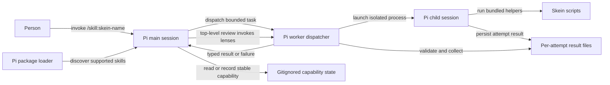
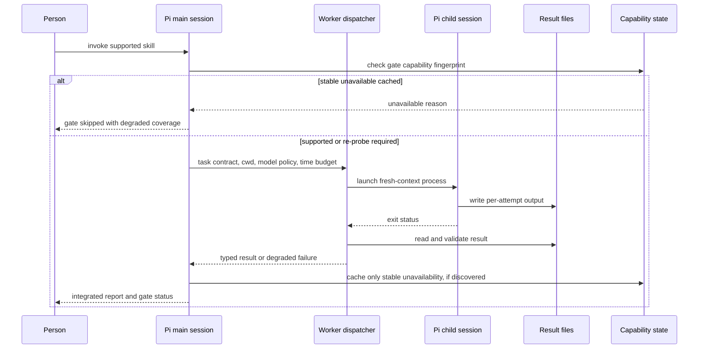

# Task: Pi package and skill port

**Status**: Not Started (architecture confirmed with capability-skip amendment; awaiting plan review)
**Component**: meta
**Assigned to**: Pi agent + maintainer
**Priority**: High
**Branch**: `feature/pi-plugin-port`
**Created**: 2026-09-29
**Review Gates**: none

## Objective

Make Skein installable in Pi as an honest, working package with Pi-native skill instructions, without regressing the Claude and Codex plugins. Keep model selection user-controlled and isolate expensive worker contexts.

## Context

Skein currently ships 15 Claude skills in `plugins/skein/skills/` and 15 Codex skills in `plugins/skein-codex/skills/`. The existing skills use their harnesses' own delegation tools and script anchors; merely exposing one mirror to Pi would register commands that cannot reliably execute. Pi packages can declare individual skill paths in a root `package.json` and be installed from Git. Pi skill names use lowercase letters, digits and hyphens, not Skein's current `skein:` invocation spelling. The current repo has no root `package.json`; this work must not make Claude/Codex discover an unfinished Pi mirror.

Observed implementation anchors (verified at plan creation): `plugins/skein/skills/dev-plan/SKILL.md` dispatches Explore with Claude's `Agent`; `plugins/skein/skills/conduct/SKILL.md` assumes synchronous `Agent` dispatch; `plugins/skein/skills/fan-out/fan-out.sh` launches `claude -p`; `scripts/lib/bundle-map.sh` declares the existing bundle targets; `scripts/check-prompt-parity.sh` compares the current two mirrors. `tests/parity/test-managed-skills-parity.sh` compares the current two managed-skill lists and keeps the legacy cleanup subset separate. These facts are part of the plan contract; correcting a stale fact later requires re-review once a marker is written. No git refs or dependency versions were specified in the request; no root Node manifest exists yet.

## Requirements

1. Ship a Pi package whose `pi.skills` is an explicit per-skill allowlist (no whole-directory or wildcard entry), updated only when a skill and its dependencies pass readiness tests; document local and pinned-Git installation, update, removal, and Pi command spelling. No false implication of `skein:` namespace support.
2. Port all 15 skill behaviors in stages. Keep a capability/inventory matrix with explicit status for each skill; never expose an orchestrator before its dependencies and tests are ready. Reuse harness-neutral assets where safe, without relying on Claude or Codex caches or environment variables.
3. Separate task intent from model policy. Use portable role contracts and structured output; allow optional user tier mappings (judgment, mechanical, factual) with a documented selected-model fallback and no claim that thinking levels are uniform across providers. Never silently substitute a model or count a degraded review as a pass.
4. Establish a bounded fresh-context worker mechanism for Pi (model choice, working directory, timeout/cancellation, stdout/stderr and schema handling, disk persistence, measured cost/usage when reported and explicit `unknown` otherwise). Do not assume Pi provides Claude's `Agent` or Codex's `spawn_agent`. Limit delegation to one level per process tree; explicitly document the subprocess reset for fan-out → conduct, or disallow the route if isolation cannot be verified.
5. Preserve the existing shared-script, marker, report, and auto-fix safety contracts; explicitly test any altered bundling, path resolution, and trust boundaries. Mark unsupported review gates `unavailable` and skip repeated probes on subsequent runs while the same capability fingerprint applies; emit a visible per-run `skipped` gate outcome linked to that reason. Never count skipped gates as passed.
6. Only cache stable capability absence (e.g. missing required gate implementation or executable), never a timeout, authentication failure, parse error, or transient process failure. Re-probe on relevant runtime/plugin/config change or explicit operator refresh. If all required gates are unavailable, stop rather than entering a false convergence loop; report partial coverage distinctly from a clean pass.
7. Keep the Claude and Codex mirrors and their tests working; add Pi-specific install/discovery and end-to-end checks; run `just ci` before PR. Pre-release smoke coverage must include all 15 skill command paths, a delegated review, a confirmation-sensitive release dry run, and two genuinely configured provider/model classes. Absence of those credentials blocks the portability claim; do not represent fake-CLI CI as equivalent.

## Review Focus

- Worker subprocess isolation, cancellation, credentials/project trust, and model fallback when authentication or capability is absent; no secrets or raw credentials in cache keys or reports.
- Cached stable gate unavailability versus transient failure; fingerprint invalidation, explicit re-probe, and degraded-result semantics across resume and subsequent runs.
- Names and paths under package installation (including paths with spaces and Git-cache relocation), bundle/script ownership, and avoidance of accidental exposure of unsupported skills.
- Pi-native cross-skill composition and the honest degraded status of unavailable gates.
- Portability across at least two configured provider/model classes without hardcoded vendor model IDs; required release smoke, not an optional CI substitute.

## Implementation Checklist

The phases below are the contract for implementation. Keep progress below the eventual review marker; do not mark this plan reviewed until an independent plan review has reconciled findings.

### Phase 1: Capability inventory and Pi package skeleton

**Impl files:** `package.json, plugins/skein-pi/skills/show-me/SKILL.md, docs/dev_plans/20260929-feature-pi-plugin-port.md`
**Test files:** `tests/pi/test_package.py, tests/pi/test_skill_inventory.py`
**Test command:** `uv run --with pytest python -m pytest tests/pi -q`
**Goal:** Every exposed Pi skill must be installable and operational, not just syntactically discoverable; the package manifest never includes an unfinished skill.

- Inventory all 15 skills in a maintained matrix with dependencies, readiness, target command name, and per-harness interactions. Add an explicit `pi.skills` path only after its dependencies and readiness checks pass; assert the exact allowlist in tests, not merely that discovered names are valid.
- Start with standalone `show-me` only. Cover Pi frontmatter and `/skill:skein-show-me` invocation; do not expose `grill` (needs `dev-plan update`) or `plan-view` (needs generator and templates) yet.
- Test local installation and path-with-spaces discovery with disposable Pi agent settings. For pinned-Git installation, use a temporary committed fixture in Phase 1; test the real published ref in Phase 4. Pi's interactive command is `/reload` (not `--reload`): test it interactively where possible or test restart-based discovery and document `/reload` separately. Never mutate the person's Pi settings.

### Phase 2: Isolated Pi worker, model policy and independent skills

**Impl files:** `plugins/skein-pi/lib/*, plugins/skein-pi/skills/rfc-finder/SKILL.md, plugins/skein-pi/skills/content-draft/SKILL.md, plugins/skein-pi/skills/content-review/SKILL.md, plugins/skein-pi/skills/spec-compliance/SKILL.md, plugins/skein-pi/skills/update-docs/SKILL.md, plugins/skein-pi/skills/plan-view/*, package.json`
**Test files:** `tests/pi/test_worker.py, tests/pi/test_model_policy.py, tests/pi/test_single_worker_skills.py, tests/pi/test_plan_view.py`
**Test command:** `uv run --with pytest python -m pytest tests/pi -q`
**Goal:** Child workers get only their task contract, an explicit model decision, measured-or-unknown cost and a bounded lifetime; failures cannot masquerade as completed work.

- Spike Pi's one-shot CLI for model selection, credentials, process exit, interruption, path resolution and usage reporting. `--no-session` alone is insufficient: explicitly disable auto-loaded skills/extensions/context (`--no-skills --no-extensions --no-context-files --no-approve`), allow only role-required tools using `--tools` or `--no-tools`, and supply curated project rules and permitted skill resources explicitly. Test sentinel project/user instructions and malicious extensions cannot enter worker context or offer nested dispatch; evaluate user-level settings/packages separately. If CLI isolation cannot be established, stop and revise architecture before registration.
- Probe the Pi shell tool's `PI_PROVIDER`/`PI_MODEL`/`PI_REASONING_LEVEL` as a candidate parent identity source, verify provenance and absence cases, and select the child model explicitly; never trust an inherited stale value from an unrelated shell. Use structured `pi --mode json` (not print-only text) if the spike requires usage/cost and failure events; parse the terminal event and final message, treating missing usage as `unknown`, never zero. Test model unavailable, auth failure and no-identity stop.
- Implement argv-based launch (never interpolate untrusted prompts into shell), bounded concurrent processes, process-group cancellation and capped output/attempt files. Consume JSON events as a stream and retain only the validated result, usage summary and safe diagnostic subset in guarded state (not raw event streams containing prompts or credentials). Define typed success, timeout, invalid-output and launch/auth failures; no recursive orchestration in a child.
- Port five independent single-worker skills. Port `plan-view` with its real `generate.py`, templates and required assets; expose only when both deterministic and `--rich` paths work through the worker layer (or explicitly split the command into tested supported modes without broken rich links). Verify relocated install-path resolution and tier mappings without pinning provider IDs.

### Phase 3: Plan composition, disk-first review and capability-aware gates

**Impl files:** `plugins/skein-pi/skills/dev-plan/*, plugins/skein-pi/skills/grill/*, plugins/skein-pi/skills/review-plan/*, plugins/skein-pi/skills/deep-review/*, plugins/skein-pi/skills/review-gauntlet/*, plugins/skein-pi/lib/*, scripts/persist-review-state.sh, scripts/persist-deep-review-state.sh, scripts/lib/bundle-map.sh, scripts/bundle-appliers.sh, .gitignore, package.json`
**Test files:** `tests/pi/test_review.py, tests/pi/test_plan_composition.py, tests/pi/test_gate_capabilities.py, tests/pi/test_bundles.py, tests/reconciliation/test-review-plan-state.sh, tests/reconciliation/test-deep-review-state.sh`
**Test command:** `uv run --with pytest python -m pytest tests/pi -q && just reconciliation-tests && just check-sync`
**Goal:** Plan decisions and review findings follow working Pi routes; validated persisted records and cached stable skips never become false approvals.

- Implement `dev-plan`'s create/update and `grill`'s decision-write route before exposing either; register `review-plan` only once it can route decisions inline through those skills and write a valid marker. Keep each unready skill off the explicit manifest allowlist. Keep `deep-review`'s lens dispatch at top-level review orchestration; the gauntlet itself runs its multi-worker gate in its own process/top-level context and sends only fixer batches to child workers, never nests a lens dispatcher inside a fixer child.
- Extend canonical review-state persistence (`--harness pi`) and the Pi gauntlet's harness-specific state anchor, without changing the meaning of existing Claude/Codex state files. Preserve reconciler, marker, per-attempt persistence, auto-fix and report contracts; bundle only used scripts from canonical sources and check all three harnesses. Resolve assets from installed package paths.
- Probe gate support before launch; cache only stable absence using guarded, repo-local gitignored state keyed by a non-secret environment/package fingerprint. On later runs emit `skipped` referencing `unavailable` without invoking the gate. On changed fingerprint or explicit re-probe, try again. Runtime timeouts/auth/invalid output stay uncached and surfaced as degraded failures.
- A round with skipped gates cannot produce a clean full-coverage approval; zero runnable gates exits visibly instead of consuming convergence rounds. Resume never re-labels cached skips as approvals. Test corrupted cache, stale fingerprint, refresh and credential safety.

### Phase 4: Complex orchestration, install coverage and release readiness

**Impl files:** `plugins/skein-pi/skills/conduct/*, plugins/skein-pi/skills/fan-out/*, plugins/skein-pi/skills/release/*, justfile, README.md, AGENTS.md, docs/dev_plans/README.md, package.json`
**Test files:** `tests/pi/test_orchestration.py, tests/pi/test_install.py, tests/pi/test_skill_inventory.py, tests/pi/test_release_smoke.py`
**Test command:** `uv run --with pytest python -m pytest tests/pi -q && just ci`
**Goal:** All 15 Pi skills work through their declared interfaces, and the existing Claude and Codex gates remain green.

- Port orchestration with one worker level per process tree, controlled worktree/process cleanup and explicit cross-skill routing. Define and test fan-out → separate Pi worker process → conduct → child implementer/test-writer as a new process tree; if nested invocation/permissions cannot be verified, disallow that route explicitly instead of claiming feature parity. Preserve release's confirmation and safety boundaries; test dry-run and refusal without any remote mutation.
- Register Pi tests in `just ci`, update README/AGENTS with supported commands and pinned Git install, and update the plan index. Test local and commit-pinned Git installs against a disposable committed remote or reachable feature-branch commit in disposable settings; verify a public release tag after publication, not before it exists. Before release require a documented smoke matrix covering every skill path, delegated review, release confirmation/refusal and two authenticated provider/model classes (not fake-CLI-only). If credentials/capabilities are unavailable, mark release verification blocked instead of claiming portability. Run full CI in background before PR, check staged paths for secrets, and regenerate bundles from canonical sources.

## Technical Specifications

### Files to Modify

- `README.md`, `AGENTS.md` — installation, supported skill matrix, port and verification instructions.
- `scripts/persist-review-state.sh`, `scripts/persist-deep-review-state.sh` — accept `pi` as a third, distinct harness identity while keeping existing Claude/Codex formats and tests stable.
- `scripts/lib/bundle-map.sh`, `scripts/bundle-appliers.sh`, and related parity checks — deliver Pi's canonical shared scripts while keeping generated copies byte-identical; do not copy artifacts by hand.
- `docs/dev_plans/README.md` — keep this plan's index entry current.

### New Files to Create

- `package.json` — Pi package root with explicit individual `pi.skills` paths for ready skills, never a skills-directory/wildcard declaration.
- `plugins/skein-pi/skills/<skill>/SKILL.md`, `plugins/skein-pi/skills/plan-view/generate.py` and required templates/assets — Pi-specific instructions, complete support files and portable anchors; only expose completed skills.
- `plugins/skein-pi/` worker-dispatch and gate-capability implementation — exact language/layout to be selected after validating Pi CLI behavior and package-path resolution.
- `tests/pi/` — package manifest, discovery, worker failure, capability-cache, parity, and end-to-end tests.

### Architecture Decisions

- Use a dedicated third mirror, not a search/replace of Claude or Codex instructions. Source-neutral scripts and prompt schemas may be shared; harness calls are rewritten explicitly.
- Initial worker strategy to validate: one-shot `pi --mode json --no-session` subprocesses with explicit prompts, resource/tool allowlists and bounded process lifetimes, coordinated by a small dispatcher. `--no-session` alone is not isolation: disable auto-discovered skills, extensions and context; inject only approved project rules/files. A child model is not automatically inherited: first probe Pi's shell-tool `PI_PROVIDER`/`PI_MODEL` identity with provenance checks, then an approved Pi API/extension or explicit user configuration, otherwise stop and ask; never silently select the child default. JSON mode can emit usage and stop-reason events but a failed turn need not set a failing process exit code; validate terminal events and report `unknown` cost if absent. If the CLI fails isolation/identity requirements, stop and revise the choice before porting orchestration skills.
- Distinguish package availability from operational readiness: `pi.skills` enumerates individual paths and changes only at readiness gates; a present but unregistered `SKILL.md` stays undiscoverable through this package. Decide whether Pi needs a package-level extension only after the subprocess prototype, rather than making an extension a prerequisite for simple skills. Preserve the same rule for cross-skill references: never chain into a not-yet-registered command.
- Persist stable gate capability decisions in a repo-local gitignored Pi state directory with guarded writes and a minimal fingerprint of relevant executable availability/version, Pi runtime, Skein package revision, and non-secret gate configuration. A matching `unavailable` record avoids probing the same unsupported gate again and produces a per-run `skipped` record naming the cached cause. Recompute on relevant change or explicit re-probe; temporary runtime errors remain uncached. A cached skip is never a clean gate pass. Do not reuse a different target's convergence ledger as the capability cache.

### Dependencies

- Pi CLI and its package/skill loader (external runtime; verify supported version during implementation); existing shell/Python test dependencies per `AGENTS.md`. No new npm runtime dependency assumed at planning time.

### Integration Seams

| Seam | Writer | Caller | Contract |
|------|--------|--------|----------|
| Package skill registration | Explicit per-skill root manifest allowlist | Pi loader | Only individually listed, readiness-tested skill paths become discoverable; skill names are collision-resistant. |
| Worker request/result | Pi skill orchestrator | Pi dispatcher/child process | Explicit role, prompt, cwd, model policy, tool/resource allowlists and timeout; validated terminal JSON event and result or typed failure, never a silent pass. |
| Script path | Pi skill | Bundled or local supporting script | Resolves relative to the installed skill/package, independent of invoking cwd and Claude/Codex env vars. |
| Result persistence | Worker | Collector/orchestrator | Each attempt has isolated files; collector owns aggregation, no shared concurrent writer. |
| Review composition | Pi top-level review-plan/deep-review or gauntlet process | Lens dispatcher and external gates | Multi-worker lenses are dispatched only by a top-level orchestrator; gauntlet fixer children never dispatch lenses. Stable unavailable capability may be reused as a cached skip, never approved. |
| Worktree process boundary | Pi fan-out | Conduct process and its workers | A separate worker process starts a new one-level orchestration tree; if nesting cannot be verified, reject fan-out → conduct rather than degrade silently. |
| Capability persistence | Gate probe | Later review runs | Stable `unavailable` record keyed by non-secret runtime/package/config fingerprint; explicit refresh or fingerprint change re-probes; transient failures never cached. |

## Architecture & Call Flow

Component graph — package discovery, main-session orchestration, isolated workers, and durable results:



Trigger order — one delegated lens/implementation task (simple skills skip the dispatcher):



Context lifecycle:

| Step | Trigger | Enters context | Cleared/persisted | Turn boundary |
|------|---------|----------------|-------------------|---------------|
| 1 | Person invokes skill | Request, selected skill instructions, relevant repo context | Main session persists | Before worker dispatch |
| 2 | Orchestrator dispatches task | Bounded prompt, approved project rules and explicit tool/resource allowlist; no parent chat or ambient skills/extensions/context | Child session ephemeral; attempt result persisted to disk | Child exits, times out, or is cancelled |
| 3 | Dispatcher validates | Terminal JSON stop reason, measured usage if available, bounded result and artifact references | Invalid/partial attempts remain diagnostic; only valid records feed collector; absent usage stays unknown | Typed handback to main session |
| 4 | Main checks capabilities | Stable non-secret fingerprint and cached unavailable reasons | Repo-local gitignored state persists across runs; invalidates on runtime/package/config change or explicit refresh | Before each gate dispatch |
| 5 | Main reports | Validated summary, skipped/unavailable gates, artifact paths | Main conversation persists; large raw findings stay on disk; skipped gates never imply approval | User decision / next phase |

> **Architecture gate answered:** the maintainer confirmed this topology with one amendment: stable unavailable review gates may be marked skipped on subsequent runs. The capability state above records that amendment without caching transient errors. No review marker exists yet; this draft has not passed `review-plan`.

## Testing Notes

### Test Approach

- Unit tests for package manifest/skill discovery, worker argv/cancellation/typed result, capability-cache invalidation and safety; no live model or network required in CI (fake Pi binary and deterministic fixtures).
- Integration tests for real Pi local-package discovery and representative simple, delegated and confirmation-sensitive paths. Required pre-release authenticated smoke matrix covers all 15 skill commands and at least two provider/model classes; keep this external-cost check separate from deterministic CI and block release if it cannot be run.
- Existing Claude/Codex parity, bundle, gauntlet, reconciliation and pytest suites continue to pass via `just ci`.

### Test Results

- Not run: plan only.

### Edge Cases to Test

- Package installed outside repository and at paths containing spaces; cwd different from package root.
- Child model unavailable/unauthenticated, parent model not transferable, quota error, timeout, interrupt, truncated JSON and output containing untrusted text. Sentinel user/project context and unapproved tools/resources cannot enter worker process; JSON exit code 0 with failed `message_end` is a failure, and missing usage is `unknown`.
- Stable unsupported gate across two runs: second run skips invocation; changed prerequisite or explicit refresh re-probes; transient timeout/auth error does not persist as unavailable.
- All gates unavailable, partially available, crash after result file write, resume after process kill, and stale/corrupt capability state; no false full-coverage pass.

## Acceptance Criteria

- All 15 Pi skill commands are deliberately named, documented and installable from a pinned Git ref; the explicit `pi.skills` per-path allowlist excludes every unfinished skill, enforced by readiness tests.
- Pi-only interactions use Pi-supported APIs or tested isolated subprocesses; no skill assumes Claude `Agent`, Codex `spawn_agent`, `${CLAUDE_PLUGIN_ROOT}`, or `$SKILL_DIR`.
- Workers have explicit model selection/fallback behavior, isolation and bounded lifecycle; results validated before merging.
- A stable unavailable review gate is skipped on a matching subsequent run, transparently marked skipped/unavailable, re-probed when prerequisites change or on explicit refresh, and never reported as a clean review pass.
- Real package installation/discovery and path resolution verified; deterministic Pi test suite and existing `just ci` pass. Before release, required real-Pi smoke verifies every skill, delegated review, safe release refusal, and two authenticated provider/model classes; absent credentials block the claim rather than silently waiving it.
- Code reviewed, documentation updated, and no changes committed directly to `main`.

<!-- reviewed: 2026-09-29 @ 9763ed9443a091c115d8cdf34edacd9ba0d37670 -->

## Progress

- [x] Phase 1: Capability inventory and Pi package skeleton
- [ ] Phase 2: Isolated Pi worker and model policy
- [ ] Phase 3: Disk-first review and capability-aware gates
- [ ] Phase 4: Complex orchestration, install coverage and release readiness

### Phase 1 capability inventory

This maintained inventory is implementation progress below the review marker; the reviewed contract above is unchanged. Only **ready** rows may appear in `package.json`'s exact `pi.skills` allowlist. A target command in this table is not a claim that it is installed. Claude and Codex remain separate authored mirrors; neither is a Pi runtime dependency.

In the interaction columns, **Agent** means Claude's clean-context Agent dispatch; **spawn_agent** means Codex's native worker dispatch subject to that skill's delegation-availability checks. Claude script anchors use `CLAUDE_PLUGIN_ROOT`; Codex uses `SKILL_DIR`. Pi must use installed-package-relative resources instead, never either environment variable or a harness cache.

| Skill | Target Pi command | Pi readiness | Dependencies / readiness gate | Claude interaction | Codex interaction | Pi interaction |
|---|---|---|---|---|---|---|
| show-me | `/skill:skein-show-me` | ready | Standalone instructions; frontmatter, exact allowlist, real install/discovery and command expansion tests | Inline format selection; optional external artifact skills | Inline format selection | Current session; text/Mermaid, opt-in standalone HTML; no external skill |
| rfc-finder | `/skill:skein-rfc-finder` | blocked (Phase 2) | Worker isolation/model policy; verified RFC retrieval | Single Agent lookup | Single spawn_agent lookup | Bounded factual worker; retrieval capability required |
| content-draft | `/skill:skein-content-draft` | blocked (Phase 2) | Worker; content-review reference guidelines shipped locally | Agent drafts from curated session facts | spawn_agent drafts from curated facts | Bounded mechanical worker; main-session approval |
| content-review | `/skill:skein-content-review` | blocked (Phase 2) | Worker; content-guidelines and writing-style references | Agent structured review | spawn_agent structured review | Bounded mechanical worker; structured findings |
| spec-compliance | `/skill:skein-spec-compliance` | blocked (Phase 2) | Worker; spec retrieval and normative requirement mapping | Judgment Agent | Judgment spawn_agent | Bounded judgment worker; evidence mapping |
| update-docs | `/skill:skein-update-docs` | blocked (Phase 2) | Worker; git diff/trunk resolution; optional gh for PR edits; show-me | Agent audit, main applies approved changes | spawn_agent audit, main applies changes | Bounded mechanical worker; main owns confirmation/writes |
| plan-view | `/skill:skein-plan-view` | blocked (Phase 2) | Real generator, templates/assets, Python dependencies, rich worker and relocated-path tests | Generator plus rich render Agents | Generator plus rich render workers | Deterministic generator plus bounded rich workers; no partial broken mode |
| dev-plan | `/skill:skein-dev-plan` | blocked (Phase 3) | Worker Explore; plan templates; create/update and decision persistence | Explore Agent on create; inline updates | Fresh spawn_agent Explore; inline updates | Bounded factual worker on create; main writes plan |
| grill | `/skill:skein-grill` | blocked (Phase 3) | Working dev-plan update route and interactive decision persistence | Inline interview, dev-plan update | Inline interview, dev-plan update | Main-session interview; no unavailable command chaining |
| review-plan | `/skill:skein-review-plan` | blocked (Phase 3) | Worker; dev-plan/grill; lens collector, reconciler, marker, persistence and auto-fix bundles | Parallel Agent lenses, contradiction pass, inline decisions | Parallel spawn_agent lenses, contradiction pass, inline decisions | Top-level lenses; disk-first results; Pi marker/persistence route |
| deep-review | `/skill:skein-deep-review` | blocked (Phase 3) | Worker; lens budgets/collector, reconciliation, persistence and auto-fix bundles | Parallel Agent lenses | Parallel spawn_agent lenses | Top-level lenses; disk-first results; Pi state identity |
| review-gauntlet | `/skill:skein-review-gauntlet` | blocked (Phase 3) | deep-review; ledger/guards; fixer worker; stable gate capability cache | Top-level deep-review/external gates; Agent fixer | Native Codex gates; deep-review gated; security deferred | Top-level gates; isolated fixer; unavailable/skipped never passed |
| conduct | `/skill:skein-conduct` | blocked (Phase 4) | Worker; reviewed marker/parser, phase prompts, CI parity; optional gauntlet route | Agent implementer/test-writer/reviewer; top-level gauntlet | spawn_agent workers; top-level gauntlet | Bounded phase workers; main orchestrator; tested handback |
| fan-out | `/skill:skein-fan-out` | blocked (Phase 4) | Pi process launcher; worktree/state cleanup; conduct reset verification; optional gauntlet | claude subprocesses; clean-context test-writer; conduct opt-in | codex exec worktrees; nested workers gated | Separate process trees only if isolation proven; otherwise reject route |
| release | `/skill:skein-release` | blocked (Phase 4) | Release lib/references; pinned git/jq/gh checks; confirmation/refusal dry-run | Main-session audit and confirmation before remote mutation | Main-session audit and confirmation before remote mutation | Main owns exact target/title/body approval; no remote writes in tests |

### Phase 1 installation and verification

Validated runtime: **Pi 0.87.1**. Phase 1 exposes only `/skill:skein-show-me`; `skein:` is not a Pi namespace. No worker or extension is shipped, and the package has no npm runtime dependencies or lifecycle scripts. `private: true` prevents accidental npm publication; local/Git package installation remains supported.

Local install (quote paths with spaces):

```sh
pi install "/absolute/path/to/skein"
pi list
pi update "/absolute/path/to/skein"
pi remove "/absolute/path/to/skein"
```

Local sources are read in place. Restart Pi after installation/edits, or enter **`/reload`** in an interactive session (there is no `--reload` flag). Invoke `/skill:skein-show-me explain the request call tree`. The tests verify restart-based discovery and real command expansion, not interactive TUI `/reload` or model output quality.

Pinned Git install, **after a commit containing this package is published** (replace `COMMIT_SHA` with that full commit; no existing release is claimed to contain this port):

```sh
pi install git:github.com/vr000m/skein@COMMIT_SHA
pi update git:github.com/vr000m/skein@COMMIT_SHA
pi remove git:github.com/vr000m/skein@COMMIT_SHA
```

Updating a pinned source reconciles that ref; it does not advance to main. Select and install a new reviewed ref to upgrade. `pi update --extensions` reconciles all packages; bare `pi update` updates Pi itself. These commands normally alter personal settings; use a disposable `HOME` and `PI_CODING_AGENT_DIR` for experiments. Do not run test installs against the person's settings.

`tests/pi/test_package.py` runs the real Pi CLI with a private environment, disposable home/agent/workspace and no credentials. A temporary committed Git fixture is reached through a private Git `insteadOf` rewrite; only the file transport is allowed, so no hosted ref/network is needed. Its default branch advances to a deliberately broken revision after the pin, proving install/update still select the ready commit. Unregistered Pi skills and legacy-mirror decoys remain undiscoverable. RPC steering/queue inspection verifies `/skill:skein-show-me` expands the installed instructions and arguments without a provider call. Missing Pi fails the readiness suite rather than silently skipping it.

### Phase 1 handoff

- Scope: root package, standalone Pi show-me, this inventory/install guide, and the two Phase 1 test modules only. No Claude/Codex edits, script bundling changes, worker layer, CI registration, public release, or personal settings changes.
- Tests: `uv run --with pytest python -m pytest tests/pi -q` — **6 passed** on Pi 0.87.1. `ruff format --check tests/pi`, `ruff check tests/pi`, `just check-sync`, `just check-prompt-parity`, `just check-trunk-snippet-parity`, and `git diff --check` passed. Local install/update/remove, spaces, relocated Git checkout, immutable commit pin, exact discovery, full skill-body/argument expansion and inventory/frontmatter contracts are covered. Pi stores local install paths relative to the disposable agent settings; tests validate their resolved identity. Built-in non-skill commands are excluded from skill census assertions.
- Verification limits: no live model response or interactive TUI `/reload` was exercised; no public ref was installed. Full `just ci` was not run (no PR opened or updated). These are not release-portability claims.
- Next: Phase 2 must first establish worker CLI isolation and model identity. All other 14 skills remain blocked and absent from the manifest. Full CI and authenticated two-provider/all-command release smoke remain later-phase gates, not satisfied by these deterministic tests.

## Findings

- A fresh-context Pi CLI Explore worker checked the repo anchors and cited `dev-plan/SKILL.md:86-86,101-126`, `conduct/SKILL.md:34-36,152-175`, `fan-out.sh:579-636`, `scripts/lib/bundle-map.sh:8-13,29-48`, `scripts/check-prompt-parity.sh:4-11,145-190`, and `tests/parity/test-managed-skills-parity.sh:2-19,138-182`. The main agent kept only grounded path/pattern facts; the worker's extra current-branch/HEAD report was excluded because the user request specified no git refs. Dependency check found no root `package.json`. The full skill-by-skill inventory is Phase 1 work.
- The Pi docs for this installed CLI describe explicit `pi.skills` per-skill paths, `pi install git:...@ref`, `/skill:name`, JSON mode and model-dependent thinking levels. CLI subprocess behavior still needs a tested spike.
- Prior five-lens plan review found seven issues; this update addresses the invalid marker placeholder, skill dependency ordering/assets, child isolation and cost reporting, third-harness persistence, explicit manifest allowlisting, required real-Pi release smoke and `/reload` spelling. Re-review the edited contract before accepting the marker; no review marker has been written.

## Issues & Solutions

- Plan-review findings were incorporated above the placeholder divider. No implementation issues recorded yet; these edits are not a substitute for a fresh review.

## Final Results

- Phase 1 complete: only `/skill:skein-show-me` is exposed; install/discovery and inventory checks pass. Phases 2–4 are not implemented. See Phase 1 handoff above for verification boundaries and the next readiness gate.
