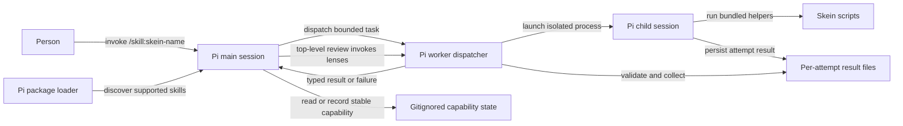
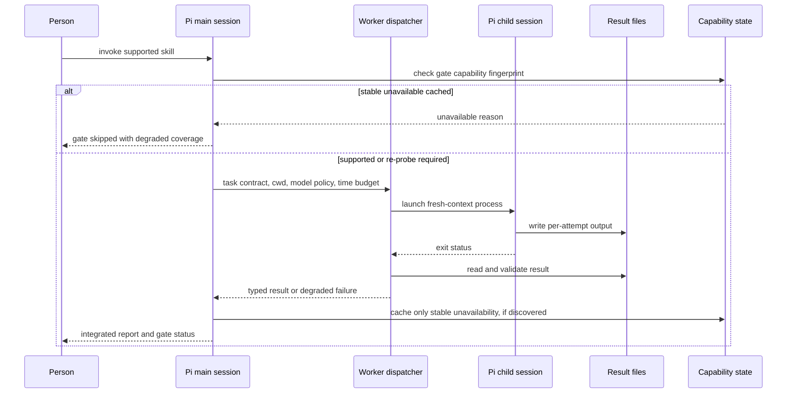

# Task: Pi package and skill port

**Status**: In Progress (Phase 1 complete; Phase 2 private-profile design revised with maintainer approval; re-review required)
**Component**: meta
**Assigned to**: Pi agent + maintainer
**Priority**: High
**Branch**: `feature/pi-plugin-port`
**Created**: 2026-09-29
**Review Gates**: none

## Objective

Make Skein installable in Pi as an honest, working package with Pi-native skill instructions, without regressing the Claude and Codex plugins. Keep model selection user-controlled and isolate expensive worker contexts.

## Context

Skein currently ships 15 Claude skills in `plugins/skein/skills/` and 15 Codex skills in `plugins/skein-codex/skills/`. The existing skills use their harnesses' own delegation tools and script anchors; merely exposing one mirror to Pi would register commands that cannot reliably execute. Pi packages can declare individual skill paths in a root `package.json` and be installed from Git. Pi skill names use lowercase letters, digits and hyphens, not Skein's current `skein:` invocation spelling. The current repo has no root `package.json`; this work must not make Claude/Codex discover an unfinished Pi mirror.

Observed implementation anchors (verified at plan creation): `plugins/skein/skills/dev-plan/SKILL.md` dispatches Explore with Claude's `Agent`; `plugins/skein/skills/conduct/SKILL.md` assumes synchronous `Agent` dispatch; `plugins/skein/skills/fan-out/fan-out.sh` launches `claude -p`; `scripts/lib/bundle-map.sh` declares the existing bundle targets; `scripts/check-prompt-parity.sh` compares the current two mirrors. `tests/parity/test-managed-skills-parity.sh` compares the current two managed-skill lists and keeps the legacy cleanup subset separate. These facts are part of the plan contract; correcting a stale fact later requires re-review once a marker is written. No git refs or dependency versions were specified in the request; no root Node manifest exists yet.

## Requirements

1. Ship a Pi package whose `pi.skills` is an explicit per-skill allowlist (no whole-directory or wildcard entry), updated only when a skill and its dependencies pass readiness tests; document local and pinned-Git installation, update, removal, and Pi command spelling. No false implication of `skein:` namespace support.
2. Port all 15 skill behaviors in stages. Keep a capability/inventory matrix with explicit status for each skill; never expose an orchestrator before its dependencies and tests are ready. Reuse harness-neutral assets where safe, without relying on Claude or Codex caches or environment variables.
3. Separate task intent from model policy. Use portable role contracts and structured output; allow optional user tier mappings (judgment, mechanical, factual) with a documented selected-model fallback and no claim that thinking levels are uniform across providers. Never silently substitute a model or count a degraded review as a pass.
4. Establish a bounded fresh-context worker mechanism for Pi (model choice, working directory, timeout/cancellation, stdout/stderr and schema handling, disk persistence, measured cost/usage when reported and explicit `unknown` otherwise). Do not assume Pi provides Claude's `Agent` or Codex's `spawn_agent`. Limit delegation to one level per process tree; explicitly document the subprocess reset for fan-out → conduct, or disallow the route if isolation cannot be verified.
5. Preserve the existing shared-script, marker, report, and auto-fix safety contracts; explicitly test any altered bundling, path resolution, and trust boundaries. Mark unsupported review gates `unavailable` and skip repeated probes on subsequent runs while the same capability fingerprint applies; emit a visible per-run `skipped` gate outcome linked to that reason. Never count skipped gates as passed.
6. Only cache stable capability absence (e.g. missing required gate implementation or executable), never a timeout, authentication failure, parse error, or transient process failure. Re-probe on relevant runtime/plugin/config change or explicit operator refresh. If all required gates are unavailable, stop rather than entering a false convergence loop; report partial coverage distinctly from a clean pass.
7. Keep the Claude and Codex mirrors and their tests working; add Pi-specific install/discovery and end-to-end checks; run `just ci` before PR. Pre-release smoke coverage must include all 15 skill command paths, a delegated review, a confirmation-sensitive release dry run, and two genuinely configured provider/model classes. Absence of those credentials blocks the portability claim; do not represent fake-CLI CI as equivalent.

## Review Focus

- Worker subprocess isolation, cancellation, credentials/project trust, and model fallback when authentication or capability is absent; no secrets or raw credentials in cache keys or reports.
- Cached stable gate unavailability versus transient failure; fingerprint invalidation, explicit re-probe, and degraded-result semantics across resume and subsequent runs.
- Names and paths under package installation (including paths with spaces and Git-cache relocation), bundle/script ownership, and avoidance of accidental exposure of unsupported skills.
- Pi-native cross-skill composition and the honest degraded status of unavailable gates.
- Portability across at least two configured provider/model classes without hardcoded vendor model IDs; required release smoke, not an optional CI substitute.

## Implementation Checklist

The phases below are the contract for implementation. Keep progress below the eventual review marker; do not mark this plan reviewed until an independent plan review has reconciled findings.

### Phase 1: Capability inventory and Pi package skeleton

**Impl files:** `package.json, plugins/skein-pi/skills/show-me/SKILL.md, docs/dev_plans/20260929-feature-pi-plugin-port.md`
**Test files:** `tests/pi/test_package.py, tests/pi/test_skill_inventory.py`
**Test command:** `uv run --with pytest python -m pytest tests/pi -q`
**Goal:** Every exposed Pi skill must be installable and operational, not just syntactically discoverable; the package manifest never includes an unfinished skill.

- Inventory all 15 skills in a maintained matrix with dependencies, readiness, target command name, and per-harness interactions. Add an explicit `pi.skills` path only after its dependencies and readiness checks pass; assert the exact allowlist in tests, not merely that discovered names are valid.
- Start with standalone `show-me` only. Cover Pi frontmatter and `/skill:skein-show-me` invocation; do not expose `grill` (needs `dev-plan update`) or `plan-view` (needs generator and templates) yet.
- Test local installation and path-with-spaces discovery with disposable Pi agent settings. For pinned-Git installation, use a temporary committed fixture in Phase 1; test the real published ref in Phase 4. Pi's interactive command is `/reload` (not `--reload`): test it interactively where possible or test restart-based discovery and document `/reload` separately. Never mutate the person's Pi settings.

### Phase 2: Isolated Pi worker, model policy and independent skills

**Impl files:** `plugins/skein-pi/extension.ts, plugins/skein-pi/lib/*, plugins/skein-pi/skills/rfc-finder/SKILL.md, plugins/skein-pi/skills/content-draft/SKILL.md, plugins/skein-pi/skills/content-review/SKILL.md, plugins/skein-pi/skills/spec-compliance/SKILL.md, plugins/skein-pi/skills/update-docs/SKILL.md, plugins/skein-pi/skills/plan-view/*, package.json`
**Test files:** `tests/pi/test_worker.py, tests/pi/test_model_policy.py, tests/pi/test_private_profile.py, tests/pi/test_single_worker_skills.py, tests/pi/test_plan_view.py`
**Test command:** `uv run --with pytest python -m pytest tests/pi -q`
**Goal:** Child workers get only their task contract, an explicit model decision, measured-or-unknown cost and a bounded lifetime; failures cannot masquerade as completed work.

- Establish the revised private-profile launch boundary before implementing the dispatcher. Each attempt gets a disposable mode-0700 HOME/agent/temp profile, newly generated mode-0600 settings/model/auth files, explicit curated system/append prompts, pinned session-dir and an environment constructed from scratch. Never reuse or copy the parent's settings, packages, auth/model stores or executable credential commands. Invoke approved absolute Node/Pi paths with `--no-session --no-skills --no-extensions --no-context-files --no-approve` and explicit resource/tool allowlists. The initial isolation-test lane is text-only `openai-completions`, literal API key, thinking off and no tools; other credential/API/tool lanes must fail closed until separately designed and tested. Test contaminated parent/project instructions, settings, extensions, packages, credential commands, environment injection and nested-dispatch attempts. If isolation fails, stop before the dispatcher or registration. See `plugins/skein-pi/lib/worker-profile.md` for the approved boundary and cleanup residuals.
- Require an explicit operator-approved provider/model/endpoint/credential selection, supplied independently of task text; no identity inferred from ambient PI variables or a CLI default. The PI shell-tool identity probe remains evidence only, not an arbitrary shell's proof of provenance. Support OAuth/cloud/extension-backed credentials only after separate lifecycle/refresh/writeback verification; the initial profile builder rejects them and never substitutes an API-key model. Use `pi --mode json`, validate exact identity and authoritative final message plus `agent_settled`, and preserve auth/model failure. Report missing or synthetic-zero usage as `unknown`, not measured zero; cost requires approved rate/provenance information. Test model unavailable, auth failure and no-approved-identity stop.
- Implement argv-based launch (never interpolate untrusted prompts into shell), bounded concurrent processes, process-group cancellation and capped output/attempt files. Consume JSON events as a stream and retain only the validated result, usage summary and safe diagnostic subset in guarded state (not raw event streams containing prompts or credentials). Define typed success, timeout, invalid-output and launch/auth failures; no recursive orchestration in a child.
- Port five independent single-worker skills. Port `plan-view` with its real `generate.py`, templates and required assets; expose only when both deterministic and `--rich` paths work through the worker layer (or explicitly split the command into tested supported modes without broken rich links). Verify relocated install-path resolution and tier mappings without pinning provider IDs.

### Phase 3: Plan composition, disk-first review and capability-aware gates

**Impl files:** `plugins/skein-pi/skills/dev-plan/*, plugins/skein-pi/skills/grill/*, plugins/skein-pi/skills/review-plan/*, plugins/skein-pi/skills/deep-review/*, plugins/skein-pi/skills/review-gauntlet/*, plugins/skein-pi/lib/*, scripts/persist-review-state.sh, scripts/persist-deep-review-state.sh, scripts/lib/bundle-map.sh, scripts/bundle-appliers.sh, .gitignore, package.json`
**Test files:** `tests/pi/test_review.py, tests/pi/test_plan_composition.py, tests/pi/test_gate_capabilities.py, tests/pi/test_bundles.py, tests/reconciliation/test-review-plan-state.sh, tests/reconciliation/test-deep-review-state.sh`
**Test command:** `uv run --with pytest python -m pytest tests/pi -q && just reconciliation-tests && just check-sync`
**Goal:** Plan decisions and review findings follow working Pi routes; validated persisted records and cached stable skips never become false approvals.

- Implement `dev-plan`'s create/update and `grill`'s decision-write route before exposing either; register `review-plan` only once it can route decisions inline through those skills and write a valid marker. Keep each unready skill off the explicit manifest allowlist. Keep `deep-review`'s lens dispatch at top-level review orchestration; the gauntlet itself runs its multi-worker gate in its own process/top-level context and sends only fixer batches to child workers, never nests a lens dispatcher inside a fixer child.
- Extend canonical review-state persistence (`--harness pi`) and the Pi gauntlet's harness-specific state anchor, without changing the meaning of existing Claude/Codex state files. Preserve reconciler, marker, per-attempt persistence, auto-fix and report contracts; bundle only used scripts from canonical sources and check all three harnesses. Resolve assets from installed package paths.
- Probe gate support before launch; cache only stable absence using guarded, repo-local gitignored state keyed by a non-secret environment/package fingerprint. On later runs emit `skipped` referencing `unavailable` without invoking the gate. On changed fingerprint or explicit re-probe, try again. Runtime timeouts/auth/invalid output stay uncached and surfaced as degraded failures.
- A round with skipped gates cannot produce a clean full-coverage approval; zero runnable gates exits visibly instead of consuming convergence rounds. Resume never re-labels cached skips as approvals. Test corrupted cache, stale fingerprint, refresh and credential safety.

### Phase 4: Complex orchestration, install coverage and release readiness

**Impl files:** `plugins/skein-pi/skills/conduct/*, plugins/skein-pi/skills/fan-out/*, plugins/skein-pi/skills/release/*, justfile, README.md, AGENTS.md, docs/dev_plans/README.md, package.json`
**Test files:** `tests/pi/test_orchestration.py, tests/pi/test_install.py, tests/pi/test_skill_inventory.py, tests/pi/test_release_smoke.py`
**Test command:** `uv run --with pytest python -m pytest tests/pi -q && just ci`
**Goal:** All 15 Pi skills work through their declared interfaces, and the existing Claude and Codex gates remain green.

- Port orchestration with one worker level per process tree, controlled worktree/process cleanup and explicit cross-skill routing. Define and test fan-out → separate Pi worker process → conduct → child implementer/test-writer as a new process tree; if nested invocation/permissions cannot be verified, disallow that route explicitly instead of claiming feature parity. Preserve release's confirmation and safety boundaries; test dry-run and refusal without any remote mutation.
- Register Pi tests in `just ci`, update README/AGENTS with supported commands and pinned Git install, and update the plan index. Test local and commit-pinned Git installs against a disposable committed remote or reachable feature-branch commit in disposable settings; verify a public release tag after publication, not before it exists. Before release require a documented smoke matrix covering every skill path, delegated review, release confirmation/refusal and two authenticated provider/model classes (not fake-CLI-only). If credentials/capabilities are unavailable, mark release verification blocked instead of claiming portability. Run full CI in background before PR, check staged paths for secrets, and regenerate bundles from canonical sources.

## Technical Specifications

### Files to Modify

- `README.md`, `AGENTS.md` — installation, supported skill matrix, port and verification instructions.
- `scripts/persist-review-state.sh`, `scripts/persist-deep-review-state.sh` — accept `pi` as a third, distinct harness identity while keeping existing Claude/Codex formats and tests stable.
- `scripts/lib/bundle-map.sh`, `scripts/bundle-appliers.sh`, and related parity checks — deliver Pi's canonical shared scripts while keeping generated copies byte-identical; do not copy artifacts by hand.
- `docs/dev_plans/README.md` — keep this plan's index entry current.

### New Files to Create

- `package.json` — Pi package root with explicit individual `pi.skills` paths for ready skills, never a skills-directory/wildcard declaration.
- `plugins/skein-pi/skills/<skill>/SKILL.md`, `plugins/skein-pi/skills/plan-view/generate.py` and required templates/assets — Pi-specific instructions, complete support files and portable anchors; only expose completed skills.
- `plugins/skein-pi/` worker-dispatch and gate-capability implementation — exact language/layout to be selected after validating Pi CLI behavior and package-path resolution.
- `tests/pi/` — package manifest, discovery, worker failure, capability-cache, parity, and end-to-end tests.

### Architecture Decisions

- Use a dedicated third mirror, not a search/replace of Claude or Codex instructions. Source-neutral scripts and prompt schemas may be shared; harness calls are rewritten explicitly.
- Revised worker strategy (maintainer-approved after the CLI spike): one-shot JSON subprocesses inside disposable private Pi profiles, prepared by `plugins/skein-pi/lib/private_profile.py`; no SDK dependency is selected. Resource-disable flags alone were disproven: parent system prompts and package-manager execution survive. The profile builder generates only approved configuration/credentials, passes curated prompt files and absolute runtime paths, and inherits no environment. Explicit operator selection is the initial identity authority, not ambient PI variables; the approval record must remain outside task/model control. The first verified lane is API-key/text/no-tools; OAuth, other API adapters, reasoning levels and role-specific tools need their own gates. No-tools prevents nested dispatch through tools but is not an OS sandbox; do not quietly enable read/bash to unblock a skill. Caller must reap the child before profile cleanup; ordinary deletion does not guarantee secure erasure, and abrupt host death can leave a private credential directory. Implement the bounded dispatcher only after the revised profile isolation tests pass. JSON exit 0 is not success; exact identity, terminal state and result schema govern acceptance, and synthetic/missing measurements remain unknown.
- Distinguish package availability from operational readiness: `pi.skills` enumerates individual paths and changes only at readiness gates; a present but unregistered `SKILL.md` stays undiscoverable through this package. The subprocess prototype established that worker-backed skills need a trusted package extension: it owns current-model/auth resolution, shows the exact role/task/model/endpoint for user confirmation, passes the resolved literal key to the host on a dedicated fd, and exposes only bounded task submission. The initial extension lane rejects OAuth, non-`openai-completions` APIs, command/fallback credentials, headers/env auth and no-UI execution; broadening any lane requires its own tests. The standalone show-me skill remains independent of the extension. Preserve the same readiness rule for cross-skill references: never chain into a not-yet-registered command.
- Persist stable gate capability decisions in a repo-local gitignored Pi state directory with guarded writes and a minimal fingerprint of relevant executable availability/version, Pi runtime, Skein package revision, and non-secret gate configuration. A matching `unavailable` record avoids probing the same unsupported gate again and produces a per-run `skipped` record naming the cached cause. Recompute on relevant change or explicit re-probe; temporary runtime errors remain uncached. A cached skip is never a clean gate pass. Do not reuse a different target's convergence ledger as the capability cache.

### Dependencies

- Pi CLI and its package/skill loader (external runtime; verify supported version during implementation); existing shell/Python test dependencies per `AGENTS.md`. No new npm runtime dependency assumed at planning time.

### Integration Seams

| Seam | Writer | Caller | Contract |
|------|--------|--------|----------|
| Package skill registration | Explicit per-skill root manifest allowlist | Pi loader | Only individually listed, readiness-tested skill paths become discoverable; skill names are collision-resistant. |
| Worker request/result | Pi skill orchestrator through trusted package extension | Extension/host/dispatcher/private child | Model/task cannot supply credentials, model, runtime or paths; user sees exact role/task/model/endpoint before approval; key uses a dedicated fd; validated terminal JSON event and result or typed failure, never a silent pass. |
| Script path | Pi skill | Bundled or local supporting script | Resolves relative to the installed skill/package, independent of invoking cwd and Claude/Codex env vars. |
| Result persistence | Worker | Collector/orchestrator | Each attempt has isolated files; collector owns aggregation, no shared concurrent writer. |
| Review composition | Pi top-level review-plan/deep-review or gauntlet process | Lens dispatcher and external gates | Multi-worker lenses are dispatched only by a top-level orchestrator; gauntlet fixer children never dispatch lenses. Stable unavailable capability may be reused as a cached skip, never approved. |
| Worktree process boundary | Pi fan-out | Conduct process and its workers | A separate worker process starts a new one-level orchestration tree; if nesting cannot be verified, reject fan-out → conduct rather than degrade silently. |
| Capability persistence | Gate probe | Later review runs | Stable `unavailable` record keyed by non-secret runtime/package/config fingerprint; explicit refresh or fingerprint change re-probes; transient failures never cached. |

## Architecture & Call Flow

Component graph — package discovery, main-session orchestration, isolated workers, and durable results:



Trigger order — one delegated lens/implementation task (simple skills skip the dispatcher):



Context lifecycle:

| Step | Trigger | Enters context | Cleared/persisted | Turn boundary |
|------|---------|----------------|-------------------|---------------|
| 1 | Person invokes skill | Request, selected skill instructions, relevant repo context | Main session persists | Before worker dispatch |
| 2 | Orchestrator dispatches task | Bounded prompt, approved project rules and explicit tool/resource allowlist; no parent chat or ambient skills/extensions/context | Child session ephemeral; attempt result persisted to disk | Child exits, times out, or is cancelled |
| 3 | Dispatcher validates | Terminal JSON stop reason, measured usage if available, bounded result and artifact references | Invalid/partial attempts remain diagnostic; only valid records feed collector; absent usage stays unknown | Typed handback to main session |
| 4 | Main checks capabilities | Stable non-secret fingerprint and cached unavailable reasons | Repo-local gitignored state persists across runs; invalidates on runtime/package/config change or explicit refresh | Before each gate dispatch |
| 5 | Main reports | Validated summary, skipped/unavailable gates, artifact paths | Main conversation persists; large raw findings stay on disk; skipped gates never imply approval | User decision / next phase |

> **Architecture gate answered:** the maintainer confirmed the topology with stable-unavailable gate skipping, then approved disposable private worker profiles after the Phase 2 CLI spike disproved parent-profile isolation. These revisions change the reviewed contract: the existing review marker below is now stale and must be refreshed only by independent re-review, not by hand.

## Testing Notes

### Test Approach

- Unit tests for package manifest/skill discovery, worker argv/cancellation/typed result, capability-cache invalidation and safety; no live model or network required in CI (fake Pi binary and deterministic fixtures).
- Integration tests for real Pi local-package discovery and representative simple, delegated and confirmation-sensitive paths. Required pre-release authenticated smoke matrix covers all 15 skill commands and at least two provider/model classes; keep this external-cost check separate from deterministic CI and block release if it cannot be run.
- Existing Claude/Codex parity, bundle, gauntlet, reconciliation and pytest suites continue to pass via `just ci`.

### Test Results

- Implementation results and verification limits are recorded in the below-marker phase handoffs; the revised private-profile architecture still requires re-review.

### Edge Cases to Test

- Package installed outside repository and at paths containing spaces; cwd different from package root.
- Child model unavailable/unauthenticated, parent model not transferable, quota error, timeout, interrupt, truncated JSON and output containing untrusted text. Sentinel user/project context and unapproved tools/resources cannot enter worker process; JSON exit code 0 with failed `message_end` is a failure, and missing usage is `unknown`.
- Stable unsupported gate across two runs: second run skips invocation; changed prerequisite or explicit refresh re-probes; transient timeout/auth error does not persist as unavailable.
- All gates unavailable, partially available, crash after result file write, resume after process kill, and stale/corrupt capability state; no false full-coverage pass.

## Acceptance Criteria

- All 15 Pi skill commands are deliberately named, documented and installable from a pinned Git ref; the explicit `pi.skills` per-path allowlist excludes every unfinished skill, enforced by readiness tests.
- Pi-only interactions use Pi-supported APIs or tested isolated subprocesses; no skill assumes Claude `Agent`, Codex `spawn_agent`, `${CLAUDE_PLUGIN_ROOT}`, or `$SKILL_DIR`.
- Workers have explicit model selection/fallback behavior, isolation and bounded lifecycle; results validated before merging.
- A stable unavailable review gate is skipped on a matching subsequent run, transparently marked skipped/unavailable, re-probed when prerequisites change or on explicit refresh, and never reported as a clean review pass.
- Real package installation/discovery and path resolution verified; deterministic Pi test suite and existing `just ci` pass. Before release, required real-Pi smoke verifies every skill, delegated review, safe release refusal, and two authenticated provider/model classes; absent credentials block the claim rather than silently waiving it.
- Code reviewed, documentation updated, and no changes committed directly to `main`.

<!-- reviewed: 2026-09-29 @ 9763ed9443a091c115d8cdf34edacd9ba0d37670 -->

## Progress

- [x] Phase 1: Capability inventory and Pi package skeleton
- [ ] Phase 2: Isolated Pi worker and model policy
- [ ] Phase 3: Disk-first review and capability-aware gates
- [ ] Phase 4: Complex orchestration, install coverage and release readiness

### Phase 1 capability inventory

This maintained inventory is implementation progress below the review marker; the reviewed contract above is unchanged. Only **ready** rows may appear in `package.json`'s exact `pi.skills` allowlist. A target command in this table is not a claim that it is installed. Claude and Codex remain separate authored mirrors; neither is a Pi runtime dependency.

In the interaction columns, **Agent** means Claude's clean-context Agent dispatch; **spawn_agent** means Codex's native worker dispatch subject to that skill's delegation-availability checks. Claude script anchors use `CLAUDE_PLUGIN_ROOT`; Codex uses `SKILL_DIR`. Pi must use installed-package-relative resources instead, never either environment variable or a harness cache.

| Skill | Target Pi command | Pi readiness | Dependencies / readiness gate | Claude interaction | Codex interaction | Pi interaction |
|---|---|---|---|---|---|---|
| show-me | `/skill:skein-show-me` | ready | Standalone instructions; frontmatter, exact allowlist, real install/discovery and command expansion tests | Inline format selection; optional external artifact skills | Inline format selection | Current session; text/Mermaid, opt-in standalone HTML; no external skill |
| rfc-finder | `/skill:skein-rfc-finder` | skipped (unavailable) | Deliberately out of Pi scope; no retrieval/network lane | Single Agent lookup | Single spawn_agent lookup | Not exposed; unavailable by decision |
| content-draft | `/skill:skein-content-draft` | ready | Trusted no-tools worker route; guidelines bundled locally; confirmed session-fact handoff and end-to-end/static readiness checks | Agent drafts from curated session facts | spawn_agent drafts from curated facts | Main confirms facts; bounded mechanical text worker; no file writes |
| content-review | `/skill:skein-content-review` | ready | Trusted no-tools worker route; both rule sets bundled; one-file/pasted-content and structured-result readiness checks | Agent structured review | spawn_agent structured review | Main reads/confirm type; bounded mechanical text worker; advisory only |
| spec-compliance | `/skill:skein-spec-compliance` | skipped (unavailable) | Deliberately out of Pi scope; no spec retrieval lane | Judgment Agent | Judgment spawn_agent | Not exposed; unavailable by decision |
| update-docs | `/skill:skein-update-docs` | implemented (review pending) | Main-session bounded diff/document snapshots; typed no-tools audit worker; live re-read before explicitly approved edits | Agent audit, main applies approved changes | spawn_agent audit, main applies changes | Typed read-only audit; main owns snapshot, review and writes; no PR edits |
| plan-view | `/skill:skein-plan-view` | skipped (unavailable) | Deliberately out of Pi scope; generator/templates not being ported | Generator plus rich render Agents | Generator plus rich render workers | Not exposed; unavailable by decision |
| dev-plan | `/skill:skein-dev-plan` | staged (Phase 3, first) | Next composition dependency; Explore, templates and main-owned create/update writes | Explore Agent on create; inline updates | Fresh spawn_agent Explore; inline updates | Planned next; not exposed until implementation and tests pass |
| grill | `/skill:skein-grill` | staged (Phase 3, with dev-plan) | Depends on working dev-plan update route and interactive decision persistence | Inline interview, dev-plan update | Inline interview, dev-plan update | Planned with dev-plan; not exposed until both routes pass |
| review-plan | `/skill:skein-review-plan` | blocked (Phase 3) | Worker; dev-plan/grill; lens collector, reconciler, marker, persistence and auto-fix bundles | Parallel Agent lenses, contradiction pass, inline decisions | Parallel spawn_agent lenses, contradiction pass, inline decisions | Top-level lenses; disk-first results; Pi marker/persistence route |
| deep-review | `/skill:skein-deep-review` | blocked (Phase 3) | Worker; lens budgets/collector, reconciliation, persistence and auto-fix bundles | Parallel Agent lenses | Parallel spawn_agent lenses | Top-level lenses; disk-first results; Pi state identity |
| review-gauntlet | `/skill:skein-review-gauntlet` | blocked (Phase 3) | deep-review; ledger/guards; fixer worker; stable gate capability cache | Top-level deep-review/external gates; Agent fixer | Native Codex gates; deep-review gated; security deferred | Top-level gates; isolated fixer; unavailable/skipped never passed |
| conduct | `/skill:skein-conduct` | blocked (Phase 4) | Worker; reviewed marker/parser, phase prompts, CI parity; optional gauntlet route | Agent implementer/test-writer/reviewer; top-level gauntlet | spawn_agent workers; top-level gauntlet | Bounded phase workers; main orchestrator; tested handback |
| fan-out | `/skill:skein-fan-out` | blocked (Phase 4) | Pi process launcher; worktree/state cleanup; conduct reset verification; optional gauntlet | claude subprocesses; clean-context test-writer; conduct opt-in | codex exec worktrees; nested workers gated | Separate process trees only if isolation proven; otherwise reject route |
| release | `/skill:skein-release` | blocked (Phase 4) | Release lib/references; pinned git/jq/gh checks; confirmation/refusal dry-run | Main-session audit and confirmation before remote mutation | Main-session audit and confirmation before remote mutation | Main owns exact target/title/body approval; no remote writes in tests |

**Pi scope decisions and sequence:** `plan-view`, `rfc-finder`, and `spec-compliance` are intentionally skipped and must remain absent from `pi.skills`; they are not unfinished registrations awaiting a follow-up probe. The next additions are `update-docs`, then `dev-plan` and `grill`, then `review-plan`, then `conduct`. `update-docs` is implemented below but remains unregistered until independent review passes. All other unready rows remain excluded.

### Phase 1 installation and verification

Validated runtime: **Pi 0.87.1**. Phase 1 exposed only `/skill:skein-show-me`; `skein:` is not a Pi namespace. At that checkpoint no worker or extension was shipped. Phase 2 now registers the readiness-tested trusted worker extension, while the explicit skill allowlist still exposes only show-me. The package has no npm runtime dependencies or lifecycle scripts. `private: true` prevents accidental npm publication; local/Git package installation remains supported.

Local install (quote paths with spaces):

```sh
pi install "/absolute/path/to/skein"
pi list
pi update "/absolute/path/to/skein"
pi remove "/absolute/path/to/skein"
```

Local sources are read in place. Restart Pi after installation/edits, or enter **`/reload`** in an interactive session (there is no `--reload` flag). Invoke `/skill:skein-show-me explain the request call tree`. The tests verify restart-based discovery and real command expansion, not interactive TUI `/reload` or model output quality.

Pinned Git install, **after a commit containing this package is published** (replace `COMMIT_SHA` with that full commit; no existing release is claimed to contain this port):

```sh
pi install git:github.com/vr000m/skein@COMMIT_SHA
pi update git:github.com/vr000m/skein@COMMIT_SHA
pi remove git:github.com/vr000m/skein@COMMIT_SHA
```

Updating a pinned source reconciles that ref; it does not advance to main. Select and install a new reviewed ref to upgrade. `pi update --extensions` reconciles all packages; bare `pi update` updates Pi itself. These commands normally alter personal settings; use a disposable `HOME` and `PI_CODING_AGENT_DIR` for experiments. Do not run test installs against the person's settings.

`tests/pi/test_package.py` runs the real Pi CLI with a private environment, disposable home/agent/workspace and no credentials. A temporary committed Git fixture is reached through a private Git `insteadOf` rewrite; only the file transport is allowed, so no hosted ref/network is needed. Its default branch advances to a deliberately broken revision after the pin, proving install/update still select the ready commit. Unregistered Pi skills and legacy-mirror decoys remain undiscoverable. RPC steering/queue inspection verifies `/skill:skein-show-me` expands the installed instructions and arguments without a provider call. Missing Pi fails the readiness suite rather than silently skipping it.

### Phase 1 handoff

- Scope: root package, standalone Pi show-me, this inventory/install guide, and the two Phase 1 test modules only. No Claude/Codex edits, script bundling changes, worker layer, CI registration, public release, or personal settings changes.
- Tests: `uv run --with pytest python -m pytest tests/pi -q` — **6 passed** on Pi 0.87.1. `ruff format --check tests/pi`, `ruff check tests/pi`, `just check-sync`, `just check-prompt-parity`, `just check-trunk-snippet-parity`, and `git diff --check` passed. Local install/update/remove, spaces, relocated Git checkout, immutable commit pin, exact discovery, full skill-body/argument expansion and inventory/frontmatter contracts are covered. Pi stores local install paths relative to the disposable agent settings; tests validate their resolved identity. Built-in non-skill commands are excluded from skill census assertions.
- Verification limits: no live model response or interactive TUI `/reload` was exercised; no public ref was installed. Full `just ci` was not run (no PR opened or updated). These are not release-portability claims.
- Next: Phase 2 must first establish worker CLI isolation and model identity. All other 14 skills remain blocked and absent from the manifest. Full CI and authenticated two-provider/all-command release smoke remain later-phase gates, not satisfied by these deterministic tests.

### Phase 2 original spike handoff — parent-profile isolation blocked

- Started the real-CLI spike on Pi 0.87.1; Phase 2 remains unchecked. Findings and proposed continuation are in `plugins/skein-pi/lib/worker-spike.md`. The reviewed contract above the marker is unchanged.
- **Blockers:** the planned disable/trust flags still load user `SYSTEM.md` and `APPEND_SYSTEM.md`. Explicit prompt overrides close that leak, but user packages are still resolved and the configured package-manager command can execute, even with all resource-disable flags and offline mode. Reusing the person's agent profile does not meet the worker isolation contract.
- **Other observations:** JSON auth failures can exit 0; missing provider usage becomes synthetic zeros; inherited PI model variables do not select the child model; LLM bash does replace stale identity values at its own boundary; model patterns resolve fuzzily and unknown model IDs may be forwarded. The dispatcher must validate exact approved identity and terminal result state and report absent measurements as unknown.
- Tests use a real CLI against a deterministic loopback endpoint and disposable settings, not a live model/provider. The malicious-extension stand-in is a benign marker/tool fixture with a positive loading control; the package-manager stand-in only writes a marker and fails. No personal credentials/settings or network registry are used.
- Validation: `uv run --with pytest python -m pytest tests/pi -q` — **21 passed** (6 Phase 1 checks + 15 spike observations/controls); `ruff format --check tests/pi`, `ruff check tests/pi` and `git diff --check` passed. Passing observation tests must not be interpreted as passing worker readiness. No full CI, authenticated model smoke, production timeout/descendant-cleanup tests or public-ref installation was performed.
- **Stop per Phase 2 gate:** no production dispatcher, worker skills, plan-view assets or manifest entries added. Recommend revising the launch contract to use a disposable worker profile with narrowly provisioned, operator-approved model/credentials (never a wholesale settings/auth copy). An SDK child with explicit loading is an alternative. Credential refresh/writeback, identity provenance and tool-level nested-dispatch restrictions require an explicit design before resuming.

### Phase 2 private-profile revision and isolation retest

- Maintainer decision: retain the CLI approach but use a disposable private profile with explicitly approved model/credentials; retest before implementing the dispatcher. The design is now in `plugins/skein-pi/lib/worker-profile.md` and the preparation-only builder in `private_profile.py`. Unlike the original spike, this revision updates the above-marker contract; **the old review marker is intentionally stale pending independent re-review**.
- Builder boundary: explicit trusted approval record and separate literal key; absolute approved Node/Pi paths; fresh mode-0700 HOME/agent/temp root; newly generated mode-0600 model/settings/auth files; curated prompt files; private session-dir; environment built from scratch. No ambient identity fallback, shared auth copy, credential command, OAuth refresh or parent writeback. It yields launch parameters but does not launch a worker or implement dispatcher logic.
- Retest: **55 passed** via `uv run --with pytest python -m pytest tests/pi -q` (6 Phase 1 + 15 original spike controls + 34 private-profile checks). Ruff format/check and diff checks passed. Real Pi 0.87.1 contacted only a deterministic loopback endpoint requiring the approved fixture key. Parent/project prompt, package, extension, credential-command, session/tool settings and environment-injection sentinels stayed out; parent/project contents remained unchanged. Model-invented shell dispatch was refused. Permissions, minimal credential storage, per-attempt separation, cleanup and invalid/absent approvals were checked.
- **Scoped result:** the ambient-startup gate passes for literal API-key, text-only `openai-completions`, thinking off, **no-tools** profiles. This is not a same-UID OS sandbox, hosted-provider smoke, complete worker readiness or proof of cost measurement. OAuth/cloud/extension credentials, other APIs/reasoning settings, and all tool-enabled lanes deliberately fail closed until separately verified.
- No dispatcher, concurrency/output limits, result persistence, new skill registration, or Phase 3/4 work was implemented. All additional skills remain blocked. Next is design re-review, then the bounded dispatcher using this boundary, with exact identity/terminal/result checks and unknown usage handling; required credential/tool lanes must pass their own gates before skill ports are exposed.

### Phase 2 bounded dispatcher handoff

- Added `plugins/skein-pi/lib/dispatcher.py`, a trusted-host library for the verified API-key/text/no-tools private-profile lane. It implements operator-confirmed opaque selection capabilities, strict task/result schemas, exact identity and terminal-event checks, unknown-usage semantics, bounded queue/concurrency/time/input/output, process-group cancellation/escalation, and immutable guarded one-writer attempt persistence. Raw events, prompts and stderr are never persisted.
- Authority remains separated: `Dispatcher.run()` accepts only task id/attempt/role/prompt. It cannot accept credentials, approvals, model/runtime overrides, paths or tools. Direct selection construction is refused; a privileged host must call `approve_selection` with an operator-facing callback that sees a redacted identity summary, never the key. This is an in-process trusted-host boundary, not a same-UID sandbox.
- `tests/pi/test_dispatcher.py` covers real Pi loopback paths and adversarial process fixtures, including early stdin close, malformed/truncated streams, duplicate JSON, false success after tool events, wrong identity/cwd, missing/synthetic usage, auth/runtime errors, credential-bearing result/diagnostics, stdout/stderr floods, running/queued cancellation and timeout, TERM-resistant descendants, concurrency, shell-like prompt bytes, authority injection, nested dispatch, immutable claims and symlink escapes.
- Independent focused review initially failed two issues: broken stdin could permit a result without complete task delivery, and Selection was an ordinary assertion. Both were fixed and regression-tested. A fresh re-review returned **PASS within the documented in-process trusted-caller boundary**. It did not refresh this plan's review marker or claim full plan review.
- Validation: `uv run --with pytest python -m pytest tests/pi -q` — **106 passed**; Ruff format/check passed. Existing parity/diff checks are rerun at final handoff. No personal credential store was read or copied; the user's newly saved Anthropic login was deliberately outside this work.
- Remaining integration gate: no model-controlled skill may read credentials or manufacture approval/launch commands. A trusted package extension/operator host must bind approved selection/credential state and expose only bounded task submission before any worker skill can use the library. That host and each required credential/tool lane need end-to-end tests. The manifest therefore remains show-me only; Phase 2 remains incomplete.

### Phase 2 trusted Pi extension handoff

- Added the package extension `plugins/skein-pi/extension.ts` and fd-based `worker_host.py`; `package.json` registers the extension explicitly while `pi.skills` remains show-me only. The extension registers one sequential `skein_worker` tool. It derives model/auth/runtime/cwd paths from trusted Pi context, not tool arguments; only role and prompt are model-supplied.
- Supported lane remains intentionally narrow: selected `openai-completions` model, non-OAuth API key from a non-command/non-fallback Pi credential source, child thinking off and no tools. Unsupported API/auth/header/env/no-UI cases fail visibly. `SKEIN_PI_PYTHON` may select an absolute interpreter; otherwise fixed absolute system candidates are tried. No npm runtime dependency or lifecycle script is added.
- Every invocation presents the **full JSON-escaped prompt**, role, selected provider/model, endpoint, credential source and child constraints through Pi UI. Decline starts no child. On approval the key travels only through dedicated fd 3 to the host; it is absent from request JSON, argv, child environment, confirmation and returned envelope. The host accepts only a dispatcher `completed` envelope; other statuses become failed tool results.
- Real Pi RPC tests install the package from a relocated path containing spaces, answer the extension confirmation, and exercise parent → extension → host → private child → validated result. They verify the child has no tools, the confirmation displays the exact task/model/endpoint, the key is absent from RPC records, state is persisted, and decline makes no child request. Runtime attempt state is gitignored at `.skein-pi-attempts/`.
- Independent review first failed because approval did not display the task. The confirmation was changed to show the exact JSON string and role; a fresh re-review returned **PASS** with no remaining concrete defect in the scoped route. This remains a focused implementation review, not a full plan re-review or marker refresh.
- Validation at the host-integration checkpoint: full deterministic Pi suite **108 passed**. Worker-backed skills remained unregistered at that checkpoint pending skill-specific flow tests. RFC/spec/update-docs and rich plan-view require separately reviewed network/read, curated-resource, or deterministic-execution lanes; they cannot silently borrow shell/read tools.

### Phase 2 first text-worker skills handoff

- Added and registered `/skill:skein-content-draft` and `/skill:skein-content-review`; the exact `pi.skills` allowlist is now show-me plus these two skills. Each carries Pi-native frontmatter and complete local reference assets; reference bytes are checked against the repo-canonical Codex content-review copies. Install/discovery and full command expansion are exercised from local and commit-pinned relocated packages, including paths with spaces.
- Dedicated extension tools, not free-form skill prompt assembly, now own both task contracts. They take only typed confirmed content fields, JSON-encode untrusted values, load the correct installed rules, enforce the 128 KiB and conservative selected-model context bounds, dispatch one mechanical no-tools worker, and show the exact resulting task/model/endpoint for approval.
- Draft requires a non-empty Markdown artifact and no findings; review requires a non-empty Markdown report artifact with the generic validated finding schema. Specialised tool validation rejects a generic-valid but unusable result as an error even if the dispatcher persisted it as audit evidence. Skills remain advisory and require explicit confirmation before dispatch and before any later file write/edit.
- Independent review initially rejected registration because only static/discovery tests existed. Real Pi RPC skill-flow tests were added for both specialised routes with the actual deterministic prompt, bundled rules and skill-shaped result. Re-review then found missing specialised artifact acceptance; validators and fail-closed tests were added. The focused result-contract review passed; its note that registration was absent referred to stale `worker-profile.md` prose, which was corrected. A final independent registration check read the manifest, specialised routes and tests and returned **PASS** with no remaining blocker in the scoped lane.
- Validation: `uv run --with pytest python -m pytest tests/pi -q` — **118 passed**; Ruff format/check passed. No live hosted model or OAuth provider was exercised; these skills are honest only for the reviewed API-key/openai-completions/text/no-tools lane. Unsupported users receive a visible tool failure, not fallback execution.
- Remaining Phase 2 skills stay blocked: rfc-finder needs retrieval, spec-compliance and update-docs need bounded repository/spec acquisition, and rich plan-view needs deterministic assets plus a separately tested rendering route. Do not expose them by weakening the no-tools boundary.

### update-docs implementation handoff — review pending

- Added Pi-native `/skill:skein-update-docs` instructions and a dedicated `skein_update_docs_audit` typed extension tool. The main session gathers bounded branch-diff and selected plan/index/changelog/README/AGENTS snapshots; the extension treats them as untrusted evidence, caps combined input at 96 KiB, requires explicit task/model/endpoint approval and dispatches one mechanical no-tools child. Findings follow the dispatcher's structured schema and are further checked for exact keys, allowed document paths, severity, count and a non-empty Markdown report.
- The audit route is read-only: the worker cannot browse, query PRs or edit. Main-session edits require user selection, a live re-read and stale-snapshot check. No auto-write, staging, PR mutation or commit route is provided. A plan target must be under `docs/dev_plans/`; findings may target only documented input names or that exact plan path.
- Tests cover hostile diff/document instructions and delimiter escaping, combined prompt-budget overflow before child launch, structured success and invalid targets, live-file stale checks/no automatic writes in the skill contract, actual Pi RPC flow, and no workspace side effects beyond the dispatcher's attempt record.
- Validation: `uv run --with pytest python -m pytest tests/pi -q` — **122 passed**; Ruff format/check, `just check-sync`, `just check-prompt-parity`, `just check-trunk-snippet-parity`, and `git diff --check` passed.
- **Not ready for registration:** independent read-only review has not yet been performed. `update-docs` remains `implemented (review pending)` in the inventory and absent from the exact `pi.skills` allowlist. The review marker above remains intentionally stale; do not refresh it without independent plan review.

## Findings

- A fresh-context Pi CLI Explore worker checked the repo anchors and cited `dev-plan/SKILL.md:86-86,101-126`, `conduct/SKILL.md:34-36,152-175`, `fan-out.sh:579-636`, `scripts/lib/bundle-map.sh:8-13,29-48`, `scripts/check-prompt-parity.sh:4-11,145-190`, and `tests/parity/test-managed-skills-parity.sh:2-19,138-182`. The main agent kept only grounded path/pattern facts; the worker's extra current-branch/HEAD report was excluded because the user request specified no git refs. Dependency check found no root `package.json`. The full skill-by-skill inventory is Phase 1 work.
- The Pi docs for this installed CLI describe explicit `pi.skills` per-skill paths, `pi install git:...@ref`, `/skill:name`, JSON mode and model-dependent thinking levels. CLI subprocess behavior still needs a tested spike.
- Prior five-lens plan review found seven issues; this update addresses the invalid marker placeholder, skill dependency ordering/assets, child isolation and cost reporting, third-harness persistence, explicit manifest allowlisting, required real-Pi release smoke and `/reload` spelling. Re-review the edited contract before accepting the marker; no review marker has been written.

## Issues & Solutions

- Plan-review findings were incorporated above the placeholder divider. No implementation issues recorded yet; these edits are not a substitute for a fresh review.

## Final Results

- Phase 1 complete. The explicit Pi skill surface now contains `/skill:skein-show-me`, `/skill:skein-content-draft`, and `/skill:skein-content-review`. Phase 2 rejected parent-profile reuse, then delivered and independently reviewed the private-profile, dispatcher, trusted extension/host, and two specialised text-only skill routes for an API-key/openai-completions/no-tools lane. Phase 2 remains incomplete: four planned independent skills still require additional retrieval/read/deterministic-render lanes. The revised full plan remains marker-stale pending plan review. Phases 3–4 are not started.
