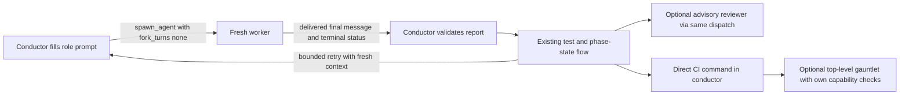

# Task: Correct Codex conduct worker API

**Status**: In Progress
**Component**: planning-skills
**Assigned to**: Codex
**Priority**: High
**Branch**: fix/codex-conduct-agent-api
**Created**: 2026-10-03
**Review Gates**: none

## Objective

Allow Codex conduct to delegate in runtimes exposing `spawn_agent` and `wait_agent` without a worker-close tool, using the supported clean-context argument. Prepare patch release 0.9.1 and install it through the Codex plugin CLI after publication confirmation.

## Context

The installed 0.9.0 skill falsely refuses this runtime because it requires `close_agent`. Its source also specifies unsupported `fork_context=false`. The current runtime exposes `fork_turns`, where `"none"` omits parent conversation history; `wait_agent` reports mailbox updates and terminal messages arrive separately.

Explore verified the authored Codex source and diagnostic, the four harness-neutral worker prompts, conduct pytest coverage, prompt-parity enforcement, both 0.9.0 plugin manifests, and local v0.9.0 tag at main d4d9a6f. Shared prompt bodies contain neither obsolete API spelling. Conduct lifecycle wording also appears in AGENTS.md and the original conduct, Goal-field, model-effort, and gauntlet plans.

## Requirements

- Require only `spawn_agent` and `wait_agent`; retain the explicit hard stop when either is unavailable.
- Use `fork_turns="none"` for every fresh worker, including retries and the advisory reviewer.
- Remove worker-close requirements and calls from authored Codex conduct; do not invent a cleanup substitute.
- Supply the filled worker prompt as `message`, use supported spawn fields, and wait for the final report and terminal status.
- Keep the shared worker prompt bodies byte-identical; add a Codex-specific dispatch request template rather than weakening parity checks.
- Preserve phase/state/report/commit boundaries and the direct CI-parity runner.
- Preserve the gauntlet's separate capability checks and unsupported-gate handback; this patch makes no promise that Review Gates: full can complete in this runtime.
- Update current documentation and append dated supersession notes to sibling plans without rewriting their historical contracts.
- Run targeted regressions and full `just ci`; review docs, code, and security before regular merge.
- Bump both plugin manifests to 0.9.1; publish only after the release skill's exact-payload confirmation, then reinstall through the CLI and verify installed bytes.

## Review Focus

The invariant is that every Codex conduct worker starts with no parent history, while availability depends only on spawn/wait. Review initial dispatch, both fix-loop routes, advisory review, and terminal gauntlet preflight. Worker completion must not be confused with `wait_agent`'s update-summary return value. Claude skill semantics and other Codex skills are outside the behavioral scope.

## Implementation Checklist

### Phase 1: Correct the worker contract

**Impl files:** plugins/skein-codex/skills/conduct/SKILL.md, plugins/skein-codex/skills/conduct/conductor.py, plugins/skein-codex/skills/conduct/worker-dispatch.md
**Test files:** plugins/skein-codex/skills/conduct/tests/test_conductor_harness.py, plugins/skein-codex/skills/conduct/tests/test_worker_api_contract.py
**Test command:** `uv run --with pytest pytest plugins/skein-codex/skills/conduct -q`
**Goal:** Every fresh worker has fork_turns="none" and a filled prompt as message; delegation requires spawn and wait only.

- Correct all authored conduct lifecycle call sites and Python diagnostic.
- Add the Codex dispatch request template and regressions for source and shared prompts.

### Phase 2: Document, validate, and prepare delivery

**Impl files:** AGENTS.md, README.md, CHANGELOG.md, docs/dev_plans/README.md, docs/dev_plans/20260422-feature-conduct-skill.md, docs/dev_plans/20260704-chore-model-effort-explicit-spawns.md, docs/dev_plans/20260707-feature-conduct-phase-goal-field.md, docs/dev_plans/20260707-feature-review-gauntlet-skill.md, plugins/skein/.claude-plugin/plugin.json, plugins/skein-codex/.codex-plugin/plugin.json
**Test files:** none
**Test command:** `just ci`

- Update current docs and sibling-plan supersession notes; prepare 0.9.1 release metadata.
- Run full CI and equivalent documentation, code, and security reviews; create and regularly merge the feature PR when clean.
- Prepare immutable release target/title/body for explicit confirmation; after confirmation publish, install, and compare installed conduct source to the released tree.

## Technical Specifications

No new dependencies or Python orchestration seam changes. The real runtime dispatch remains driven by SKILL.md, with a JSON request template in worker-dispatch.md. Shared implementer, test-writer, reviewer, and legacy CI-summary prompt bodies retain their existing schemas and parity. The Python test seam is not a simulation of real runtime tool availability.

## Architecture & Call Flow

The existing conductor-to-worker boundary remains intact:

`wait_agent` summaries wake the conductor; they are not report content. Parent history stays in the conductor, the rendered role prompt enters each fresh worker, and validated reports enter existing phase state. Retries never reuse worker conversation history. The gauntlet remains a separate top-level skill boundary.

## Testing Notes

New tests sweep authored conduct Markdown and the Python diagnostic for obsolete APIs; validate the JSON spawn template and role effort selection; and verify missing-delegation behavior and shared prompt parity. Existing conduct tests cover prompt isolation and retries. Full `just ci` supplies repository-wide coverage. A live clean-context Explore dispatch used fork_turns="none" and returned its final report without a close operation.

## Acceptance Criteria

- No obsolete spawn argument or worker-close operation remains in authored Codex conduct.
- All fresh worker routes reference the supported request template and retain clean context.
- Spawn/wait unavailability still fails closed with the exact two-tool diagnostic.
- Targeted regressions, prompt parity, full CI, and pre-merge reviews pass.
- Feature PR is merged normally; release and CLI installation are verified after explicit publication confirmation.

<!-- reviewed: YYYY-MM-DD @ <hash> -->

## Progress

- [x] Phase 1: Correct the worker contract
- [ ] Phase 2: Document, validate, and prepare delivery

## Findings

- Runtime schema directly verifies fork_turns="none", spawn_agent, and wait_agent; no close operation exists.
- Plan review: architecture and sequencing used clean-context workers; testing, assumptions, codebase-claims, and the post-reconciliation contradiction pass ran in-session after the runtime thread limit, with best-effort isolation. Two Important architecture findings addressed by the explicit gauntlet boundary and call-flow section; no contradictory fixes. Full findings: `.review-plan/latest-codex.json`.
- Targeted validation: 245 Codex conduct tests passed; all ten new declarative API checks pass. Prompt parity passed. Authored-source sweep verified clean context across initial dispatch, both fix-loop roles, and advisory review. Historical sibling-plan contract bytes were preserved.
- Code review found that a later parallel dispatch can fail while an earlier worker is still writing. The dispatch template now requires collecting already-started workers' terminal reports before handback; a regression pins that ordering. Manual security review found no new input-execution path: role prompts retain their untrusted-data boundaries and tool arguments use structured serialization.
- Full validation: `just ci` exited 0 outside the process-restricted sandbox, with fixture-only `commit.gpgsign=false` and a scoped uv cache. The final Codex conduct suite passed 246 tests, including eleven API regressions. Documentation, code, and security audits are clear. Source, metadata, and docs are ready for PR; publication and installed-byte verification remain outstanding.

## Issues & Solutions

- Publication has an explicit exact-payload confirmation gate in skein:release; source edits and release preparation can proceed before it.

## Final Results

Pending.
