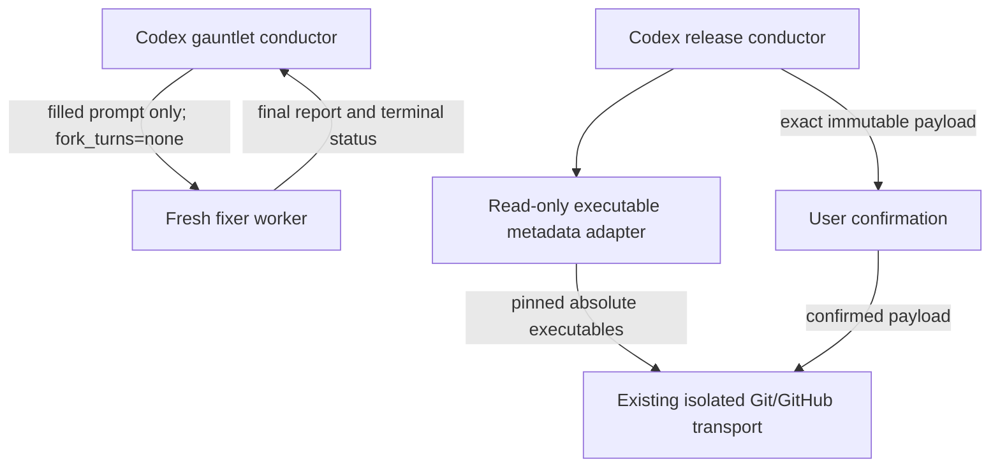

# Codex gauntlet and release runtime correction

**Status**: In Review
**Component**: meta
**Priority**: High
**Branch**: fix/codex-runtime-release-0.9.2
**PR**: [#54](https://github.com/vr000m/skein/pull/54)
**Created**: 2026-10-04
**Review Gates:** none

## Objective

Ship patch 0.9.2 with Codex gauntlet worker dispatch compatible with this runtime and a bounded Homebrew directory-permission exception for Codex release preflight. Preserve Claude skill behavior and shared release libraries.

## Context

The user approved both corrections and the Codex-only call flow on 2026-10-04. Conduct's API correction shipped in 0.9.1; gauntlet still specifies unsupported `fork_context=false` and requires a missing worker-close operation. The release mirrors currently share a strict executable policy that rejects a supported local Homebrew installation because its Cellar directory is group-writable. Permission changes are not a fix.

Explore verified the authored Codex skill paths, conduct dispatch template, gauntlet tests, release workflow normalization and release contract tests. Both manifests are 0.9.1. At branch creation main was `032ea0cbe182af3188a6a4275aa47628ce01cbe1`; local v0.9.2 was absent. These git facts are point-in-time; path and policy claims are part of the reviewed contract and require review again if corrected.

Live filesystem inspection resolved Homebrew Git 2.56.0, gh 2.102.0 and jq 1.8.2 into `/opt/homebrew/Cellar`. The only component rejected by the original permission rule was the current-user-owned, system-admin-group-owned Cellar directory, mode 0775. Executable files were mode 0555; formula/version directories were 0755. No root pyproject.toml exists; justfile runs pytest through `uv run --with pytest`.

## Requirements

- All gauntlet fixer dispatches, including retries and quick-mode substantive fixes, use `spawn_agent` with `fork_turns="none"`. Require spawn/wait; preserve the no-inline-fixing fallback and top-level review gates.
- Wait summaries are mailbox updates only. Collect delivered final output and terminal worker status before consuming a report or advancing the convergence ledger. Dispatch failures hand back the actual error after any started workers drain; do not reuse prior worker conversations.
- Inherit the harness-selected model, requesting medium effort when supported. Keep the existing fixer report, quarantine, claim promotion and convergence semantics.
- Codex release uses an explicit read-only metadata adapter when native stat/hash tools are absent. On macOS, the fixed system `/usr/bin/env` and `/usr/bin/python3` bootstrap the adapter in an empty environment with isolated Python (`-I -S`), through a verified native direct-argv launcher with the child environment supplied before process creation. A runtime-native Node REPL provides `node:child_process.spawn` with `shell:false` and explicit `env:{}`. This trusts the installed operating system and its system-interpreter loader before application-tool pinning; unsupported/missing system bootstrap fails closed. The adapter performs filesystem/identity reads only, never tool execution, permissions changes or network work. Codex release keeps fixed trusted executable roots, canonical paths, user/root ownership, device/inode/hash pinning and pre-execution reverification, isolated environment/source/transport rules, conditional jq and exact-payload publication confirmation.
- On macOS only, permit group-writable directories at or below `/opt/homebrew` or `/usr/local` on a canonical executable's path when the executable is inside that prefix's Cellar, the directory is root/current-user-owned and its group is the system `admin` group. Resolve entrypoint symlinks as data before checking the final canonical path. Reject world-writable components, group/other-writable executable files, unexpected owners/groups, and symlinks in that final path. This trusts administrators maintaining the installation and retains the verification-to-launch race as an explicit residual.
- Register one exact Codex-only release policy paragraph as a parity divergence, with cardinality/placement checks. Missing, modified, duplicated, appended, misplaced or Claude-side exception text must fail. All remaining normalized release workflow and shared library bytes retain parity; no lagging-mirror escape hatch is used.
- Claude authored skill content, release references and shared libraries remain byte-identical to main. Both plugin manifests receive the common release version 0.9.2. Do not change fan-out's dormant topology documentation or other skills.
- Update CHANGELOG, current repo docs, index and sibling-plan supersession notes without changing their accepted contract prefixes. Prove review-marker preservation outside conduct.
- Run full local CI, staged-secret checks and pre-merge documentation/code/security review; prepare a PR. Publishing a release still requires its exact post-merge target/title/body confirmation.
- Native gauntlet gates use a shipped strict JSON Schema and locally validate their final envelopes. Codex 0.160.1 native review does not forward `--output-schema`; preserve native `review/start` through stdio app-server with `experimentalRawEvents`, validate its single raw `final_answer` and matching successful turn, and deterministically map the explicit verdict/findings without another model turn. Never reinterpret malformed output as approval.
- Pin each round's source HEAD and effective tracked/untracked input fingerprint. Review a private clone of the pinned committed or uncommitted input; check source and snapshot identities before accepting every native result and before applying fixes or appending the ledger. Input drift stops the round without fixes or a ledger append. Preserve the existing uncommitted target surface.

## Review Focus

The additional Phase 4 boundaries are raw native verdict versus rendered prose, closed nested schema validation, and immutable gate input versus verified fix-baseline transitions (including trivial-then-substantive batches). Verify source/snapshot checks and successful matching turn completion. The original boundaries are clean worker context versus mailbox wakeups, Codex-only release divergence versus normalized parity, and trusted Homebrew directory writers versus strict executable-file/other-writability checks. Verify every fixer route, first-launch bootstrap and Audit Mode's reuse of the invariant. Do not infer runtime gate availability or successful tag/release publication from this patch.

## Implementation Checklist

### Phase 1: Correct Codex gauntlet worker lifecycle
**Impl files:** plugins/skein-codex/skills/review-gauntlet/SKILL.md, plugins/skein-codex/skills/review-gauntlet/worker-dispatch.md
**Test files:** tests/gauntlet/test_codex_agent_api.py, tests/parity/test-spawn-tiers.sh, justfile, AGENTS.md
**Test command:** `UV_CACHE_DIR=/private/tmp/skein-uv-cache UV_OFFLINE=1 uv run --with pytest python -m pytest tests/gauntlet/test_codex_agent_api.py -q`
**Goal:** Fresh fixer context and validated terminal reports drive the existing convergence algorithm; a missing worker-close API never blocks dispatch.

- Add a structured Codex dispatch template and reference it from the sole gauntlet lifecycle contract.
- Cover accepted tool arguments, inherited model/effort behavior and obsolete API absence within gauntlet only; preserve the one prose medium-effort hint and existing census counts. Test full, quick, resume and verification routes through the one lifecycle. Include mailbox-only updates, final output without terminal status, terminal errors/malformed reports and dispatch-capacity failure while workers remain outstanding.
- Preserve unsupported-gate status accounting and shared gauntlet helpers.

### Phase 2: Correct Codex Homebrew executable preflight
**Impl files:** plugins/skein-codex/skills/release/SKILL.md, plugins/skein-codex/skills/release/executable_policy.py, plugins/skein-codex/skills/release/native-launch.md, scripts/check-prompt-parity.sh
**Test files:** tests/parity/test-prompt-parity-extended.sh, tests/parity/test_release_skill_contract.py, plugins/skein-codex/skills/release/tests/test_executable_policy.py, justfile
**Test command:** `bash tests/parity/test-prompt-parity-extended.sh`
**Validation cmd:** `just check-prompt-parity`
**Goal:** Only the confirmed macOS Homebrew directory rule diverges; normalized shared release behavior and strict file identity checks remain enforced.

- Add the bounded Codex policy paragraph adjacent to the shared executable invariant, explicitly applying it during bootstrap and Audit Mode.
- Extend exact-line/cardinality normalization without permitting other release drift. Require one paragraph immediately after the invariant within Step 2 and zero on Claude; update the synthetic positive seed. Keep the addition below the existing Step 2 size tolerance (about 4.4 KB), without moving shared prose to references.
- Add mutation regressions and executable metadata/identity tests; run the release contract suite in this phase. Run an independent read-only scenario check using real Homebrew metadata and rejected boundary fixtures. No filesystem permissions or remote artifacts are changed.

### Phase 3: Document, validate and prepare 0.9.2
**Impl files:** README.md, AGENTS.md, CHANGELOG.md, plugins/skein/.claude-plugin/plugin.json, plugins/skein-codex/.codex-plugin/plugin.json, docs/dev_plans/README.md, docs/dev_plans/20261003-bug-codex-conduct-agent-api.md, docs/dev_plans/20260707-feature-review-gauntlet-skill.md, docs/dev_plans/20260710-feature-review-gauntlet-resume.md, docs/dev_plans/20260712-feature-release-skill.md, docs/dev_plans/20260914-feature-release-repo-template.md, docs/dev_plans/20260917-refactor-release-skill-structure.md
**Test files:** tests/parity/test-spawn-tiers.sh, tests/parity/test_release_skill_contract.py
**Test command:** `just ci`
**Goal:** A reviewable patch PR carries 0.9.2 metadata, complete validation evidence and accurate Codex-only scope.

- Record both fixes in dated 0.9.2 and update compare links and both plugin versions.
- Add current docs and below-marker supersession notes to every relevant sibling plan; preserve historical contracts.
- Verify Claude source/shared-lib byte preservation, every worker call site, normalized release policy placement and plan marker hashes.
- Run ruff format/check, targeted regression gates and full CI with both lagging-mirror variables absent from the environment. Stage explicit paths, scan staged secrets and create focused commits. Print `git diff main...HEAD --stat`, then run documentation/code/security reviews on that committed scope, address findings in further focused commits and rerun affected/full checks before creating/updating the PR. Review Gates: none disables auto-chaining only; the conductor owns these explicit manual reviews.

### Phase 4: Freeze native gate inputs and enforce strict envelopes
**Impl files:** plugins/skein-codex/skills/review-gauntlet/SKILL.md, plugins/skein-codex/skills/review-gauntlet/native_gates.py, plugins/skein-codex/skills/review-gauntlet/native-gate-schema.json, justfile, README.md, AGENTS.md, CHANGELOG.md
**Test files:** tests/gauntlet/test_native_gates.py
**Test command:** `UV_CACHE_DIR=/private/tmp/skein-uv-cache UV_OFFLINE=1 uv run --with pytest python -m pytest tests/gauntlet/test_native_gates.py -q`
**Goal:** Only strict, completed native results for the pinned input may reach reconciliation, fixes or ledger accounting.

- Keep the native reviewer through `review/start`; capture its raw final answer with app-server `experimentalRawEvents`, validate the explicit verdict and matching successful terminal turn, and map findings deterministically. Rendered prose or missing raw-event support is an error. Adversarial review uses the same shipped schema directly. Both paths return one locally validated envelope to the existing bounded helper; shared libraries remain unchanged.
- Create an owned private clone with hooks and ambient Git configuration disabled. Capture effective tracked/untracked file bytes, modes and symlink spellings plus HEAD/index state; materialize uncommitted input into the clone when selected. Freeze base/head as commit IDs. Reject unsupported unmerged/submodule input rather than dropping it.
- Recheck source fingerprint and snapshot state at native boundaries. Keep the round fingerprint fixed until all review results are accepted. Check a separate mutation baseline before every applier/fixer/retry and ledger append; advance it only after Guardrails 4/5 attribute all changed paths to accepted fixes, require a clean checkout and pass full CI. The next review round repins the resulting source. Do not advance a round that encountered input drift.
- Reproduce prose, malformed/duplicate JSON, strict nested auto-fix rejection, source edits, source HEAD changes, snapshot edits and uncommitted file changes with real Git fixtures and deterministic CLI doubles. Then perform live native/adversarial probes on a frozen fixture before full CI and fresh committed-scope reviews.

## Technical Specifications

### Files to Modify

The exact files are listed in phase contracts. Authoritative edits occur in the plugin sources, not installed cache directories. Shared gauntlet/release libraries are unchanged. `justfile` wires the new Codex dispatch regression into existing CI; AGENTS records the recipe and sanctioned policy divergence.

### New Files to Create

- `plugins/skein-codex/skills/review-gauntlet/worker-dispatch.md`: structured spawn arguments and final-report collection contract, following conduct's supported runtime idiom.
- `tests/gauntlet/test_codex_agent_api.py`: Codex dispatch and lifecycle contract coverage.
- `plugins/skein-codex/skills/release/native-launch.md`: verified native direct-argv/environment launch contract for the macOS adapter and every subsequent application-tool command.
- `plugins/skein-codex/skills/release/executable_policy.py` and `tests/test_executable_policy.py`: deterministic read-only application-tool pinning and permission/identity regression tests.

### Architecture Decisions

These are corrections to two existing orchestration boundaries, not a new transport or gate. The Codex Homebrew paragraph narrowly qualifies only the shared directory group-write prohibition. The authored read-only `executable_policy.py` adapter supplies canonicalization, no-follow component inspection, OS/admin-group identification and device/inode/hash capture/reverification. Its verified native launcher and fixed system-interpreter bootstrap form an explicit trusted-runtime/plugin/OS boundary, replacing the unverified assumption that this Codex runtime has native filesystem primitives. It performs no application-tool execution or state mutation. Every subsequent workflow launch uses the recorded canonical identity; native adapters remain available when the harness supplies them. The exact policy paragraph has an explicit normalization contract and cannot be silently broadened.

### Integration Seams

| Boundary | Preserved contract |
|---|---|
| Main gauntlet to fixer | Filled prompt as entire message; no parent history; medium effort when supported; existing report schema |
| Fixer to main | Final report plus terminal status; live diff/test verification before ledger accounting |
| Release invariant to isolated transport | Canonical pinned executable identities and explicit source/remote state |
| Codex release to parity gate | One exact positioned policy paragraph; all other release bytes remain compared |
| Source to delivery | Shared version metadata, feature PR, post-merge confirmed release and CLI installation |

## Architecture & Call Flow

The user confirmed this flow before phases were written.



```mermaid
sequenceDiagram
    participant G as Gauntlet conductor
    participant F as Fresh fixer
    participant R as Release conductor
    participant T as Existing isolated transport
    participant U as User
    G->>F: spawn_agent(fork_turns=none, filled prompt)
    F-->>G: Final report; terminal status
    G->>G: wait_agent wakeup; collect delivered final message/status
    G->>G: Validate fix and continue existing convergence loop
    R->>R: Pin canonical executables; apply narrow Homebrew directory rule
    R->>T: Existing read-only preflight through pinned tools
    T-->>R: Immutable destination and tag/release state
    R->>U: Exact target, title and body
    U-->>R: Explicit confirmation
    R->>R: Reverify pinned identities and destination
    R->>T: Existing confirmed mutation and read-back verification
```

| Step | Trigger | Enters context | Cleared/persisted | Turn boundary |
|---|---|---|---|---|
| Fixer dispatch | Existing finding batch | Filled prompt, scoped findings and trusted goal | Parent conversation excluded; fresh worker for retries | Main to worker |
| Fixer collection | Mailbox update and final message | Validated final report and terminal status | Existing ledger/accounting retained | Worker to main |
| Release preflight | Explicit release invocation | Canonical tool metadata, identities and source/remote state | Adapter/native stat data; no ambient executable lookup | Main to transport |
| Release confirmation | Immutable release payload | Exact destination, target, title and body | Locked existing payload and identity state | Main to user |
| Release mutation | Confirmation and revalidation | Verified mutation result | Existing tag/release read-back evidence | Main to transport and back |

### Native review input and verdict boundary

The conductor pins base, HEAD and source fingerprint → the adapter creates an owned private clone → native `review/start` emits its raw structured final answer and successful matching completion (or adversarial `codex exec` emits a schema-constrained envelope) → local validation and source/snapshot reverification produce one bounded-gate envelope. Unsupported raw-event runtimes, malformed JSON and ambiguous prose remain errors. Findings stay repository-relative after snapshot-path mapping. The conductor checks its fixed review input before accepting results, then checks the accepted mutation baseline before every fix or ledger operation; verified fix commits are the only permitted baseline transition. Temporary clones are removed; the original checkout is never materialized or edited by the adapter.

## Testing Notes

Baseline `just check-prompt-parity` and 298 release-contract tests passed before edits. New tests must reproduce obsolete Codex dispatch and reject overly broad/misplaced release normalization. Independent scenario validation covers accepted entrypoint/transport-helper symlink resolution and admin-group Homebrew Cellar directories for both prefixes; non-macOS, prefix-lookalikes, executables outside the matching Cellar, group-writable ancestors above the prefix, and non-admin/outside-prefix/world-writable directories; writable files; unexpected owners; symlinks in the final canonical path; and changed identities. It remains read-only and is not a release publication test. Full `just ci` is required before opening/updating the PR.

## Acceptance Criteria

- All Codex gauntlet fixer routes use the runtime-compatible clean-context lifecycle; no obsolete API is required.
- Real observed Homebrew metadata is accepted only by the Codex exception; boundary violations remain rejected.
- Exact positioned release policy normalization passes, and negative mutations fail.
- Claude skill sources, release references and shared libraries are byte-identical to main.
- Both plugin versions and CHANGELOG are 0.9.2, targeted and full checks pass, and the PR accurately describes final scope.
- Native/adversarial gates emit strict envelopes from frozen input; clean, seeded-bug, malformed output and drift cases are demonstrated. Every fixer/applier/ledger boundary checks the accepted source baseline.
- Sibling reviewed contract prefixes and marker status are preserved; delivery remains explicitly unverified until merge/publication/installation.

<!-- reviewed: YYYY-MM-DD @ <hash> -->

## Progress

- [x] Phase 1: Correct Codex gauntlet worker lifecycle
- [x] Phase 2: Correct Codex Homebrew executable preflight
- [x] Phase 3: Document, validate and prepare 0.9.2
- [x] Phase 4: Freeze native gate inputs and enforce strict envelopes

## Findings

- Five Codex lenses and the post-reconciliation contradiction pass completed. Four Important findings are addressed: review ordering, lifecycle failure cases, Homebrew boundary fixtures, and the missing native-filesystem bootstrap interface.
- Separate Claude review completed all five lenses and a contradiction pass. Accepted corrections preserve the effort census, bound paragraph size/placement/cardinality, run phase-local contract tests, document system bootstrap and platform/admin identification, and explicitly distinguish manual review from auto-chain gates. The report's claim that `/opt` is admin-group 0775 was rechecked and rejected: live no-follow stat reports root-owned 0755. Historical sibling markers are already stale where recorded; append notes without claiming fresh reviews.
- Existing dormant fan-out and Claude historical Codex API wording are deliberately outside this behavior patch; no repo-wide obsolete-token sweep is promised.
- Independent preflight found Git's compiled HTTPS-helper lookup beneath `/opt/homebrew/opt/git`. The adapter permits Homebrew `opt` aliases only as lookup paths; their resolved executables must still pass the existing canonical roots and permission policy. A regression pins this boundary. Real Git/gh/jq/helper pinning and immediate reverification all returned exit 0, with the helper inside Git's matching Cellar installation.

## Issues & Solutions

- **2026-10-07 gauntlet follow-up:** User reported a blocked 0.9.1 run with prose native output, an initially rejected nested auto-fix schema, and concurrent renderer edits. The installed lifecycle mismatch is already corrected by this PR. Inspection of the exact Codex 0.160.1 source confirms that native `review/start` receives no output schema, while ordinary `turn/start` does. A live clean-case probe showed that rendered native prose can omit an explicit clean verdict; a second normalization turn correctly refused to infer one. The replacement app-server raw-event probe retained the native JSON verdict and successful turn. Phase 4 addresses that integration and mutable-input gap; the earlier run has no verdict and its PYTHONPATH observation remains provisional.
- **2026-10-07 review corrections:** Fresh review reproduced source-local `diff.noprefix` breaking staged snapshot replay and escaping links exposing mutable external bytes. `d1654cd` centralizes canonical cached patches; `95f4975` rejects escaping/cyclic resolved snapshot links. Two prefix-config regressions and ten committed/uncommitted symlink regressions cover these cases; fresh final reviews found no remaining defects.

- Logic and security review found that an outer Bash process can interpret inherited BASH_ENV or SHELLOPTS/PS4 before its inner `env -i`. A standalone privileged-shell launcher passed subprocess tests, but stronger runtime probes proved that this runtime silently ignores the requested shell. It was removed. The supported native Node launcher supplies argv and a closed environment before process creation; no ambient shell fallback is permitted.
- Native validation also found that macOS inode values exceed JavaScript exact integer precision. Device/inode metadata is transported as decimal strings, and pin documents are preserved losslessly during reverification.
- Incremental review required an explicit bridge to the retained same-Bash mutation and raw-pipe templates. The native API directly starts identity-pinned Bash in a closed environment, preserving payload loading, adjacent verification, mutation and cleanup in one child. Native output remains byte buffers; committed blob pipes are never decoded/re-encoded as JavaScript strings.

- A shared release rule needs a registered Codex-only divergence to preserve the requested harness scope without weakening parity elsewhere.

## Final Results

[PR #54](https://github.com/vr000m/skein/pull/54) contains the Codex-only fixes and shared 0.9.2 version metadata. All 392 targeted tests passed: 56 native input/verdict regressions, seven dispatch, 29 executable-policy/native-launch and 300 release-contract tests. Full `just ci` passed at `95f4975`, without lagging-mirror variables or parity waivers; ruff format/check, prompt parity and 187 skill-shape assertions passed. Fresh logic, security, architecture and documentation lenses each completed four assigned native-gate units with zero actionable findings (`20261008T030725Z-092-native-fixed`), following full-branch reviews at `61b5c24` and fixes for both reported defects.

The review invariant is explicit: only a strict, completed result for the pinned private input can authorize fixes or ledger accounting. Both native gate branches share snapshot creation, source/snapshot reverification and local schema validation. Both cached-diff reads share canonical prefix enforcement. Every applier/fixer/retry/ledger boundary checks the accepted mutation baseline; only fully attributed, verified fix commits can advance it. Regressions prove escaping/cyclic links stop before native launch, internal links retain frozen bytes after source edits, source/index/HEAD changes invalidate input, and malformed/prose/ambiguous verdicts never become approval.

Live bounded native probes accepted a clean square-function addition and flagged an addition-instead-of-multiplication bug in committed and staged-plus-unstaged targets; adversarial review also flagged the bug. The final uncommitted probe ran on Codex CLI 0.161.0 and preserved the source HEAD and fingerprint. The raw-event API was grounded in Codex 0.160.1 source and verified live. The interrupted PCH run still has no accepted verdict; its provisional renderer finding was not validated by these fixtures.

Real native bootstrap, pin reverification, empty-environment, literal-argv, missing-binary and tampered-hash checks passed; Git/gh/jq/HTTPS-helper pins passed with lossless identity roundtrips. After immediately reverifying Bash/cat pins, a native compound call preserved the exact raw bytes `ff00410a`; an explicit empty child environment produced zero bytes. Claude skill sources and shared release files remain byte-identical to main. Canonical marker checks preserved all four marked sibling contract hashes and all six sibling contract prefixes and prior marker statuses.

Merge, tag creation, GitHub release publication and plugin installation are pending. Source preparation and CI do not assert that 0.9.2 is released or installed.
